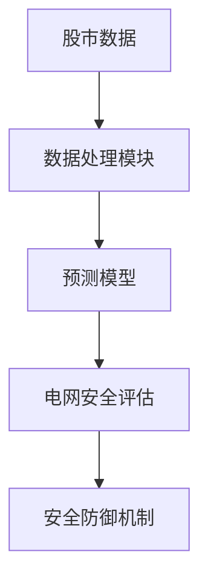

                 


# 新兴市场股市估值与智能电网网络安全技术的互动

> **关键词**：智能电网，网络安全，股市估值，互动关系，技术分析，风险评估

> **摘要**：本文探讨新兴市场股市估值与智能电网网络安全技术之间的互动关系，分析股市波动对电网稳定性的影响，反之亦然。通过技术分析、量化分析和网络安全防御机制的结合，提出互动关系的数学模型和系统架构设计，最后结合实际案例，提供解决方案和未来研究方向。

---

## 第1章: 背景介绍

### 1.1 问题背景

#### 1.1.1 新兴市场股市的特点
- 新兴市场股市波动性大，受政策、经济和外部市场影响显著。
- 交易量增长快，投资者结构多元化，包含散户和机构投资者。

#### 1.1.2 智能电网的发展现状
- 智能电网整合了传统电网与信息技术，实现能源的高效管理。
- 分布式能源、物联网技术的应用提高了电网的智能化水平。
- 面临网络攻击风险，安全性成为重要挑战。

#### 1.1.3 互动关系的提出
- 股市波动可能影响能源企业的股价，进而影响投资者对能源行业的信心。
- 智能电网的安全性问题可能引发能源供应波动，影响股市表现。
- 两者之间存在相互影响的潜在机制。

### 1.2 问题描述

#### 1.2.1 股市估值的核心问题
- 如何准确预测股市波动，评估能源企业的价值。
- 应对股市风险，优化投资组合。

#### 1.2.2 智能电网网络安全的挑战
- 面临日益复杂的网络攻击，如勒索软件、DDoS攻击。
- 设备和数据的多层级防护需求。

#### 1.2.3 互动关系的定义与边界
- 互动关系指股市波动与智能电网安全事件之间的相互作用。
- 边界包括：信息传播、市场反应、网络安全事件的影响范围。

### 1.3 问题解决

#### 1.3.1 股市估值的技术手段
- 使用技术分析工具和量化模型预测市场走势。

#### 1.3.2 智能电网网络安全的解决方案
- 构建多层次防御体系，采用加密和认证技术。

#### 1.3.3 互动关系的应用场景
- 在股市剧烈波动时，提前预警电网安全风险。
- 在网络安全事件发生后，评估对股市的影响。

### 1.4 核心概念与联系

#### 1.4.1 核心概念原理
- 股市估值依赖于多种因素，包括宏观经济指标和企业基本面。
- 智能电网的安全性依赖于技术手段和管理策略。

#### 1.4.2 概念属性特征对比表格
| 特征 | 股市估值 | 智能电网网络安全 |
|------|----------|--------------------|
| 对象 | 股票价格 | 电网系统          |
| 工具 | 技术分析、量化模型 | 加密技术、入侵检测系统 |
| 目标 | 优化投资组合 | 保护能源供应安全 |

#### 1.4.3 ER实体关系图架构
```mermaid
erDiagram
  customer[投资者] {
    id
    名称
  }
  stock[股票] {
    id
    名称
    价格
  }
  grid[电网] {
    id
    区域
    状态
  }
  risk[风险] {
    id
    类型
    影响程度
  }
  customer -|> stock
  grid -|> risk
  stock -|> risk
```

---

## 第2章: 股市估值技术与方法

### 2.1 技术分析

#### 2.1.1 K线图与趋势分析
- K线图显示股票价格的开盘价、收盘价、最高价和最低价。
- 趋势分析识别上升或下降趋势。

#### 2.1.2 技术指标
- **MACD**：通过移动平均线判断市场趋势。
- **RSI**：衡量超买或超卖状态。

#### 2.1.3 股市预测模型
- 使用线性回归、支持向量机（SVM）等机器学习算法。

### 2.2 量化分析

#### 2.2.1 数据清洗与特征提取
- 清洗缺失值和异常值。
- 提取价格、成交量等特征。

#### 2.2.2 机器学习在股市预测中的应用
- 使用随机森林、LSTM等模型进行预测。

#### 2.2.3 时间序列分析模型
- ARIMA模型预测未来价格走势。

### 2.3 风险评估

#### 2.3.1 风险因子分析
- 分析波动率、市场风险溢价等因素。

#### 2.3.2 风险价值(VaR)模型
- 计算在特定置信水平下的潜在损失。

#### 2.3.3 系统性风险与非系统性风险
- 系统性风险影响整个市场，如经济衰退。
- 非系统性风险影响个别资产，如公司新闻。

---

## 第3章: 智能电网网络安全技术

### 3.1 网络架构

#### 3.1.1 智能电网的分层架构
- **感知层**：采集数据。
- **网络层**：传输数据。
- **应用层**：处理数据并提供服务。

#### 3.1.2 数据传输与存储安全
- 使用加密算法确保数据完整性。

#### 3.1.3 网络设备的防护机制
- 防火墙、入侵检测系统保护设备。

### 3.2 威胁分析

#### 3.2.1 网络攻击类型
- 病毒攻击、拒绝服务攻击、中间人攻击。

#### 3.2.2 潜在攻击点分析
- 电力控制系统、数据服务器等。

#### 3.2.3 威胁建模与风险评估
- 使用STRIDE模型识别威胁。

### 3.3 安全防御

#### 3.3.1 网络入侵检测系统（IDS）
- 监测异常流量，及时报警。

#### 3.3.2 加密技术与身份认证
- SSL/TLS加密数据传输。
- 使用数字证书进行身份认证。

#### 3.3.3 自动化响应机制
- 自动隔离受感染设备，限制攻击影响。

---

## 第4章: 互动关系与系统分析

### 4.1 股市数据与电网安全的关联

#### 4.1.1 股市波动对电网稳定性的影响
- 股价下跌可能导致能源企业投资减少，影响电网维护。

#### 4.1.2 网络安全事件对股市的影响
- 重大安全事件可能引发能源股价格下跌。

### 4.2 数学模型与公式

#### 4.2.1 互动关系的数学模型
- 使用向量自回归模型（VAR）分析股市和网络安全事件的相互影响。
- $$ VAR(p) = \epsilon_t + A_1 z_{t-1} + A_2 z_{t-2} + \dots + A_p z_{t-p} $$
  其中，$z_t$ 表示股市和网络安全的综合指标。

#### 4.2.2 风险评估模型
- 使用Copula模型分析股市和网络安全事件的相关性。
- $$ C(u, v) = F(F^{-1}(u), F(F^{-1}(v))) $$

### 4.3 系统分析与设计

#### 4.3.1 系统架构设计


#### 4.3.2 系统功能设计
- 数据采集模块：实时采集股市数据和电网运行数据。
- 预测模块：使用机器学习模型预测股市波动和网络安全风险。
- 安全评估模块：评估潜在风险并制定防御策略。

---

## 第5章: 项目实战

### 5.1 环境安装

```bash
# 安装Python和相关库
pip install numpy pandas scikit-learn matplotlib
```

### 5.2 核心代码实现

```python
# 股市预测代码
import pandas as pd
import numpy as np
from sklearn.ensemble import RandomForestRegressor
from sklearn.metrics import mean_absolute_error

# 数据预处理
data = pd.read_csv('stock_data.csv')
features = data[['open', 'high', 'low', 'volume']]
labels = data['close']

# 训练模型
model = RandomForestRegressor(n_estimators=100)
model.fit(features, labels)

# 预测
test_features = features[-1:]
predicted_price = model.predict(test_features)
print(f'预测收盘价：{predicted_price[0]}')
```

### 5.3 代码解读与分析
- 使用随机森林回归模型预测股市价格。
- 评估模型性能，计算均绝对误差（MAE）。

### 5.4 案例分析
- 分析某新兴市场的股市波动，评估智能电网的安全风险。
- 应用预测模型和防御机制，制定应对策略。

---

## 第6章: 总结与展望

### 6.1 总结
- 本文探讨了新兴市场股市估值与智能电网网络安全技术的互动关系。
- 提出了解决方案，结合技术分析和网络安全防御机制。

### 6.2 最佳实践 tips
- 定期更新模型参数，适应市场变化。
- 加强电网系统的安全性，防范网络攻击。

### 6.3 未来展望
- 研究更复杂的数学模型，提高预测精度。
- 探索区块链技术在能源安全中的应用。

---

**作者：AI天才研究院/AI Genius Institute & 禅与计算机程序设计艺术 /Zen And The Art of Computer Programming**

