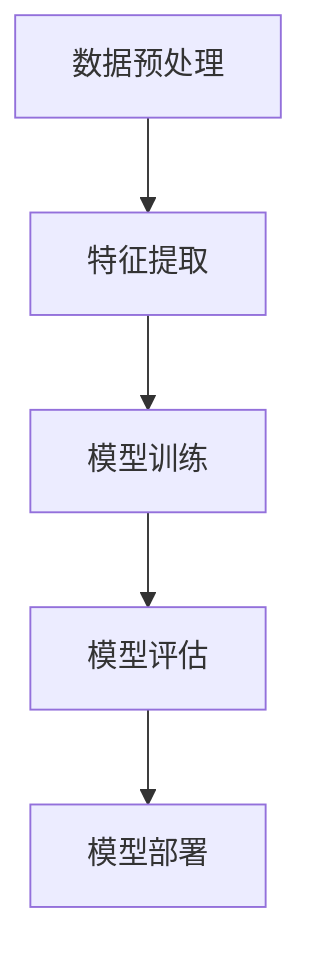
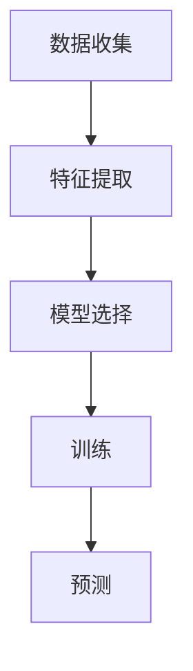
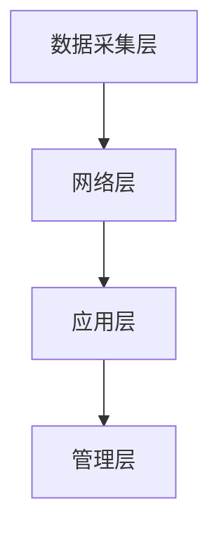

                 


# 新兴市场股市估值与智能电网网络安全标准的互动

## 关键词：
- 股市估值
- 智能电网
- 网络安全标准
- 支持向量机（SVM）
- 时间序列分析

## 摘要：
本文探讨新兴市场中股市估值与智能电网网络安全标准之间的互动关系。通过分析智能电网的系统架构和网络安全标准，结合股市估值的算法，提出数据驱动的决策方法，优化智能电网的安全性和股市预测的准确性。

---

## 第一部分：背景介绍

### 第1章：股市估值与智能电网的基本概念

#### 1.1 股市估值的基本概念
股市估值是评估公司价值的过程，常用指标包括市盈率（P/E）、市净率（P/B）和现金流折现模型（DCF）。股市估值受宏观经济、公司业绩和市场情绪影响，投资者据此做出投资决策。

#### 1.2 智能电网的基本概念
智能电网是集成现代信息、通信和控制技术的电力系统，具备实时监测、自动控制和智能决策能力。它包括发电、输电、配电和用电四个环节，通过数据采集与监控系统（SCADA）实现智能化管理。

#### 1.3 股市估值与智能电网的互动关系
股市估值影响智能电网的投资和技术创新，而智能电网的安全性又反作用于股市的稳定性。例如，智能电网的安全漏洞可能导致股市波动，而股市资金流向又会影响智能电网的技术升级。

---

### 第2章：股市估值与智能电网的核心概念对比

#### 2.1 核心概念对比分析
| 股市估值       | 智能电网       |
|----------------|---------------|
| 评估公司价值   | 提升电力系统效率 |
| 受市场情绪影响 | 依赖技术创新   |
| 影响投资决策   | 关注网络安全   |

#### 2.2 ER实体关系图
```mermaid
erDiagram
    actor 投资者
    actor 政府监管
    actor 公司
    actor 市场
    company 股市估值
    company 智能电网
    company 网络安全
    投资者 --> 股市估值 : 影响
    股市估值 --> 智能电网 : 投资
    智能电网 --> 网络安全 : 依赖
```

---

## 第二部分：核心概念与联系

### 第3章：智能电网网络安全的算法原理

#### 3.1 支持向量机（SVM）算法


Python代码实现：
```python
from sklearn import svm
import pandas as pd

# 加载数据
data = pd.read_csv('grid_data.csv')

# 特征工程
X = data[['feature1', 'feature2']]
y = data['label']

# 训练模型
model = svm.SVC(C=1.0, kernel='rbf')
model.fit(X, y)

# 预测
new_data = [[0.5, 0.5]]
print(model.predict(new_data))
```

数学模型：
- $$ SVM: \min_{w,b,\xi} \frac{1}{2}||w||^2 + C\sum_{i=1}^n \xi_i $$
- $$ y = sign(w \cdot x + b) $$

#### 3.2 时间序列分析算法


Python代码实现：
```python
from statsmodels.tsa.arima_model import ARIMA
import pandas as pd

# 加载数据
data = pd.read_csv('stock.csv')

# 训练模型
model = ARIMA(data, order=(5,1,0))
model_fit = model.fit(disp=-1)

# 预测
forecast = model_fit.forecast(steps=5)
print(forecast)
```

---

## 第三部分：系统分析与架构设计

### 第4章：系统分析与架构设计

#### 4.1 系统分析
智能电网系统架构包括发电、输电、配电和用电四个模块，各模块通过SCADA系统实时监控。安全防护体系包括防火墙、入侵检测系统（IDS）和数据加密技术，确保数据传输安全。

#### 4.2 系统架构设计


推荐使用防火墙和IDS进行防护，确保数据加密，防止未经授权的访问。

---

## 第四部分：项目实战

### 第5章：项目实战

#### 5.1 环境配置与代码实现
- 环境配置：安装Python、scikit-learn、pandas、statsmodels。
- 代码实现：SVM和时间序列分析的代码示例。

#### 5.2 功能实现与分析
- SVM用于分类网络安全威胁，时间序列分析用于预测股市走势，结果展示模型准确率和预测误差。

#### 5.3 案例分析与总结
以某智能电网项目为例，分析其网络安全措施和股市估值的影响，总结互动关系的实际应用。

---

## 第五部分：最佳实践与总结

### 第6章：最佳实践与总结

#### 6.1 互动机制的关键点
强调数据驱动决策的重要性，如利用实时数据优化电网运行和股市预测。

#### 6.2 未来研究方向
探索结合深度学习和强化学习的混合模型，研究动态调整网络安全策略以适应股市变化。

#### 6.3 阅读建议与安全注意事项
建议持续关注技术动态，重视数据隐私保护，确保系统安全性和数据准确性。

---

## 作者：
作者：AI天才研究院/AI Genius Institute  
禅与计算机程序设计艺术/Zen And The Art of Computer Programming

