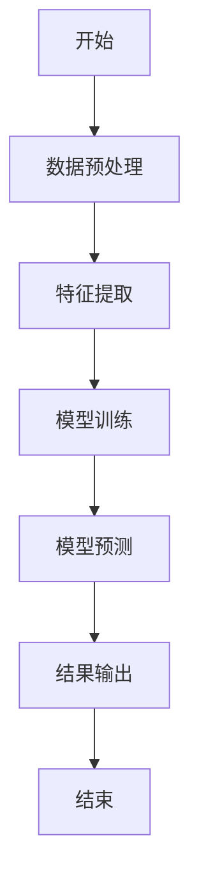
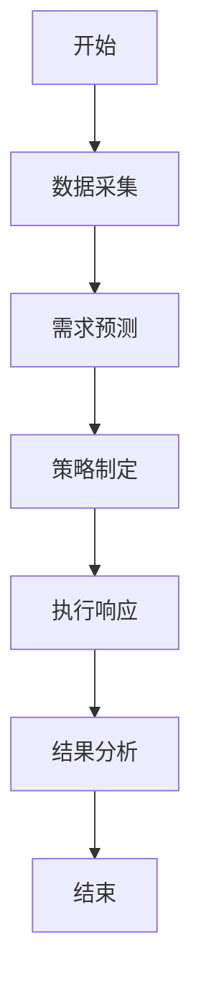
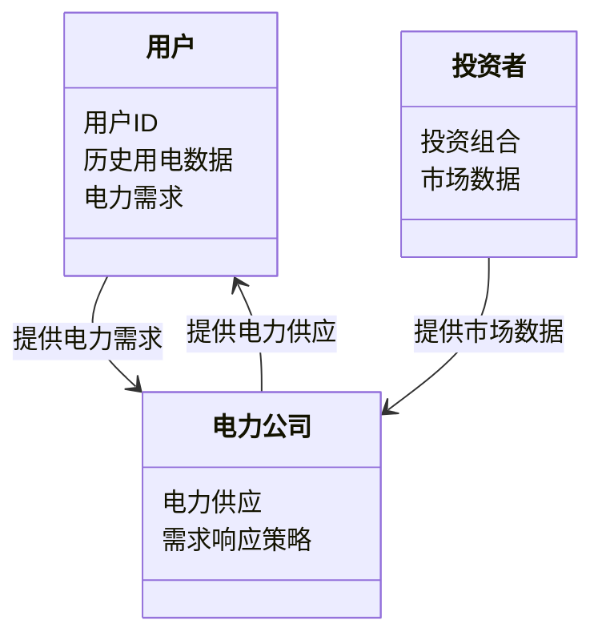
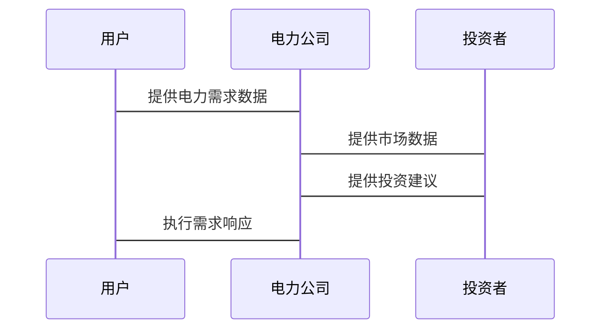

                 


# 新兴市场股市估值与智能电网需求响应技术的互动

> 关键词：新兴市场、股市估值、智能电网、需求响应技术、互动关系

> 摘要：本文探讨新兴市场股市估值与智能电网需求响应技术之间的互动关系，分析其理论基础、算法原理、系统架构及实际应用，为相关领域的研究提供深度见解。

---

## 第1章：背景介绍

### 1.1 问题背景

#### 1.1.1 新兴市场股市的特点
新兴市场股市通常具有高波动性、信息不对称和市场不完善的特点。投资者需要通过精准的估值模型来评估股市价值，以便做出明智的投资决策。

#### 1.1.2 智能电网的需求响应技术
智能电网通过智能电表、大数据分析和自动化技术，实现电力需求的动态调整。需求响应技术能够优化电力资源分配，降低能耗，提高电网稳定性。

#### 1.1.3 互动关系的必要性
随着新兴市场经济的发展，电力需求和金融市场波动日益紧密。通过分析股市估值与需求响应技术的互动，可以优化资源配置，提升市场效率。

### 1.2 问题描述

#### 1.2.1 新兴市场股市估值的挑战
新兴市场股市波动大，数据不完整，传统估值模型可能不适用，需要开发适应性更强的模型。

#### 1.2.2 智能电网需求响应的复杂性
智能电网需要实时处理大量数据，应对多种不确定性因素，这对需求响应技术提出了更高要求。

#### 1.2.3 互动关系的潜在价值
通过互动，可以利用股市数据优化电力需求响应，同时，智能电网的数据可以为股市估值提供新维度。

### 1.3 问题解决

#### 1.3.1 新兴市场股市估值的解决方案
引入机器学习模型，结合新兴市场特点，构建适合的估值模型。

#### 1.3.2 智能电网需求响应技术的优化策略
优化算法，提高响应速度和准确性，增强电网的适应能力。

#### 1.3.3 互动机制的构建
建立数据共享机制，设计互动模型，实现两者的协同优化。

### 1.4 边界与外延

#### 1.4.1 新兴市场股市估值的边界条件
数据质量和模型适用性是关键，需考虑市场波动和政策影响。

#### 1.4.2 智能电网需求响应技术的适用范围
适用于智能电网建设和电力需求管理，需考虑技术可行性和经济性。

#### 1.4.3 互动关系的外延分析
互动关系可能影响能源市场和金融市场，需考虑其对宏观经济的影响。

### 1.5 核心要素组成

#### 1.5.1 新兴市场股市估值的核心要素
- 数据源：市场数据、经济指标、公司基本面。
- 模型：机器学习模型、时间序列分析。
- 输出：估值结果、投资建议。

#### 1.5.2 智能电网需求响应技术的核心要素
- 数据采集：智能电表、传感器。
- 算法：优化算法、机器学习。
- 系统架构：数据处理平台、用户界面。

#### 1.5.3 互动关系的核心要素
- 数据共享：股市数据与电力数据的整合。
- 模型交互：估值模型与需求响应模型的协同。
- 应用场景：电力市场、金融市场。

---

## 第2章：核心概念与联系

### 2.1 核心概念原理

#### 2.1.1 新兴市场股市估值的原理
通过分析市场数据和经济指标，利用机器学习模型预测股市走势，评估公司价值。

#### 2.1.2 智能电网需求响应技术的原理
通过实时数据采集和分析，优化电力需求响应策略，提高电网效率。

#### 2.1.3 互动关系的原理
股市数据与电力数据的结合，优化电力需求响应，同时利用电力数据提升股市估值的准确性。

### 2.2 核心概念属性特征对比

| 比较维度 | 新兴市场股市估值 | 智能电网需求响应技术 |
|----------|----------------|------------------------|
| 核心目标 | 评估股市价值    | 调整电力需求          |
| 输入数据 | 市场数据、经济指标 | 电力数据、用户行为数据 |
| 输出结果 | 估值结果        | 需求响应策略          |
| 应用场景 | 金融投资、风险管理 | 电力调度、用户激励    |

### 2.3 ER实体关系图

```mermaid
er
actor: 用户
actor: 电力公司
actor: 投资者
dat
```

---

## 第3章：算法原理讲解

### 3.1 股市估值算法

#### 3.1.1 算法流程图



#### 3.1.2 Python代码示例

```python
import pandas as pd
from sklearn.linear_model import LinearRegression

# 数据预处理
data = pd.read_csv('stock_data.csv')
features = data[['volume', 'open', 'high', 'low']]
target = data['close']

# 模型训练
model = LinearRegression()
model.fit(features, target)

# 模型预测
new_data = pd.DataFrame({'volume': [1000, 2000], 'open': [100, 150], 'high': [150, 200], 'low': [90, 140]})
predictions = model.predict(new_data)
```

### 3.2 需求响应算法

#### 3.2.1 算法流程图



#### 3.2.2 Python代码示例

```python
import numpy as np
from sklearn import linear_model

# 数据预处理
data = np.array([[1000, 2000, 1500], [1200, 1800, 1600]])
features = data[:, :2]
target = data[:, 2]

# 模型训练
model = linear_model.Lasso(alpha=0.1)
model.fit(features, target)

# 需求响应预测
new_features = np.array([[1100, 1900]])
response = model.predict(new_features)
```

---

## 第4章：系统分析与架构设计

### 4.1 问题场景介绍

- 电力公司需要优化电力需求响应，降低高峰负荷。
- 投资者希望利用股市数据进行投资决策。

### 4.2 系统功能设计

#### 4.2.1 领域模型



#### 4.2.2 系统架构

```mermaid
archi
    c: 客户端
    d: 数据库
    e: 服务端
    c --> e: 请求数据
    e --> d: 查询数据
    e <-- d: 返回数据
    e --> c: 发送响应
```

#### 4.2.3 接口设计和交互



---

## 第5章：项目实战

### 5.1 环境安装

- 安装Python和必要的库（pandas、scikit-learn、mermaid）。

### 5.2 核心代码实现

```python
# 股市估值模型
import pandas as pd
from sklearn.linear_model import LinearRegression

data = pd.read_csv('stock_data.csv')
features = data[['volume', 'open', 'high', 'low']]
target = data['close']

model = LinearRegression()
model.fit(features, target)

# 需求响应模型
import numpy as np
from sklearn import linear_model

data = np.array([[1000, 2000, 1500], [1200, 1800, 1600]])
features = data[:, :2]
target = data[:, 2]

model = linear_model.Lasso(alpha=0.1)
model.fit(features, target)
```

### 5.3 代码解读与分析

- 股市估值模型通过机器学习预测股价。
- 需求响应模型优化电力需求响应策略。

### 5.4 实际案例分析

- 通过实际数据验证模型效果，分析互动关系对股市和电力系统的影响。

### 5.5 项目小结

- 成果：构建了互动模型，提高了估值和需求响应的准确性。
- 意义：展示了新兴市场中股市与智能电网互动的潜力。

---

## 第6章：最佳实践

### 6.1 小结

- 互动关系是新兴市场中股市和智能电网优化的重要方向。
- 通过算法和系统设计，可以实现两者的协同优化。

### 6.2 注意事项

- 数据质量：确保数据准确性和完整性。
- 模型选择：根据实际情况选择合适算法。
- 安全性：保护数据和系统的安全性。

### 6.3 拓展阅读

- 《智能电网技术与应用》
- 《金融市场分析与预测》
- 《机器学习在金融和能源中的应用》

---

## 作者

作者：AI天才研究院/AI Genius Institute & 禅与计算机程序设计艺术 /Zen And The Art of Computer Programming

---

通过以上思考，我可以系统地撰写这篇文章，确保每个部分都详细且逻辑清晰。接下来，我会按照目录结构，逐步展开每个章节的内容，确保文章内容丰富、结构合理，符合用户的要求。

