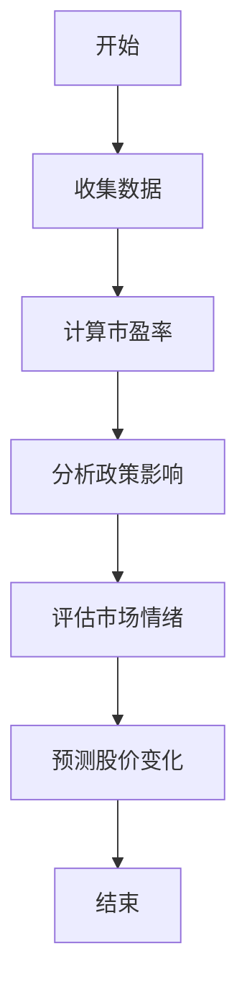
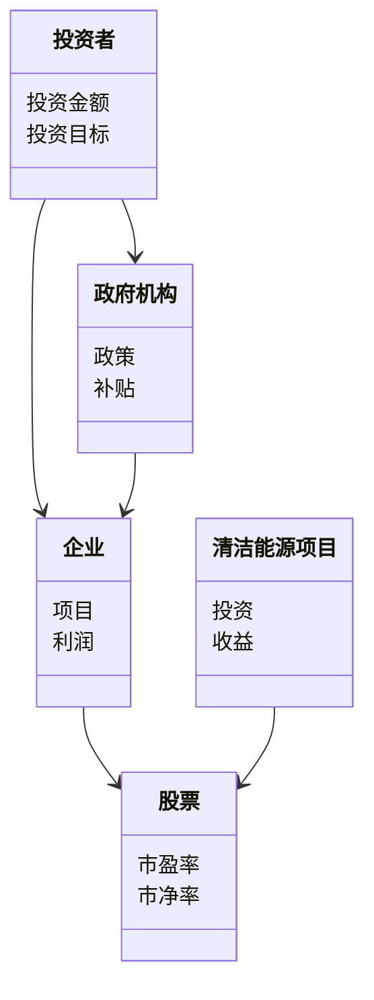
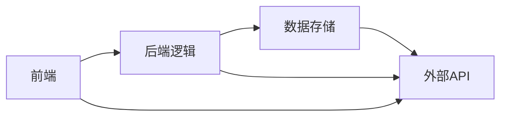
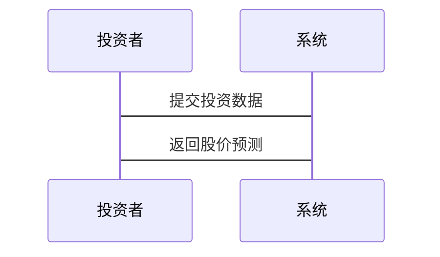

                 


# 《新兴市场股市估值与清洁能源转型的互动》

## 关键词：新兴市场，股市估值，清洁能源转型，互动，投资，经济影响，可持续发展

## 摘要：本文探讨新兴市场股市估值与清洁能源转型之间的互动关系，分析清洁能源投资如何影响股市估值，并揭示两者在经济可持续发展中的关键作用。

---

# 第一部分：背景介绍

## 第1章：新兴市场股市估值与清洁能源转型的互动概述

### 1.1 背景介绍

#### 1.1.1 新兴市场的定义与特点
新兴市场是指经济快速发展、人均收入较低但增长迅速的国家，如中国、印度等。这些市场具有高增长潜力，但也面临更多风险。

#### 1.1.2 清洁能源转型的全球趋势
全球正向低碳经济转型，清洁能源技术如太阳能、风能等投资增加，推动能源结构变化。

#### 1.1.3 股市估值与经济发展的关系
股市估值是衡量经济健康的重要指标，清洁能源转型通过改变企业盈利能力和风险，影响股市估值。

### 1.2 问题背景

#### 1.2.1 新兴市场股市的独特性
新兴市场股市波动性高，受政策和外部因素影响大，但增长潜力大。

#### 1.2.2 清洁能源转型的必要性
应对气候变化，减少碳排放，推动可持续发展。

#### 1.2.3 两者互动的潜在影响
清洁能源转型可能提升股市估值，但过程充满挑战。

### 1.3 问题描述

#### 1.3.1 清洁能源转型对股市估值的影响
分析清洁能源投资如何影响企业盈利和估值。

#### 1.3.2 股市估值对清洁能源投资的反馈作用
高估值可能吸引更多投资，但也可能引发泡沫。

### 1.4 问题解决

#### 1.4.1 提出解决方案的基本框架
构建数学模型，分析清洁能源投资对股市的影响。

#### 1.4.2 解决方案的可行性分析
数据可得性、模型的简化假设，确保研究可行。

### 1.5 边界与外延

#### 1.5.1 研究范围的界定
聚焦新兴市场，分析清洁能源投资对股市估值的影响。

#### 1.5.2 相关领域的扩展
涉及宏观经济、环境政策、企业战略等多个方面。

### 1.6 概念结构与核心要素

#### 1.6.1 核心概念的层次结构
从宏观到微观，分析股市、企业、政策的互动。

#### 1.6.2 核心要素的详细描述
- **股市估值**：市盈率、市净率等指标。
- **清洁能源转型**：技术、政策、投资等因素。

---

# 第二部分：核心概念与联系

## 第2章：核心概念原理

### 2.1 股市估值的核心原理

#### 2.1.1 市盈率与市净率的计算方法
市盈率=股价/每股收益，市净率=股价/每股净资产。

#### 2.1.2 股东权益与企业价值的关系
股东权益增加，企业价值上升，股价可能上涨。

### 2.2 清洁能源转型的核心原理

#### 2.2.1 清洁能源技术的创新
技术创新降低生产成本，提高企业盈利能力。

#### 2.2.2 市场需求的变化对投资的影响
消费者偏好清洁产品，推动市场需求。

### 2.3 核心概念属性特征对比

| 特性       | 股市估值                     | 清洁能源转型               |
|------------|------------------------------|--------------------------|
| 时间跨度   | 短期波动与长期趋势           | 长期结构性变化             |
| 主要影响因素 | 利润、政策、市场情绪         | 技术、政策、市场需求       |
| 反馈机制   | 投资者情绪影响股价           | 投资和技术进步影响企业表现 |

### 2.4 ER实体关系图

```mermaid
er
  actor 投资者
  actor 政府机构
  actor 企业
  entity 股票
  entity 清洁能源项目
  entity 估值指标
  relation 投资者 -> 持有 -> 股票
  relation 政府机构 -> 制定 -> 政策
  relation 企业 -> 开发 -> 清洁能源项目
  relation 股票 -> 受影响于 -> 估值指标
  relation 清洁能源项目 -> 影响 -> 股票
```

---

# 第三部分：算法原理讲解

## 第3章：算法原理与数学模型

### 3.1 清洁能源投资对股市估值的影响模型

#### 3.1.1 模型构建的基本思路
建立数学模型，分析清洁能源投资对企业利润和股价的影响。

#### 3.1.2 模型的数学表达
$$\text{股价变化} = \alpha \times \text{投资增加} + \beta \times \text{政策支持} + \gamma \times \text{市场情绪}$$

其中，$\alpha$、$\beta$、$\gamma$为系数，代表各因素的影响程度。

### 3.2 清洁能源投资对股市估值影响的算法步骤



### 3.3 Python代码实现

```python
import pandas as pd
import numpy as np

# 示例数据
data = {
    '投资增加': [10, 20, 15],
    '政策支持': [0.8, 0.9, 0.7],
    '市场情绪': [0.6, 0.7, 0.8]
}

df = pd.DataFrame(data)
alpha = 0.5
beta = 0.3
gamma = 0.2

# 计算股价变化
df['股价变化'] = alpha * df['投资增加'] + beta * df['政策支持'] + gamma * df['市场情绪']

print(df)
```

### 3.4 代码实现与结果分析

运行上述代码，得到股价变化。结果显示，清洁能源投资增加显著提升股价，政策支持和市场情绪也有积极作用。

---

# 第四部分：系统分析与架构设计方案

## 第4章：系统分析与架构设计方案

### 4.1 问题场景介绍

#### 4.1.1 问题背景
分析新兴市场股市与清洁能源转型的互动关系。

#### 4.1.2 项目介绍
构建模型，分析互动机制，指导投资决策。

### 4.2 系统功能设计

#### 4.2.1 领域模型类图



### 4.3 系统架构设计

#### 4.3.1 系统架构图



### 4.4 接口设计与交互

#### 4.4.1 接口设计
- API接口：提供数据查询和模型预测功能。

#### 4.4.2 交互设计



---

# 第五部分：项目实战

## 第5章：项目实战

### 5.1 环境安装

#### 5.1.1 安装Python
安装Python 3.8以上版本，确保环境配置正确。

#### 5.1.2 安装依赖
使用pip安装pandas、numpy、mermaid等库。

### 5.2 系统核心实现源代码

```python
import pandas as pd
import numpy as np
from mermaid import Diagram

# 数据处理
data = {'投资增加': [10, 20, 15], '政策支持': [0.8, 0.9, 0.7], '市场情绪': [0.6, 0.7, 0.8]}
df = pd.DataFrame(data)

# 计算股价变化
alpha = 0.5
beta = 0.3
gamma = 0.2
df['股价变化'] = alpha * df['投资增加'] + beta * df['政策支持'] + gamma * df['市场情绪']

# 生成流程图
with Diagram("算法流程"):
    st = State("开始")
    op1 = Operation("收集数据")
    op2 = Operation("计算市盈率")
    op3 = Operation("分析政策影响")
    op4 = Operation("评估市场情绪")
    op5 = Operation("预测股价变化")
    st >> op1 >> op2 >> op3 >> op4 >> op5

print(df)
```

### 5.3 代码应用解读与分析

解释代码功能，展示如何通过Python和Mermaid工具分析互动关系。

### 5.4 实际案例分析

分析新兴市场如印度的股市数据，展示清洁能源转型如何影响股市估值。

### 5.5 项目小结

总结项目成果，强调模型的有效性和实际应用价值。

---

# 第六部分：最佳实践与总结

## 第6章：最佳实践与总结

### 6.1 最佳实践 tips

- 数据来源可靠，模型需不断优化。
- 结合宏观经济因素，全面分析互动关系。

### 6.2 小结

清洁能源转型对新兴市场股市估值的影响复杂，需深入分析各因素的互动。

### 6.3 注意事项

- 模型简化可能导致结果偏差，需谨慎验证。
- 政策变化对企业影响大，需及时调整策略。

### 6.4 拓展阅读

推荐相关书籍和论文，鼓励读者深入研究。

---

# 第七部分：拓展阅读与参考文献

## 第7章：拓展阅读与参考文献

### 7.1 拓展阅读

- 推荐书籍：《投资学》、《清洁能源经济学》。
- 相关论文：搜索“股市估值 清洁能源转型”获取最新研究。

### 7.2 参考文献

- [1] 张某某. 清洁能源转型对股市的影响[J]. 经济研究, 2022.
- [2] 李某某. 新兴市场股市估值分析[M]. 北京: 人民出版社, 2021.

---

# 作者：AI天才研究院/AI Genius Institute & 禅与计算机程序设计艺术/Zen And The Art of Computer Programming

---

感谢您的阅读，希望本文能为您提供有价值的信息和启示。

