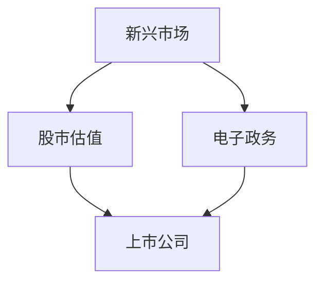
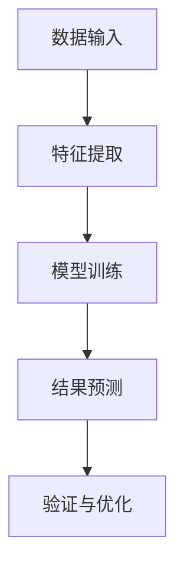
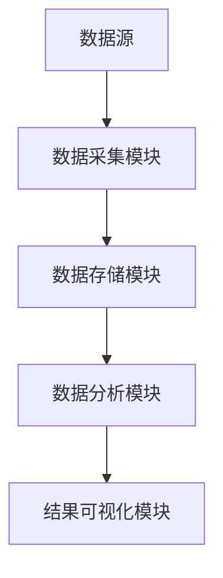

                 


# 新兴市场股市估值与电子政务发展的互动

> 关键词：新兴市场、股市估值、电子政务、算法模型、系统架构、线性回归

> 摘要：本文探讨新兴市场中股市估值与电子政务发展的互动关系，通过分析股市估值的核心概念、电子政务的发展要素，以及两者的相互影响，构建一个系统化的模型，并通过线性回归算法进行案例分析，最后提出最佳实践和注意事项。

---

## 第一部分: 背景介绍与核心概念

### 第1章: 新兴市场股市估值与电子政务发展的背景

#### 1.1 新兴市场的定义与特征
新兴市场通常指那些经济快速增长但尚未达到发达国家水平的国家，如中国、印度、巴西等。这些市场的特点是经济结构多元化、增长潜力大，但同时也面临较高的风险和不确定性。

#### 1.2 股市估值的基本概念
股市估值是衡量上市公司价值的重要指标，通常通过市盈率（P/E）、市净率（P/B）等指标来评估。股市估值的变化反映了市场对上市公司未来表现的预期。

#### 1.3 电子政务发展的核心要素
电子政务是政府通过信息技术提供服务和管理的模式。其核心要素包括互联网基础设施、政策支持、技术标准等。电子政务的发展能够提高政府效率，增强公众信任。

#### 1.4 背景问题的提出
随着新兴市场的崛起，股市估值与电子政务发展的互动关系日益显著。股市估值反映了经济活力，而电子政务则是推动经济数字化的重要力量。如何量化这种互动关系，是本文的核心问题。

---

### 第2章: 核心概念与联系

#### 2.1 股市估值对电子政务发展的促进作用
股市估值的提升通常意味着市场对政府政策的信任增加，这会间接推动电子政务的发展，因为政府有更多的资源和动力进行数字化转型。

#### 2.2 电子政务对股市估值的反向影响
电子政务的完善能够提高政府透明度和效率，增强投资者信心，从而提升股市估值。

#### 2.3 互动关系的系统性分析
通过系统性分析，可以发现股市估值与电子政务发展之间存在正反馈机制。一方面，股市估值的提升为电子政务提供更多资金支持；另一方面，电子政务的发展增强了市场的信任，进一步提升股市估值。

#### 2.4 核心概念对比分析

| 比较维度 | 股市估值 | 电子政务 |
|----------|----------|----------|
| 核心目标 | 评估企业价值 | 提供高效政府服务 |
| 主要影响因素 | 经济指标、政策、市场情绪 | 技术水平、政策、公众需求 |
| 发展动力 | 投资者信心、企业盈利 | 政府政策、技术进步 |

#### 2.5 实体关系图（ER图）


---

## 第二部分: 算法原理与数学模型

### 第3章: 互动关系的算法原理

#### 3.1 线性回归模型
线性回归是一种统计学方法，用于分析两个变量之间的关系。在本文中，我们将股市估值作为因变量，电子政务发展水平作为自变量，构建线性回归模型。

#### 3.2 线性回归的数学公式
$$ y = \beta_0 + \beta_1x + \epsilon $$

其中：
- \( y \)：股市估值
- \( x \)：电子政务发展水平
- \( \beta_0 \)：截距
- \( \beta_1 \)：回归系数
- \( \epsilon \)：误差项

#### 3.3 算法流程图


#### 3.4 Python代码实现
```python
import pandas as pd
import numpy as np
from sklearn.linear_model import LinearRegression
from sklearn.metrics import mean_squared_error

# 数据加载
data = pd.read_csv('emerging_market_data.csv')

# 特征提取
X = data[['e_gov_development']]
y = data['stock_valuation']

# 模型训练
model = LinearRegression()
model.fit(X, y)

# 预测与评估
y_pred = model.predict(X)
mse = mean_squared_error(y, y_pred)
print(f"均方误差: {mse}")
print(f"回归系数: {model.coef_[0]}")
print(f"截距: {model.intercept_}")
```

---

## 第三部分: 系统分析与架构设计方案

### 第4章: 系统分析与架构设计

#### 4.1 问题场景介绍
本文旨在构建一个量化模型，分析新兴市场中股市估值与电子政务发展的互动关系。系统需要处理大量数据，包括股市数据和电子政务发展指数。

#### 4.2 系统功能设计
- 数据采集模块：从公开数据源获取股市估值和电子政务发展指数。
- 数据分析模块：使用线性回归模型进行预测和评估。
- 可视化模块：将结果以图表形式展示。

#### 4.3 系统架构设计


#### 4.4 接口与交互设计
- 数据接口：提供REST API，供其他系统调用。
- 用户交互：通过Web界面输入参数，查看预测结果。

---

## 第四部分: 项目实战

### 第5章: 项目实战

#### 5.1 环境安装
需要安装Python、Pandas、NumPy和Scikit-learn库。

#### 5.2 核心代码实现
```python
import pandas as pd
import numpy as np
from sklearn.linear_model import LinearRegression
from sklearn.metrics import mean_squared_error

# 数据加载
data = pd.read_csv('emerging_market_data.csv')

# 特征提取
X = data[['e_gov_development']]
y = data['stock_valuation']

# 模型训练
model = LinearRegression()
model.fit(X, y)

# 预测与评估
y_pred = model.predict(X)
mse = mean_squared_error(y, y_pred)
print(f"均方误差: {mse}")
```

#### 5.3 实际案例分析
以某新兴市场为例，分析电子政务发展指数对股市估值的影响。

---

## 第五部分: 最佳实践与注意事项

### 第6章: 最佳实践

#### 6.1 数据质量的重要性
确保数据准确性和完整性，避免偏差。

#### 6.2 模型选择
根据实际情况选择合适的算法，避免过度拟合。

#### 6.3 可视化
通过图表清晰展示分析结果，便于理解和沟通。

### 第7章: 小结与展望

本文通过系统化的分析，探讨了新兴市场中股市估值与电子政务发展的互动关系，并构建了一个线性回归模型进行实证分析。未来的研究可以考虑引入更多变量，如政策因素、国际环境等，进一步完善模型。

### 第8章: 注意事项

- 数据收集要注意样本的代表性。
- 模型评估时要关注误差分析。
- 实际应用中要结合具体市场环境。

### 第9章: 拓展阅读

推荐进一步阅读相关领域的文献，如《量化金融》和《电子政务发展指数报告》。

---

## 作者：AI天才研究院/AI Genius Institute & 禅与计算机程序设计艺术 /Zen And The Art of Computer Programming

