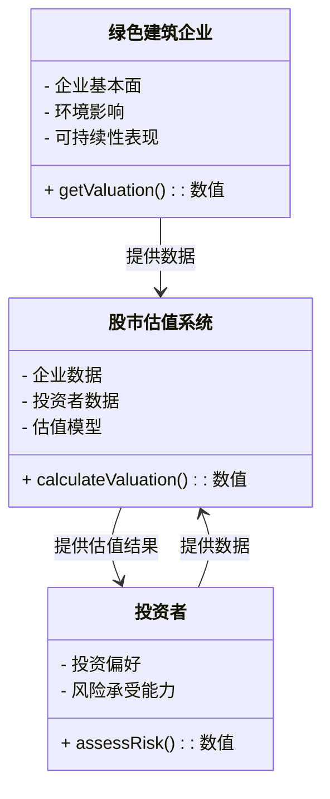
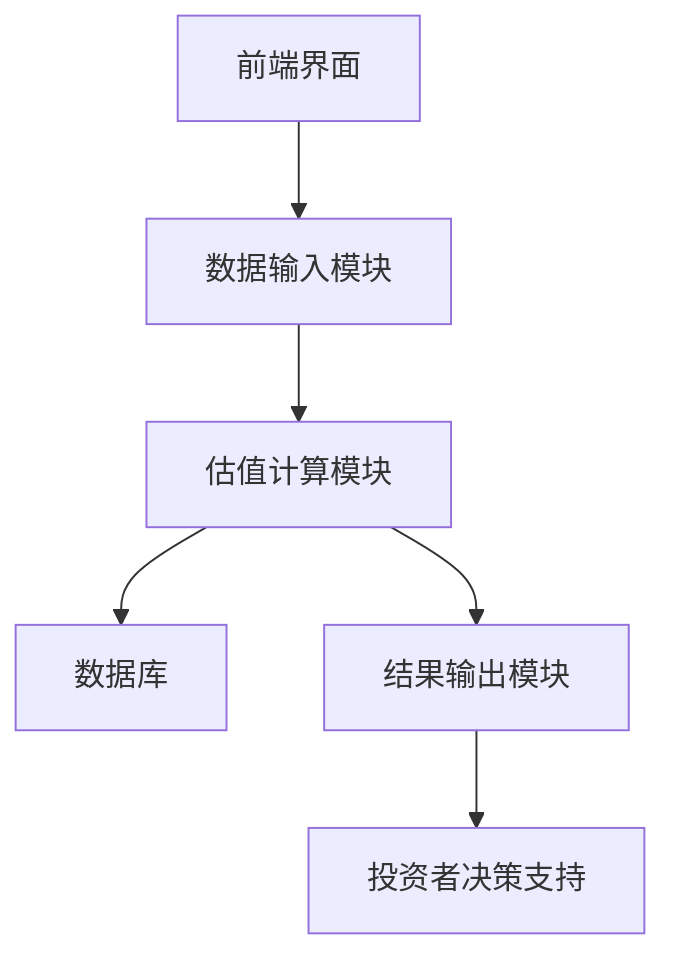
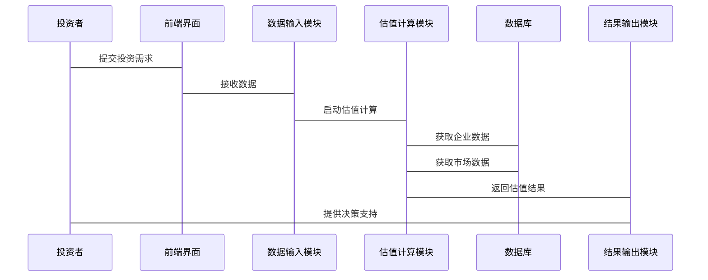

                 


---

# 新兴市场股市估值与绿色建筑发展的互动

## 关键词：新兴市场、股市估值、绿色建筑、可持续发展、投资分析、经济发展

## 摘要：  
新兴市场作为全球经济增长的重要驱动力，其股市估值与绿色建筑发展之间的互动关系日益受到关注。本文从绿色建筑的定义与发展、股市估值的基本理论入手，分析绿色建筑对股市估值的直接影响和间接影响，探讨两者之间的互动机制。通过实证分析和系统架构设计，本文揭示了绿色建筑如何通过提升企业盈利能力、改变投资者偏好和推动宏观经济优化，进而影响股市估值。最后，本文结合实际案例，提出了绿色建筑与股市估值互动的系统设计和项目实施路径，为投资者和政策制定者提供了有益参考。

---

# 第一部分: 新兴市场股市估值与绿色建筑发展的背景与概述

## 第1章: 新兴市场股市估值的背景与现状

### 1.1 新兴市场的定义与特点

#### 1.1.1 新兴市场的定义
新兴市场是指那些经济快速增长、但尚未完全工业化的国家，包括中国、印度、巴西等。这些市场通常具有较高的增长潜力，但也伴随着较高的风险。

#### 1.1.2 新兴市场的经济特征
- 经济结构多元化，涵盖制造业、服务业和农业。
- 人口年轻，消费市场潜力大。
- 政府政策对经济发展具有重要影响。

#### 1.1.3 新兴市场股市的独特性
- 市场波动性较大，受政策和外部环境影响显著。
- 市场流动性相对较低，投资者结构以散户为主。

### 1.2 绿色建筑的定义与发展

#### 1.2.1 绿色建筑的定义
绿色建筑是指在全生命周期内，最大限度地减少资源消耗和环境影响的建筑。它强调能源效率、可持续材料和环保设计。

#### 1.2.2 绿色建筑的核心要素
- 能源效率：使用可再生能源，减少能源消耗。
- 材料选择：使用环保材料，减少建筑垃圾。
- 智能化系统：通过智能技术优化建筑运行。

#### 1.2.3 绿色建筑的全球发展趋势
- 全球范围内绿色建筑认证（如LEED、BREEAM）的需求增加。
- 各国政府出台政策支持绿色建筑发展。
- 投资者对绿色建筑的关注度提高。

## 第2章: 股市估值的基本理论与方法

### 2.1 股市估值的基本概念

#### 2.1.1 股市估值的定义
股市估值是指通过对企业的财务状况、市场地位、行业前景等多方面因素进行分析，确定其股票的合理价格。

#### 2.1.2 股市估值的主要指标
- 市盈率（P/E）：市价与每股收益的比率。
- 市净率（P/B）：市价与每股净资产的比率。
- 股息率：每股股息与股价的比率。

#### 2.1.3 股市估值的影响因素
- 宏观经济环境：GDP增长率、利率、通货膨胀等。
- 行业发展趋势：行业周期、政策支持等。
- 企业基本面：盈利能力、财务状况、管理团队等。

### 2.2 绿色建筑与股市估值的联系

#### 2.2.1 绿色建筑对股市估值的影响
- 绿色建筑企业通常具有较高的成长性和较低的环境风险，可能享有更高的估值溢价。
- 投资者对绿色建筑的关注可能推动相关企业股票价格上涨。

#### 2.2.2 绿色建筑企业的上市现状
- 全球范围内，越来越多的绿色建筑企业选择上市融资。
- 新兴市场中，绿色建筑企业的上市数量和市值均呈现增长趋势。

#### 2.2.3 绿色建筑对投资者决策的影响
- 投资者 increasingly incorporate ESG（环境、社会、治理）因素 into their investment decisions.
- 绿色建筑企业因其可持续性优势，可能吸引更多长期投资者。

---

# 第二部分: 绿色建筑发展对股市估值的影响机制

## 第3章: 绿色建筑对股市估值的直接影响

### 3.1 绿色建筑企业的市场表现

#### 3.1.1 绿色建筑企业的盈利能力
- 绿色建筑企业通过节能技术降低成本，提升盈利能力。
- 可再生能源的应用有助于企业减少能源支出。

#### 3.1.2 绿色建筑企业的成长性
- 绿色建筑市场需求增长迅速，企业具有较大的成长空间。
- 政策支持和技术创新为企业提供持续增长动力。

#### 3.1.3 绿色建筑企业的风险评估
- 绿色建筑企业面临政策风险和市场风险，但整体风险较低。

### 3.2 绿色建筑对投资者偏好的影响

#### 3.2.1 绿色投资理念的兴起
- 全球范围内，ESG投资理念逐渐成为主流。
- 投资者 increasingly demand transparency and sustainability in their investments.

#### 3.2.2 绿色建筑对投资者决策的影响
- 绿色建筑企业因符合可持续发展理念，受到投资者青睐。
- 绿色建筑企业可能享有更高的品牌价值和市场声誉。

#### 3.2.3 绿色建筑企业对市场的溢价
- 绿色建筑企业因较高的社会认可度，可能享有估值溢价。

## 第4章: 绿色建筑对股市估值的间接影响

### 4.1 绿色建筑对宏观经济的影响

#### 4.1.1 绿色建筑对GDP的贡献
- 绿色建筑产业带动相关行业发展，提升GDP。
- 绿色建筑投资创造就业机会，促进经济发展。

#### 4.1.2 绿色建筑对就业的影响
- 绿色建筑项目需要大量劳动力，特别是在施工和设计阶段。
- 技术创新推动高技能岗位需求增加。

#### 4.1.3 绿色建筑对能源消耗的减少
- 绿色建筑通过节能技术减少能源消耗，降低碳排放。
- 有助于实现全球气候目标，提升国家形象。

### 4.2 绿色建筑对行业发展的推动

#### 4.2.1 绿色建筑对相关产业的带动
- 绿色建筑推动建材、设备制造等相关产业发展。
- 绿色建筑促进智能建筑技术的发展，推动科技行业进步。

#### 4.2.2 绿色建筑对技术创新的促进
- 绿色建筑企业研发投入增加，推动技术创新。
- 技术创新降低建筑成本，提升企业竞争力。

#### 4.2.3 绿色建筑对市场竞争格局的影响
- 绿色建筑企业因竞争优势明显，市场地位提升。
- 竞争对手被迫跟进，推动整个行业向绿色方向发展。

---

# 第三部分: 股市估值与绿色建筑发展的互动关系分析

## 第5章: 股市估值与绿色建筑发展

### 5.1 股市估值对绿色建筑发展的促进作用

#### 5.1.1 股市融资推动绿色建筑发展
- 绿色建筑企业通过股市融资获得资金支持。
- 投资者对绿色建筑的关注推动企业加大研发投入。

#### 5.1.2 股市估值引导企业优化管理
- 企业为提升估值，优化财务管理和信息披露。
- 提升治理结构，增强投资者信心。

#### 5.1.3 股市估值推动行业创新
- 企业为提升估值，积极采用新技术和新模式。
- 创新成果提升企业竞争力，推动行业整体进步。

### 5.2 绿色建筑发展对股市估值的反向影响

#### 5.2.1 绿色建筑提升企业品牌价值
- 绿色建筑企业因环保形象，品牌价值提升。
- 高品牌价值吸引投资者，推动股价上涨。

#### 5.2.2 绿色建筑降低企业风险
- 绿色建筑企业因环境友好，面临较少的政策风险。
- 可持续发展模式降低企业经营风险。

#### 5.2.3 绿色建筑推动股市整体优化
- 绿色建筑企业表现优异，推动股市整体上涨。
- 投资者对绿色建筑的关注推动股市结构优化。

## 第6章: 绿色建筑与股市估值互动的系统架构设计

### 6.1 系统功能设计

#### 6.1.1 领域模型设计


#### 6.1.2 系统架构设计


### 6.2 系统接口设计

#### 6.2.1 系统交互流程


---

# 第四部分: 项目实战与案例分析

## 第7章: 项目实战

### 7.1 环境安装

#### 7.1.1 安装Python
```bash
# 安装Python
sudo apt-get update
sudo apt-get install python3
```

#### 7.1.2 安装依赖库
```bash
pip install numpy pandas matplotlib
```

### 7.2 核心代码实现

#### 7.2.1 绿色建筑企业估值模型
```python
import numpy as np
import pandas as pd

def calculate_green_building_valuation(revenue, profit_margin, growth_rate, discount_rate):
    # 使用DCF模型计算企业估值
    free_cash_flow = revenue * profit_margin * (1 - discount_rate)
    terminal_value = free_cash_flow / (discount_rate - growth_rate)
    enterprise_value = free_cash_flow + terminal_value
    return enterprise_value

# 示例数据
revenue = 100000000  # 营业收入（美元）
profit_margin = 0.15  # 利润率
growth_rate = 0.05     # 增长率
discount_rate = 0.08    # 折现率

valuation = calculate_green_building_valuation(revenue, profit_margin, growth_rate, discount_rate)
print(f"企业估值: ${valuation:.2f}")
```

#### 7.2.2 投资者偏好分析
```python
import pandas as pd

def analyze_investor_preference(preferences):
    # 分析投资者偏好
    preference_counts = pd.Series(preferences).value_counts(normalize=True)
    return preference_counts

# 示例数据
preferences = ['绿色建筑', '传统建筑', '绿色能源', '传统能源'] * 100
preference_counts = analyze_investor_preference(preferences)
print(preference_counts)
```

### 7.3 案例分析

#### 7.3.1 国内案例分析
- 案例：中国某绿色建筑企业IPO估值分析
  - 收入增长：过去三年收入增长20%。
  - 利润率：15%。
  - 市场前景：绿色建筑市场需求年增长10%。
  - 使用DCF模型计算企业估值。

#### 7.3.2 国际案例分析
- 案例：某新兴市场绿色建筑企业融资分析
  - 使用投资者偏好分析模型，确定投资者对绿色建筑的关注度。
  - 评估企业在国际市场中的竞争力。

---

# 第五部分: 结论与展望

## 第8章: 结论与展望

### 8.1 结论

- 绿色建筑发展对股市估值具有显著的正面影响。
- 投资者对绿色建筑的关注推动企业市值增长。
- 绿色建筑与股市估值的互动关系是可持续发展的关键因素。

### 8.2 展望

- 进一步研究绿色建筑对不同市场类型的影响。
- 探讨绿色金融工具在绿色建筑融资中的作用。
- 提升绿色建筑企业的信息披露透明度。

---

# 作者：AI天才研究院/AI Genius Institute & 禅与计算机程序设计艺术 /Zen And The Art of Computer Programming

