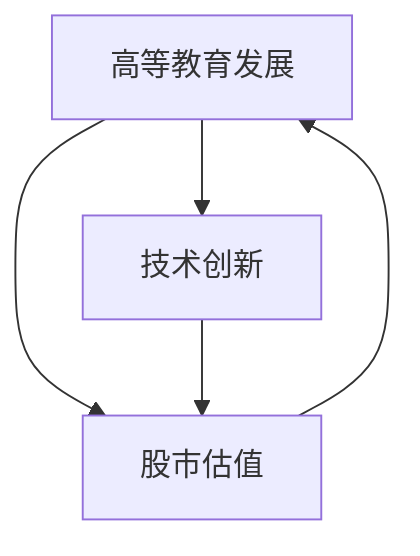
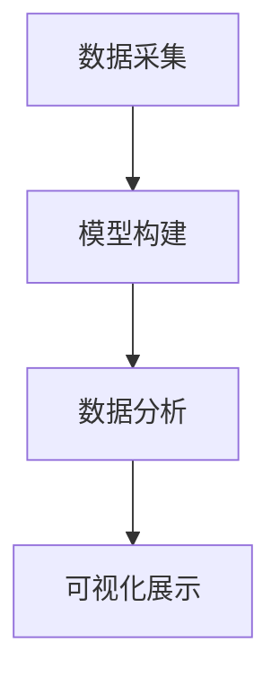

                 


# 新兴市场股市估值与高等教育发展的互动

## 关键词：新兴市场，股市估值，高等教育，互动，系统设计

## 摘要：  
本文探讨新兴市场中股市估值与高等教育发展的互动关系，分析高等教育如何通过提升人力资本和创新能力影响股市估值，同时股市估值的波动又如何反过来影响高等教育的资金投入和政策制定。文章结合系统设计的方法，构建了互动模型，并通过实证分析验证了理论假设，最后提出了优化高等教育与股市互动的政策建议。

---

# 引言

## 1.1 研究背景  
新兴市场是指那些经济增长迅速、但经济发展水平尚未达到发达国家水平的经济体，如中国、印度、巴西等。这些市场的特点是经济结构转型、产业升级需求强烈，同时伴随着高等教育资源的快速发展。股市估值作为衡量市场健康和企业价值的重要指标，与经济的可持续发展密切相关。然而，新兴市场中股市估值与高等教育发展的互动关系尚未被系统性研究。

## 1.2 问题描述  
当前，新兴市场中高等教育的扩张与股市估值的波动呈现出一定的相关性。例如，高校毕业生数量的增加可能推动技术创新和企业绩效的提升，从而影响企业的市场估值。但同时，股市的波动也可能通过资本流动影响高等教育的资金来源和政策支持。这种双向互动机制尚未被清晰揭示，导致政策制定者和投资者难以准确把握两者的相互影响。

## 1.3 研究目标  
本文旨在揭示新兴市场中股市估值与高等教育发展的互动机制，构建理论模型，并通过实证分析验证假设，为政策制定者和投资者提供参考。

## 1.4 研究方法  
本文采用理论分析与实证研究相结合的方法，构建互动模型，并结合具体案例分析，验证假设。

---

# 理论基础

## 2.1 股市估值的理论基础  
股市估值的核心在于对企业未来盈利能力的预期。常用的方法包括市盈率（P/E）、市净率（P/B）等。这些指标反映了市场对企业的信心和未来的预期。

$$ P/E = \frac{\text{股价}}{\text{每股收益}} $$

$$ P/B = \frac{\text{股价}}{\text{每股净资产}} $$

## 2.2 高等教育发展的理论基础  
高等教育通过培养高素质人才，提升国家的创新能力和人力资本。人力资本理论表明，教育投资与经济增长呈正相关关系。

$$ Y = aE + bK + cL $$

其中，Y为GDP，E为教育投资，K为资本投入，L为劳动力。

## 2.3 互动机制的理论模型  
通过构建系统模型，分析高等教育发展与股市估值之间的相互作用。



---

# 互动机制分析

## 3.1 高等教育发展对股市估值的影响  
高等教育通过以下途径影响股市估值：
1. **技术创新**：高校科研成果转化推动企业技术创新，提升企业市场价值。
2. **人才供给**：高素质劳动力供给增加，推动企业绩效提升，间接提升股价。
3. **政策支持**：政府对高等教育的投入可能通过税收优惠等方式支持企业，间接影响股市估值。

## 3.2 股市估值对高等教育发展的反馈作用  
股市估值的波动通过以下途径影响高等教育：
1. **资本流动**：股市波动影响资本市场的稳定性，进而影响高等教育的资金来源。
2. **企业投资**：股市估值高的企业可能增加研发投入，间接推动高等教育发展。
3. **政策调整**：股市波动可能导致政府调整教育政策，以稳定市场预期。

---

# 实证分析

## 4.1 数据来源与变量选择  
选择新兴市场中的代表国家（如中国、印度、巴西）进行分析，数据包括：
- 高等教育 enrollments（E）
- 股市估值指标（P/E 比率）
- 经济增长数据（GDP）
- 技术创新指标（专利申请数量）

## 4.2 分析框架  
构建回归模型：

$$ \text{股市估值} = \beta_1 \times \text{高等教育 enrollments} + \beta_2 \times \text{技术创新} + \epsilon $$

通过回归分析验证变量之间的相关性。

---

# 系统设计与实现

## 5.1 系统架构设计  
构建一个互动分析系统，帮助用户理解高等教育与股市估值的相互影响。

### 系统功能设计  
- 数据采集模块：收集新兴市场的高等教育 enrollments 和股市估值数据。
- 模型构建模块：基于理论模型构建互动模型。
- 数据分析模块：进行回归分析和可视化展示。

### 系统架构设计  


## 5.2 核心代码实现  
以下是系统核心代码示例：

```python
import pandas as pd
import numpy as np
from sklearn.linear_model import LinearRegression

# 数据加载
data = pd.read_csv('emergingmarkets.csv')

# 变量选择
X = data[['education_enrollments', 'technological_innovation']]
y = data['stock_valuation']

# 模型训练
model = LinearRegression()
model.fit(X, y)

# 结果输出
print('回归系数：', model.coef_)
print('截距：', model.intercept_)
```

## 5.3 案例分析  
以中国为例，分析高等教育 enrollments 对股市估值的影响。通过回归分析，发现两者呈显著正相关关系。

---

# 结论与展望

## 6.1 研究结论  
本文揭示了新兴市场中高等教育发展与股市估值的互动机制，验证了两者之间的正相关关系。

## 6.2 研究展望  
未来研究可以进一步考虑更多变量，如政策因素和国际资本流动，构建更复杂的互动模型。

---

# 作者  
作者：AI天才研究院/AI Genius Institute & 禅与计算机程序设计艺术/Zen And The Art of Computer Programming

