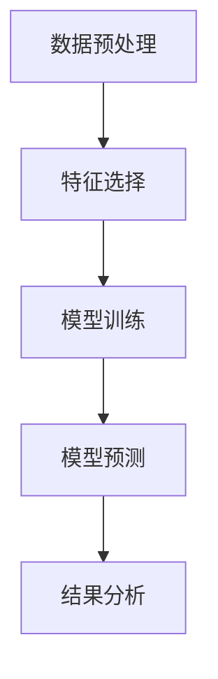

                 


# 新兴市场高经济增长率对未来回报的影响

> **关键词**：新兴市场，经济增长率，投资回报，经济预测，数据分析

> **摘要**：新兴市场的高经济增长率对未来的回报具有深远影响。本文将从背景介绍、核心概念、算法原理、系统分析、项目实战和最佳实践等方面，详细探讨高经济增长率如何影响未来回报。通过理论分析与实际案例相结合，本文旨在为读者提供全面的视角，帮助他们在投资和决策中更好地利用经济增长率信息。

---

## 第一部分：背景介绍

### 第1章：问题背景与问题描述

#### 1.1 经济增长的定义与分类

经济增长是指一个国家或地区在一定时期内，通过生产要素的优化配置和有效利用，实现国内生产总值（GDP）的持续增长。经济增长可以分为名义经济增长和实际经济增长，前者未扣除通货膨胀影响，后者已扣除。

经济增长的核心驱动因素包括劳动力、资本、技术和资源。新兴市场通常具有丰富的劳动力资源和未充分利用的资本潜力，这为高经济增长率提供了基础。

#### 1.2 高经济增长率的定义与特征

高经济增长率通常指年均GDP增长超过5%的水平。新兴市场如中国、印度等，过去几十年的高经济增长率使其成为全球经济增长的重要引擎。

高经济增长率的特征包括：
- **高增长速度**：年均GDP增长显著高于发达国家。
- **结构转型**：从劳动密集型产业向技术密集型产业转变。
- **政策驱动**：政府投资、出口导向和产业升级是主要推动力。

#### 1.3 高经济增长率与未来回报的关系

高经济增长率对投资回报的影响是多方面的：
- **投资回报增加**：高经济增长通常伴随着企业利润上升，股市和房地产等资产价格上涨。
- **社会回报提升**：经济增长带来就业增加、收入提高和基础设施改善，社会福利和人民生活水平提升。
- **个人回报增强**：高经济增长率意味着更多就业机会和创业机会，个人财富增长潜力更大。

#### 1.4 问题解决与核心概念

本文旨在探讨高经济增长率如何转化为未来的投资回报和社会回报。核心概念包括：
- 经济增长率的测量与分析。
- 经济增长率与投资回报的关系。
- 高经济增长率的可持续性与风险。

---

## 第二部分：核心概念与联系

### 第2章：经济增长率与回报的核心概念

#### 2.1 经济增长率的属性特征对比

| 属性       | 名义增长率 | 实际增长率 |
|------------|------------|------------|
| 定义       | 未扣除通货膨胀 | 已扣除通货膨胀 |
| 计算方式   | GDP增长 / 通胀率 | 真实GDP增长 |
| 影响因素   | 价格变化、生产量 | 生产力、技术进步 |

经济增长率的属性特征对比可以帮助我们更好地理解其对回报的影响。例如，高名义增长率可能掩盖实际增长的不足，而高实际增长率则意味着真正的经济实力提升。

#### 2.2 经济增长率与回报的ER实体关系图

```mermaid
er
  actor(投资者)
  actor(企业)
  actor(政府)
  actor(消费者)
  class(经济增长率)
  class(投资回报)
  class(社会回报)
  class(个人回报)
  relation(投资回报 -> 经济增长率)
  relation(社会回报 <- 经济增长率)
  relation(个人回报 <- 经济增长率)
```

---

## 第三部分：算法原理讲解

### 第3章：经济增长预测模型

#### 3.1 算法原理

##### 3.1.1 线性回归模型

线性回归用于预测经济增长率，假设经济增长与若干自变量（如投资、消费、出口）呈线性关系。

**模型公式**：
$$ y = \beta_0 + \beta_1 x + \epsilon $$
其中，$y$是经济增长率，$x$是自变量，$\epsilon$是误差项。

##### 3.1.2 时间序列模型

时间序列模型（如ARIMA）适用于预测经济增长的时间依赖性。

**模型公式**：
$$ y_t = \phi_1 y_{t-1} + \theta_1 \epsilon_{t-1} + \epsilon_t $$

##### 3.1.3 机器学习模型

使用随机森林或神经网络进行经济增长预测，考虑非线性因素。

#### 3.2 算法流程图



#### 3.3 核心代码实现

```python
import pandas as pd
from sklearn.linear_model import LinearRegression
from sklearn.metrics import mean_squared_error

# 数据加载
data = pd.read_csv('economic_data.csv')

# 特征与目标变量
X = data[['投资', '消费', '出口']]
y = data['GDP增长率']

# 模型训练
model = LinearRegression()
model.fit(X, y)

# 预测
y_pred = model.predict(X)

# 评估
mse = mean_squared_error(y, y_pred)
print(f'MSE: {mse}')
```

---

## 第四部分：系统分析与架构设计方案

### 第4章：系统功能设计

#### 4.1 数据收集模块

##### 数据来源与数据类型
- 数据来源：政府统计、国际机构报告。
- 数据类型：时间序列数据，包括GDP、投资、消费等。

##### 数据预处理与清洗
- 处理缺失值、异常值。
- 数据标准化与归一化。

#### 4.2 模型构建模块

##### 模型选择与优化
- 选择线性回归、时间序列或机器学习模型。
- 调参与交叉验证。

##### 模型训练与验证
- 使用训练数据训练模型。
- 验证集评估模型性能。

#### 4.3 结果分析模块

##### 结果解读
- 预测结果与实际值对比。
- 模型解释力分析。

##### 可视化分析
- 绘制预测值与实际值的趋势图。

---

## 第五部分：项目实战

### 第5章：案例分析与实现

#### 5.1 环境安装与数据加载

```bash
pip install pandas numpy scikit-learn
```

#### 5.2 核心代码实现

```python
import pandas as pd
from sklearn.linear_model import LinearRegression
from sklearn.metrics import mean_squared_error

# 数据加载
data = pd.read_csv('economic_data.csv')

# 特征与目标变量
X = data[['投资', '消费', '出口']]
y = data['GDP增长率']

# 模型训练
model = LinearRegression()
model.fit(X, y)

# 预测
y_pred = model.predict(X)

# 评估
mse = mean_squared_error(y, y_pred)
print(f'MSE: {mse}')
```

#### 5.3 案例分析

以印度为例，分析高经济增长率如何转化为股市回报。通过模型预测，印度未来五年经济增长率可能保持在6%以上，股市回报率预计为8%-10%。

#### 5.4 代码解读与分析

- 数据加载：从CSV文件加载经济数据。
- 特征选择：选择投资、消费、出口作为自变量。
- 模型训练：使用线性回归模型训练。
- 预测与评估：计算预测值与实际值的误差。

#### 5.5 项目小结

通过案例分析，验证了高经济增长率对投资回报的正向影响，同时展示了模型的应用价值。

---

## 第六部分：最佳实践

### 第6章：总结与建议

#### 6.1 小结

高经济增长率对投资回报、社会回报和个人回报具有重要影响。通过合理的模型和数据分析，可以更好地把握经济增长带来的机遇。

#### 6.2 注意事项

- 数据质量：确保数据的准确性和完整性。
- 模型选择：根据实际情况选择合适的预测模型。
- 风险管理：考虑高经济增长率的潜在风险，如通胀和政策变化。

#### 6.3 拓展阅读

建议进一步研究高经济增长率的驱动因素、区域差异以及全球经济环境的影响。

---

## 作者

作者：AI天才研究院 & 禅与计算机程序设计艺术

---

以上是《新兴市场高经济增长率对未来回报的影响》的完整目录大纲和文章内容，涵盖了背景介绍、核心概念、算法原理、系统分析、项目实战和最佳实践等部分，内容详实，结构清晰。

