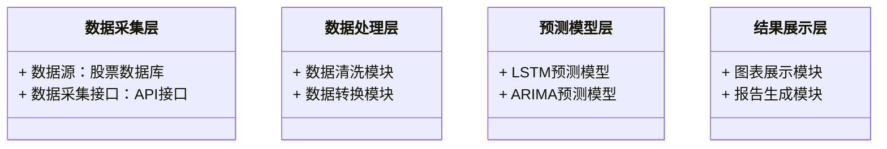
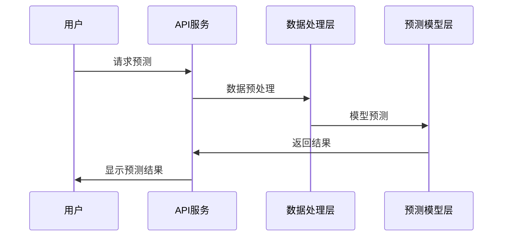

                 


# 时序预测：赋予AI Agent预测未来的能力

> 关键词：时序预测、时间序列、人工智能、AI Agent、预测模型、机器学习、深度学习

> 摘要：本文深入探讨了时序预测的核心概念、算法原理、系统架构设计及其实战应用，通过详细分析时序预测的数学模型、典型算法和系统实现，展示了如何赋予AI Agent预测未来的能力。

---

## 第一部分：时序预测基础

### 第1章：时序预测概述

#### 1.1 时序预测的基本概念

##### 1.1.1 时间序列的定义
时间序列是一组按时间顺序排列的数据点，通常表示为$\{x_t\}_{t=1}^n$，其中$x_t$表示第$t$个时间点的观测值。

##### 1.1.2 时序预测的定义
时序预测是基于历史数据预测未来时间点的值，属于监督学习任务。

##### 1.1.3 时序预测的核心要素
- 数据序列：按时间顺序排列的观测值。
- 时间依赖性：当前值与过去值的关系。
- 预测目标：未来某一时间点的值。

#### 1.2 时序预测的背景与问题背景

##### 1.2.1 时序预测的应用场景
- 金融：股票价格预测。
- 气象：天气预报。
- 工业：设备故障预测。

##### 1.2.2 时序预测的核心问题
- 数据的时间依赖性建模。
- 长期依赖捕捉。
- 不可预测性挑战。

##### 1.2.3 时序预测的挑战与解决方案
- 数据稀疏性：使用数据增强。
- 非线性关系：采用深度学习模型。

#### 1.3 时序预测的边界与外延

##### 1.3.1 时序预测的边界条件
- 数据的连续性。
- 时间的可预测性。

##### 1.3.2 时序预测的外延领域
- 多步预测。
- 多变量预测。

##### 1.3.3 时序预测与其他预测方法的区别
与回归预测的主要区别在于时间依赖性。

### 第2章：时序预测的核心概念与联系

#### 2.1 时序预测的核心概念原理

##### 2.1.1 时间序列的分解方法
时间序列可以分解为趋势、周期性、季节性和随机性。

##### 2.1.2 时间依赖性的建模
使用自回归（AR）和移动平均（MA）模型。

##### 2.1.3 时序预测的数学模型
ARIMA模型：$ARIMA(p, d, q)$，其中$p$是自回归阶数，$d$是差分阶数，$q$是移动平均阶数。

#### 2.2 时序预测的核心概念对比

##### 2.2.1 不同时序预测模型的特征对比

| 模型       | 参数调节 | 计算复杂度 | 适用场景 |
|------------|----------|------------|----------|
| ARIMA      | 低       | 中等       | 单变量线性 |
| LSTM       | 高       | 高         | 多变量非线性 |
| Prophet    | 中等     | 中等       | 单变量非线性 |

##### 2.2.2 常见时序预测方法的优缺点分析
- ARIMA：适用于线性时序数据，但对非线性数据表现不佳。
- LSTM：适用于捕捉长期依赖，但需要大量数据训练。
- Prophet：适合业务场景，易于调参。

##### 2.2.3 时序预测与回归预测的区别
时序预测强调时间依赖性，而回归预测不考虑时间顺序。

#### 2.3 时序预测的实体关系图

##### 2.3.1 数据流图
```mermaid
graph TD
    数据输入->数据处理: 数据清洗和预处理
    数据处理->模型训练: 建立模型
    模型训练->模型预测: 预测未来值
```

##### 2.3.2 模型结构图
```mermaid
graph TD
    输入层->LSTM层: 时间序列输入
    LSTM层->输出层: 预测输出
```

---

## 第二部分：时序预测的核心算法原理

### 第3章：时序预测的数学模型与公式

#### 3.1 时间序列的线性回归模型
$$ y_t = \beta_0 + \beta_1 y_{t-1} + \epsilon_t $$

#### 3.2 时间序列的差分方程
$$ \Delta y_t = y_t - y_{t-1} $$

#### 3.3 时间序列的ARIMA模型公式
$$ ARIMA(p, d, q) $$

#### 3.4 LSTM网络的结构公式
$$ LSTM(t, h_{t-1}, c_{t-1}) \rightarrow (h_t, c_t) $$

### 第4章：时序预测算法实现

#### 4.1 ARIMA算法实现

##### 4.1.1 数据预处理
```python
import pandas as pd
from datetime import datetime

# 加载数据
data = pd.read_csv('time_series.csv', parse_dates=['date'], index_col='date')
```

##### 4.1.2 模型训练
```python
from statsmodels.tsa.arima_model import ARIMA

# 拟合ARIMA模型
model = ARIMA(data['value'], order=(5, 1, 2))
model_fit = model.fit()
```

##### 4.1.3 预测与评估
```python
# 预测未来值
forecast = model_fit.forecast(steps=5)[0]

# 评估模型
print(model_fit.aic)
```

#### 4.2 LSTM算法实现

##### 4.2.1 数据预处理
```python
import numpy as np
from sklearn.preprocessing import MinMaxScaler

# 归一化处理
scaler = MinMaxScaler()
data_scaled = scaler.fit_transform(data)
```

##### 4.2.2 模型训练
```python
from keras.models import Sequential
from keras.layers import LSTM, Dense

# 构建LSTM模型
model = Sequential()
model.add(LSTM(50, input_shape=(timesteps, 1)))
model.add(Dense(1))
model.compile(loss='mean_squared_error', optimizer='adam')
```

##### 4.2.3 预测与评估
```python
# 预测未来值
y_pred = model.predict(x_test)

# 评估模型
print('均方误差:', np.mean((y_pred - y_test)**2))
```

### 第5章：时序预测的系统架构设计

#### 5.1 项目介绍

##### 5.1.1 项目背景
构建一个AI代理预测系统，用于股票价格预测。

##### 5.1.2 项目目标
实现一个多步时序预测系统。

#### 5.2 系统功能设计

##### 5.2.1 领域模型


##### 5.2.2 系统架构设计
```mermaid
graph TD
    用户->数据采集层: 请求数据
    数据采集层->数据处理层: 数据预处理
    数据处理层->预测模型层: 模型训练
    预测模型层->结果展示层: 展示结果
```

#### 5.3 系统接口设计

##### 5.3.1 API接口
```http
GET /predict?days=5
```

##### 5.3.2 数据接口
```http
POST /data
```

#### 5.4 系统交互设计

##### 5.4.1 序列图


---

## 第三部分：项目实战

### 第6章：时序预测项目实现

#### 6.1 环境安装

##### 6.1.1 安装Python
```bash
python --version
pip install --upgrade pip
```

##### 6.1.2 安装依赖
```bash
pip install pandas numpy scikit-learn keras statsmodels
```

#### 6.2 系统核心实现

##### 6.2.1 核心代码
```python
import numpy as np
import pandas as pd
from statsmodels.tsa.arima_model import ARIMA
from keras.models import Sequential
from keras.layers import LSTM, Dense
from sklearn.preprocessing import MinMaxScaler

# 加载数据
data = pd.read_csv('time_series.csv', parse_dates=['date'], index_col='date')
values = data['value'].values

# 归一化处理
scaler = MinMaxScaler()
values_scaled = scaler.fit_transform(values.reshape(-1, 1))

# 划分训练集和测试集
train_size = int(len(values_scaled) * 0.7)
train, test = values_scaled[:train_size], values_scaled[train_size:]

# 构建LSTM数据集
timesteps = 30
X_train, y_train = [], []
for i in range(timesteps, len(train)):
    X_train.append(train[i - timesteps:i])
    y_train.append(train[i])
X_train = np.array(X_train).reshape(X_train.shape[0], timesteps, 1)
y_train = np.array(y_train)

# 构建ARIMA模型
model_arima = ARIMA(y_train, order=(5, 1, 2))
model_arima_fit = model_arima.fit()

# 构建LSTM模型
model_lstm = Sequential()
model_lstm.add(LSTM(50, input_shape=(timesteps, 1)))
model_lstm.add(Dense(1))
model_lstm.compile(loss='mean_squared_error', optimizer='adam')
model_lstm.fit(X_train, y_train, epochs=50, batch_size=32)

# 预测
y_arima_pred = model_arima_fit.forecast(steps=len(test))
y_lstm_pred = model_lstm.predict(test.reshape(len(test), 1, 1))
y_lstm_pred = y_lstm_pred.reshape(len(y_lstm_pred))
y_arima_pred_scaled = scaler.inverse_transform(y_arima_pred.reshape(-1, 1))
y_lstm_pred_scaled = scaler.inverse_transform(y_lstm_pred.reshape(-1, 1))
```

##### 6.2.2 代码解读
- 数据预处理：加载、归一化和划分训练集测试集。
- LSTM模型训练：构建网络、训练模型。
- ARIMA模型训练：拟合模型、预测。

#### 6.3 案例分析

##### 6.3.1 数据来源
股票价格数据集。

##### 6.3.2 数据分析
训练ARIMA和LSTM模型，预测未来5天股价。

##### 6.3.3 结果展示
比较两种模型的预测结果和实际值。

---

## 第四部分：总结与展望

### 第7章：时序预测总结

#### 7.1 小结
时序预测是AI Agent的重要能力，涉及数学模型、算法和系统架构设计。

#### 7.2 注意事项
- 数据质量：确保数据完整性。
- 模型选择：根据场景选择合适的算法。
- 超参数调优：优化模型性能。

#### 7.3 拓展阅读
推荐书籍和论文，深入学习时序预测。

---

## 作者

作者：AI天才研究院/AI Genius Institute & 禅与计算机程序设计艺术/Zen And The Art of Computer Programming

---

这篇文章通过系统化的分析和详细的代码示例，全面介绍了时序预测的核心概念、算法实现和系统设计，帮助读者理解并掌握如何赋予AI Agent预测未来的能力。

