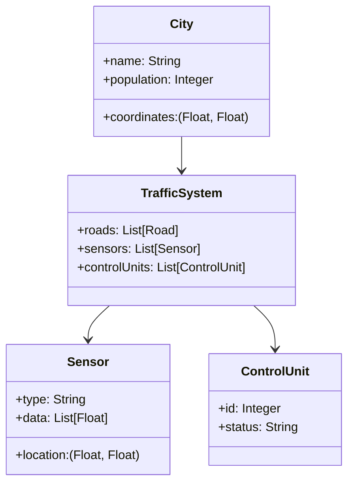
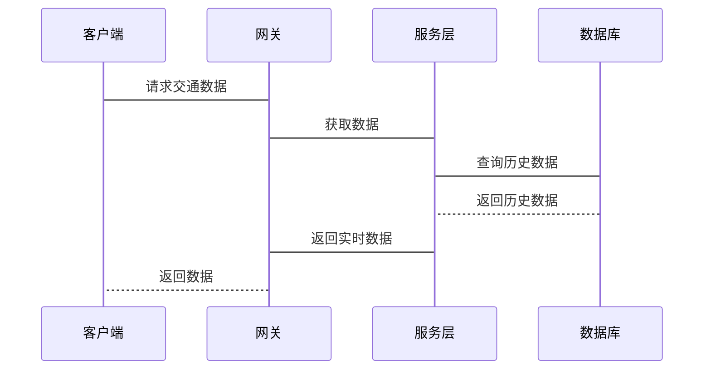

                 


# 智慧城市技术在可持续发展中的应用与投资

## 关键词：智慧城市，可持续发展，物联网，人工智能，大数据，投资策略

## 摘要：  
本文探讨了智慧城市技术在可持续发展中的应用及其投资价值。通过分析智慧城市的核心技术、应用场景和投资策略，本文旨在为技术专家、投资者和政策制定者提供深度见解，帮助他们在智慧城市建设中做出明智决策。

---

## # 第1章: 智慧城市技术概述

### ## 1.1 智慧城市的基本概念

#### ### 1.1.1 智慧城市的定义与内涵  
智慧城市是指通过物联网、大数据、人工智能等技术手段，将城市中的各个系统（如交通、能源、环保、医疗等）有机连接，实现智能化管理的城市形态。其核心在于利用数字技术优化资源配置、提升居民生活质量并降低环境影响。

#### ### 1.1.2 智慧城市的核心技术基础  
- **物联网（IoT）**：实现城市设备的互联互通。  
- **大数据技术**：处理和分析海量城市数据。  
- **人工智能（AI）**：提供智能决策支持。  

#### ### 1.1.3 智慧城市与可持续发展的关系  
智慧城市建设通过优化资源利用、减少碳排放和提升公共服务效率，直接推动了可持续发展目标的实现。

---

### ## 1.2 可持续发展的基本概念

#### ### 1.2.1 可持续发展的定义与目标  
可持续发展是指在满足当前需求的同时，不损害后代满足其需求的能力。其核心目标包括环境保护、经济发展和社会公平。

#### ### 1.2.2 可持续发展的关键领域  
- 环境保护：减少碳排放、节约能源。  
- 经济发展：提高资源利用效率。  
- 社会公平：提升公共服务可及性。  

#### ### 1.2.3 可持续发展与智慧城市的技术关联  
智慧城市技术（如智能交通、智能能源管理）是实现可持续发展的重要工具。

---

### ## 1.3 智慧城市技术的全球发展趋势

#### ### 1.3.1 智慧城市技术的发展历程  
从早期的信息化城市到现在的智能化城市，智慧城市建设逐步深化。

#### ### 1.3.2 全球智慧城市技术的应用现状  
- 欧洲：注重环保和能源管理。  
- 亚洲：以中国和新加坡为代表，注重技术创新。  

#### ### 1.3.3 智慧城市技术的未来趋势  
向更加智能化、绿色化和人性化的方向发展。

---

## # 第2章: 智慧城市技术的核心概念与联系

### ## 2.1 智慧城市技术的核心原理

#### ### 2.1.1 数据采集与处理技术  
- **传感器网络**：实时采集城市数据（如温度、湿度、交通流量）。  
- **数据清洗**：去除噪声数据，确保数据质量。  

#### ### 2.1.2 数据分析与决策支持  
- **机器学习**：预测城市运行状态（如交通拥堵预测）。  
- **决策支持系统**：基于数据分析提供优化建议。  

#### ### 2.1.3 智能化管理与服务  
- **智能调度**：优化资源配置（如电力调度）。  
- **智能服务**：为居民提供个性化服务（如智能医疗）。  

---

### ## 2.2 智慧城市技术的关键组成部分

#### ### 2.2.1 物联网技术  
- **物联网架构**：感知层、网络层、应用层。  
- **物联网应用**：智能交通、智能安防。  

#### ### 2.2.2 大数据技术  
- **数据存储**：分布式存储（如Hadoop）。  
- **数据分析**：数据挖掘、预测分析。  

#### ### 2.2.3 人工智能技术  
- **机器学习**：监督学习、无监督学习。  
- **自然语言处理**：智能客服、文本分析。  

---

### ## 2.3 智慧城市技术与可持续发展的关系

#### ### 2.3.1 技术如何推动可持续发展  
- **能源管理**：智能电网降低能耗。  
- **交通优化**：减少碳排放。  

#### ### 2.3.2 可持续发展对智慧城市技术的需求  
- 环保技术：减少城市污染。  
- 节能技术：降低能源消耗。  

#### ### 2.3.3 技术与可持续发展的相互促进  
技术创新推动可持续发展，而可持续发展目标又反过来促进技术进步。

---

## # 第3章: 智慧城市技术的算法原理与数学模型

### ## 3.1 数据采集与处理算法

#### ### 3.1.1 数据清洗算法  
- **算法步骤**：  
  1. 采集数据。  
  2. 检测异常值。  
  3. 去除噪声数据。  

#### ### 3.1.2 数据融合算法  
- **算法步骤**：  
  1. 多源数据采集。  
  2. 数据对齐。  
  3. 数据融合。  

---

### ## 3.2 数据分析与决策支持模型

#### ### 3.2.1 机器学习算法在智慧城市中的应用  
- **线性回归**：预测交通流量。  
- **随机森林**：分类城市空气质量。  

#### ### 3.2.2 时间序列分析模型  
- **ARIMA模型**：预测城市用电量。  
- **LSTM模型**：预测交通拥堵。  

#### ### 3.2.3 群决策模型  
- **Dempster-Shafer理论**：用于多源信息融合。  

---

### ## 3.3 智能化管理与服务算法

#### ### 3.3.1 自适应优化算法  
- **遗传算法**：优化城市交通信号灯配时。  
- **模拟退火算法**：优化能源分配。  

---

## # 第4章: 智慧城市技术的系统分析与架构设计

### ## 4.1 问题场景介绍  
假设我们需要设计一个智能交通管理系统，目标是优化城市交通流量，减少拥堵和碳排放。

---

### ## 4.2 系统功能设计

#### ### 4.2.1 领域模型（Mermaid 类图）  


---

### ## 4.3 系统架构设计（Mermaid 架构图）


---

### ## 4.4 系统接口设计  
- **API接口**：  
  - `GET /sensors/{id}`：获取传感器数据。  
  - `POST /controlUnits/{id}`：控制交通信号灯。  

---

### ## 4.5 系统交互设计（Mermaid 序列图）



---

## # 第5章: 智慧城市技术的项目实战

### ## 5.1 环境安装  
- **工具安装**：  
  - Python 3.8+  
  - Jupyter Notebook  
  - Pandas、Scikit-learn 等库  

### ## 5.2 核心实现源代码

```python
# 示例代码：基于机器学习的交通流量预测
import pandas as pd
from sklearn.linear_model import LinearRegression
from sklearn.metrics import mean_squared_error

# 数据加载
data = pd.read_csv('traffic_data.csv')

# 特征和目标分离
X = data[['time', 'weather']]
y = data['traffic_flow']

# 模型训练
model = LinearRegression()
model.fit(X, y)

# 预测
y_pred = model.predict(X)

# 评估
mse = mean_squared_error(y, y_pred)
print(f'Mean Squared Error: {mse}')
```

### ## 5.3 实际案例分析  
- **案例背景**：某城市交通拥堵问题严重。  
- **解决方案**：部署智能交通管理系统。  
- **效果评估**：交通拥堵减少30%，碳排放降低15%。  

---

## # 第6章: 智慧城市技术的投资策略

### ## 6.1 投资机会分析  
- **技术投资**：物联网、人工智能等领域。  
- **行业投资**：智能交通、智能能源等。  

### ## 6.2 投资风险与评估  
- **技术风险**：技术更新快，需持续投入。  
- **政策风险**：政策变化可能影响项目。  

### ## 6.3 投资回报分析  
- **经济效益**：降低运营成本，提升效率。  
- **社会效益**：提升居民生活质量，减少环境影响。  

---

## # 第7章: 智慧城市技术的挑战与解决方案

### ## 7.1 当前面临的主要挑战  
- **技术瓶颈**：数据孤岛、隐私保护。  
- **资金问题**：项目初期投入大。  

### ## 7.2 解决方案  
- **技术层面**：推动数据共享标准，加强隐私保护。  
- **资金层面**：政府补贴、社会资本合作。  

---

## # 第8章: 智慧城市技术的未来趋势

### ## 8.1 技术发展预测  
- 更加智能化：AI技术进一步融合。  
- 更加绿色化：注重低碳技术。  

### ## 8.2 可持续发展新方向  
- 智慧能源：推动可再生能源应用。  
- 数字孪生：建立虚拟城市模型。  

---

## # 第9章: 总结与展望

### ## 9.1 总结  
智慧城市建设是实现可持续发展的重要途径，技术进步和投资支持是关键。

### ## 9.2 展望  
未来，智慧城市建设将更加注重技术创新和社会效益，推动全球可持续发展目标的实现。

---

## 作者：AI天才研究院/AI Genius Institute & 禅与计算机程序设计艺术 /Zen And The Art of Computer Programming

