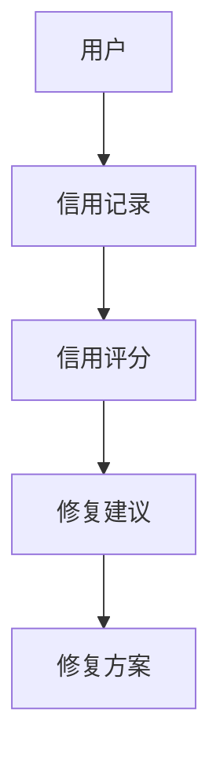
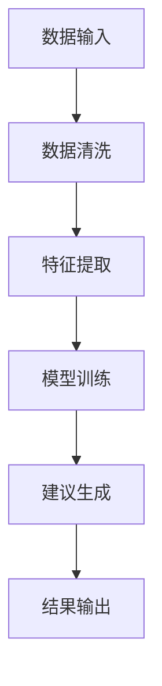
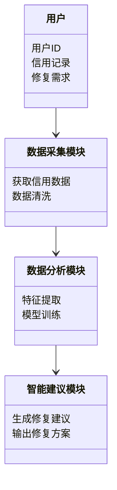
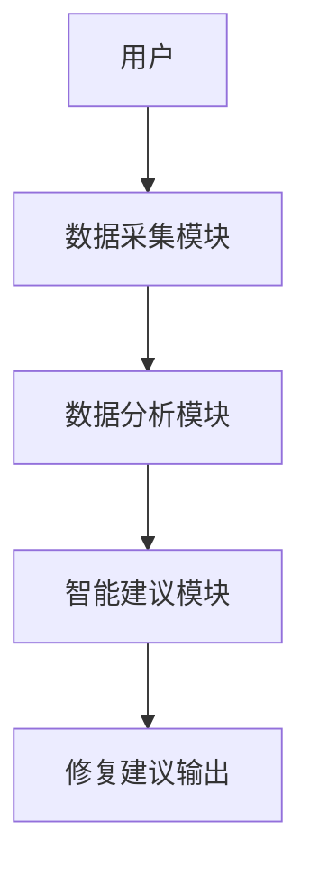
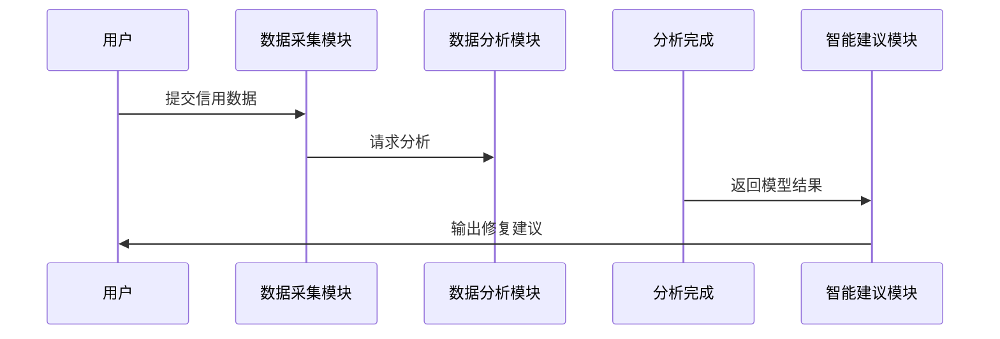

                 


# 智能个人信用修复建议系统

## 关键词：智能信用修复，信用评估，机器学习，数据挖掘，系统架构

## 摘要：智能个人信用修复建议系统是一种基于人工智能和机器学习技术的创新解决方案，旨在通过智能化的数据分析和建模，为个人提供个性化的信用修复建议。本文从系统概述、核心概念、算法原理、系统架构、项目实战和最佳实践等多维度进行深度分析，帮助读者全面理解智能信用修复系统的设计与实现。

---

# 第1章: 智能个人信用修复建议系统概述

## 1.1 信用修复的重要性

### 1.1.1 信用修复的背景

在现代社会，信用记录是个人和企业的重要资产。良好的信用记录能够帮助个人获得贷款、信用卡等金融服务，而不良的信用记录则可能导致融资困难甚至影响职业发展。因此，信用修复成为许多人关注的焦点。

### 1.1.2 信用修复的核心概念

信用修复是指通过合法手段改善个人或企业的信用记录，使其恢复到良好状态的过程。智能信用修复建议系统利用人工智能和大数据技术，为用户提供个性化的修复方案。

### 1.1.3 个人信用修复的必要性

随着信用评分在金融领域的广泛应用，个人信用修复的必要性日益凸显。智能系统能够帮助用户快速识别信用问题，并提供有效的修复建议。

### 1.1.4 信用修复的边界与外延

信用修复的边界包括合法的信用改善行为，而外延则涉及信用评分模型、修复策略等。

## 1.2 智能信用修复建议系统的背景

### 1.2.1 传统信用修复方式的局限性

传统信用修复方式依赖人工分析，效率低、成本高且缺乏个性化。

### 1.2.2 智能化信用修复的优势

智能系统能够快速分析大量数据，提供精准的修复建议。

### 1.2.3 信用修复系统的边界与外延

信用修复系统的边界包括数据采集、分析和建议生成，外延则涉及信用评分模型优化和修复效果评估。

## 1.3 系统的核心要素组成

### 1.3.1 数据采集模块

负责收集用户的信用记录、消费行为等数据。

### 1.3.2 数据分析模块

利用机器学习算法对数据进行建模和分析。

### 1.3.3 智能建议模块

根据分析结果生成修复建议，并提供执行方案。

## 1.4 本章小结

本章介绍了信用修复的重要性及其智能化的必要性，详细阐述了智能信用修复建议系统的核心组成。

---

# 第2章: 核心概念与联系

## 2.1 核心概念原理

### 2.1.1 数据采集与处理

通过合法渠道获取用户的信用数据，并进行清洗和标准化。

### 2.1.2 数据分析与建模

利用机器学习算法对数据进行建模，识别影响信用评分的关键因素。

### 2.1.3 智能建议生成

根据模型结果生成修复建议，并优化建议的可行性。

## 2.2 核心概念属性特征对比

| 特征 | 数据采集 | 数据分析 | 智能建议 |
|------|----------|----------|----------|
| 数据类型 | 结构化数据 | 结构化和非结构化数据 | 结构化数据 |
| 数据量 | 中等 | 大规模 | 小规模 |
| 处理方式 | 清洗、转换 | 建模、预测 | 生成、优化 |

## 2.3 ER实体关系图架构



---

# 第3章: 算法原理讲解

## 3.1 数据预处理

### 3.1.1 数据清洗

```python
import pandas as pd
data = pd.read_csv('credit_data.csv')
# 删除缺失值
data.dropna(inplace=True)
```

### 3.1.2 数据标准化

```python
from sklearn.preprocessing import StandardScaler
scaler = StandardScaler()
data_scaled = scaler.fit_transform(data)
```

### 3.1.3 数据特征选择

```python
from sklearn.feature_selection import SelectKBest
selector = SelectKBest(k=5)
selected_data = selector.fit_transform(data)
```

## 3.2 模型训练

### 3.2.1 算法选择

选择合适的机器学习算法，如随机森林或支持向量机。

### 3.2.2 模型训练流程



### 3.2.3 模型评估

使用准确率、召回率等指标评估模型性能。

## 3.3 智能建议生成

### 3.3.1 建议生成规则

根据模型输出，生成修复建议的优先级和具体措施。

### 3.3.2 建议优化策略

结合用户实际情况，优化建议的可行性。

### 3.3.3 建议输出格式

提供清晰的修复步骤和时间规划。

---

# 第4章: 系统分析与架构设计方案

## 4.1 问题场景介绍

### 4.1.1 信用修复的常见问题

包括信用评分低、逾期记录等。

### 4.1.2 系统的目标与范围

目标是为用户提供个性化的修复建议，范围包括数据采集、分析和建议生成。

## 4.2 系统功能设计

### 4.2.1 领域模型



## 4.3 系统架构设计

### 4.3.1 系统架构图



### 4.3.2 接口设计

定义RESTful API接口，供用户提交数据和获取建议。

### 4.3.3 交互流程图



---

# 第5章: 项目实战

## 5.1 环境安装

### 5.1.1 安装Python

```bash
python --version
```

### 5.1.2 安装依赖库

```bash
pip install pandas scikit-learn
```

## 5.2 系统核心实现

### 5.2.1 数据预处理

```python
import pandas as pd
from sklearn.preprocessing import StandardScaler

data = pd.read_csv('credit_data.csv')
data.dropna(inplace=True)
scaler = StandardScaler()
data_scaled = scaler.fit_transform(data)
```

### 5.2.2 模型训练

```python
from sklearn.ensemble import RandomForestClassifier

model = RandomForestClassifier()
model.fit(data_scaled, labels)
```

### 5.2.3 修复建议生成

```python
import numpy as np

def generate修复建议(model, data):
    predict = model.predict(data)
    建议 = []
    for i in range(len(predict)):
        if predict[i] == 0:
            建议.append("优化信用记录")
        else:
            建议.append("保持良好信用")
    return 建议
```

## 5.3 案例分析

### 5.3.1 案例背景

用户信用评分为500分，存在逾期记录。

### 5.3.2 数据分析

模型分析发现，逾期记录和高债务比例是主要问题。

### 5.3.3 修复建议

1. 清偿逾期债务。
2. 降低债务比例。
3. 提供还款证明。

## 5.4 项目小结

本章通过实际案例展示了系统的实现过程和修复效果。

---

# 第6章: 最佳实践与总结

## 6.1 小结

智能信用修复系统通过数据驱动和人工智能技术，为用户提供高效的信用修复建议。

## 6.2 注意事项

1. 数据隐私保护。
2. 确保算法的可解释性。
3. 定期更新模型。

## 6.3 拓展阅读

推荐相关领域的书籍和论文，进一步深入学习。

---

作者：AI天才研究院/AI Genius Institute & 禅与计算机程序设计艺术 /Zen And The Art of Computer Programming

---

这篇文章系统地介绍了智能个人信用修复建议系统的各个方面，从背景、核心概念到算法原理和系统架构，最后通过实战案例和总结，帮助读者全面理解系统的实现和应用。

