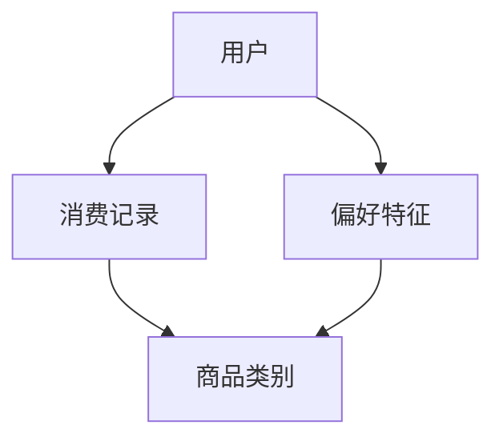
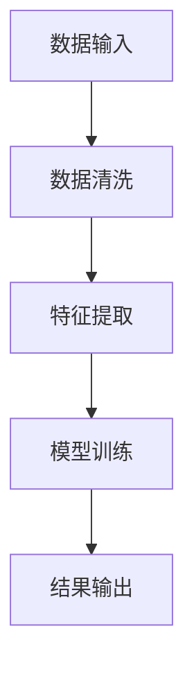
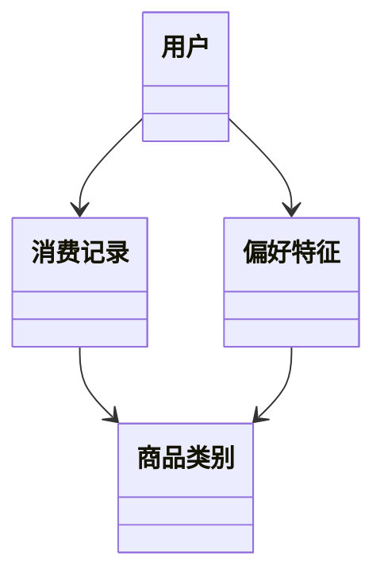
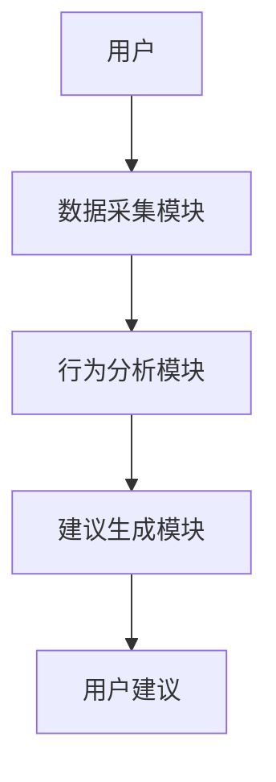
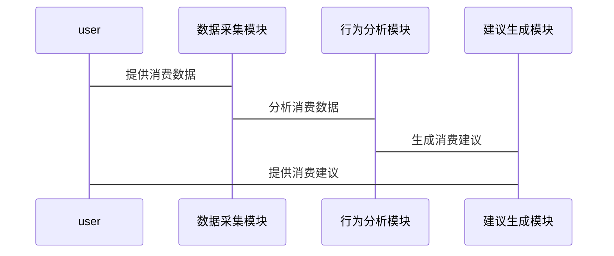

                 


# 智能个人消费模式分析与建议系统

> 关键词：智能消费分析，AI驱动建议，数据驱动决策，消费行为建模，个性化推荐

> 摘要：本文探讨了利用人工智能技术分析个人消费模式并提供建议的系统设计与实现。通过数据采集、行为分析和智能建议生成，优化用户的消费决策，帮助用户实现更高效和理性的消费管理。

---

# 第1章 智能个人消费模式分析与建议系统的背景介绍

## 1.1 问题背景与描述

### 1.1.1 当前个人消费行为的多样性与复杂性
随着经济的发展和生活水平的提高，个人消费行为变得日益复杂。消费者在购物时不仅要考虑价格，还要考虑品牌、质量、口碑、便利性等多种因素。此外，线上线下的消费渠道融合进一步增加了消费行为的复杂性。

### 1.1.2 消费者行为分析的必要性
消费者行为分析是理解用户需求、优化用户体验的关键。通过分析消费数据，企业可以更好地满足消费者需求，同时也能帮助消费者自身做出更明智的消费决策。

### 1.1.3 智能消费模式分析的创新性
传统的消费分析方法依赖于统计学和数据分析，而智能消费模式分析则引入了人工智能技术，通过机器学习算法对消费数据进行深度挖掘，能够实时生成个性化的消费建议，极大地提高了分析效率和准确性。

## 1.2 问题解决思路与方法

### 1.2.1 数据驱动的消费行为分析
通过收集和分析用户的消费数据，包括消费金额、时间、地点、商品类别等，构建消费行为模型。

### 1.2.2 人工智能在消费建议中的应用
利用机器学习算法（如协同过滤、聚类分析、回归分析等）对消费数据进行建模，生成个性化的消费建议。

### 1.2.3 系统化解决方案的设计思路
设计一个包括数据采集、行为分析和建议生成的系统化解决方案，实现从数据到建议的全流程自动化。

## 1.3 系统的边界与外延

### 1.3.1 系统功能的边界
系统主要关注个人消费行为的分析与建议生成，不涉及企业的供应链管理和财务分析。

### 1.3.2 系统应用的范围
系统适用于个人用户，帮助用户优化个人消费决策，提高消费效率。

### 1.3.3 系统与外部环境的交互
系统通过API接口与消费数据源（如银行、电商平台）交互，同时向用户输出消费建议。

## 1.4 核心概念与结构

### 1.4.1 核心概念的定义
- **消费数据**：用户在不同渠道和时间点的消费记录。
- **消费行为分析**：对消费数据进行建模和分析，识别用户的消费模式和偏好。
- **智能建议生成**：基于分析结果，生成个性化的消费建议。

### 1.4.2 概念之间的关系
消费数据是消费行为分析的基础，分析结果用于生成消费建议，建议又反过来影响消费数据。

### 1.4.3 系统的核心要素组成
- 数据采集模块：负责收集用户的消费数据。
- 行为分析模块：对消费数据进行建模和分析。
- 建议生成模块：基于分析结果生成个性化建议。

---

# 第2章 核心概念与联系

## 2.1 核心概念原理

### 2.1.1 数据采集与处理
通过API或数据库接口采集用户的消费数据，包括消费金额、时间、地点、商品类别等。

### 2.1.2 消费行为分析
利用机器学习算法（如聚类分析、关联规则挖掘）对消费数据进行建模，识别用户的消费偏好和行为模式。

### 2.1.3 智能建议生成
基于分析结果，生成个性化的消费建议，例如推荐适合用户的产品或提醒用户避免冲动消费。

## 2.2 核心概念属性特征对比

| 模块         | 特征               | 优势                           |
|--------------|--------------------|--------------------------------|
| 数据采集     | 精准性、实时性      | 确保数据的准确性和及时性       |
| 行为分析     | 深度、关联性        | 发现数据中的潜在关联和规律       |
| 建议生成     | 个性化、实时性      | 提供针对性强、及时的消费建议     |

## 2.3 ER实体关系图



---

# 第3章 算法原理讲解

## 3.1 算法原理概述

### 3.1.1 数据预处理
对采集到的消费数据进行清洗和标准化，确保数据质量。

### 3.1.2 特征提取
从消费数据中提取关键特征，如消费频率、金额分布、时间偏好等。

### 3.1.3 模型训练
使用机器学习算法（如协同过滤、随机森林）对提取的特征进行建模，训练消费行为分析模型。

## 3.2 算法流程图



## 3.3 算法实现代码

```python
import pandas as pd
from sklearn.ensemble import RandomForestClassifier

# 数据加载与预处理
data = pd.read_csv('consumption_data.csv')
data = data.dropna()  # 删除缺失值
data = pd.get_dummies(data)  # 特征编码

# 特征选择与模型训练
features = data.drop('label', axis=1)
label = data['label']
model = RandomForestClassifier().fit(features, label)
```

## 3.4 数学模型与公式

### 3.4.1 协同过滤算法
$$ \text{相似度} = \frac{\sum (x_i - \bar{x})(y_i - \bar{y})}{\sqrt{\sum (x_i - \bar{x})^2} \sqrt{\sum (y_i - \bar{y})^2}} $$

### 3.4.2 线性回归模型
$$ y = \beta_0 + \beta_1 x + \epsilon $$

---

# 第4章 系统分析与架构设计

## 4.1 问题场景介绍
系统设计目标是帮助用户优化消费决策，通过实时分析消费数据，生成个性化建议。

## 4.2 系统功能设计

### 4.2.1 领域模型类图



### 4.2.2 系统架构图



## 4.3 接口与交互设计

### 4.3.1 系统接口设计
- 用户接口：提供消费记录输入和建议查看功能。
- 数据接口：通过API获取消费数据。

### 4.3.2 系统交互流程图



---

# 第5章 项目实战

## 5.1 环境安装与配置
安装必要的Python库，如Pandas、Scikit-learn、Mermaid等。

## 5.2 核心功能实现

### 5.2.1 数据采集模块
使用Python的requests库从API获取消费数据。

### 5.2.2 行为分析模块
使用Scikit-learn中的聚类算法分析消费数据。

### 5.2.3 建议生成模块
基于分析结果生成消费建议，并通过用户友好的界面展示。

## 5.3 代码实现与解读
```python
import requests
from sklearn.cluster import KMeans

# 数据采集
response = requests.get('http://api.example.com/consumption')
data = response.json()

# 行为分析
X = data['features']
model = KMeans(n_clusters=3).fit(X)

# 建议生成
clusters = model.predict(X)
for cluster in clusters:
    print(f'建议：{cluster}')
```

## 5.4 实际案例分析
通过实际数据，分析用户的消费行为，并生成个性化的消费建议。

## 5.5 项目小结
总结项目实施过程中的经验与教训，优化系统设计。

---

# 第6章 最佳实践与总结

## 6.1 系统优缺点总结
- **优点**：提高消费效率，帮助用户做出更明智的消费决策。
- **缺点**：需要依赖高质量的数据，用户隐私保护需加强。

## 6.2 改进建议
- 提供更个性化的建议。
- 加强用户隐私保护措施。
- 提供数据可视化功能，帮助用户更好地理解消费行为。

## 6.3 注意事项
- 确保数据安全，防止数据泄露。
- 定期更新模型，保持建议的准确性。

## 6.4 拓展阅读
推荐相关书籍和论文，帮助读者深入理解智能消费分析技术。

---

# 作者：AI天才研究院/AI Genius Institute & 禅与计算机程序设计艺术 /Zen And The Art of Computer Programming

