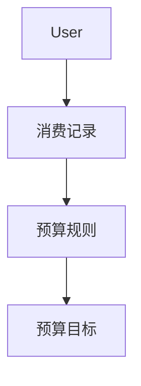
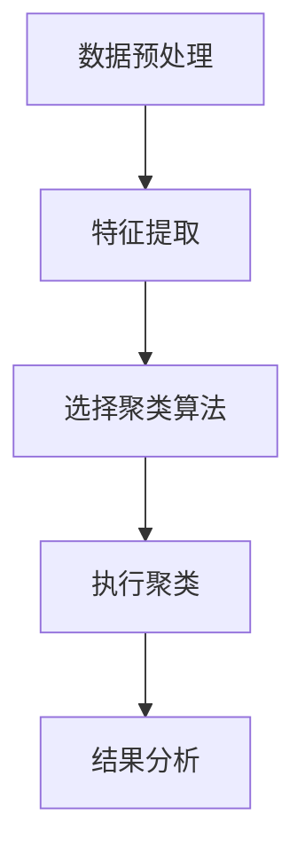
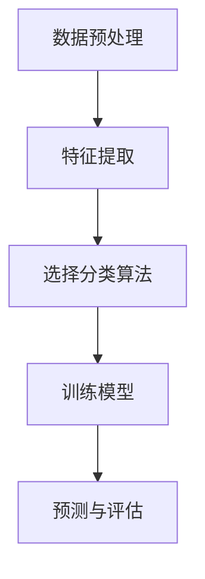
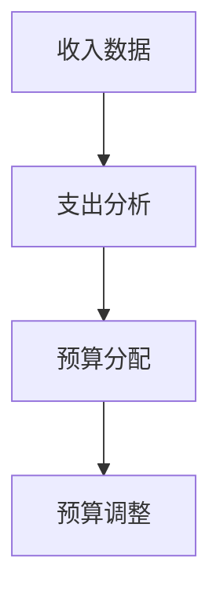
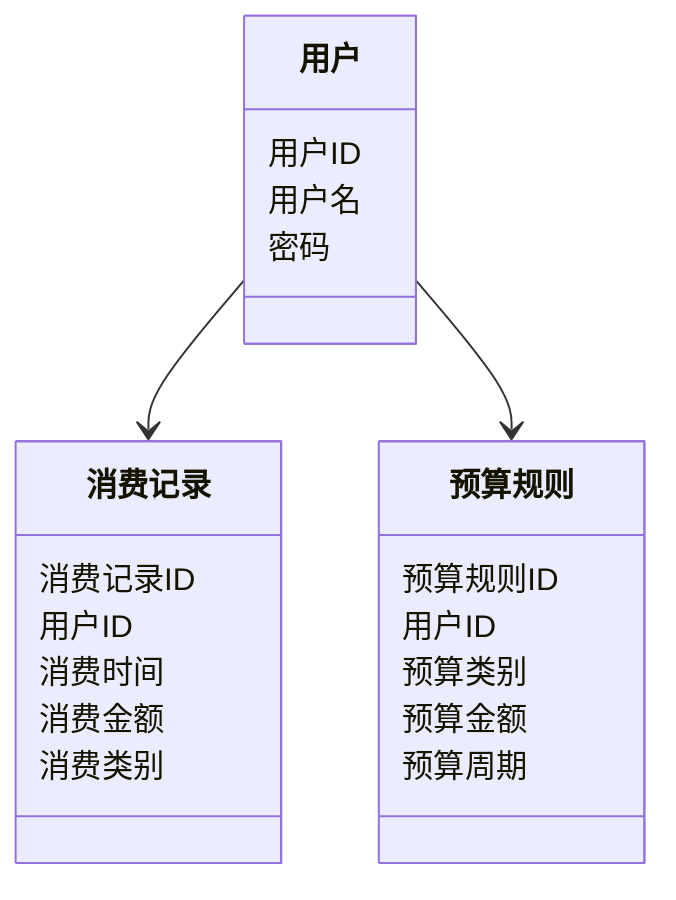
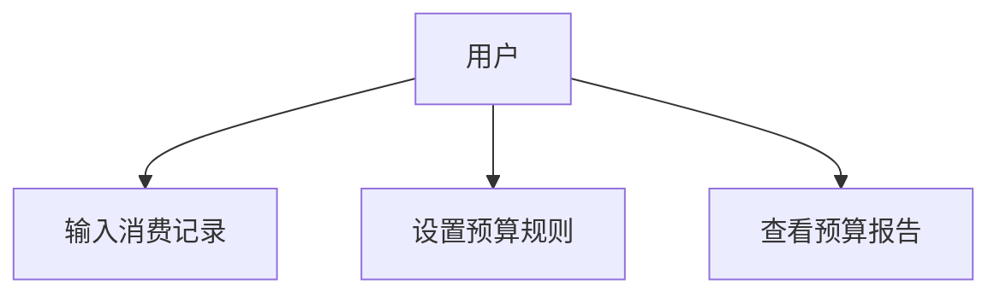

                 


# 智能个人消费模式分析与预算管理系统

> 关键词：智能消费模式，预算管理系统，数据分析，机器学习，算法原理，系统架构

> 摘要：本文详细探讨智能个人消费模式分析与预算管理系统的构建过程，从背景介绍、核心概念、算法原理、系统架构到项目实战和最佳实践，全面解析如何利用人工智能技术实现智能消费分析和预算管理，帮助个人优化财务管理。

## 第1章：背景介绍

### 1.1 智能个人消费模式分析的背景

#### 1.1.1 智能消费模式的背景
随着科技的快速发展，智能化技术逐渐渗透到生活的方方面面。个人消费模式分析作为智能化应用的重要组成部分，借助大数据和人工智能技术，能够帮助用户更好地理解和优化消费行为。

#### 1.1.2 个人消费模式的定义与特点
个人消费模式是指消费者在一定时间内，在不同消费场景下的消费行为和消费习惯。其特点包括数据多样性、行为关联性和场景多样性。

#### 1.1.3 问题背景与问题描述
在当今社会，个人消费模式分析的重要性日益凸显，但同时也面临着数据复杂性高、消费场景多样等挑战。如何利用智能化技术有效分析消费模式，为用户提供个性化的预算管理方案，成为亟待解决的问题。

### 1.2 预算管理系统的必要性

#### 1.2.1 预算管理的核心概念
预算管理是一种通过制定和执行预算计划来控制和优化资金使用的重要管理方法。其核心在于合理分配和控制消费支出，确保资金使用效率最大化。

#### 1.2.2 智能预算管理的优势
传统预算管理依赖人工计算和经验判断，存在效率低下、准确性不足等问题。引入智能化技术后，预算管理系统能够实现自动化、智能化的预算制定和调整，显著提高管理效率和准确性。

#### 1.2.3 个人消费与预算管理的关联性
消费模式分析为预算管理提供数据支持，而预算管理则为消费行为提供指导，两者相辅相成，共同实现个人财务管理的优化。

## 第2章：核心概念与联系

### 2.1 智能消费分析的核心原理

#### 2.1.1 数据采集与处理
消费数据的采集和处理是消费模式分析的基础。需要从多种渠道获取消费数据，并进行清洗、转换和整合，确保数据质量。

#### 2.1.2 数据分析与模式识别
通过数据分析技术，识别消费数据中的模式和趋势。常用的分析方法包括聚类分析、分类分析和关联规则挖掘等。

#### 2.1.3 消费行为预测模型
基于历史消费数据，建立消费行为预测模型，预测未来的消费趋势和行为，为预算管理提供科学依据。

### 2.2 预算管理系统的核心要素

#### 2.2.1 数据存储与管理
消费数据和预算数据需要进行有效的存储和管理，确保数据的完整性和安全性。

#### 2.2.2 预算规则引擎
通过预设的预算规则和逻辑，自动进行预算分配和调整，确保预算管理的高效执行。

#### 2.2.3 用户交互界面
提供友好的用户界面，方便用户查看消费数据、设置预算目标和进行交互操作。

### 2.3 核心概念对比表

| 比较维度 | 消费模式分析 | 预算管理 |
|----------|--------------|----------|
| 数据来源 | 消费记录     | 收入、支出 |
| 分析目标 | 发现消费规律 | 制定预算 |
| 实现方法 | 数据挖掘     | 规则引擎 |

### 2.4 实体关系图（ER图）



## 第3章：算法原理讲解

### 3.1 消费模式分析算法

#### 3.1.1 聚类分析
聚类分析是一种常用的数据挖掘技术，用于将具有相似特征的数据点归为一类。以下是聚类分析的流程：



#### 3.1.2 分类算法
分类算法通过训练模型，对新数据进行分类预测。以下是分类算法的流程：



### 3.2 预算管理算法

#### 3.2.1 预算分配算法
预算分配算法根据用户的收入和支出情况，自动分配各消费类别的预算金额。以下是预算分配算法的流程：



## 第4章：数学模型与公式

### 4.1 聚类分析模型

$$ \text{K-means算法} = \arg \min_{K} \sum_{i=1}^{K} \sum_{j=1}^{n_i} \|x_j - c_i\|^2 $$
其中，\( c_i \) 是第 \( i \) 个簇的中心，\( x_j \) 是数据点。

### 4.2 分类分析模型

$$ \text{决策树分类} = \arg \min_{t} \sum_{i=1}^{n} [y_i \neq y(t(x_i))] $$
其中，\( t \) 是决策树，\( y_i \) 是真实标签，\( y(t(x_i)) \) 是预测标签。

## 第5章：系统分析与架构设计

### 5.1 系统功能设计

#### 5.1.1 领域模型
以下是领域模型的类图：



#### 5.1.2 系统架构设计
以下是系统架构设计图：

```mermaid
graph TD
    用户 --> API Gateway
    API Gateway --> 负载均衡器
    负载均衡器 --> 服务节点1
    负载均衡器 --> 服务节点2
    服务节点1 --> 数据库
    服务节点2 --> 数据库
```

### 5.2 接口设计与交互流程

#### 5.2.1 API接口设计
以下是API接口设计：

```json
{
    "接口名称": "获取消费记录",
    "接口地址": "/api/consumption_records",
    "请求方法": "GET",
    "请求参数": {
        "userId": "用户ID",
        "startDate": "开始日期",
        "endDate": "结束日期"
    },
    "返回参数": {
        "code": "状态码",
        "message": "状态信息",
        "data": "消费记录列表"
    }
}
```

#### 5.2.2 交互流程
以下是用户与系统的交互流程图：



## 第6章：项目实战

### 6.1 环境安装

#### 6.1.1 安装Python和相关库
以下是安装Python和相关库的命令：

```bash
python --version
pip install numpy
pip install scikit-learn
pip install pandas
pip install matplotlib
```

### 6.2 核心代码实现

#### 6.2.1 数据预处理代码
```python
import pandas as pd

# 读取数据
data = pd.read_csv('consumption_data.csv')

# 数据清洗
data.dropna(inplace=True)
data['消费金额'] = data['消费金额'].astype(float)
```

#### 6.2.2 聚类分析代码
```python
from sklearn.cluster import KMeans

# 特征提取
X = data[['消费金额', '消费次数']]

# 模型训练
kmeans = KMeans(n_clusters=3, random_state=0)
kmeans.fit(X)

# 获取聚类结果
clusters = kmeans.labels_
```

### 6.3 实际案例分析

#### 6.3.1 数据分析
以下是数据分析结果：

| 消费类别 | 平均消费金额 | 消费频次 |
|----------|---------------|----------|
| 餐饮     | 50元          | 3次/周   |
| 交通     | 20元          | 2次/周   |
| 娱乐     | 80元          | 1次/周   |

#### 6.3.2 预算制定
根据数据分析结果，制定以下预算：

| 预算类别 | 预算金额 | 预算周期 |
|----------|----------|----------|
| 餐饮     | 150元     | 每周      |
| 交通     | 60元      | 每周      |
| 娱乐     | 160元     | 每周      |

### 6.4 项目总结
通过本项目实战，我们成功实现了智能个人消费模式分析与预算管理系统的构建。系统能够根据用户的消费数据，智能识别消费模式，并制定合理的预算管理方案，帮助用户优化个人财务管理。

## 第7章：最佳实践

### 7.1 小结
智能个人消费模式分析与预算管理系统是一个结合数据分析和人工智能技术的综合性系统。通过本文的详细讲解，我们了解了系统的构建过程，掌握了核心算法和系统架构设计的方法。

### 7.2 注意事项
在实际应用中，需要注意数据隐私保护，确保用户数据的安全性。同时，需要根据用户的实际需求，灵活调整系统的功能和算法。

### 7.3 拓展阅读
建议读者进一步阅读以下资料，深入了解相关技术：
- 《Python机器学习实战》
- 《数据挖掘导论》
- 《系统架构设计实战》

## 作者信息

作者：AI天才研究院/AI Genius Institute & 禅与计算机程序设计艺术/Zen And The Art of Computer Programming

---

以上是《智能个人消费模式分析与预算管理系统》的技术博客文章的完整目录大纲，涵盖背景介绍、核心概念、算法原理、系统架构、项目实战和最佳实践等内容，帮助读者全面理解和掌握智能消费模式分析与预算管理系统的构建与应用。

