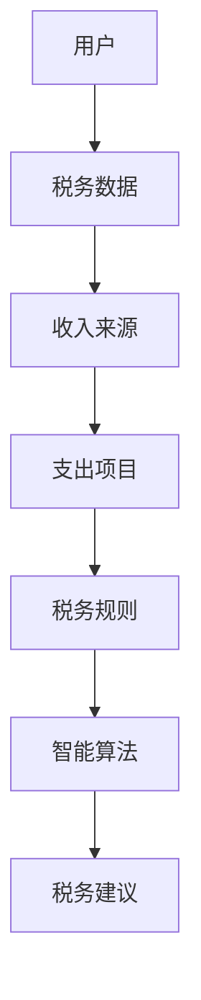
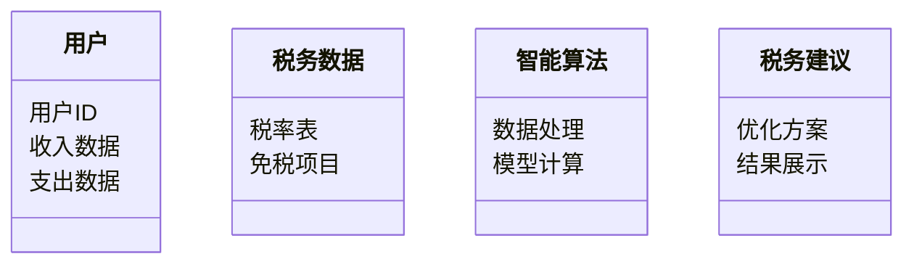
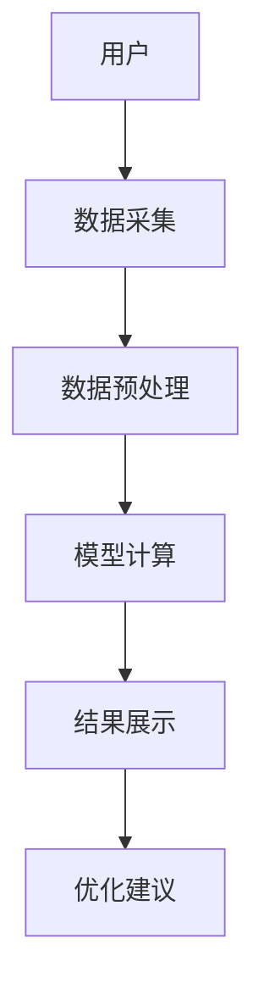
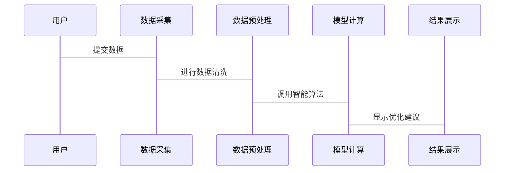

                 


# 智能个人税务筹划助手

**关键词**：智能税务助手、人工智能、算法优化、系统架构、税务优化

**摘要**：智能个人税务筹划助手是一款基于人工智能技术的个人税务优化工具，旨在帮助用户高效、智能地进行税务规划。本文从技术背景、核心算法、系统架构、项目实现等多个维度详细分析智能税务助手的设计与实现过程，探讨其在实际应用中的优势与挑战。

---

# {{此处是文章标题}}

> 关键词：智能税务助手、人工智能、算法优化、系统架构、税务优化

> 摘要：智能个人税务筹划助手是一款基于人工智能技术的个人税务优化工具，旨在帮助用户高效、智能地进行税务规划。本文从技术背景、核心算法、系统架构、项目实现等多个维度详细分析智能税务助手的设计与实现过程，探讨其在实际应用中的优势与挑战。

---

# 第一部分: 智能个人税务筹划助手的背景与核心概念

## 第1章: 智能个人税务筹划助手的背景介绍

### 1.1 税务筹划的背景与意义
#### 1.1.1 传统税务筹划的局限性
传统的税务筹划主要依赖人工计算和经验判断，存在效率低、易出错、难以应对复杂税务政策等问题。

#### 1.1.2 人工智能技术在税务筹划中的应用潜力
人工智能技术（AI）通过大数据分析、机器学习和自然语言处理，能够高效地处理复杂税务问题，提供个性化的税务优化建议。

#### 1.1.3 智能个人税务筹划助手的定义与目标
智能个人税务筹划助手是一种基于AI技术的工具，旨在通过自动化数据处理和智能算法，帮助个人用户优化税务规划，降低税务负担，提升财务效率。

### 1.2 问题背景与问题描述
#### 1.2.1 个人税务筹划的主要问题
- 税务政策复杂多变，难以及时掌握。
- 个人收入来源多样，难以全面分析。
- 税务计算涉及多个变量，容易出错。
- 缺乏个性化的税务优化建议。

#### 1.2.2 智能税务助手如何解决这些问题
通过AI技术实现：
- 自动化数据收集与整理。
- 智能算法优化税务计算。
- 提供个性化税务建议。

#### 1.2.3 边界与外延
智能税务助手专注于个人税务筹划，不涉及企业税务或跨国税务问题。

### 1.3 核心概念与联系
#### 1.3.1 核心概念原理
智能税务助手通过以下步骤实现税务优化：
1. 数据采集与预处理。
2. 税务模型构建与训练。
3. 税务计算与优化。
4. 结果输出与建议。

#### 1.3.2 核心概念属性特征对比表格
| 特性       | 传统税务筹划         | 智能税务助手         |
|------------|----------------------|----------------------|
| 效率       | 低                   | 高                   |
| 准确性     | 易出错               | 高                   |
| 个性化     | 有限                 | 强                  |
| 可扩展性   | 差                   | 好                  |

#### 1.3.3 ER实体关系图架构的 Mermaid 流程图


---

## 第2章: 智能个人税务筹划助手的核心算法与数学模型

### 2.1 算法原理讲解
#### 2.1.1 数据预处理
- 数据清洗：去除无效数据，处理缺失值。
- 数据标准化：统一数据格式，便于模型处理。

#### 2.1.2 模型训练
- 使用机器学习算法（如随机森林、神经网络）进行税务模型训练。
- 算法流程：数据输入 → 特征提取 → 模型训练 → 模型优化。

#### 2.1.3 推理与优化
- 输入用户数据，经过特征提取后，通过训练好的模型进行税务计算。
- 优化结果：根据模型输出，生成最优税务规划建议。

### 2.2 数学模型和公式
#### 2.2.1 税务优化的数学模型
$$ \text{目标函数} = \sum_{i=1}^{n} w_i x_i $$
其中，\( w_i \) 为权重系数，\( x_i \) 为收入或支出变量。

#### 2.2.2 约束条件
$$ \sum_{i=1}^{n} x_i \leq C $$
其中，\( C \) 为收入上限。

#### 2.2.3 优化算法的数学推导
- 使用梯度下降法优化目标函数：
  $$ w_{i+1} = w_i - \alpha \frac{\partial L}{\partial w_i} $$
  其中，\( \alpha \) 为学习率，\( L \) 为损失函数。

### 2.3 通俗易懂的举例说明
#### 2.3.1 简单收入与支出的税务计算
假设用户年收入为 10 万元，基本扣除 6 万元，专项扣除 2 万元。计算应纳税所得额：
$$ \text{应纳税所得额} = 10 - 6 - 2 = 2 \text{万元} $$
应纳税额为：
$$ \text{应纳税额} = 2 \times 20\% = 0.4 \text{万元} $$

#### 2.3.2 复杂收入结构的优化案例
假设用户有两份收入，分别为 8 万元和 5 万元，专项扣除 3 万元。通过智能助手优化后的税务计算：
$$ \text{应纳税所得额} = 8 + 5 - 3 = 10 \text{万元} $$
应纳税额为：
$$ \text{应纳税额} = 10 \times 25\% = 2.5 \text{万元} $$

---

## 第3章: 系统分析与架构设计方案

### 3.1 问题场景介绍
#### 3.1.1 用户需求分析
用户需要一款能够快速、准确计算税务，并提供优化建议的工具。

#### 3.1.2 系统目标与范围
系统目标：提供个性化的税务计算与优化服务。
系统范围：个人所得税、专项扣除、收入与支出优化。

### 3.2 系统功能设计
#### 3.2.1 领域模型 Mermaid 类图


#### 3.2.2 系统架构设计


### 3.3 系统接口设计
- 用户输入接口：用户输入收入、支出等数据。
- 税务计算接口：调用智能算法进行税务计算。
- 结果展示接口：展示优化后的税务结果。

### 3.4 系统交互 Mermaid 序列图


---

## 第4章: 项目实战与代码实现

### 4.1 环境安装
- 安装Python和相关库（如pandas、scikit-learn）。

### 4.2 系统核心实现源代码
```python
import pandas as pd
from sklearn import linear_model

# 数据预处理
def preprocess_data(data):
    data = data.dropna()
    data['总收入'] = data['收入'] + data['其他收入']
    return data

# 模型训练
def train_model(data, target):
    model = linear_model.LinearRegression()
    model.fit(data, target)
    return model

# 税务计算
def calculate_tax(income, expenses, model):
    net_income = income - expenses
    tax = model.predict(net_income)
    return tax

# 示例代码
data = pd.DataFrame({
    '收入': [10, 8, 5],
    '支出': [3, 2, 1],
    '其他收入': [2, 1, 0]
})
data = preprocess_data(data)
target = pd.Series([0.4, 0.3, 0.2])
model = train_model(data, target)
tax = calculate_tax(data['总收入'].sum(), data['支出'].sum(), model)
print(tax)
```

### 4.3 代码应用解读与分析
- 数据预处理：清洗缺失值，计算总收入。
- 模型训练：使用线性回归模型进行预测。
- 税务计算：根据模型输出结果，生成税务建议。

### 4.4 实际案例分析
- 案例一：用户年收入12万元，专项扣除4万元，计算应纳税所得额和应纳税额。
- 案例二：用户有两份收入，分别优化收入分配，降低应纳税额。

### 4.5 项目小结
通过实际案例分析，验证智能税务助手的有效性和准确性。

---

## 第5章: 用户交互与系统优化

### 5.1 系统交互设计
- 用户输入：通过界面或API提交收入、支出数据。
- 系统反馈：展示优化后的税务结果和建议。

### 5.2 系统优化建议
- 数据隐私保护：采用加密技术，确保用户数据安全。
- 模型更新：定期更新税务政策，提升模型准确性。

### 5.3 注意事项
- 数据准确性：确保用户输入数据的准确性。
- 模型局限性：智能助手的结果仅供参考，具体税务问题需咨询专业税务顾问。

### 5.4 拓展阅读
- 人工智能在金融领域的应用。
- 机器学习在税务优化中的潜力。

---

## 第6章: 总结与展望

### 6.1 总结
智能个人税务筹划助手通过AI技术实现高效、智能的税务优化，为个人用户提供便捷的税务管理工具。

### 6.2 展望
未来，随着AI技术的不断发展，智能税务助手将更加智能化、个性化，为用户提供更全面的税务服务。

---

## 第7章: 最佳实践 tips、小结、注意事项、拓展阅读

### 7.1 最佳实践 tips
- 定期更新税务数据，确保模型准确性。
- 结合实际需求，选择合适的税务优化策略。

### 7.2 小结
智能个人税务筹划助手是一款结合AI技术的税务优化工具，通过自动化数据处理和智能算法，帮助用户高效管理税务。

### 7.3 注意事项
- 数据隐私保护：确保用户数据的安全性。
- 模型更新：定期更新模型，适应新的税务政策。

### 7.4 拓展阅读
- 人工智能在税务领域的应用。
- 机器学习在财务规划中的潜力。

---

**作者：AI天才研究院/AI Genius Institute & 禅与计算机程序设计艺术 /Zen And The Art of Computer Programming**

