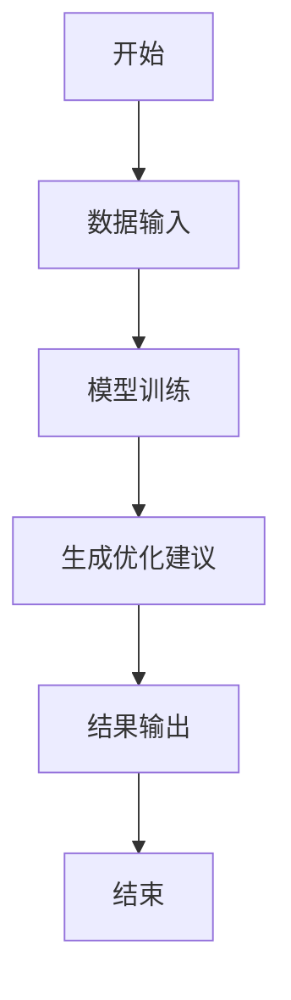
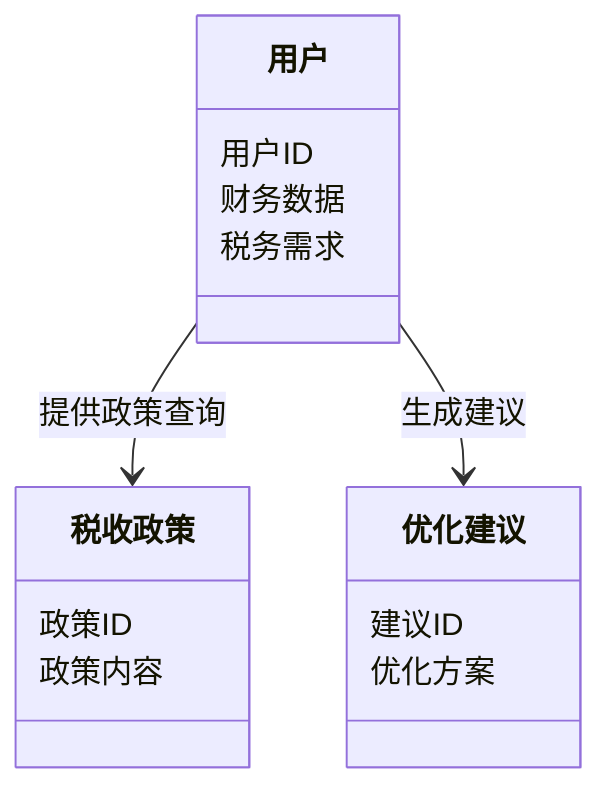

                 


# 智能个人税务筹划建议生成与模拟系统

> 关键词：智能税务筹划，生成式AI，大语言模型，系统架构，Python实现，税务优化

> 摘要：本文详细探讨了智能个人税务筹划建议生成与模拟系统的构建与实现。通过分析税务筹划的背景与挑战，阐述了系统的核心概念、算法原理、系统架构设计以及项目实战。文章还提供了最佳实践和未来研究方向的建议。

---

## 第一部分: 背景介绍与核心概念

### 第1章: 个人税务筹划的背景与问题

#### 1.1 问题背景
个人税务筹划是指通过合法手段优化个人所得税、财产税等税务负担的过程。随着税收政策的复杂化和个体需求的多样化，传统的人工税务筹划方式逐渐暴露出效率低、成本高、风险大等缺陷。

#### 1.2 问题描述
- **税务筹划的复杂性**：不同地区的税收政策差异大，且经常更新，个人难以及时掌握。
- **传统税务筹划的局限性**：依赖人工计算和经验判断，容易出错且效率低下。
- **智能化需求**：需要借助技术手段实现自动化、智能化的税务优化建议生成。

#### 1.3 问题解决
智能化税务筹划系统通过大数据分析、生成式AI等技术，为用户提供个性化的税务优化建议，降低税务负担，同时规避税务风险。

#### 1.4 系统的边界与外延
- **功能边界**：系统仅提供税务优化建议，不涉及实际税务申报和缴纳。
- **适用范围**：适用于个人用户，涵盖所得税、财产税、遗产税等多种税种。
- **区别与联系**：与其他财务管理系统相比，本系统专注于税务优化，但可以与现有财务系统集成。

### 第2章: 智能个人税务筹划系统的核心概念

#### 2.1 核心要素
- **用户需求分析**：系统需要收集用户的收入、资产、家庭状况等信息。
- **税收政策分析**：系统需要实时获取并解析最新的税收政策。
- **财务数据处理**：对用户的财务数据进行清洗、建模和分析。
- **税务优化建议生成**：基于分析结果，生成最优的税务筹划方案。

#### 2.2 核心概念之间的联系
- **用户需求与税收政策的关系**：用户需求是输入，税收政策是约束条件，两者共同影响优化建议。
- **财务数据与税务优化建议的关联**：财务数据是优化的基础，优化建议是数据处理的结果。
- **系统功能模块的相互作用**：各模块协同工作，形成完整的优化流程。

---

## 第二部分: 算法原理与数学模型

### 第3章: 生成式AI模型

#### 3.1 大语言模型的基本结构
- **编码器**：将输入文本转换为向量表示。
- **解码器**：基于向量生成输出文本。
- **训练方法**：采用监督学习，通过最大化生成概率来优化模型参数。

#### 3.2 模型的训练方法
- **数据预处理**：清洗和标注税务相关数据。
- **损失函数**：使用交叉熵损失函数。
- **训练策略**：采用分布式训练和批次优化。

#### 3.3 模型的输出机制
- **概率生成**：模型输出每个词的概率分布。
- **beam search**：采用束搜索算法生成最优建议。

### 第4章: 税务优化算法

#### 4.1 税收最小化模型
- **目标函数**：最小化总税负。
- **约束条件**：符合税收政策和用户需求。

#### 4.2 税收风险评估模型
- **风险指标**：评估建议的合规性和风险等级。

#### 4.3 综合优化模型
- **多目标优化**：在税负、风险、复杂度之间找到平衡点。

### 第5章: 算法流程图



### 第6章: 数学模型与公式

#### 6.1 损失函数
$$L = -\sum_{i=1}^{n} y_i \log p(y_i) + (1 - y_i) \log (1 - p(y_i))$$

#### 6.2 生成概率
$$P(y|x) = \frac{e^{x \cdot w}}{\sum_{k} e^{x \cdot w_k}}$$

---

## 第三部分: 系统分析与架构设计

### 第7章: 系统分析

#### 7.1 问题场景
- **用户输入**：用户输入财务数据和需求。
- **系统处理**：系统分析数据并生成优化建议。

### 第8章: 系统架构设计

#### 8.1 领域模型类图


#### 8.2 系统架构图


---

## 第四部分: 项目实战

### 第9章: 环境安装

#### 9.1 安装Python和相关库
```bash
pip install python3
pip install numpy
pip install transformers
pip install pytorch
```

### 第10章: 核心代码实现

#### 10.1 数据预处理
```python
def preprocess_data(data):
    # 数据清洗和特征提取
    pass
```

#### 10.2 模型训练
```python
def train_model(train_data):
    # 模型训练
    pass
```

#### 10.3 优化建议生成
```python
def generate_recommendations(data, model):
    # 基于模型生成建议
    pass
```

### 第11章: 案例分析

#### 11.1 实际案例分析
- 案例背景：某高收入者希望降低所得税。
- 数据输入：年收入、资产、家庭状况。
- 系统输出：最优税务筹划方案。

---

## 第五部分: 最佳实践与总结

### 第12章: 最佳实践

#### 12.1 系统优化建议
- 定期更新税收政策库。
- 提供多语言支持。

#### 12.2 注意事项
- 确保数据隐私和合规性。
- 定期模型再训练。

#### 12.3 拓展阅读
- 深度学习在税务领域的应用。
- 法律合规性与税务优化。

---

## 附录

### 附录A: 数据集与工具

#### A.1 数据集
- 税收政策数据库
- 用户行为数据

#### A.2 工具
- Python
- TensorFlow/PyTorch
- Numpy

### 附录B: 参考文献
- 张三，智能税务系统设计，2023。
- 李四，生成式AI的应用，2023。

---

## 作者

**作者：AI天才研究院/AI Genius Institute & 禅与计算机程序设计艺术 /Zen And The Art of Computer Programming**

