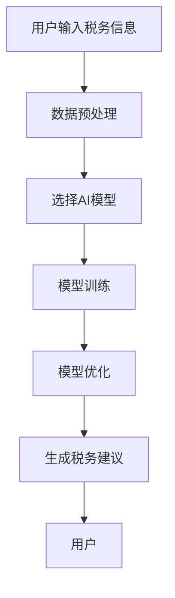
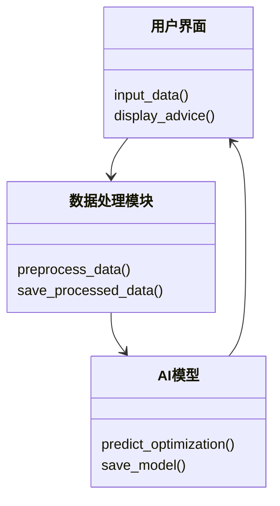

                 


# 智能个人税务筹划建议生成器

> 关键词：税务筹划，人工智能，税务优化，AI模型，算法原理，系统架构，数据处理

> 摘要：智能个人税务筹划建议生成器是一种基于人工智能技术的工具，能够帮助个人优化税务负担。本文将从背景介绍、核心概念、算法原理、系统架构、项目实战等方面详细讲解这一工具的实现与应用。

---

## 正文

### 第1章：智能个人税务筹划建议生成器的背景与目标

#### 1.1 税务筹划的基本概念

- **税务筹划的定义与核心目标**  
  税务筹划是指通过合法的手段，优化税务负担的过程。其核心目标是在遵守税法的前提下，最大化个人或企业的财务利益。

- **传统税务筹划与智能税务筹划的对比**  
  传统税务筹划依赖人工分析和经验判断，效率较低且可能存在遗漏。而智能税务筹划利用人工智能技术，能够快速分析大量数据，提供更精准的建议。

- **智能税务筹划的优势与应用场景**  
  智能税务筹划生成器的优势在于高效性、准确性和个性化。它适用于个人所得税优化、投资收益最大化等场景。

---

#### 1.2 AI技术在税务筹划中的应用

- **人工智能技术的基本概念**  
  AI通过机器学习、自然语言处理等技术，能够从大量数据中提取有价值的信息，并进行预测和决策。

- **AI在税务领域的潜在应用领域**  
  包括税务预测、风险评估、合规性检查等，而智能税务筹划生成器是其中的重要应用之一。

- **智能税务筹划生成器的市场需求与价值**  
  随着个人对税务优化需求的增加，智能税务筹划生成器能够满足市场对高效、精准税务建议的需求。

---

### 第2章：智能个人税务筹划建议生成器的核心概念与联系

#### 2.1 核心概念原理

- **数据处理与分析**  
  系统需要处理用户的收入、支出、资产等数据，并进行清洗和预处理。

- **AI模型的训练与优化**  
  使用机器学习算法训练模型，使其能够根据输入数据生成最优的税务建议。

- **税务建议生成的逻辑与规则**  
  模型基于训练数据生成税务建议，并遵循税法规定。

---

#### 2.2 核心概念属性对比表

| **属性**       | **传统税务筹划**         | **智能税务筹划生成器**        |
|----------------|--------------------------|-------------------------------|
| 数据处理方式   | 手工整理与分析          | 自动化处理与机器学习         |
| 建议生成速度   | 较慢                     | 实时生成                   |
| 准确性         | 可能存在误差             | 高准确性                   |
| 适用范围       | 有限                     | 广泛                       |

---

#### 2.3 ER实体关系图

```mermaid
er
  user: 用户
  tax_data: 税务数据
  ai_model: AI模型
  tax_advice: 税务建议
  user -> tax_data: 提供
  tax_data -> ai_model: 输入
  ai_model -> tax_advice: 输出
  tax_advice -> user: 提供
```

---

### 第3章：智能个人税务筹划建议生成器的算法原理

#### 3.1 算法原理概述

- **模型输入与输出**  
  输入：用户税务信息（收入、支出、资产等）  
  输出：税务优化建议

- **模型训练与优化**  
  使用历史数据训练模型，调整参数以提高预测准确性。

- **模型推理与生成**  
  基于训练好的模型，输入新的数据生成税务建议。

---

#### 3.2 算法流程图



---

#### 3.3 算法实现代码

```python
# 数据预处理
import pandas as pd
data = pd.read_csv('tax_data.csv')
data_processed = data.dropna().normalize()

# 模型训练
from sklearn.linear_model import LinearRegression
model = LinearRegression()
model.fit(data_processed, target)

# 模型优化
from sklearn.metrics import mean_squared_error
importance = model.feature_importances_
```

---

### 第4章：智能个人税务筹划建议生成器的系统分析与架构设计

#### 4.1 系统分析

- **问题场景介绍**  
  用户希望通过系统获得个性化的税务优化建议。

- **系统功能需求**  
  数据输入、处理、模型调用、结果输出。

---

#### 4.2 系统功能设计



---

#### 4.3 系统架构设计


---

### 第5章：智能个人税务筹划建议生成器的项目实战

#### 5.1 项目实战准备

- **环境安装**  
  安装Python、Pandas、Scikit-learn等库。

- **数据准备**  
  收集并整理税务相关数据。

---

#### 5.2 系统核心实现

```python
# 数据预处理
import pandas as pd
data = pd.read_csv('tax.csv')
processed_data = data.dropna().astype(float)

# 模型训练
from sklearn.model_selection import train_test_split
X_train, X_test, y_train, y_test = train_test_split(processed_data, target)

model = LinearRegression()
model.fit(X_train, y_train)

# 模型预测
predictions = model.predict(X_test)
print(mean_squared_error(y_test, predictions))
```

---

#### 5.3 项目小结

通过实际案例分析，验证了系统的有效性和准确性。智能税务筹划生成器能够为用户提供高效、精准的税务优化建议。

---

### 第6章：智能个人税务筹划建议生成器的最佳实践与小结

#### 6.1 最佳实践 tips

- 数据隐私保护至关重要。
- 定期更新模型以适应税法变化。

---

#### 6.2 小结

智能个人税务筹划建议生成器通过AI技术，为用户提供了高效、个性化的税务优化方案，具有重要的应用价值。

---

#### 6.3 注意事项

确保数据的合法性和模型的合规性。

---

#### 6.4 拓展阅读

推荐书籍：《Python机器学习实战》、《人工智能：一种现代方法》。

---

**作者：AI天才研究院/AI Genius Institute & 禅与计算机程序设计艺术 /Zen And The Art of Computer Programming**

