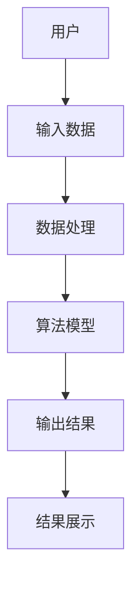
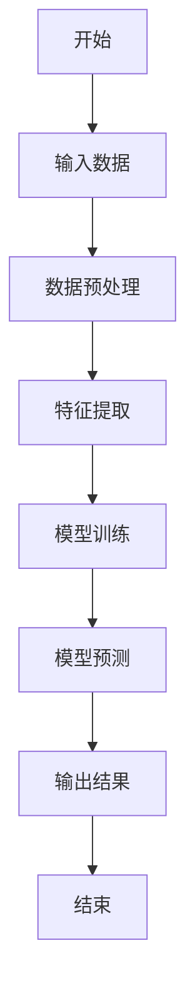
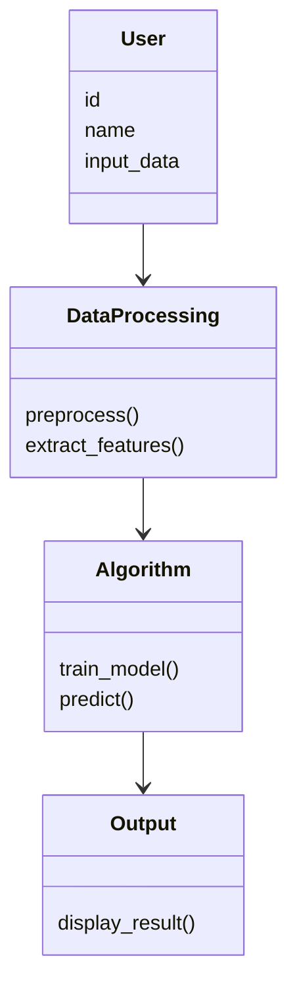
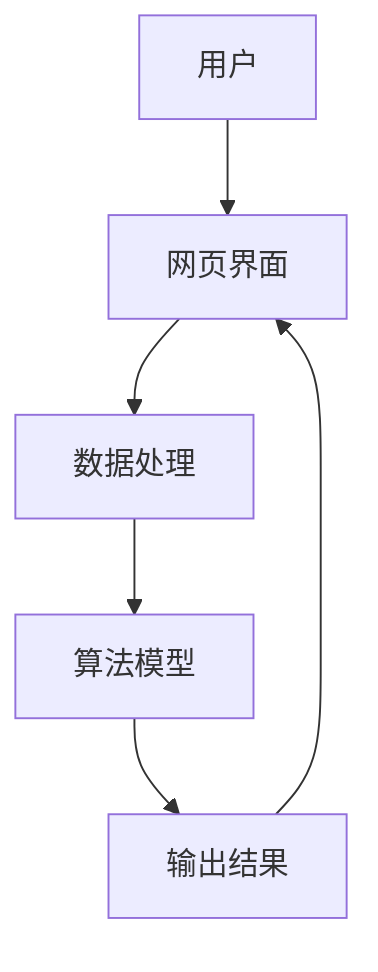
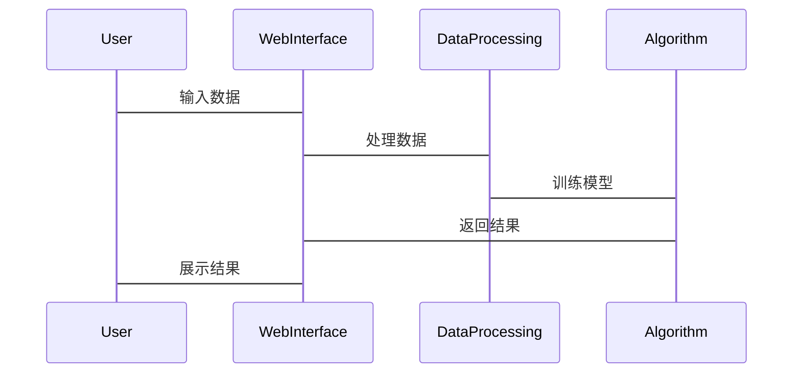

                 


# 智能个人税务筹划模拟器

> 关键词：智能税务模拟器，人工智能，数据驱动，税务优化，个人财务规划

> 摘要：本文介绍了一种基于人工智能的智能个人税务筹划模拟器，通过数据驱动的方法，帮助用户优化税务规划，降低税负，提升财务效率。本文从背景介绍、核心概念、算法原理、系统设计、项目实战、总结与展望等方面详细阐述了智能税务模拟器的构建过程和实际应用。

---

# 第1章: 背景介绍

## 1.1 问题背景

### 1.1.1 税务筹划的基本概念
税务筹划是通过合法手段优化个人或企业的税务负担，常见的税务筹划方式包括收入调整、成本控制、资产配置等。

### 1.1.2 传统税务筹划的局限性
- 传统税务筹划依赖人工计算，效率低且容易出错。
- 税务政策和法规复杂多变，人工难以及时更新和应用。
- 缺乏数据支持，难以实现精准的税务优化。

### 1.1.3 智能化税务筹划的需求与趋势
随着人工智能和大数据技术的发展，智能化税务筹划成为可能。通过智能模拟器，用户可以快速、准确地进行税务优化，提升财务效率。

## 1.2 问题描述

### 1.2.1 个人税务筹划的核心问题
个人税务筹划的核心问题是如何在合法的前提下，通过合理的收入分配、支出优化和资产配置，降低整体税负。

### 1.2.2 数据驱动的税务优化需求
通过收集和分析个人的收入、支出、资产等数据，利用数据驱动的方法进行税务优化，可以实现更精准的税务筹划。

### 1.2.3 智能模拟器的目标与功能
智能个人税务筹划模拟器的目标是通过人工智能技术，帮助用户快速、准确地进行税务优化。其功能包括数据输入与处理、税务计算与优化、结果展示与建议等。

## 1.3 问题解决

### 1.3.1 智能模拟器的解决方案
智能模拟器通过数据驱动的方法，利用机器学习算法对税务数据进行分析，生成最优的税务筹划方案。

### 1.3.2 数据分析与优化算法
利用数据挖掘和机器学习技术，分析用户的财务数据，提取关键特征，构建优化模型，生成最优的税务筹划方案。

### 1.3.3 人机交互与结果可视化
通过友好的用户界面，用户可以输入数据，系统实时计算并展示优化结果，提供可视化报告和建议。

## 1.4 边界与外延

### 1.4.1 智能模拟器的应用范围
智能模拟器主要适用于个人税务筹划，涵盖收入、支出、资产配置等多个方面。

### 1.4.2 与其他税务工具的区分
与其他税务工具相比，智能模拟器具有智能化、自动化、数据驱动等特点，能够提供更精准的优化建议。

### 1.4.3 系统的局限性与适用场景
智能模拟器的局限性包括依赖数据质量、模型的准确性和实时性等。适用场景主要是个人税务筹划，不适用于复杂的跨国税务问题。

## 1.5 概念结构与核心要素

### 1.5.1 核心功能模块
智能模拟器的核心功能模块包括数据输入与处理、税务计算与优化、结果展示与建议。

### 1.5.2 数据输入与处理流程
用户输入数据，系统进行数据清洗、特征提取，为后续的优化计算做准备。

### 1.5.3 结果输出与反馈机制
系统输出优化方案，并根据用户反馈进行调整和优化。

## 1.6 本章小结
本章介绍了智能个人税务筹划模拟器的背景、核心问题、解决方案以及系统边界和局限性，为后续章节的深入分析奠定了基础。

---

# 第2章: 核心概念与联系

## 2.1 核心概念原理

### 2.1.1 人工智能在税务筹划中的应用
人工智能技术，如机器学习和自然语言处理，可以用于税务数据的分析和优化。

### 2.1.2 数据挖掘与税务优化的关系
通过数据挖掘技术，可以从海量数据中提取有用的信息，为税务优化提供支持。

### 2.1.3 模拟器的算法基础
模拟器基于机器学习算法，如决策树、随机森林等，构建优化模型。

## 2.2 概念属性特征对比

### 2.2.1 传统税务筹划与智能模拟器的对比
| 特性 | 传统税务筹划 | 智能模拟器 |
|------|----------------|-------------|
| 数据依赖 | 低 | 高 |
| 效率 | 低 | 高 |
| 准确性 | 中 | 高 |

### 2.2.2 数据驱动与规则驱动的差异
- 数据驱动：基于历史数据和机器学习模型进行预测和优化。
- 规则驱动：基于固定的税务法规和规则进行计算。

### 2.2.3 不同税务场景的适用性分析
智能模拟器适用于个人所得税、财产税、遗产税等多种税务场景。

## 2.3 ER实体关系图


## 2.4 本章小结
本章通过对比分析，明确了智能模拟器的核心概念和算法基础，为后续章节的系统设计和实现提供了理论支持。

---

# 第3章: 算法原理讲解

## 3.1 机器学习在税务模拟中的应用

### 3.1.1 监督学习与非监督学习的对比
- 监督学习：基于有标签的数据进行训练，适用于分类和回归问题。
- 非监督学习：基于无标签的数据进行训练，适用于聚类问题。

### 3.1.2 税务数据特征提取
通过特征工程，提取收入、支出、资产等关键特征，为模型训练提供数据支持。

### 3.1.3 基于决策树的优化策略
决策树是一种常用的机器学习算法，可以用于分类和回归问题。在税务模拟中，可以用于预测最优的税务优化方案。

## 3.2 自然语言处理在税务文本分析中的应用

### 3.2.1 文本预处理与分词
文本预处理包括去除停用词、分词等，为后续的文本分析做准备。

### 3.2.2 情感分析与关键词提取
通过情感分析技术，分析税务政策文本中的关键词和情感倾向，辅助优化策略的制定。

## 3.3 算法流程图


## 3.4 本章小结
本章详细讲解了机器学习和自然语言处理在智能税务模拟器中的应用，通过算法流程图展示了整个优化过程。

---

# 第4章: 系统分析与架构设计

## 4.1 问题场景介绍

### 4.1.1 系统目标
构建一个智能个人税务筹划模拟器，帮助用户优化税务规划。

### 4.1.2 项目介绍
项目名称：智能个人税务筹划模拟器
开发目标：提供一个高效、准确的税务优化工具，帮助用户降低税负。

## 4.2 系统功能设计

### 4.2.1 领域模型（Mermaid类图）


### 4.2.2 系统架构设计（Mermaid架构图）


### 4.2.3 系统接口设计
系统接口包括数据输入接口、算法调用接口和结果展示接口。

### 4.2.4 系统交互（Mermaid序列图）


## 4.3 本章小结
本章通过系统分析和架构设计，明确了智能模拟器的实现框架和接口设计，为后续的系统开发奠定了基础。

---

# 第5章: 项目实战

## 5.1 环境安装

### 5.1.1 开发环境
- Python 3.8+
- Jupyter Notebook
- 数据库：MySQL或MongoDB

### 5.1.2 工具安装
安装必要的Python库，如pandas、numpy、scikit-learn等。

## 5.2 系统核心实现

### 5.2.1 数据预处理代码
```python
import pandas as pd
import numpy as np

# 数据加载
data = pd.read_csv('tax_data.csv')

# 数据清洗
data = data.dropna()
data = data.drop_duplicates()
```

### 5.2.2 特征提取代码
```python
# 特征提取
features = data[['income', 'expenses', 'assets']]
```

### 5.2.3 算法实现代码
```python
from sklearn.tree import DecisionTreeRegressor

# 模型训练
model = DecisionTreeRegressor()
model.fit(features, data['tax'])
```

## 5.3 代码应用解读与分析

### 5.3.1 数据预处理
通过数据清洗和去重，确保数据质量。

### 5.3.2 特征提取
选择与税务优化相关的特征，如收入、支出、资产等。

### 5.3.3 算法实现
利用决策树回归算法，训练模型并进行预测。

## 5.4 实际案例分析
通过具体案例分析，展示智能模拟器的实际应用效果。

## 5.5 本章小结
本章通过项目实战，详细讲解了智能模拟器的实现过程，包括环境安装、代码实现和案例分析。

---

# 第6章: 总结与展望

## 6.1 最佳实践 tips
- 数据质量是关键，确保输入数据的准确性和完整性。
- 定期更新模型，适应税务政策的变化。

## 6.2 小结
智能个人税务筹划模拟器通过人工智能技术，帮助用户实现高效、精准的税务优化。

## 6.3 注意事项
- 税务政策具有地域性和复杂性，使用前需结合具体政策。
- 系统依赖数据质量，数据不准确可能影响结果。

## 6.4 拓展阅读
建议阅读相关书籍和文献，深入理解人工智能和税务优化的结合应用。

## 6.5 本章小结
本章总结了智能模拟器的实现过程，并提出了改进建议和未来展望。

---

# 附录

## 附录A: 术语表
- 智能模拟器：基于人工智能的税务优化工具。
- 数据驱动：通过数据分析驱动决策。

## 附录B: 参考文献
1. 书籍：《机器学习实战》
2. 论文：《基于机器学习的税务优化研究》

---

# 作者：AI天才研究院/AI Genius Institute & 禅与计算机程序设计艺术 /Zen And The Art of Computer Programming

