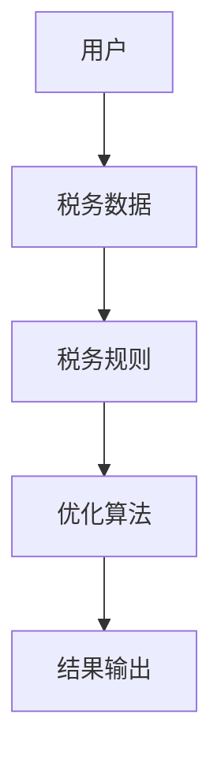
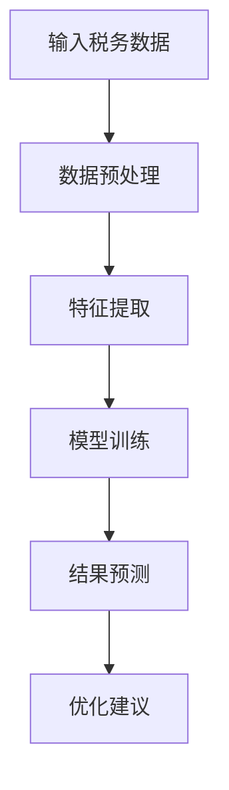
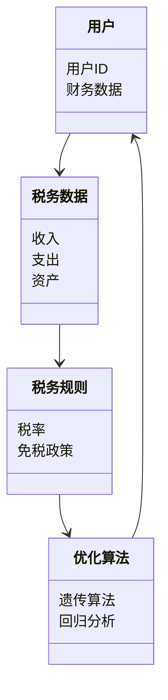
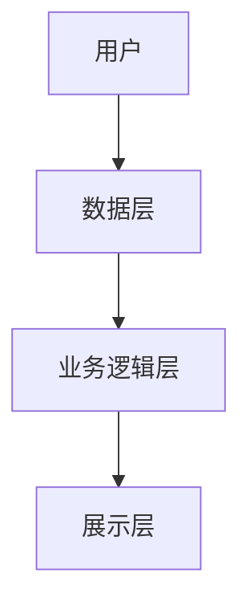

                 


# 智能个人税务筹划模拟平台

> 关键词：人工智能、税务筹划、系统设计、算法优化、数据挖掘

> 摘要：本文详细探讨了智能个人税务筹划模拟平台的构建与实现，结合人工智能、数据挖掘和优化算法，提出了一种创新的税务筹划解决方案，为个人用户提供高效、智能的税务规划服务。

---

## 第一部分：智能个人税务筹划模拟平台背景介绍

### 第1章：智能个人税务筹划模拟平台概述

#### 1.1 问题背景与目标

- **1.1.1 税务筹划的背景与重要性**  
  税务筹划是个人财务管理的重要组成部分，通过合法合规的手段优化税负，提升财务效益。随着税收政策的复杂化和个性化需求的增加，传统的人工税务筹划方式已难以满足高效性和精准性的要求。

- **1.1.2 传统税务筹划的局限性**  
  传统税务筹划依赖人工分析，存在效率低、成本高、易出错等问题，难以应对复杂多变的税收政策和个性化需求。

- **1.1.3 智能化税务筹划的必要性**  
  利用人工智能和大数据技术，可以实现自动化、智能化的税务筹划，提高效率和准确性，满足用户的个性化需求。

#### 1.2 平台的功能与目标

- **1.2.1 平台的核心功能**  
  - 数据采集与分析：收集用户的财务数据，分析收入、支出、资产配置等信息。  
  - 税务规则解析：解析税收政策和法规，生成适用的税务规则。  
  - 智能优化：基于优化算法，生成最优的税务筹划方案。  
  - 结果展示：以可视化的方式展示筹划结果和建议。

- **1.2.2 平台的目标与价值**  
  平台旨在为用户提供高效、智能的税务筹划服务，帮助用户在合法合规的前提下，最大限度地优化税负，提升财务效益。

#### 1.3 平台的边界与外延

- **1.3.1 平台的功能边界**  
  平台专注于个人税务筹划，不涉及企业税务或其他领域的业务。

- **1.3.2 平台的适用范围与限制**  
  适用于个人用户，需用户提供真实、准确的财务数据。平台不提供法律咨询，仅提供优化建议。

#### 1.4 平台的概念结构与核心要素

- **1.4.1 平台的组成要素**  
  - 用户：输入财务数据并使用平台。  
  - 数据层：存储用户数据和税务规则。  
  - 业务逻辑层：处理数据，生成优化方案。  
  - 展示层：以可视化方式展示结果。

- **1.4.2 核心要素之间的关系**  
  用户数据输入 -> 数据层存储 -> 业务逻辑处理 -> 结果展示。

#### 1.5 本章小结

本章介绍了智能个人税务筹划模拟平台的背景、功能、目标、边界和核心要素，为后续章节的展开奠定了基础。

---

## 第二部分：智能税务筹划的核心概念与联系

### 第2章：智能税务筹划的核心概念与联系

#### 2.1 核心概念原理

- **2.1.1 人工智能在税务筹划中的应用**  
  利用机器学习和自然语言处理技术，分析税务数据和政策，生成优化方案。

- **2.1.2 税务规则与数据挖掘**  
  通过数据挖掘技术，从大量数据中提取税务规则和模式，辅助优化决策。

- **2.1.3 智能优化算法**  
  使用遗传算法等优化算法，寻找最优的税务筹划方案。

#### 2.2 核心概念属性特征对比

- **2.2.1 传统税务筹划与智能税务筹划对比**  
  | 特性         | 传统税务筹划 | 智能税务筹划 |
  |--------------|---------------|---------------|
  | 效率         | 低            | 高            |
  | 准确性       | 依赖经验      | 数据驱动      |
  | 个性化       | 有限          | 高            |

- **2.2.2 数据驱动与规则驱动的对比**  
  数据驱动：基于大量数据，发现隐藏模式。  
  规则驱动：基于预定义规则，进行判断。

- **2.2.3 精准计算与经验估算的对比**  
  精准计算：利用数学模型，得出最优解。  
  经验估算：依赖人工经验，可能存在误差。

#### 2.3 ER实体关系图



#### 2.4 本章小结

本章详细讲解了智能税务筹划的核心概念及其与传统方法的区别，并通过对比分析和ER图展示了平台的结构。

---

## 第三部分：智能税务筹划的算法原理

### 第3章：智能税务筹划的算法原理

#### 3.1 算法原理概述

- **3.1.1 机器学习在税务筹划中的应用**  
  使用回归分析和分类算法，预测税务影响。

- **3.1.2 自然语言处理在税务规则解析中的应用**  
  通过NLP技术，解析税收政策文本，提取规则。

- **3.1.3 智能优化算法的原理**  
  利用遗传算法，寻找最优解。

#### 3.2 算法流程图



#### 3.3 算法数学模型

- **3.3.1 线性回归模型**  
  $$ y = \beta_0 + \beta_1x + \epsilon $$

- **3.3.2 支持向量机模型**  
  $$ \text{最大化} \ 1 - \text{误分类} $$

- **3.3.3 遗传算法优化**  
  $$ \text{适应度函数} = \text{税后收益最大化} $$

#### 3.4 本章小结

本章详细介绍了智能税务筹划中使用的算法原理，并通过流程图和数学模型展示了算法的实现过程。

---

## 第四部分：系统分析与架构设计方案

### 第4章：系统分析与架构设计方案

#### 4.1 问题场景介绍

- **4.1.1 税务筹划的典型问题**  
  税收政策复杂，用户需求个性化，传统方法效率低。

- **4.1.2 平台的目标用户与使用场景**  
  目标用户为个人用户，使用场景包括年度税务规划、资产配置优化等。

#### 4.2 项目介绍

- **4.2.1 项目目标**  
  构建智能税务筹划模拟平台，提供高效、精准的税务规划服务。

- **4.2.2 项目范围**  
  专注于个人税务筹划，涵盖收入、支出、资产等数据的分析。

- **4.2.3 项目约束**  
  数据隐私保护，确保用户信息安全。

#### 4.3 系统功能设计

- **4.3.1 领域模型**



#### 4.4 系统架构设计



#### 4.5 本章小结

本章通过系统分析和架构设计，明确了平台的结构和功能，为后续的实现奠定了基础。

---

## 第五部分：项目实战

### 第5章：项目实战

#### 5.1 环境安装

- **5.1.1 安装Python环境**  
  使用Anaconda安装Python 3.8以上版本。

- **5.1.2 安装依赖库**  
  ```bash
  pip install numpy pandas scikit-learn
  ```

#### 5.2 系统核心实现

- **5.2.1 数据预处理代码**

```python
import pandas as pd

def preprocess_data(data):
    # 处理缺失值
    data = data.dropna()
    # 标准化处理
    from sklearn.preprocessing import StandardScaler
    scaler = StandardScaler()
    data_scaled = scaler.fit_transform(data)
    return data_scaled
```

- **5.2.2 模型训练代码**

```python
from sklearn.linear_model import LinearRegression

def train_model(data, target):
    model = LinearRegression()
    model.fit(data, target)
    return model
```

#### 5.3 实际案例分析

- **5.3.1 案例背景**  
  用户年收入100万元，需优化个人所得税和资产配置。

- **5.3.2 案例分析与优化建议**  
  通过平台分析，建议将部分收入投资于免税产品，降低税负。

#### 5.4 本章小结

本章通过实际案例分析，展示了平台的实现过程和应用价值。

---

## 第六部分：最佳实践

### 第6章：最佳实践

#### 6.1 小结

- 平台的核心价值在于高效、智能的税务筹划服务。
- 通过人工智能和优化算法，提升了税务筹划的效率和准确性。

#### 6.2 注意事项

- 确保数据隐私和安全。
- 定期更新税收政策和法规。

#### 6.3 拓展阅读

- 推荐阅读《机器学习实战》和《数据挖掘导论》。

#### 6.4 本章小结

本章总结了平台的核心价值和注意事项，为读者提供了实用的建议。

---

## 附录

### 附录A：系统架构图


### 附录B：流程图


### 附录C：数学公式

- 线性回归模型：$$ y = \beta_0 + \beta_1x + \epsilon $$
- 遗传算法优化：$$ \text{适应度函数} = \text{税后收益最大化} $$

---

## 作者：AI天才研究院/AI Genius Institute & 禅与计算机程序设计艺术/Zen And The Art of Computer Programming

---

这篇文章通过详细讲解智能个人税务筹划模拟平台的背景、核心概念、算法原理、系统架构设计、项目实战和最佳实践，为读者提供了一个全面的技术视角，帮助读者理解并掌握如何构建和应用此类平台。

