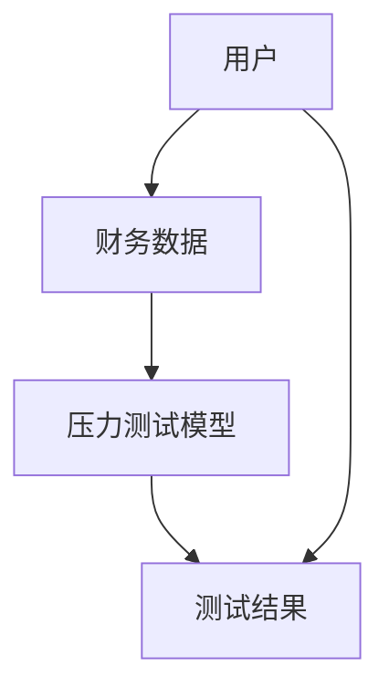
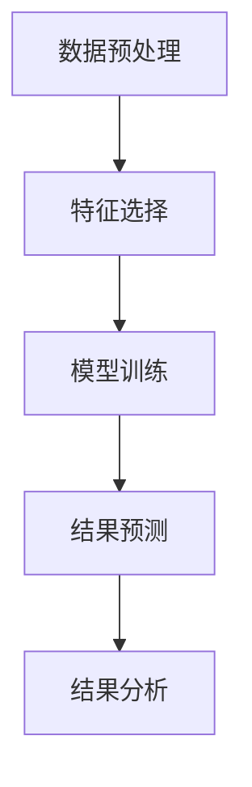
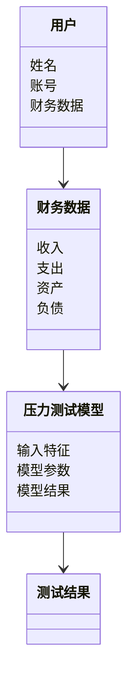
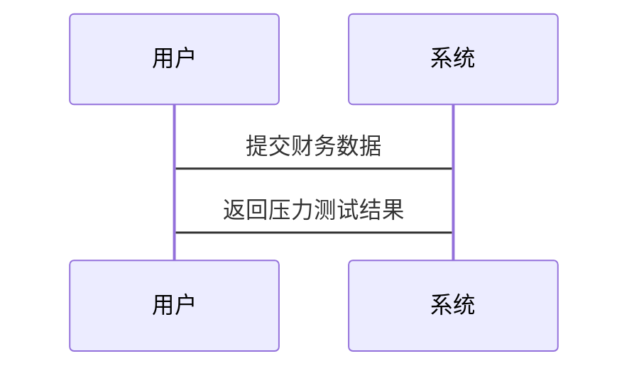

                 


# 智能个人财务 Stress Testing 工具

> 关键词：智能财务工具，压力测试，人工智能，个人财务，风险管理

> 摘要：本文深入探讨了智能个人财务压力测试工具的核心概念、算法原理、系统架构以及实际应用。通过结合人工智能技术，分析个人财务状况，评估潜在风险，并提供优化建议，帮助用户在财务压力下做出明智决策。

---

## 第一部分: 智能个人财务 Stress Testing 工具概述

### 第1章: 智能个人财务 Stress Testing 工具的背景与概念

#### 1.1 财务压力测试的基本概念

##### 1.1.1 什么是财务压力测试
财务压力测试是一种评估个人或企业在面对极端市场条件、经济波动或其他潜在风险时的财务承受能力的方法。对于个人而言，压力测试可以帮助评估在失业、重大医疗支出、投资亏损等情况下的财务稳定性。

##### 1.1.2 财务压力测试的目的与意义
- **目的**：识别潜在的财务风险，评估应对能力，制定应对策略。
- **意义**：帮助个人在面对财务危机时做出更明智的决策，避免财务崩溃。

##### 1.1.3 个人财务压力测试的独特性
- **个性化**：每个人的财务状况和风险承受能力不同，压力测试需要个性化定制。
- **实时性**：基于实时数据，动态评估财务状况。
- **预测性**：通过模拟极端情况，预测可能的财务结果。

#### 1.2 智能工具在财务压力测试中的作用

##### 1.2.1 智能技术如何优化财务压力测试
- **自动化数据收集**：通过API接口自动获取银行账户、投资账户等数据。
- **智能分析**：利用机器学习算法对财务数据进行深度分析，预测潜在风险。
- **个性化建议**：根据测试结果，提供优化财务结构的建议。

##### 1.2.2 人工智能在个人财务分析中的应用
- **预测模型**：使用回归分析、随机森林等算法预测财务风险。
- **用户画像**：基于用户数据构建用户画像，提供个性化服务。

##### 1.2.3 智能工具的优势与局限性
- **优势**：
  - 高效性：快速处理大量数据。
  - 精准性：基于复杂算法提供准确预测。
  - 便捷性：用户友好的界面设计。
- **局限性**：
  - 数据依赖：结果准确性依赖于数据质量和完整性。
  - 黑箱问题：用户难以理解模型的决策过程。

#### 1.3 个人财务压力测试的场景与应用

##### 1.3.1 常见的个人财务压力测试场景
- 失业风险测试：评估失业后的生活支出和储蓄消耗速度。
- 投资风险测试：评估投资组合在市场下跌情况下的表现。
- 突发支出测试：评估应对重大医疗支出或家庭紧急情况的能力。

##### 1.3.2 不同场景下的测试方法
- **失业场景**：模拟失去主要收入来源，计算剩余资金支持多久。
- **投资场景**：模拟投资组合在不同市场条件下的表现。
- **突发支出场景**：评估应急基金是否足够应对突发支出。

##### 1.3.3 应用案例分析
- 案例1：某用户失业后，压力测试显示其储蓄可支持6个月的生活开支，建议减少非必要开支并寻找新收入来源。
- 案例2：某投资者的压力测试显示其投资组合在市场下跌20%时将亏损15%，建议调整投资比例以降低风险。

---

### 第2章: 智能个人财务 Stress Testing 工具的核心概念与联系

#### 2.1 核心概念原理

##### 2.1.1 智能工具的基本原理
智能个人财务压力测试工具通过收集和分析用户的财务数据，利用机器学习算法预测潜在风险，并提供应对策略。

##### 2.1.2 压力测试的关键指标
- **流动性比率**：衡量短期偿债能力。
- **债务负担率**：衡量债务与收入的比例。
- **投资风险指数**：评估投资组合的潜在风险。

##### 2.1.3 人工智能算法在压力测试中的应用
- **算法选择**：随机森林、支持向量机（SVM）等算法用于分类和回归分析。
- **特征工程**：提取关键财务指标作为模型输入特征。
- **模型训练**：通过历史数据训练模型，评估财务风险。

#### 2.2 核心概念对比表格

| 概念         | 描述                                                                 |
|--------------|----------------------------------------------------------------------|
| 财务压力测试 | 评估个人在特定财务压力下的应对能力                                       |
| 人工智能     | 利用机器学习算法模拟和预测财务状况                                       |
| 用户画像     | 基于用户数据构建的个性化财务分析模型                                     |

#### 2.3 ER 实体关系图


---

### 第3章: 智能个人财务 Stress Testing 工具的算法原理

#### 3.1 算法原理概述

##### 3.1.1 基于机器学习的压力测试模型
- **随机森林算法**：用于分类和回归分析，预测财务风险。
- **数学模型**：随机森林是一种基于树的集成算法，通过构建多个决策树并进行投票或平均化得到最终结果。

##### 3.1.2 算法流程图


##### 3.1.3 核心代码实现
```python
import pandas as pd
from sklearn.ensemble import RandomForestClassifier
from sklearn.model_selection import train_test_split
from sklearn.metrics import accuracy_score

# 数据加载
data = pd.read_csv('financial_data.csv')
X = data.drop('target', axis=1)
y = data['target']

# 数据分割
X_train, X_test, y_train, y_test = train_test_split(X, y, test_size=0.2, random_state=42)

# 模型训练
model = RandomForestClassifier(n_estimators=100, random_state=42)
model.fit(X_train, y_train)

# 模型预测
y_pred = model.predict(X_test)

# 模型评估
print('Accuracy:', accuracy_score(y_test, y_pred))
```

##### 3.1.4 数学模型与公式
- **随机森林算法**：
  - 随机森林通过构建多个决策树，并对结果进行投票或平均化，提高模型的准确性和鲁棒性。
  - 决策树的分裂标准可以使用基尼指数或信息增益。

  $$ Gini = 1 - \sum_{i=1}^{n} p_i^2 $$

- **特征重要性评估**：
  - 随机森林可以通过特征重要性系数（Feature Importance）评估各个特征对模型的贡献程度。

---

### 第4章: 智能个人财务 Stress Testing 工具的系统分析与架构设计

#### 4.1 系统功能设计

##### 4.1.1 系统功能模块
- 数据采集模块：收集用户的财务数据。
- 数据处理模块：清洗和预处理数据。
- 模型构建模块：训练压力测试模型。
- 结果分析模块：生成压力测试报告。

##### 4.1.2 领域模型类图


#### 4.2 系统架构设计

##### 4.2.1 系统架构图


#### 4.3 系统接口设计

##### 4.3.1 API 接口
- 数据接口：提供REST API用于数据上传和下载。
- 模型接口：提供API用于调用压力测试模型进行预测。

##### 4.3.2 接口交互流程


---

### 第5章: 智能个人财务 Stress Testing 工具的项目实战

#### 5.1 环境安装与配置

##### 5.1.1 安装依赖
```bash
pip install pandas scikit-learn matplotlib
```

##### 5.1.2 环境配置
- 数据库连接配置
- API接口配置

#### 5.2 核心代码实现

##### 5.2.1 数据预处理
```python
import pandas as pd

# 加载数据
data = pd.read_csv('financial_data.csv')

# 数据清洗
data.dropna(inplace=True)
data = pd.get_dummies(data)
```

##### 5.2.2 模型训练
```python
from sklearn.ensemble import RandomForestClassifier
from sklearn.model_selection import train_test_split

X = data.drop('target', axis=1)
y = data['target']

X_train, X_test, y_train, y_test = train_test_split(X, y, test_size=0.2, random_state=42)

model = RandomForestClassifier(n_estimators=100, random_state=42)
model.fit(X_train, y_train)
```

##### 5.2.3 结果分析
```python
from sklearn.metrics import classification_report

y_pred = model.predict(X_test)
print(classification_report(y_test, y_pred))
```

#### 5.3 案例分析

##### 5.3.1 案例背景
- 用户A：月收入10000元，月支出8000元，储蓄100000元，投资50000元。

##### 5.3.2 压力测试模拟
- 失业场景：月支出不变，储蓄每月减少5000元，可支持20个月。
- 投资场景：投资组合在市场下跌20%时亏损10000元，建议调整投资比例。

##### 5.3.3 优化建议
- 建议建立应急基金，增加储蓄比例。
- 优化投资组合，降低高风险资产比例。

---

### 第6章: 总结与展望

#### 6.1 最佳实践 tips
- 定期更新财务数据，确保模型准确性。
- 根据测试结果调整财务计划，降低潜在风险。

#### 6.2 小结
智能个人财务压力测试工具通过结合人工智能技术，帮助用户在财务压力下做出更明智的决策，提高财务稳定性。

#### 6.3 注意事项
- 数据隐私保护：确保用户数据的安全性。
- 模型局限性：压力测试结果仅供参考，具体决策需结合实际情况。

#### 6.4 未来展望
- 更智能化：引入更多人工智能技术，如自然语言处理，提供更个性化的服务。
- 更广泛的应用：扩展到更多财务场景，如税务规划、遗产规划等。

---

## 作者：AI天才研究院/AI Genius Institute & 禅与计算机程序设计艺术 /Zen And The Art of Computer Programming

