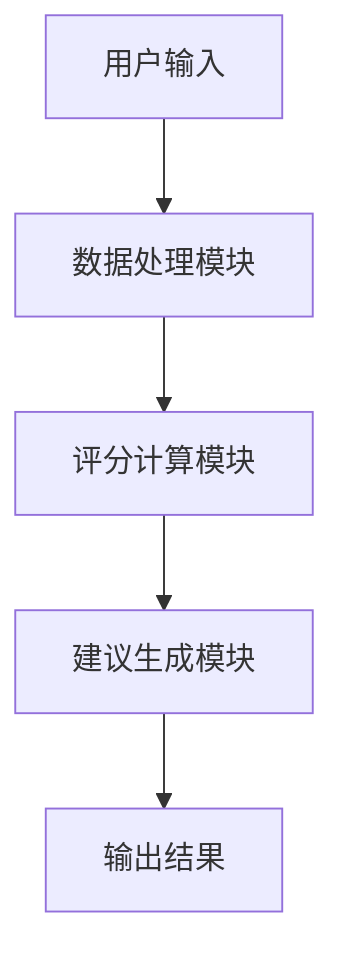
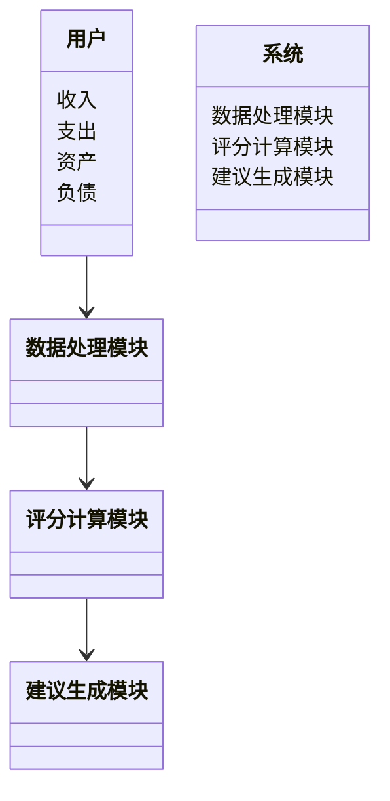
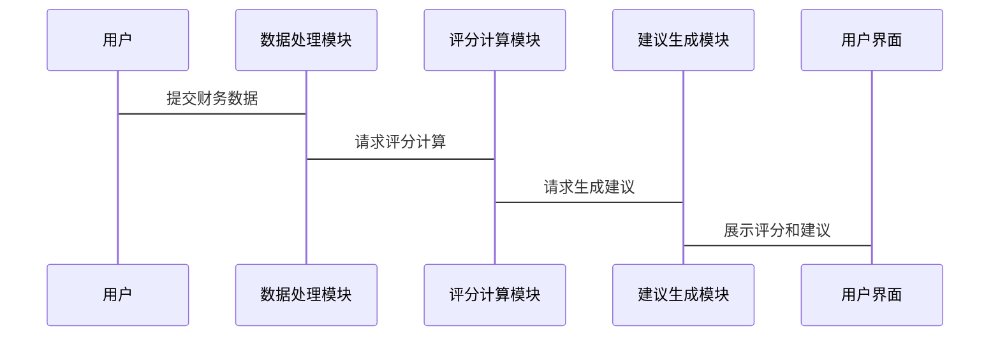

                 

<think>
好的，我将按照您的要求逐步撰写这篇文章。首先，我会按照目录大纲的结构，从概述、核心概念、算法原理、系统架构、项目实战和最佳实践等方面展开。每个部分都尽量详细，使用清晰的逻辑和专业但易懂的语言。

## 第一部分: 智能个人财务健康评分与改善建议系统概述

### 第1章: 问题背景与需求分析

#### 1.1 个人财务管理的重要性
##### 1.1.1 个人财务管理的核心问题
在现代生活中，个人财务管理是每个人都会面临的重要课题。随着经济的发展和生活水平的提高，人们的收入来源和支出项目日益多样化，如何有效地管理个人财务，确保财务健康，成为一个亟待解决的问题。

##### 1.1.2 当前个人财务管理的痛点
- **信息分散**：个人的财务数据可能分布在多个账户和平台，难以集中管理。
- **缺乏专业的知识**：大多数人在财务管理方面缺乏专业的知识，难以制定合理的财务计划。
- **难以量化健康状况**：个人的财务健康状况难以量化，缺乏统一的评分标准。
- **个性化需求**：每个人的财务状况和目标不同，需要个性化的管理方案。

##### 1.1.3 智能化财务管理的必要性
随着人工智能和大数据技术的发展，智能化的财务管理系统能够帮助用户实时监控财务状况，提供个性化的建议，从而提高财务管理的效率和效果。

#### 1.2 问题描述与目标
##### 1.2.1 财务健康评分的定义
财务健康评分是对个人财务状况的整体评估，旨在量化个人在收入、支出、资产和负债等方面的表现，从而判断其财务健康程度。

##### 1.2.2 改善建议系统的目标
改善建议系统的目标是根据用户的财务健康评分，提供具体的财务优化建议，帮助用户改善财务状况，实现财务目标。

##### 1.2.3 系统的边界与外延
系统边界：本系统仅针对个人用户，不包括企业或其他组织的财务管理。 
系统外延：系统可扩展到家庭财务管理，以及与其他财务服务（如银行、投资平台）的集成。

#### 1.3 核心概念与系统架构
##### 1.3.1 财务健康评分模型
财务健康评分模型是系统的核心，通过对用户收入、支出、资产和负债等多方面数据的分析，生成一个综合评分。

##### 1.3.2 改善建议生成机制
系统根据评分结果，生成个性化的改善建议，包括优化支出结构、调整资产配置等具体措施。

##### 1.3.3 系统核心功能模块
- **数据输入与处理模块**：收集和整理用户的财务数据。
- **评分计算模块**：基于模型计算用户的财务健康评分。
- **建议生成模块**：根据评分结果生成改善建议。
- **用户界面模块**：提供友好的用户界面，展示评分和建议。

---

### 第2章: 核心概念与系统架构

#### 2.1 财务健康评分模型
##### 2.1.1 模型输入特征
- **收入来源**：包括工资、投资收益等。
- **支出结构**：包括日常生活开支、债务还款等。
- **资产配置**：包括现金、存款、房产、股票等资产。
- **负债情况**：包括信用卡债务、贷款等。
- **风险偏好**：用户对风险的承受能力。

##### 2.1.2 模型输出结果
- 综合评分：0-100分，分数越高表示财务状况越健康。
- 评分维度：包括收入稳定性、支出合理性、资产安全性、负债风险性等。

##### 2.1.3 模型核心要素对比表
| 特征          | 描述 |
|---------------|------|
| 收入来源      | 收入的多样性与稳定性 |
| 支出结构      | 支出的合理性与优化空间 |
| 资产配置      | 资产的多样性和风险分散度 |
| 负债情况      | 债务的合理性与偿债能力 |
| 风险偏好      | 用户对风险的承受能力 |

#### 2.2 改善建议生成机制
##### 2.2.1 建议生成规则
- 根据评分结果，优先解决影响评分的主要问题。
- 提供可执行的具体建议，如增加紧急储备金、优化支出结构等。

##### 2.2.2 建议优先级排序
- 优先处理高风险问题，如高负债比例、低应急资金储备等。
- 根据用户的财务目标和风险偏好，调整建议的优先级。

##### 2.2.3 建议的个性化定制
系统会根据用户的财务状况、目标和偏好，生成个性化的改善建议。

#### 2.3 系统架构设计
##### 2.3.1 系统功能模块
- **数据输入模块**：用户输入财务数据，如收入、支出、资产、负债等。
- **数据处理模块**：对输入数据进行清洗和预处理，确保数据的准确性和完整性。
- **评分计算模块**：基于评分模型，计算用户的财务健康评分。
- **建议生成模块**：根据评分结果，生成改善建议。
- **用户界面模块**：展示评分结果和改善建议。

##### 2.3.2 系统架构图


---

### 第3章: 财务健康评分模型算法原理

#### 3.1 模型概述
##### 3.1.1 模型输入与输出
- **输入**：用户的财务数据，包括收入、支出、资产、负债等。
- **输出**：财务健康评分（0-100分），以及评分的各个维度。

##### 3.1.2 模型训练数据来源
- 用户提供的财务数据。
- 市场数据，如通货膨胀率、平均工资水平等。
- 历史财务数据，用于模型训练和验证。

##### 3.1.3 模型核心算法
采用加权评分法，根据各个评分维度的重要性，给予不同的权重，计算最终的综合评分。

##### 3.1.4 模型数学公式
综合评分公式：
$$
\text{评分} = w_1 \times \text{收入评分} + w_2 \times \text{支出评分} + w_3 \times \text{资产评分} + w_4 \times \text{负债评分}
$$
其中，$w_1, w_2, w_3, w_4$ 是各个维度的权重，满足 $w_1 + w_2 + w_3 + w_4 = 1$。

#### 3.2 模型实现步骤
##### 3.2.1 数据预处理
- 数据清洗：去除异常值，处理缺失值。
- 数据标准化：对不同量纲的特征进行标准化处理。

##### 3.2.2 模型训练
- 根据历史数据，训练加权评分模型，确定各个维度的权重。

##### 3.2.3 模型验证
- 使用验证集，评估模型的准确性和稳定性。

##### 3.2.4 模型优化
- 根据验证结果，调整模型参数，优化评分效果。

#### 3.3 模型权重确定
##### 3.3.1 权重确定方法
- 根据专家意见和市场数据，确定各个维度的权重。

##### 3.3.2 权重调整策略
- 根据用户反馈，动态调整权重，提高模型的适应性。

---

## 第四章: 系统分析与架构设计方案

### 4.1 问题场景介绍
用户的财务数据可能分布在多个平台，需要整合到一个系统中进行统一管理。同时，用户需要个性化的财务建议，帮助他们优化财务状况。

### 4.2 项目介绍
本项目旨在开发一个智能个人财务健康评分与改善建议系统，通过数据处理、模型计算和建议生成，帮助用户更好地管理个人财务。

### 4.3 系统功能设计
#### 4.3.1 领域模型


#### 4.3.2 系统架构设计


#### 4.3.3 系统接口设计
- **输入接口**：用户输入财务数据。
- **输出接口**：展示评分结果和改善建议。

#### 4.3.4 系统交互流程


---

## 第五章: 项目实战

### 5.1 环境安装
- **Python**：安装Python 3.x。
- **库的安装**：安装pandas、numpy、scikit-learn等库。

### 5.2 核心代码实现
#### 5.2.1 数据处理模块
```python
import pandas as pd
import numpy as np

def load_data(file_path):
    # 读取数据
    data = pd.read_csv(file_path)
    # 数据清洗
    data.dropna(inplace=True)
    return data

def preprocess_data(data):
    # 数据标准化
    from sklearn.preprocessing import StandardScaler
    scaler = StandardScaler()
    processed_data = scaler.fit_transform(data)
    return processed_data
```

#### 5.2.2 评分计算模块
```python
def calculate_score(processed_data, weights):
    # 计算各个维度的评分
    income_score = processed_data[:, 0] * weights[0]
    expenditure_score = processed_data[:, 1] * weights[1]
    asset_score = processed_data[:, 2] * weights[2]
    liability_score = processed_data[:, 3] * weights[3]
    total_score = income_score + expenditure_score + asset_score + liability_score
    return total_score

weights = [0.3, 0.3, 0.2, 0.2]
processed_data = preprocess_data(data)
scores = calculate_score(processed_data, weights)
```

#### 5.2.3 建议生成模块
```python
def generate_recommendations(scores):
    recommendations = []
    for score in scores:
        if score < 50:
            recommendations.append("建议优化支出结构")
        elif 50 <= score < 70:
            recommendations.append("建议增加应急储备金")
        else:
            recommendations.append("财务状况良好，继续保持")
    return recommendations

recommendations = generate_recommendations(scores)
```

### 5.3 案例分析
假设一个用户的财务数据如下：
- 收入：月收入10000元
- 支出：月支出7000元
- 资产：存款300000元，无负债
- 风险偏好：中风险

系统计算出该用户的财务健康评分为85分，属于良好状态。建议继续优化资产配置，增加投资组合。

---

## 第六章: 最佳实践与总结

### 6.1 最佳实践
- **数据隐私保护**：确保用户的财务数据不被泄露。
- **模型优化**：根据用户反馈，持续优化评分模型。
- **系统扩展性**：未来可以加入更多财务指标，如投资回报率、通胀影响等。

### 6.2 小结
智能个人财务健康评分与改善建议系统通过智能化的手段，帮助用户更好地管理个人财务，实现财务目标。系统的核心在于准确的评分模型和个性化的建议生成。

### 6.3 注意事项
- 用户在使用系统前，应确保数据的准确性。
- 系统建议仅供参考，用户应根据自身情况做出决策。

### 6.4 拓展阅读
- 《个人财务管理入门》
- 《智能化财务管理系统的开发与应用》

---

## 作者：AI天才研究院/AI Genius Institute & 禅与计算机程序设计艺术 /Zen And The Art of Computer Programming

