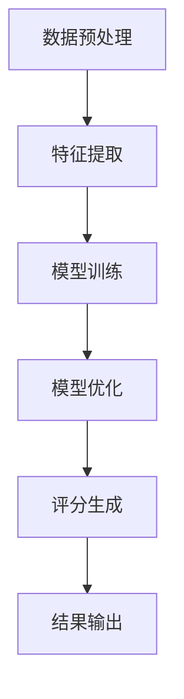
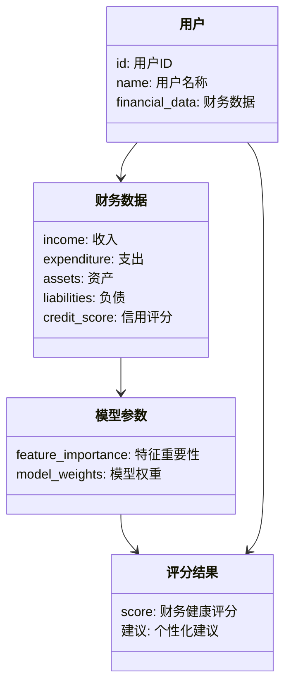

                 


# 智能个人财务健康评分系统

## 关键词：智能评分系统、个人财务管理、机器学习、金融健康评估、数据驱动决策

## 摘要：智能个人财务健康评分系统是一种结合人工智能和数据科学的创新解决方案，旨在通过多维度数据分析和机器学习算法，为个人提供实时、动态的财务健康评估。本文将深入探讨该系统的背景、核心概念、算法原理、系统架构以及实际应用，帮助读者全面理解其工作原理和价值。

---

# 第一部分：智能个人财务健康评分系统概述

## 第1章：背景介绍

### 1.1 问题背景

随着经济的发展和生活节奏的加快，个人财务管理变得越来越复杂。传统的财务管理方式依赖于手动记录和简单规则，难以应对复杂多变的经济环境。例如，许多人无法准确评估自己的财务健康状况，导致过度消费、债务累积等问题。此外，传统评分系统通常基于单一维度的数据（如信用卡消费记录），缺乏对整体财务状况的全面分析。

### 1.2 问题描述

智能个人财务健康评分系统的目标是通过多维度数据（如收入、支出、资产、负债、信用记录等）的整合与分析，为用户提供实时、动态的财务健康评分。该系统能够帮助用户识别潜在的财务风险，优化财务管理策略，并提供个性化的财务建议。

### 1.3 核心概念与联系

智能评分系统的核心在于数据的整合与分析。通过机器学习算法，系统能够从海量数据中提取关键特征，并生成动态的评分结果。以下是智能评分系统与传统评分系统的对比：

| 特性                | 传统评分         | 智能评分         |
|---------------------|------------------|------------------|
| 数据来源            | 单一维度数据     | 多维度数据融合   |
| 计算方式            | 简单规则        | 机器学习模型     |
| 评估频率            | 定期评估         | 实时动态评估     |
| 个性化程度          | 低              | 高              |

以下是系统的ER实体关系图：

```mermaid
er
  actor: 用户
  entity: 财务数据
  entity: 评分结果
  entity: 模型参数
  relation: 用户 -> 提供 财务数据
  relation: 财务数据 -> 输入 模型参数
  relation: 模型参数 -> 生成 评分结果
  relation: 评分结果 -> 反馈 用户
```

---

## 第2章：算法原理

### 2.1 机器学习算法选择

随机森林（Random Forest）是一种基于决策树的集成学习算法，具有较强的抗过拟合能力和特征重要性分析能力。以下是随机森林的工作流程：

1. 数据预处理：清洗数据，处理缺失值和异常值。
2. 特征提取：从多维度数据中提取关键特征。
3. 模型训练：生成多个决策树，并对结果进行集成。
4. 模型优化：通过交叉验证调整模型参数。
5. 评分生成：根据模型预测结果生成财务健康评分。

### 2.2 数学模型与公式

随机森林的预测公式如下：

$$
y = \frac{1}{n} \sum_{i=1}^{n} y_i
$$

其中，$y$ 是最终预测结果，$y_i$ 是单棵决策树的预测结果，$n$ 是决策树的数量。

以下是随机森林的训练流程图：



---

## 第3章：系统架构设计

### 3.1 系统功能设计

以下是系统的核心功能模块：

1. 数据采集模块：从多种数据源获取财务数据。
2. 数据处理模块：清洗和预处理数据。
3. 模型训练模块：训练机器学习模型。
4. 评分生成模块：根据模型预测结果生成评分。
5. 用户交互模块：提供评分结果和个性化建议。

以下是系统的领域模型类图：



### 3.2 系统架构图

以下是系统的整体架构图：

```mermaid
archi
    component 用户端 {
        接收用户输入
        显示评分结果
    }
    component 数据采集模块 {
        从银行获取交易记录
        从税务系统获取收入数据
        从信用机构获取信用报告
    }
    component 数据处理模块 {
        清洗数据
        特征提取
    }
    component 模型训练模块 {
        训练随机森林模型
        优化模型参数
    }
    component 评分生成模块 {
        生成财务健康评分
        提供个性化建议
    }
    用户端 --> 数据采集模块
    数据采集模块 --> 数据处理模块
    数据处理模块 --> 模型训练模块
    模型训练模块 --> 评分生成模块
    评分生成模块 --> 用户端
```

---

## 第4章：项目实战

### 4.1 环境安装

以下是项目所需的环境配置：

1. Python 3.8+
2. Pandas 1.0+
3. Scikit-learn 0.24+
4. Mermaid CLI工具

### 4.2 核心代码实现

以下是系统的核心代码示例：

```python
import pandas as pd
from sklearn.ensemble import RandomForestClassifier
from sklearn.metrics import accuracy_score
from sklearn.model_selection import train_test_split

# 数据加载
data = pd.read_csv('financial_data.csv')

# 数据预处理
data = data.dropna()
X = data[['income', 'expenditure', 'assets', 'liabilities', 'credit_score']]
y = data['health_score']

# 数据分割
X_train, X_test, y_train, y_test = train_test_split(X, y, test_size=0.2)

# 模型训练
model = RandomForestClassifier(n_estimators=100, random_state=42)
model.fit(X_train, y_train)

# 模型预测
y_pred = model.predict(X_test)

# 模型评估
print('准确率:', accuracy_score(y_test, y_pred))
```

### 4.3 实际案例分析

假设用户A的财务数据如下：

| 收入 | 支出 | 资产 | 负债 | 信用评分 |
|------|------|------|------|----------|
| 5000 | 4000 | 100000 | 20000 | 750 |

根据模型预测，用户A的财务健康评分为75分，属于良好状态。系统会建议用户优化资产配置，减少非必要支出。

---

## 第5章：总结与展望

### 5.1 最佳实践

1. 定期更新模型参数，确保评分结果的准确性。
2. 提供个性化的财务建议，提升用户体验。
3. 加强数据隐私保护，确保用户信息安全。

### 5.2 未来展望

智能个人财务健康评分系统未来可以进一步扩展功能，例如：

1. 实现实时监控，动态调整评分结果。
2. 集成更多数据源，提升评估维度。
3. 提供更个性化的财务规划服务。

---

## 作者信息

作者：AI天才研究院（AI Genius Institute） & 禅与计算机程序设计艺术（Zen And The Art of Computer Programming）

---

通过以上内容，我们详细介绍了智能个人财务健康评分系统的核心概念、算法原理、系统架构和实际应用。希望读者能够通过本文全面理解该系统的工作原理和价值。

