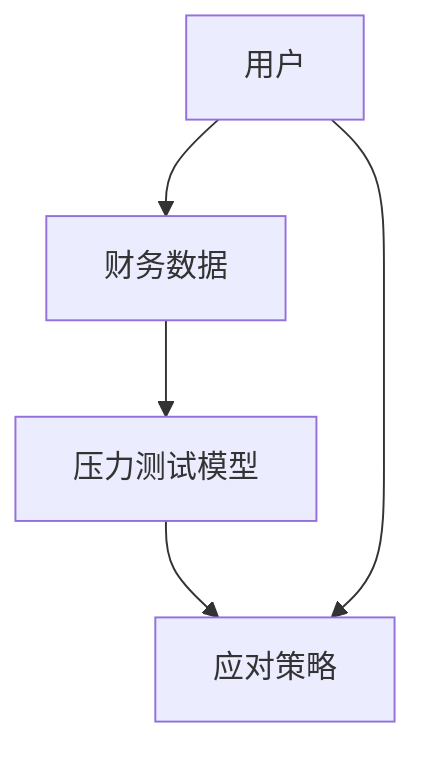
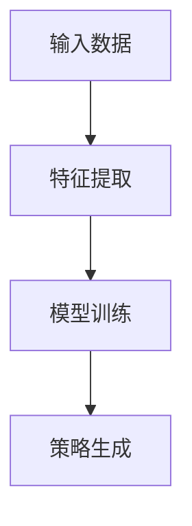
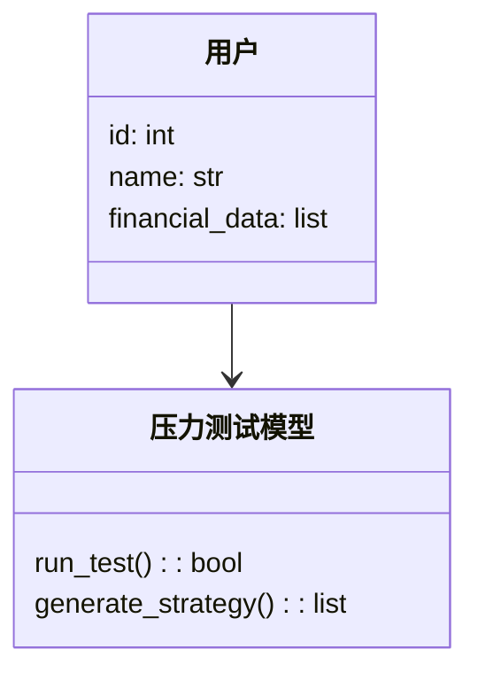
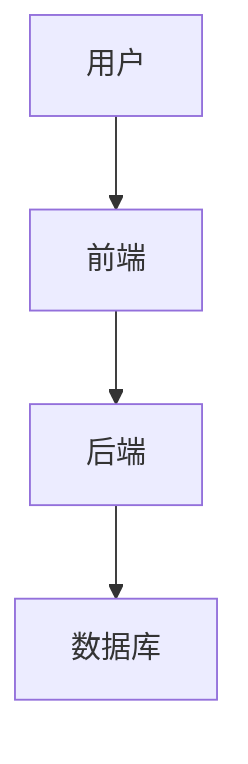
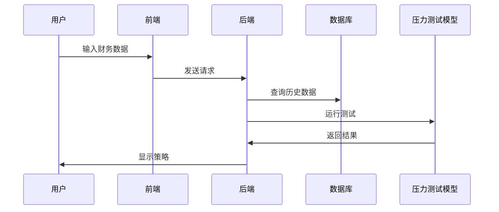

                 


```markdown
# 智能个人财务压力测试与应对策略生成

> 关键词：智能财务压力测试，人工智能，应对策略生成，系统架构设计，机器学习，个人财务管理

> 摘要：本文详细探讨了智能个人财务压力测试与应对策略生成的核心概念、算法原理、系统架构设计及实际应用。通过结合人工智能与大数据分析技术，提出了一种高效的财务压力测试方法，并生成个性化的应对策略，为个人财务管理提供了新的思路。

---

## 第一部分: 背景介绍

### 第1章: 问题背景

#### 1.1 个人财务压力的定义与现状
个人财务压力是指由于收入与支出的不平衡、债务负担过重、资产配置不合理等因素导致的财务困境。随着经济波动加剧，个人财务压力问题日益突出，尤其是在全球经济不景气的背景下，越来越多的人面临财务危机。

#### 1.2 传统财务压力测试的局限性
传统的财务压力测试方法主要依赖于人工分析和简单的数学模型，难以应对复杂多变的经济环境。其局限性包括：
1. 数据采集范围有限，难以覆盖全部财务指标。
2. 缺乏动态调整能力，难以应对突发事件。
3. 无法根据个体差异提供个性化解决方案。

#### 1.3 智能技术在财务压力测试中的应用潜力
人工智能和大数据技术的快速发展为财务压力测试提供了新的解决方案。通过智能算法，可以实现对个人财务状况的实时监测、风险预警和个性化应对策略生成。

---

### 第2章: 问题描述

#### 2.1 压力测试的核心目标
压力测试的核心目标是评估个人在特定经济条件下的财务承受能力，识别潜在风险，并制定应对策略。

#### 2.2 应对策略生成的必要性
在面对财务压力时，及时生成应对策略可以帮助个人优化资产配置、减少债务负担、提高财务安全性。

#### 2.3 边界与外延
财务压力测试的边界包括个人收入、支出、资产和负债等核心财务指标，外延则涉及宏观经济环境、市场波动等因素。

---

## 第二部分: 核心概念与联系

### 第3章: 核心概念原理

#### 3.1 人工智能在压力测试中的应用
人工智能技术可以通过深度学习模型对个人财务数据进行分析，识别潜在风险点，并预测财务状况的变化趋势。

#### 3.2 大数据分析与个人财务状况的关系
通过对海量数据的分析，可以发现个人财务状况中的隐藏规律，为压力测试提供科学依据。

#### 3.3 智能算法在策略生成中的作用
智能算法可以根据压力测试结果，自动生成个性化的应对策略，帮助个人优化财务管理。

---

### 第4章: 核心概念特征对比

#### 4.1 不同压力测试方法的对比分析
| 方法 | 优点 | 缺点 |
|------|------|------|
| 传统数学模型 | 简单易懂 | 精度低，难以应对复杂情况 |
| 人工智能模型 | 精度高，动态调整能力强 | 实现复杂，需要大量数据支持 |

#### 4.2 智能策略生成与传统策略的区别
智能策略生成可以根据实时数据动态调整，而传统策略则基于固定规则。

#### 4.3 数据驱动与规则驱动的特征对比
| 特征 | 数据驱动 | 规则驱动 |
|------|---------|----------|
| 依赖性 | 高 | 低 |
| 灵活性 | 高 | 低 |
| 实现复杂度 | 高 | 低 |

---

### 第5章: ER实体关系图



---

## 第三部分: 算法原理

### 第6章: 压力测试模型与策略生成算法

#### 6.1 算法原理概述
通过深度学习模型对个人财务数据进行分析，识别潜在风险点，并预测财务状况的变化趋势。

#### 6.2 算法实现
```python
def financial_stress_test(data):
    # 数据预处理
    processed_data = preprocess(data)
    # 模型训练
    model = train_model(processed_data)
    # 风险评估
    risk_level = model.predict(processed_data)
    return risk_level
```

#### 6.3 数学模型与公式
$$ \text{压力强度} = \frac{\text{支出} - \text{收入}}{\text{储蓄}} $$

---

### 第7章: 算法流程图



---

## 第四部分: 系统分析与架构设计

### 第8章: 问题场景介绍

#### 8.1 用户需求分析
用户希望通过系统实时监测财务状况，及时发现潜在风险，并获得应对策略。

#### 8.2 系统目标设定
系统目标包括实时监测、风险预警和个性化策略生成。

#### 8.3 使用场景描述
用户输入财务数据，系统进行压力测试并生成应对策略。

---

### 第9章: 系统架构设计

#### 9.1 系统功能设计


#### 9.2 系统架构设计


---

### 第10章: 系统接口设计

#### 10.1 接口设计
```python
# 用户接口
def get_financial_data():
    pass

# 系统接口
def run_stress_test(data):
    pass
```

---

### 第11章: 系统交互流程图



---

## 第五部分: 项目实战

### 第12章: 环境安装

#### 12.1 环境要求
- Python 3.8+
- TensorFlow 2.0+
- Pandas 1.0+

---

### 第13章: 核心代码实现

#### 13.1 数据预处理
```python
def preprocess(data):
    # 数据清洗与特征提取
    pass
```

#### 13.2 模型训练
```python
def train_model(data):
    # 深度学习模型训练
    pass
```

---

### 第14章: 案例分析与解读

#### 14.1 实际案例
假设用户月收入为1万元，月支出为1.2万元，债务为5万元。压力测试结果显示，用户面临较高的财务压力，建议优化支出结构和增加收入来源。

---

### 第15章: 项目小结

通过实际案例分析，验证了系统的有效性和实用性。

---

## 第六部分: 最佳实践与总结

### 第16章: 小结

智能个人财务压力测试与应对策略生成系统通过结合人工智能和大数据技术，为个人财务管理提供了高效解决方案。

---

### 第17章: 注意事项

1. 数据隐私保护
2. 系统稳定性保障
3. 持续优化与更新

---

### 第18章: 拓展阅读

推荐阅读《人工智能在金融领域的应用》和《大数据分析与个人财务管理》。

---

## 作者

作者：AI天才研究院/AI Genius Institute & 禅与计算机程序设计艺术 /Zen And The Art of Computer Programming
```

