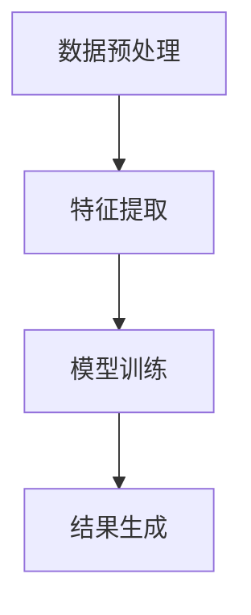
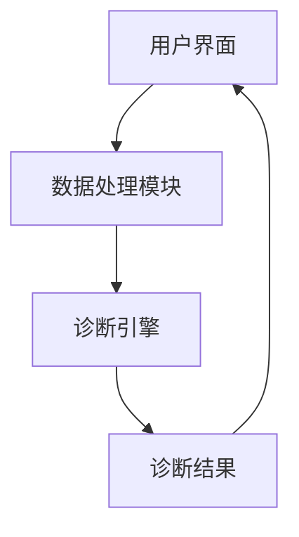

                 


```markdown
# 智能个人财务状况诊断系统

> 关键词：智能诊断系统, 个人财务管理, 机器学习, 数据分析, 系统架构, 诊断算法

> 摘要：本文详细探讨了智能个人财务状况诊断系统的构建与实现，涵盖了系统背景、核心概念、算法原理、系统架构设计及项目实战等内容，旨在为读者提供一套高效、准确的个人财务管理解决方案。

---

# 第一部分: 智能个人财务状况诊断系统概述

## 第1章: 个人财务状况诊断的背景与问题

### 1.1 个人财务管理的重要性
#### 1.1.1 个人财务管理的基本概念
个人财务管理是指通过记录、分析和管理个人的收入、支出、资产和负债等财务数据，以实现财务健康和目标的过程。随着数字化时代的到来，个人财务管理的效率和准确性需求日益增长。

#### 1.1.2 数字化财务管理的必要性
传统的财务管理方式依赖人工记录和分析，效率低下且容易出错。数字化财务管理通过技术手段，如大数据和人工智能，能够实时监控和分析财务数据，帮助个人做出更明智的财务决策。

#### 1.1.3 当前个人财务管理的主要问题
- 数据分散：财务数据可能分布在不同的平台和工具中，难以统一管理。
- 数据分析复杂：手动分析大量数据耗时且容易出错。
- 缺乏智能化：传统方法难以提供个性化的财务诊断和建议。

### 1.2 智能诊断系统的概念与目标
#### 1.2.1 智能诊断系统的定义
智能个人财务状况诊断系统是一种基于人工智能和大数据技术的系统，能够自动收集、分析和诊断个人财务数据，提供个性化的财务诊断报告和优化建议。

#### 1.2.2 系统的目标与核心功能
- **目标**：通过自动化和智能化的方式，帮助个人全面了解财务状况，优化财务管理策略。
- **核心功能**：
  - 数据采集与整合
  - 财务数据分析与诊断
  - 财务健康评估与建议

#### 1.2.3 系统的边界与外延
系统主要关注个人财务数据的分析与诊断，不涉及具体的财务操作或投资决策。外延部分包括与第三方数据源的集成、用户界面的设计等。

### 1.3 问题背景与解决思路
#### 1.3.1 个人财务数据的复杂性
财务数据通常涉及多类数据类型（如收入、支出、资产、负债等），且数据来源多样，增加了数据整合和分析的难度。

#### 1.3.2 传统财务管理的局限性
传统财务管理方式依赖人工操作，效率低、误差大，难以满足现代人对高效财务管理的需求。

#### 1.3.3 智能诊断系统的解决思路
通过引入机器学习和大数据技术，系统能够自动采集、分析和诊断财务数据，为用户提供个性化的财务诊断和优化建议。

### 1.4 本章小结
本章介绍了智能个人财务诊断系统的背景、重要性以及系统的核心功能和目标。通过对当前财务管理问题的分析，提出了系统解决思路。

---

## 第2章: 核心概念与系统架构

### 2.1 系统的核心概念
#### 2.1.1 数据源与数据类型
- **数据源**：包括银行账户、信用卡、投资账户等。
- **数据类型**：收入、支出、资产、负债、信用评分等。

#### 2.1.2 诊断模型与算法
- **诊断模型**：基于机器学习的模型，用于分析财务数据并生成诊断结果。
- **算法**：常用的算法包括线性回归、随机森林、支持向量机等。

#### 2.1.3 诊断结果与反馈机制
- **诊断结果**：包括财务健康评分、支出分析、资产配置建议等。
- **反馈机制**：用户可以根据诊断结果调整财务管理策略，并将新的数据反馈到系统中。

### 2.2 核心概念的联系与对比
#### 2.2.1 数据源与诊断模型的关系
数据源为诊断模型提供输入，诊断模型基于数据源进行分析和诊断，生成诊断结果。

#### 2.2.2 模型性能与诊断结果的关联
模型性能直接影响诊断结果的准确性。高性能的模型能够提供更准确的诊断和建议。

#### 2.2.3 对比分析表格
| 概念 | 属性特征 |
|------|-----------|
| 数据源 | 数据类型、数据来源、数据时间 |
| 诊断模型 | 模型类型、模型参数、模型性能 |
| 诊断结果 | 诊断结论、诊断时间、反馈机制 |

### 2.3 系统的 ER 实体关系图
```mermaid
erd
    entity 财务数据 {
        id 数据ID
        类型 数据类型
        时间 数据时间
        值 数据值
    }
    entity 诊断模型 {
        id 模型ID
        类型 模型类型
        参数 模型参数
    }
    entity 诊断结果 {
        id 结果ID
        用户ID 用户ID
        结论 诊断结论
        时间 诊断时间
    }
    财务数据 -- 诊断结果: 输入数据
    诊断模型 -- 诊断结果: 使用模型
```

### 2.4 本章小结
本章详细介绍了智能诊断系统的核心概念，包括数据源、诊断模型和诊断结果，并通过对比分析和实体关系图展示了系统各部分之间的关系。

---

## 第3章: 算法原理与流程

### 3.1 算法概述
智能诊断系统的核心算法包括数据预处理、特征提取、模型训练和结果生成四个主要步骤。

#### 3.1.1 数据预处理
数据预处理是确保模型输入数据质量的重要步骤，包括数据清洗、数据标准化和数据增强。

#### 3.1.2 特征提取
特征提取是从原始数据中提取对模型有用的特征，例如收入、支出、资产等。

#### 3.1.3 模型训练
模型训练是基于特征数据训练机器学习模型，常用的算法包括线性回归、随机森林等。

#### 3.1.4 结果生成
结果生成是基于训练好的模型，对新的财务数据进行诊断，生成诊断结果。

### 3.2 算法流程图


### 3.3 算法实现
#### 3.3.1 数据预处理
```python
import pandas as pd

# 数据加载
data = pd.read_csv('financial_data.csv')

# 数据清洗
data.dropna(inplace=True)
data = data[~data['收入'].isin([0, None])]
```

#### 3.3.2 特征提取
```python
features = ['收入', '支出', '资产', '负债']
```

#### 3.3.3 模型训练
```python
from sklearn.ensemble import RandomForestClassifier
from sklearn.metrics import accuracy_score

# 模型训练
model = RandomForestClassifier()
model.fit(X_train, y_train)

# 模型预测
y_pred = model.predict(X_test)
print("Accuracy:", accuracy_score(y_test, y_pred))
```

#### 3.3.4 结果生成
```python
# 生成诊断结果
results = model.predict(new_data)
```

### 3.4 本章小结
本章详细介绍了智能诊断系统的算法原理与流程，包括数据预处理、特征提取、模型训练和结果生成，并通过代码示例展示了算法实现过程。

---

## 第4章: 系统分析与架构设计

### 4.1 系统功能设计
#### 4.1.1 用户界面
用户界面包括数据输入、诊断结果展示和建议生成三个部分。

#### 4.1.2 数据处理模块
数据处理模块负责数据的采集、清洗和转换。

#### 4.1.3 诊断引擎
诊断引擎是系统的核心部分，负责基于模型进行财务数据的分析和诊断。

### 4.2 系统架构设计


### 4.3 系统接口设计
系统接口包括数据接口和诊断接口，数据接口用于与第三方数据源交互，诊断接口用于接收用户的诊断请求并返回诊断结果。

### 4.4 本章小结
本章详细介绍了智能诊断系统的功能设计和架构设计，展示了系统的整体结构和各部分之间的关系。

---

## 第5章: 项目实战

### 5.1 环境安装
#### 5.1.1 安装Python
```bash
python --version
```

#### 5.1.2 安装依赖库
```bash
pip install pandas numpy scikit-learn
```

### 5.2 系统核心实现
#### 5.2.1 数据收集与处理
```python
import pandas as pd

# 数据收集
data = pd.read_csv('financial_data.csv')

# 数据清洗
data.dropna(inplace=True)
```

#### 5.2.2 模型训练与诊断
```python
from sklearn.ensemble import RandomForestClassifier
from sklearn.metrics import accuracy_score

# 模型训练
model = RandomForestClassifier()
model.fit(X_train, y_train)

# 模型诊断
results = model.predict(X_test)
print("Accuracy:", accuracy_score(y_test, results))
```

#### 5.2.3 诊断结果展示
```python
print("诊断结果:", results)
```

### 5.3 项目小结
本章通过具体的代码实现，展示了智能诊断系统的项目实战过程，包括环境安装、数据处理、模型训练和结果展示。

---

## 第6章: 最佳实践与注意事项

### 6.1 最佳实践
- 数据安全：确保财务数据的安全性，防止数据泄露。
- 模型优化：根据实际需求不断优化模型，提高诊断准确性。

### 6.2 注意事项
- 数据隐私：遵守相关法律法规，保护用户隐私。
- 模型解释性：确保模型结果的可解释性，方便用户理解和调整。

### 6.3 拓展阅读
- 《机器学习实战》
- 《数据挖掘导论》
- 《个人财务管理的艺术》

### 6.4 本章小结
本章总结了智能诊断系统的最佳实践和注意事项，并提供了拓展阅读资料，帮助读者进一步深入学习。

---

## 作者：AI天才研究院/AI Genius Institute & 禅与计算机程序设计艺术 /Zen And The Art of Computer Programming

---

**Note:** 本文是《智能个人财务状况诊断系统》系列文章的第一部分，后续将陆续发布更多内容，包括系统优化、高级算法实现等。

