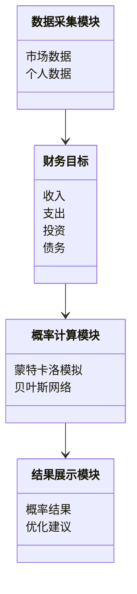
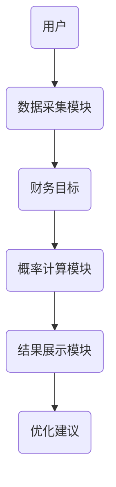
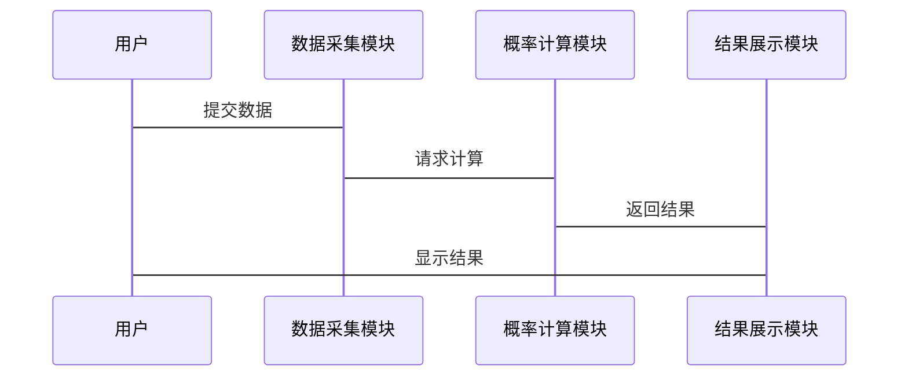

                 


# 智能个人财务目标实现概率计算器

> 关键词：智能财务目标、实现概率计算器、蒙特卡洛模拟、贝叶斯网络、财务规划

> 摘要：本文深入探讨了智能个人财务目标实现概率计算器的设计与实现。通过结合概率计算、人工智能和大数据分析，提出了一个基于蒙特卡洛模拟和贝叶斯网络的财务目标实现概率计算方法，并通过系统架构设计和实际案例分析，展示了该计算器的实际应用价值。

---

## 第一部分: 智能个人财务目标实现概率计算器的背景与概念

### 第1章: 财务目标实现概率计算的背景与问题描述

#### 1.1 个人财务规划的重要性
##### 1.1.1 个人财务规划的基本概念
个人财务规划是通过科学的分析和计划，帮助个人实现财务目标的过程。它包括收入、支出、储蓄、投资等多方面的管理。财务规划的目标通常包括应急储备、债务偿还、子女教育、退休计划等。

##### 1.1.2 财务目标与实现路径的关系
财务目标是财务规划的核心，而实现路径则是达成目标的具体步骤。例如，为了实现退休计划，可能需要通过长期投资来积累足够的资金。财务目标的实现概率直接影响个人的财务安全和生活质量。

##### 1.1.3 传统财务规划方法的局限性
传统的财务规划方法通常基于固定假设，如固定的投资回报率和稳定的经济环境。然而，实际情况往往复杂多变，传统方法难以准确预测和应对不确定性。此外，传统方法通常只提供确定性的结果，而忽略了概率因素。

#### 1.2 概率计算在财务规划中的作用
##### 1.2.1 概率计算的基本原理
概率计算是通过分析随机事件的可能性来预测结果的一种方法。在财务规划中，概率计算可以帮助个人了解不同财务决策的成功概率，从而做出更明智的选择。

##### 1.2.2 概率在财务目标实现中的应用
通过概率计算，可以评估不同财务策略的可行性。例如，评估在不同投资组合下实现财务目标的概率，或者在不同经济环境下债务偿还的可能性。

##### 1.2.3 智能计算器的必要性与优势
智能计算器通过结合人工智能和大数据分析，能够实时更新概率模型，提供更精准的财务目标实现概率预测。与传统方法相比，智能计算器的优势在于其动态性和准确性。

#### 1.3 问题背景与目标设定
##### 1.3.1 财务目标实现的概率问题
财务目标的实现受到多种不确定因素的影响，如市场波动、通货膨胀、个人收入变化等。因此，需要一种能够量化这些不确定性影响的方法。

##### 1.3.2 智能计算器的核心目标
智能计算器的核心目标是通过概率计算，帮助个人评估财务目标实现的可能性，并提供优化建议。它能够实时更新概率模型，适应变化的经济环境和个人财务状况。

##### 1.3.3 边界与外延分析
智能计算器的边界在于其数据来源和模型假设。外延则包括对宏观经济环境、个人行为等因素的分析。需要明确模型的适用范围和限制条件。

#### 1.4 核心概念与联系
##### 1.4.1 智能财务目标实现概率的核心要素
智能财务目标实现概率的核心要素包括财务目标、实现路径、不确定性因素和概率模型。这些要素共同构成了概率计算的基础框架。

##### 1.4.2 AI与大数据在概率计算中的作用
人工智能和大数据技术为概率计算提供了强大的工具。通过机器学习算法，可以分析大量数据，提取有用的信息，优化概率模型。

##### 1.4.3 概率计算的数学模型与算法原理
概率计算的数学模型包括概率分布、条件概率等。算法原理则涉及蒙特卡洛模拟、贝叶斯网络等。

---

## 第二部分: 概率计算的核心概念与算法原理

### 第2章: 概率计算的数学模型与公式

#### 2.1 概率计算的基本原理
##### 2.1.1 概率的基本定义与性质
概率是衡量某一事件发生的可能性大小。概率的取值范围在0到1之间，0表示不可能发生，1表示必然发生。概率具有加法性和乘法性。

##### 2.1.2 概率分布的类型与特点
概率分布描述了随机变量所有可能取值及其对应的概率。常见的概率分布包括均匀分布、正态分布、泊松分布等。

##### 2.1.3 条件概率与贝叶斯定理
条件概率是指在已知某个事件发生的情况下，另一个事件发生的概率。贝叶斯定理通过条件概率描述了事件之间的关系。

#### 2.2 财务目标实现概率的数学模型
##### 2.2.1 财务目标实现的概率函数
财务目标实现的概率函数通常是一个复杂的多变量函数，涉及收入、支出、投资回报率等多种因素。

##### 2.2.2 概率模型的构建与优化
通过机器学习算法，可以构建和优化概率模型。例如，使用支持向量机（SVM）或随机森林（Random Forest）进行分类或回归分析。

##### 2.2.3 模型的适用性与局限性
概率模型的适用性取决于数据质量和模型假设。模型的局限性包括数据偏差、假设不合理等。

#### 2.3 概率计算的算法原理
##### 2.3.1 蒙特卡洛模拟算法
蒙特卡洛模拟是一种通过随机采样来估计概率的方法。其步骤如下：
1. 初始化参数
2. 进行随机采样
3. 计算概率
4. 输出结果
5. 结束

##### 2.3.2 贝叶斯网络算法
贝叶斯网络是一种基于概率的图模型，用于描述变量之间的关系。其核心是条件概率公式：
$$ P(A|B) = \frac{P(B|A)P(A)}{P(B)} $$

##### 2.3.3 支持向量机与决策树算法
支持向量机（SVM）和决策树（Decision Tree）是常用的机器学习算法，可以用于概率估计和分类。

---

## 第三部分: 系统分析与架构设计

### 第3章: 系统分析与架构设计方案

#### 3.1 问题场景介绍
财务目标实现概率计算器需要处理多种不确定性因素，包括市场波动、个人收入变化等。系统需要能够实时更新概率模型，并提供优化建议。

#### 3.2 项目介绍
本项目旨在开发一个智能个人财务目标实现概率计算器，帮助用户评估财务目标的实现可能性，并提供优化建议。

#### 3.3 系统功能设计
##### 3.3.1 领域模型设计
领域模型描述了系统的功能模块及其关系。类图如下：


#### 3.4 系统架构设计
##### 3.4.1 系统架构图


#### 3.5 系统接口设计
系统接口主要分为数据接口和用户接口。数据接口用于获取市场数据和用户数据，用户接口用于展示结果和优化建议。

#### 3.6 系统交互设计
##### 3.6.1 用户交互流程
1. 用户输入财务目标和相关数据
2. 系统采集市场数据
3. 概率计算模块进行计算
4. 结果展示模块显示概率结果和优化建议

##### 3.6.2 交互序列图


---

## 第四部分: 项目实战

### 第4章: 项目实战

#### 4.1 环境安装
##### 4.1.1 安装Python
需要安装Python 3.8及以上版本。
##### 4.1.2 安装相关库
安装numpy、pandas、scikit-learn等库。

#### 4.2 系统核心实现源代码
##### 4.2.1 数据预处理代码
```python
import numpy as np
import pandas as pd

# 读取数据
data = pd.read_csv('financial_data.csv')

# 数据清洗
data.dropna(inplace=True)
data = data[~data['income'].isnull()]
```

##### 4.2.2 概率计算代码
```python
from sklearn.svm import SVC
from sklearn.tree import DecisionTreeClassifier
from sklearn.model_selection import train_test_split

# 划分训练集和测试集
X = data.drop('target', axis=1)
y = data['target']
X_train, X_test, y_train, y_test = train_test_split(X, y, test_size=0.2)

# 训练模型
model = SVC()
model.fit(X_train, y_train)

# 预测概率
y_pred = model.predict(X_test)
```

#### 4.3 代码应用解读与分析
通过上述代码，可以实现对财务目标实现概率的预测。模型的性能可以通过准确率、召回率等指标进行评估。

#### 4.4 实际案例分析
以一个典型的财务目标为例，分析模型的预测结果，并提供优化建议。

#### 4.5 项目小结
本项目通过实际案例展示了智能财务目标实现概率计算器的应用价值。模型的准确性和鲁棒性是未来优化的重要方向。

---

## 第五部分: 总结与展望

### 第5章: 总结与展望

#### 5.1 本章总结
本文详细介绍了智能个人财务目标实现概率计算器的设计与实现。通过结合概率计算、人工智能和大数据分析，提出了一个高效的解决方案。

#### 5.2 最佳实践 tips
- 数据质量是模型性能的关键
- 定期更新模型参数
- 结合实际需求选择合适的算法

#### 5.3 注意事项
- 数据隐私保护
- 模型的可解释性
- 系统的实时性要求

#### 5.4 拓展阅读
推荐阅读相关领域的书籍和论文，如《Python机器学习实战》、《贝叶斯网络入门》等。

---

作者：AI天才研究院/AI Genius Institute & 禅与计算机程序设计艺术 /Zen And The Art of Computer Programming

