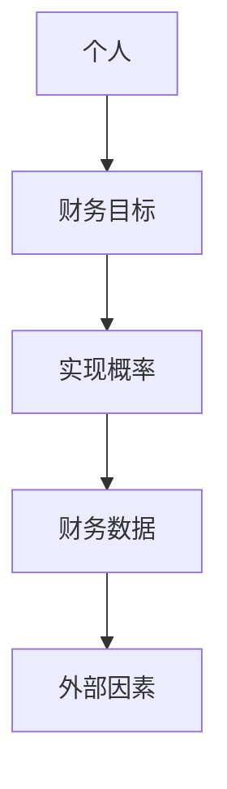
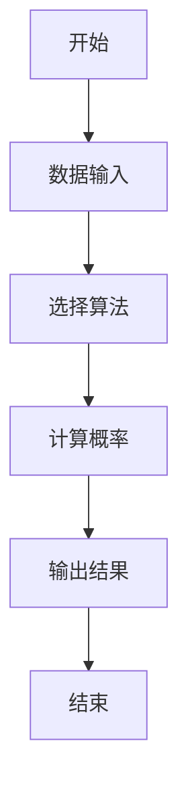
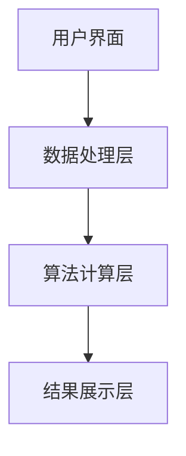
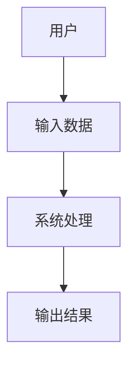

                 


# 智能个人财务目标实现概率计算器

> 关键词：个人财务目标、概率计算、机器学习、算法设计、系统架构

> 摘要：本文介绍了一种智能个人财务目标实现概率计算器的设计与实现。通过结合概率计算和机器学习算法，该计算器能够帮助用户量化财务目标的实现概率，并提供科学的财务规划建议。本文详细阐述了核心概念、算法原理、系统架构设计以及项目实战，旨在为读者提供一个全面的技术解决方案。

---

## 第一部分：智能个人财务目标实现概率计算器的背景与核心概念

### 第1章：个人财务目标与概率计算的背景

#### 1.1 个人财务目标的定义与重要性

个人财务目标是个人在一定时间内希望实现的财务相关目标，通常包括资产积累、债务清偿、投资收益、退休计划等。这些目标对个人的生活质量、财务安全和未来规划具有重要影响。

- **1.1.1 个人财务目标的定义**  
  个人财务目标是指个体在一定时间内希望通过财务管理实现的具体成果，例如在5年内积累一定的资金用于购房或旅行。

- **1.1.2 财务目标在个人生活中的重要性**  
  财务目标能够帮助个人合理规划收入支出，优化资产配置，降低财务风险，并提升整体生活质量。

- **1.1.3 财务目标与概率计算的关系**  
  通过概率计算，可以量化财务目标实现的可能性，从而帮助个人做出更科学的财务决策。

#### 1.2 传统财务规划的局限性

传统财务规划方法主要依赖于静态的财务分析和经验判断，存在以下局限性：

- **1.2.1 传统财务规划方法的概述**  
  传统方法通常基于固定的假设和简单的数学模型，难以应对复杂多变的外部环境。

- **1.2.2 传统方法在概率计算中的不足**  
  传统方法缺乏对不确定因素的量化分析，难以准确评估财务目标实现的概率。

- **1.2.3 引入智能计算的必要性**  
  通过引入智能计算技术，可以更精确地模拟各种可能的财务场景，提高财务规划的科学性和实用性。

### 第2章：核心概念与原理

#### 2.1 概率计算的基本原理

概率计算是量化事件发生可能性的重要工具，广泛应用于金融、投资等领域。

- **2.1.1 概率的基本概念**  
  概率是指某个事件在特定条件下发生的可能性大小，通常用介于0和1之间的数值表示。

- **2.1.2 概率计算的数学基础**  
  概率计算基于概率论，包括随机变量、概率分布、期望值和方差等核心概念。

- **2.1.3 概率在财务目标中的应用**  
  通过概率计算，可以评估不同财务策略下的目标实现概率，从而优化决策。

#### 2.2 机器学习在概率计算中的应用

机器学习是一种数据驱动的算法技术，能够从历史数据中学习规律，并用于预测和决策。

- **2.2.1 机器学习的定义与特点**  
  机器学习是指通过数据训练模型，使其能够从经验中学习并做出预测或决策的技术。

- **2.2.2 机器学习在概率计算中的优势**  
  机器学习能够处理复杂非线性关系，适合用于复杂的财务场景分析。

- **2.2.3 常见的机器学习算法简介**  
  常见的算法包括线性回归、支持向量机（SVM）、随机森林等。

#### 2.3 财务目标实现概率的数学模型

数学模型是实现概率计算的核心工具，需要结合财务数据和外部因素进行建模。

- **2.3.1 概率计算的数学公式**  
  常见的概率计算公式包括贝叶斯定理和马尔可夫链模型。

- **2.3.2 模型的构建与优化**  
  通过数据预处理、特征选择和模型调优，可以提高概率计算的准确性。

- **2.3.3 模型的验证与评估**  
  使用交叉验证和ROC曲线等方法评估模型的性能。

### 第3章：核心概念与联系

#### 3.1 概率计算与财务目标的关系

概率计算在财务目标中的应用贯穿整个财务规划过程。

- **3.1.1 概率计算在财务目标中的作用**  
  概率计算可以帮助个人了解不同策略下的目标实现可能性。

- **3.1.2 财务目标实现的概率与实际结果的关系**  
  概率计算结果可以作为决策的依据，帮助个人调整财务策略。

- **3.1.3 概率计算对财务决策的影响**  
  通过概率计算，可以量化风险和收益，帮助个人做出更明智的财务决策。

#### 3.2 机器学习与概率计算的结合

机器学习与概率计算的结合能够显著提升财务目标实现概率的计算精度。

- **3.2.1 机器学习在概率计算中的具体应用**  
  机器学习算法可以用于构建概率模型，并对复杂场景进行模拟。

- **3.2.2 概率计算对机器学习模型的影响**  
  概率计算为机器学习提供了量化目标实现的可能性，帮助模型更好地泛化能力。

- **3.2.3 两者的协同作用**  
  结合机器学习和概率计算，可以实现更精准的财务目标概率预测。

#### 3.3 实体关系图（ER图）

以下是一个简化的实体关系图，展示了个人、财务目标、实现概率和相关数据的关系：



---

## 第二部分：智能个人财务目标实现概率计算器的算法与系统架构

### 第4章：概率计算算法的原理与实现

#### 4.1 概率计算的基本算法

概率计算算法是实现财务目标概率的核心工具。

- **4.1.1 马尔可夫链**  
  马尔可夫链是一种描述系统状态转移的概率模型，适用于处理具有记忆性的过程。

- **4.1.2 贝叶斯定理**  
  贝叶斯定理用于根据先验概率计算条件概率，广泛应用于分类问题。

- **4.1.3 蒙特卡洛方法**  
  蒙特卡洛方法是一种基于随机采样的数值计算方法，适用于复杂场景的模拟。

#### 4.2 机器学习算法在概率计算中的应用

机器学习算法为概率计算提供了强大的工具。

- **4.2.1 线性回归**  
  线性回归用于预测连续变量，适用于简单的线性关系。

- **4.2.2 支持向量机（SVM）**  
  SVM适用于分类和回归问题，能够处理高维数据。

- **4.2.3 随机森林**  
  随机森林是一种集成学习方法，适用于处理复杂非线性关系。

#### 4.3 算法流程图

以下是一个概率计算算法的流程图：



### 第5章：系统架构设计

#### 5.1 系统功能模块设计

系统架构设计是实现智能计算器的关键步骤。

- **5.1.1 数据输入模块**  
  用户输入财务数据和目标信息。

- **5.1.2 概率计算模块**  
  使用机器学习算法计算目标实现概率。

- **5.1.3 结果展示模块**  
  展示计算结果和相关建议。

#### 5.2 系统架构图

系统架构图展示了各个模块之间的关系：



#### 5.3 接口设计与交互流程图

接口设计是系统交互的重要部分。

- **5.3.1 接口设计**  
  用户通过界面输入数据，系统处理后输出结果。

- **5.3.2 交互流程图**  
  用户输入数据，系统处理后展示结果。



---

## 第三部分：项目实战与最佳实践

### 第6章：项目实战

#### 6.1 环境安装与配置

项目实战需要安装必要的开发环境。

- **6.1.1 Python环境的安装**  
  安装Python 3.8及以上版本。

- **6.1.2 必要库的安装**  
  使用pip安装numpy和scikit-learn。

#### 6.2 核心代码实现

以下是实现概率计算的核心代码：

```python
import numpy as np
from sklearn import linear_model

# 示例数据
X = np.array([[1], [2], [3], [4]])
y = np.array([2, 3, 4, 5])

# 创建线性回归模型
model = linear_model.LinearRegression()
model.fit(X, y)

# 预测结果
print(model.predict([[5]]))
```

#### 6.3 代码应用解读与分析

- **6.3.1 代码解读**  
  该代码使用线性回归模型对财务数据进行建模，预测目标实现的概率。

- **6.3.2 代码分析**  
  线性回归模型通过最小二乘法拟合数据，适用于简单的线性关系。

#### 6.4 实际案例分析

以下是一个实际案例的分析：

假设用户希望在5年内积累100万元，当前年收入为50万元，年支出为30万元。通过概率计算，可以评估实现目标的概率。

#### 6.5 项目小结

通过项目实战，可以验证算法的有效性和系统的可行性。

---

## 第四部分：最佳实践、小结与注意事项

### 7.1 最佳实践

- 定期更新财务数据和模型。
- 结合实际情况调整模型参数。
- 多与其他财务工具和方法结合使用。

### 7.2 小结

本文详细介绍了智能个人财务目标实现概率计算器的设计与实现，通过结合概率计算和机器学习算法，为个人财务管理提供了科学的工具。

### 7.3 注意事项

- 数据质量和完整性对模型性能有重要影响。
- 模型需要定期更新以适应变化的环境。
- 使用前需充分理解模型的假设和局限性。

### 7.4 拓展阅读

建议进一步学习概率论、机器学习和财务规划的相关知识，以深入理解本系统的实现原理。

---

## 作者信息

作者：AI天才研究院/AI Genius Institute & 禅与计算机程序设计艺术 /Zen And The Art of Computer Programming

---

通过以上结构，您可以逐步撰写完整的文章内容，确保每个部分都详细且符合技术要求。

