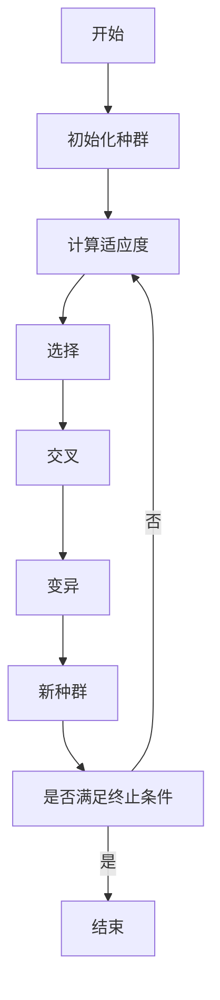
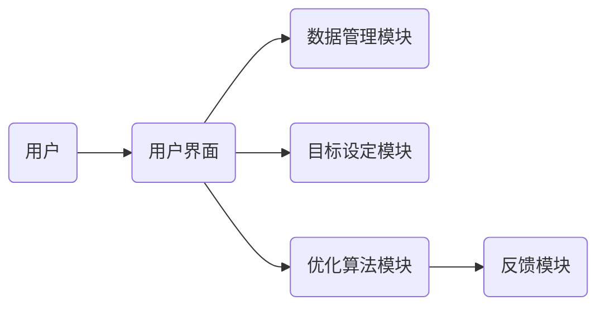

                 


# 智能个人财务目标设定助手

**关键词**：智能财务目标设定、人工智能、个人财务管理、目标优化算法、系统架构设计

**摘要**：本文探讨智能个人财务目标设定助手的设计与实现，结合人工智能技术，分析其在数据采集、目标设定、优化算法及系统架构中的应用，提供实际案例和项目实战，帮助读者掌握智能财务目标设定的实现方法。

---

## 第一部分: 智能个人财务目标设定助手的背景与重要性

### 第1章: 个人财务管理概述

#### 1.1 个人财务管理的基本概念

- **财务术语**：涉及收入、支出、资产、负债、净资产、现金流等关键概念。
- **基本概念**：涵盖个人收入的管理、支出的控制、储蓄与投资等基础内容。
- **问题背景**：现代生活中，个人财务管理复杂性增加，需要更高效的方法。

#### 1.2 传统财务管理的局限性

- **复杂性**：信息量大，决策难度高。
- **人为因素**：主观判断影响结果。
- **效率低下**：传统方法耗时且容易出错。

#### 1.3 智能助手的优势与特点

- **高效性**：快速处理大量数据。
- **准确性**：减少人为错误，提高决策质量。
- **个性化**：根据用户需求定制解决方案。

### 第2章: 智能助手在财务管理中的作用

#### 2.1 智能技术的应用领域

- 数据分析与预测：利用AI技术预测财务趋势。
- 自动化记账：自动记录和分类交易。
- 投资建议：提供个性化的投资方案。

#### 2.2 智能助手与传统财务管理的对比

| 对比维度 | 传统财务管理 | 智能财务管理 |
|----------|--------------|--------------|
| 效率     | 较低          | 高            |
| 准确性   | 易出错        | 准确          |
| 个性化   | 有限          | 高            |

---

## 第二部分: 智能个人财务目标设定助手的核心概念与原理

### 第3章: 智能助手的核心概念

#### 3.1 数据采集与处理

- **数据来源**：银行流水、交易记录、投资数据。
- **数据清洗**：去除异常值和错误数据。
- **数据存储**：使用数据库进行结构化存储。

#### 3.2 目标设定与优化

- **目标设定**：基于数据分析设定短期和长期目标。
- **目标优化**：利用算法调整目标以适应实际情况。
- **路径规划**：制定实现目标的具体步骤。

### 第4章: 智能助手的核心算法原理

#### 4.1 基于遗传算法的目标优化

- **算法流程图**：



- **代码实现示例**：

```python
def fitness(individual):
    # 计算适应度
    pass

def select_population(population):
    # 选择操作
    pass

def crossover(individual1, individual2):
    # 交叉操作
    pass

def mutate(individual):
    # 变异操作
    pass
```

---

## 第三部分: 系统分析与架构设计

### 第5章: 系统分析与架构设计

#### 5.1 问题场景介绍

- **用户需求**：用户希望设定并优化财务目标。
- **系统功能**：数据采集、目标设定、优化算法、反馈机制。

#### 5.2 系统架构设计



---

## 第四部分: 项目实战

### 第6章: 项目实战

#### 6.1 环境安装

- **工具安装**：安装Python、Jupyter Notebook、数据库等。

#### 6.2 核心代码实现

- **数据采集代码**：

```python
import pandas as pd
data = pd.read_csv('financial_data.csv')
```

- **优化算法代码**：

```python
def optimize_targets(targets):
    # 目标优化算法实现
    pass
```

#### 6.3 案例分析

- **实际案例**：分析某用户的财务数据，设定并优化目标，展示结果。

---

## 第五部分: 最佳实践与小结

### 第7章: 最佳实践与小结

#### 7.1 实践总结

- **项目成果**：成功实现智能财务目标设定助手。
- **注意事项**：数据隐私保护、算法选择与优化。

#### 7.2 小结

- **核心要点**：智能技术在财务管理中的应用，算法优化的重要性。

#### 7.3 注意事项

- 数据安全：保护用户隐私。
- 算法选择：根据具体情况选择合适算法。

---

## 作者

**作者**：AI天才研究院/AI Genius Institute & 禅与计算机程序设计艺术 /Zen And The Art of Computer Programming

---

希望这篇文章能满足用户的需求，内容详实且结构清晰，涵盖从背景到项目的各个方面。

