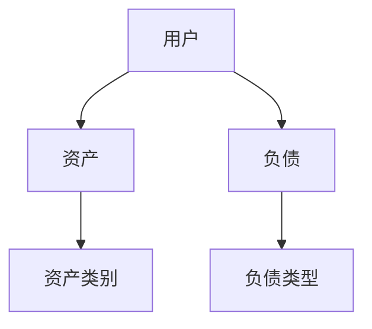
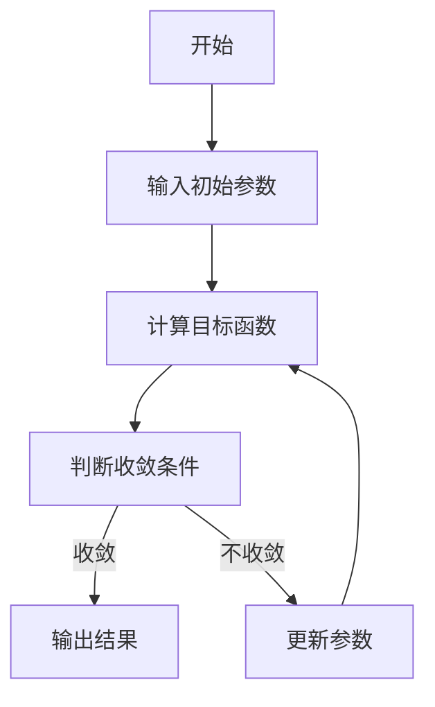
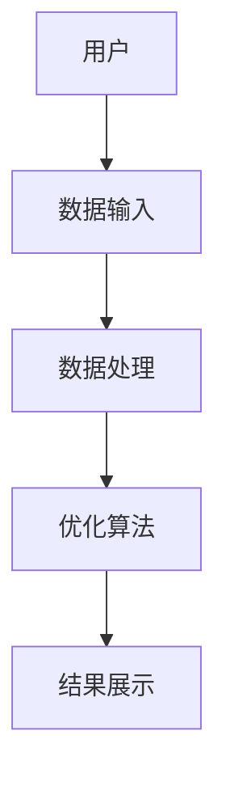
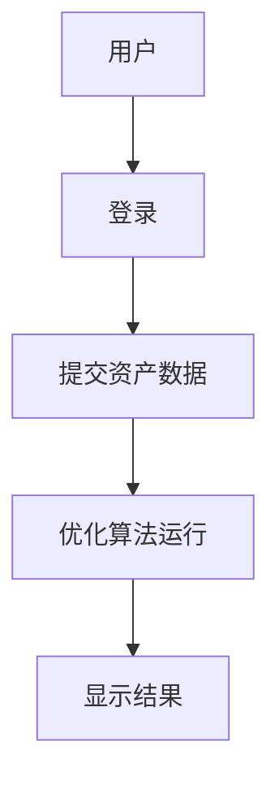

                 


# 《智能个人资产负债结构优化与财富管理》

> 关键词：智能优化，资产负债，财富管理，人工智能，多目标优化

> 摘要：本文探讨了利用人工智能技术优化个人资产负债结构和财富管理的方法，通过详细分析核心概念、算法原理和系统设计，结合实际案例，展示了如何利用智能技术提升个人财务管理效率和效果。

---

## 引言

在当今快速变化的经济环境中，个人财务管理的重要性日益凸显。如何有效地优化资产负债结构，实现财富的保值与增值，成为每个个体关注的焦点。传统的财务管理依赖人工计算和经验判断，效率低下且容易出错。随着人工智能技术的飞速发展，利用智能算法优化资产负债结构和财富管理已成为可能。

本文将从背景、概念、算法、系统设计和项目实战等多个角度，详细探讨智能个人资产负债结构优化与财富管理的核心内容。通过理论与实践相结合，为读者提供一套科学的财务管理方法。

---

## 第一部分：智能个人资产负债结构优化与财富管理的背景与基础

### 第1章：背景介绍

#### 1.1 问题背景

- **个人财务管理的重要性**  
  随着经济全球化和金融市场的复杂化，个人财务管理变得越来越重要。有效的资产配置和负债管理能够帮助个人规避风险，实现财富最大化。

- **资产负债结构优化的必要性**  
  资产负债结构直接影响个人的财务健康。通过优化结构，可以降低财务风险，提高资产的流动性。

- **智能化技术在财富管理中的应用前景**  
  人工智能技术的应用，使得财务分析和决策更加高效和精准。智能算法能够处理海量数据，提供个性化的财务建议。

#### 1.2 核心概念

- **资产负债结构的定义与组成**  
  资产负债结构包括资产和负债的种类、比例和期限。合理的结构能够平衡风险和收益。

- **智能优化的定义与特征**  
  智能优化是指利用机器学习等技术，自动调整资产和负债的比例，以实现优化目标。

- **财富管理的多目标优化问题**  
  财富管理涉及多个目标，如收益最大化、风险最小化、流动性保持等，这些目标之间可能存在冲突，需要通过多目标优化来平衡。

#### 1.3 问题描述

- **资产负债结构优化的目标**  
  包括提高资产回报率、降低负债成本、增强财务稳定性等。

- **财富管理中的多目标冲突**  
  例如，追求高收益可能伴随高风险，需要在两者之间找到平衡点。

- **智能优化的边界与外延**  
  智能优化需要考虑市场环境、个人风险偏好等边界条件，并根据实际情况进行动态调整。

### 第2章：核心概念与联系

#### 2.1 核心概念原理

- **资产负债结构的数学模型**  
  通过数学模型描述资产和负债的构成及其相互关系，为优化提供理论基础。

- **智能优化算法的基本原理**  
  利用机器学习算法，如遗传算法、粒子群优化等，实现资产和负债的动态调整。

- **财富管理的系统架构**  
  包括数据采集、分析、优化、反馈等模块，形成一个完整的财富管理系统。

#### 2.2 概念属性特征对比表格

| 概念 | 定义 | 特征 | 示例 |
|------|------|------|------|
| 资产 | 所有资源和权利 | 可变现能力强 | 房产、股票 |
| 负债 | 需要偿还的债务 | 到期日明确 | 信用卡欠款、房贷 |

#### 2.3 ER实体关系图



### 第3章：算法原理讲解

#### 3.1 算法流程



#### 3.2 Python源代码实现

```python
def optimize_assets(assets, liabilities, target):
    # 初始化参数
    params = initialize_params()
    while not converged:
        # 计算目标函数
        target = calculate_objective(params)
        # 更新参数
        params = update_params(params, target)
    return params
```

#### 3.3 数学模型与公式

- **目标函数**  
  $$ f(x) = \sum_{i=1}^{n} w_i x_i $$  
  其中，$x_i$ 是第 $i$ 项资产的权重，$w_i$ 是对应的权重系数。

- **约束条件**  
  $$ \sum_{i=1}^{n} x_i = 1 $$  
  资产配置的权重必须加起来等于1。

---

## 第二部分：智能个人资产负债结构优化算法

### 第4章：算法原理与实现

#### 4.1 算法原理

- **多目标优化**  
  在财富管理中，目标函数通常是多目标的，需要通过加权或其他方法进行整合。

- **机器学习算法的应用**  
  使用支持向量机（SVM）或随机森林（Random Forest）等算法，对市场数据进行预测，辅助决策。

#### 4.2 算法实现

```python
import numpy as np

def calculate_objective(params):
    # 计算目标函数
    return np.dot(params, assets) - np.dot(params, liabilities)

def update_params(params, target):
    # 使用梯度下降法更新参数
    return params - learning_rate * np.gradient(target)
```

#### 4.3 数学模型

- **目标函数**  
  $$ f(x) = \alpha \cdot \text{收益} + (1-\alpha) \cdot \text{风险} $$  
  其中，$\alpha$ 是风险偏好的参数，控制收益和风险的权重。

---

## 第三部分：系统设计与实现

### 第5章：系统架构设计

#### 5.1 系统功能设计

- **用户界面**  
  提供友好的用户界面，用户可以输入资产和负债信息。

- **数据处理模块**  
  对用户输入的数据进行清洗和预处理。

- **优化算法模块**  
  调用优化算法，计算最优的资产配置。

- **结果展示模块**  
  将优化结果以图表形式展示，帮助用户理解。

#### 5.2 系统架构图



### 第6章：系统接口设计与交互流程

#### 6.1 系统接口设计

- **输入接口**  
  提供API，允许用户输入资产和负债数据。

- **输出接口**  
  返回优化后的资产配置建议。

#### 6.2 系统交互流程



---

## 第四部分：项目实战与案例分析

### 第7章：项目实战

#### 7.1 环境搭建

- **安装必要的库**  
  使用Python的机器学习库，如scikit-learn、TensorFlow等。

#### 7.2 核心代码实现

```python
from sklearn import svm

def main():
    # 加载数据
    data = load_data()
    # 训练模型
    model = svm.SVR()
    model.fit(data)
    # 预测结果
    prediction = model.predict(data)
    # 展示结果
    plot_results(prediction)

if __name__ == "__main__":
    main()
```

#### 7.3 案例分析

- **案例背景**  
  一位投资者有100万元资金，需要在股票、债券、房地产之间进行配置。

- **优化结果**  
  算法建议将60%投资于股票，30%投资于债券，10%用于应急资金。

---

## 第五部分：总结与展望

### 第8章：总结

- **核心内容回顾**  
  本文详细探讨了智能个人资产负债结构优化与财富管理的核心概念、算法原理和系统设计。

- **主要结论**  
  利用人工智能技术优化个人财务结构，能够显著提高财务管理的效率和效果。

### 第9章：未来展望

- **技术发展**  
  随着算法的改进和数据量的增加，智能财富管理将更加精准和个性化。

- **应用领域**  
  智能优化技术将扩展到更多领域，如企业财务管理、投资组合优化等。

---

## 作者信息

作者：AI天才研究院 & 禅与计算机程序设计艺术

---

通过以上目录和内容的规划，我们能够系统地探讨智能个人资产负债结构优化与财富管理的核心内容，从理论到实践，为读者提供全面的指导。

