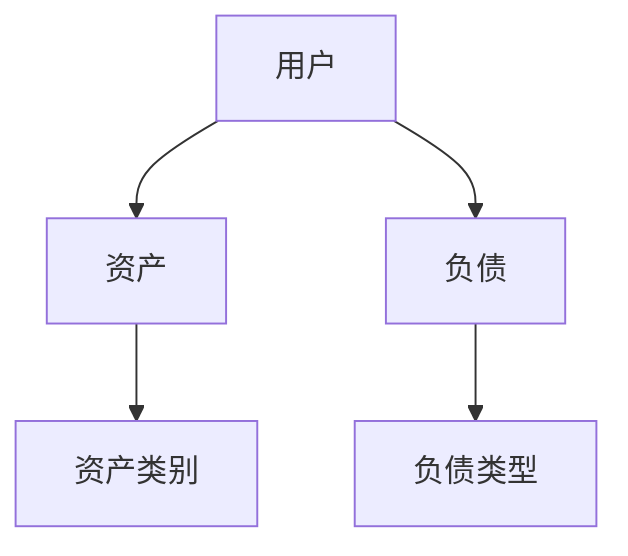
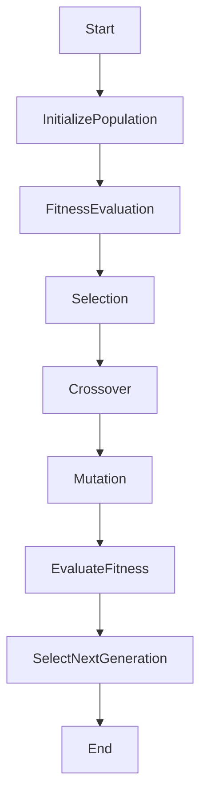
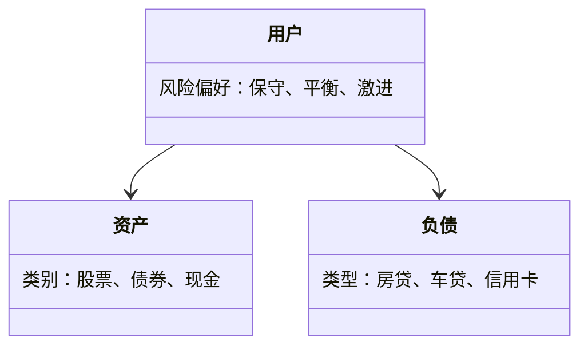
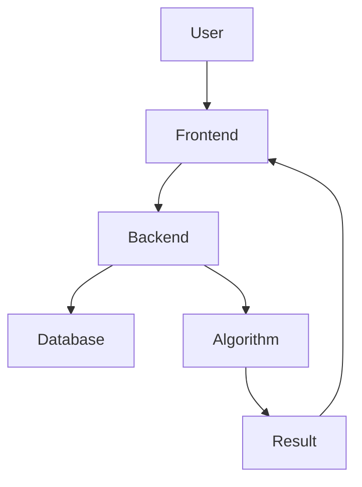
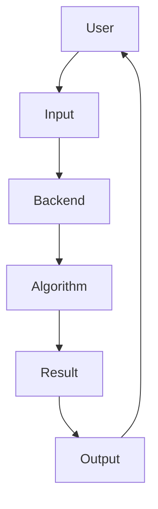

                 


# 智能个人资产负债结构优化系统

## 关键词：智能、资产负债、结构优化、算法、系统架构

## 摘要：  
《智能个人资产负债结构优化系统》旨在探讨如何通过智能化技术优化个人资产负债结构。本文从背景介绍、核心概念、算法原理、系统架构到项目实战，系统性地阐述了该系统的构建与实现。通过对比传统方法的局限性，本文提出了一种基于智能算法的优化方案，并结合实际案例进行分析，为读者提供一套高效、可扩展的解决方案。

---

# 第1章: 智能个人资产负债结构优化系统背景介绍

## 1.1 问题背景

### 1.1.1 个人资产负债管理的重要性  
个人资产负债管理是实现财务健康的关键，涉及资产配置、债务管理和风险控制。良好的资产负债结构能够帮助个人在不同经济环境下保持财务稳定，实现财富增值。

### 1.1.2 传统资产负债管理的局限性  
传统资产负债管理依赖人工判断，存在以下问题：  
1. **信息不全**：难以全面考虑市场波动、利率变化等动态因素。  
2. **效率低下**：人工计算复杂，难以快速响应市场变化。  
3. **主观性高**：依赖个人经验，缺乏客观性和系统性。  

### 1.1.3 智能化资产负债管理的必要性  
随着人工智能和大数据技术的发展，智能化资产负债管理成为趋势。通过智能算法优化资产配置，能够在复杂多变的经济环境中实现更优的财务表现。

## 1.2 问题描述

### 1.2.1 资产负债结构优化的核心问题  
如何在满足风险偏好和收益目标的前提下，优化资产和负债的比例，实现财务目标。

### 1.2.2 智能化优化的关键特征  
1. **数据驱动**：基于实时数据进行动态调整。  
2. **智能算法**：利用机器学习和优化算法实现自动化优化。  
3. **个性化**：根据个人财务状况和目标提供定制化方案。  

### 1.2.3 系统边界与外延  
系统边界包括：  
- 输入：个人资产、负债数据，市场数据（如利率、收益率）。  
- 输出：优化后的资产负债结构。  
- 外延：涉及投资组合优化、风险管理等领域。  

## 1.3 核心概念与联系

### 1.3.1 核心概念原理  
智能资产负债优化系统通过数据采集、建模、算法优化和结果反馈，实现资产负债结构的动态调整。

### 1.3.2 核心概念属性特征对比表  
| 属性       | 资产负债结构优化 |
|------------|----------------|
| **目标**   | 最大化收益、最小化风险 |
| **变量**   | 资产配置比例、负债规模 |
| **约束**   | 风险承受能力、资金流动性 |

### 1.3.3 ER实体关系图架构  


## 1.4 本章小结  
本章从背景和问题出发，阐述了智能化资产负债管理的必要性，并明确了系统的核心概念和架构。

---

# 第2章: 智能个人资产负债结构优化系统的核心概念与联系

## 2.1 核心概念原理

### 2.1.1 智能化优化的基本原理  
系统通过数据采集、建模、算法优化和结果反馈，实现资产负债结构的动态调整。

### 2.1.2 多目标优化的实现方法  
多目标优化问题可以通过权重分配或 Pareto 最优解方法解决。

### 2.1.3 系统动态调整的机制  
系统根据市场变化和用户需求，实时调整资产和负债的比例。

## 2.2 核心概念属性特征对比表  
| 属性       | 特征描述 |
|------------|----------|
| 资产类别   | 风险、收益、流动性 |
| 负债类型   | 成本、期限、偿债顺序 |

## 2.3 ER实体关系图架构  


## 2.4 本章小结  
本章详细阐述了系统的优化原理和核心概念，为后续实现奠定了基础。

---

# 第3章: 智能个人资产负债结构优化系统的算法原理

## 3.1 算法原理概述

### 3.1.1 优化算法的选择与比较  
- **遗传算法**：适用于复杂的组合优化问题。  
- **粒子群优化（PSO）**：适用于连续优化问题。  
- **模拟退火（SA）**：适用于全局最优求解。  

### 3.1.2 智能优化算法的核心思想  
以遗传算法为例：  
1. 初始化种群。  
2. 计算适应度。  
3. 选择、交叉和变异。  
4. 保留适应度高的个体。  

### 3.1.3 算法流程图  


## 3.2 算法实现与数学模型

### 3.2.1 算法实现代码  
```python
def fitness(asset_weights, liabilities_weights, market_data):
    # 计算收益和风险
    return -1 * (0.5 * (收益) - 0.5 * (风险))
```

### 3.2.2 数学模型  
目标函数：  
$$ \text{最大化收益：} \sum_{i=1}^n w_i r_i $$  
约束条件：  
$$ \sum_{i=1}^n w_i = 1 $$  
$$ \sum_{i=1}^n w_i^2 \leq \text{风险容忍度} $$  

## 3.3 本章小结  
本章详细讲解了优化算法的原理和实现，为系统实现提供了技术基础。

---

# 第4章: 智能个人资产负债结构优化系统的系统分析与架构设计方案

## 4.1 系统分析

### 4.1.1 问题场景介绍  
系统需要处理复杂的市场数据和用户需求，实时优化资产负债结构。

### 4.1.2 系统功能设计  
- 数据采集：资产、负债数据采集。  
- 数据分析：分析市场趋势、用户需求。  
- 算法优化：调用优化算法进行结构优化。  
- 结果展示：可视化优化结果。  

### 4.1.3 领域模型图  


## 4.2 系统架构设计

### 4.2.1 系统架构图  


### 4.2.2 接口设计  
- 输入接口：用户输入资产、负债数据。  
- 输出接口：优化结果展示。  

### 4.2.3 交互流程图  


## 4.3 本章小结  
本章详细描述了系统的架构和功能设计，为后续实现提供了指导。

---

# 第5章: 智能个人资产负债结构优化系统的项目实战

## 5.1 环境搭建与安装

### 5.1.1 Python环境安装  
- 安装Python 3.8+。  
- 安装Pandas、NumPy、Scikit-learn等库。  

### 5.1.2 数据采集  
从公开数据源获取市场数据和用户资产数据。

## 5.2 核心功能实现

### 5.2.1 数据预处理  
```python
import pandas as pd
data = pd.read_csv('market_data.csv')
data = data.dropna()
```

### 5.2.2 算法实现  
```python
from sklearn.model_selection import train_test_split
from sklearn.linear_model import LinearRegression
model = LinearRegression()
X_train, X_test, y_train, y_test = train_test_split(X, y, test_size=0.2)
model.fit(X_train, y_train)
```

### 5.2.3 结果展示  
```python
import matplotlib.pyplot as plt
plt.plot(model.predict(X_test), label='预测值')
plt.plot(y_test, label='真实值')
plt.legend()
plt.show()
```

## 5.3 实际案例分析  
以某用户为例，分析优化前后的资产负债结构变化，展示系统效果。

## 5.4 本章小结  
本章通过实战项目，详细讲解了系统的实现过程和优化效果。

---

# 第6章: 智能个人资产负债结构优化系统的最佳实践

## 6.1 小结  
智能资产负债优化系统通过数据驱动和智能算法，实现高效、个性化的资产配置。

## 6.2 注意事项  
- 数据质量对结果影响重大。  
- 算法选择需结合具体场景。  

## 6.3 拓展阅读  
推荐相关书籍和论文，帮助读者深入学习。

---

# 作者：AI天才研究院 & 禅与计算机程序设计艺术  
本文作者是AI天才研究院和“禅与计算机程序设计艺术”团队，致力于人工智能和计算机科学的研究与实践。

---

通过以上结构，文章系统性地介绍了智能个人资产负债结构优化系统的各个方面，从理论到实践，为读者提供了一套完整的解决方案。

