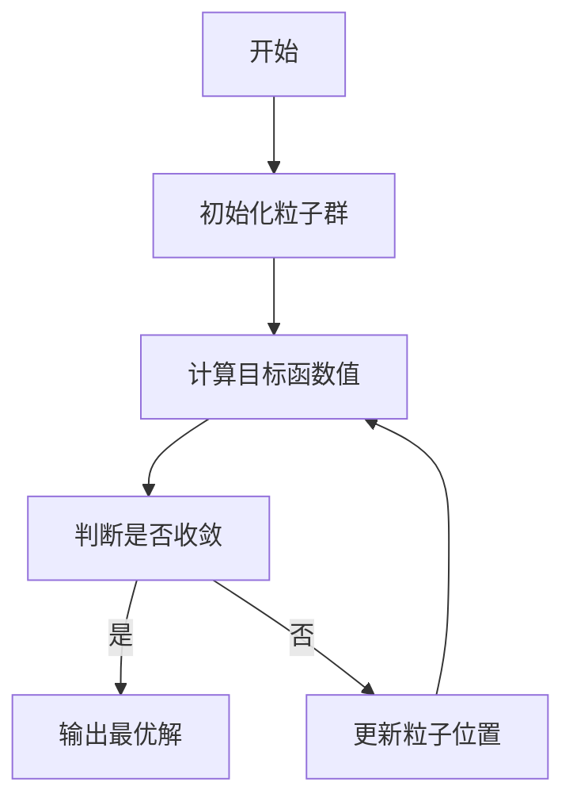
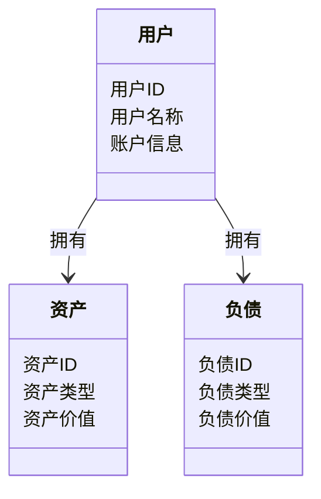
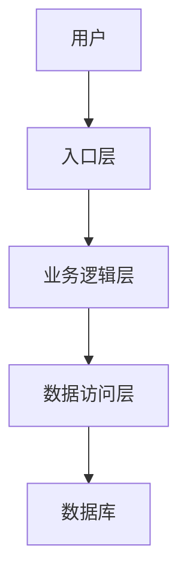
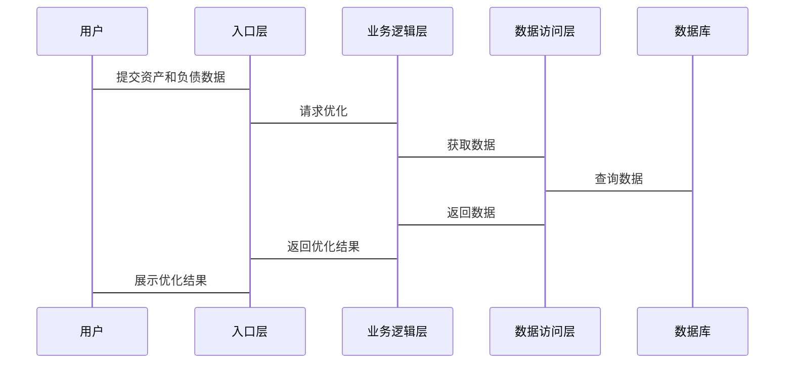

                 


# 智能个人资产负债表优化器

## 关键词：智能优化器，个人财务管理，数学建模，优化算法，系统设计

## 摘要：本文将详细介绍智能个人资产负债表优化器的设计与实现，从背景、核心概念、算法原理、系统架构到项目实战，全面剖析优化器的工作原理和实际应用。通过数学建模和优化算法，结合系统设计，提供一种高效的个人财务管理工具，帮助用户实现资产配置的最优解。

---

# 第一部分: 智能个人资产负债表优化器的背景与基础

## 第1章: 智能个人资产负债表优化器概述

### 1.1 智能个人资产负债表的定义与特点

#### 1.1.1 传统个人资产负债表的局限性
传统的个人资产负债表主要依赖人工记录和计算，存在以下问题：
- 数据采集效率低
- 计算复杂，容易出错
- 无法实时优化资产配置
- 缺乏智能化的决策支持

#### 1.1.2 智能优化器的核心概念
智能个人资产负债表优化器是一种基于人工智能和优化算法的工具，能够实时分析用户的资产和负债情况，并提供最优的资产配置建议。其核心概念包括：
- **数据采集与分析**：通过API或手动输入，获取用户的资产、负债和收入数据。
- **优化算法**：基于数学建模，使用优化算法（如遗传算法、粒子群优化等）求解最优解。
- **智能决策支持**：根据优化结果，提供资产配置建议和风险提示。

#### 1.1.3 优化器与传统方法的区别
| 对比维度 | 传统方法 | 智能优化器 |
|----------|----------|------------|
| 数据处理 | 手动记录，效率低 | 自动采集，实时更新 |
| 计算方式 | 单一维度计算 | 多目标优化，全局最优 |
| 决策支持 | 无智能化建议 | 提供实时优化建议和风险提示 |

### 1.2 个人资产负债表优化的背景与问题背景

#### 1.2.1 个人财务管理的重要性
随着经济的发展，个人财务管理变得越来越复杂。用户需要管理的资产种类越来越多，包括股票、基金、房地产等，传统的财务管理方法难以应对复杂的资产配置问题。

#### 1.2.2 传统资产负债表的不足
- 数据分散，难以整合
- 缺乏实时性，无法及时调整资产配置
- 无法进行多目标优化
- 缺乏风险评估和预警机制

#### 1.2.3 智能优化器的必要性与目标
智能优化器的引入旨在解决上述问题，其目标是通过智能化的算法，帮助用户实现资产配置的最优解，降低风险，提高收益。

### 1.3 智能个人资产负债表优化器的应用场景与意义

#### 1.3.1 个人财务优化的主要场景
- **资产配置优化**：根据用户的财务目标和风险承受能力，优化资产配置。
- **风险管理**：通过优化算法，识别潜在风险并提供预警。
- **财务规划**：帮助用户制定长期财务目标，如购房、退休计划等。

#### 1.3.2 智能优化器在财务管理中的意义
- 提高财务管理效率
- 实现多目标优化
- 提供智能化的决策支持
- 降低用户在复杂资产配置中的决策难度

#### 1.3.3 优化器的边界与外延
智能优化器的边界主要集中在个人财务管理领域，未来可以扩展到企业财务管理、投资组合优化等领域。

---

## 第2章: 智能个人资产负债表优化器的核心概念与联系

### 2.1 核心概念原理

#### 2.1.1 优化器的数学模型
优化器的核心是数学建模，目标函数和约束条件是模型的两大核心组成部分：
- **目标函数**：最大化或最小化的目标，例如资产收益最大化。
- **约束条件**：优化过程中的限制条件，例如资产分配比例不超过某个值。

#### 2.1.2 优化算法的基本原理
优化算法是优化器的核心，常见的优化算法包括：
- **遗传算法**：模拟自然选择过程，通过交叉和变异操作优化解。
- **粒子群优化**：通过模拟鸟群觅食行为，寻找最优解。
- **梯度下降**：通过计算梯度，逐步逼近最优解。

#### 2.1.3 智能优化器的实现逻辑
优化器的实现逻辑包括以下步骤：
1. 数据采集与预处理
2. 建立数学模型
3. 选择优化算法
4. 迭代优化
5. 输出优化结果

### 2.2 核心概念属性对比

| 对比维度 | 简单优化器 | 智能优化器 |
|----------|------------|------------|
| 数据处理 | 单维度分析 | 多维度优化 |
| 算法复杂度 | 单目标优化 | 多目标优化 |
| 决策支持 | 无预警机制 | 带有风险预警 |

### 2.3 ER实体关系图架构

```mermaid
erd
    资产表(资产ID, 资产类型, 资产价值, 负债ID, 负债类型, 负债价值)
    用户表(用户ID, 用户名称, 账户信息)
    交易记录表(交易ID, 交易时间, 交易金额, 交易类型)
    相关关系:
        资产表 --> 用户表: 一个用户拥有多个资产
        资产表 --> 交易记录表: 每个交易记录对应多个资产
```

---

## 第3章: 智能个人资产负债表优化器的算法原理与数学模型

### 3.1 算法原理

#### 3.1.1 优化目标函数的定义
目标函数是优化的核心，例如：
$$ \text{maximize } f(x) = \sum_{i=1}^{n} w_i \cdot x_i $$
其中，\( w_i \) 是资产 \( i \) 的权重，\( x_i \) 是资产 \( i \) 的配置比例。

#### 3.1.2 约束条件的建模
约束条件包括：
1. 资产配置比例之和为1：
$$ \sum_{i=1}^{n} x_i = 1 $$
2. 资产配置比例非负：
$$ x_i \geq 0 $$

#### 3.1.3 优化算法的选择与实现
选择粒子群优化算法（PSO）作为示例，其步骤如下：
1. 初始化粒子群。
2. 计算每个粒子的目标函数值。
3. 更新粒子的最优解和全局最优解。
4. 根据全局最优解更新粒子的速度和位置。
5. 重复步骤2-4，直到满足收敛条件。

### 3.2 算法流程图



### 3.3 数学模型与公式

#### 3.3.1 目标函数
$$ \text{maximize } f(x) = \sum_{i=1}^{n} w_i \cdot x_i $$

#### 3.3.2 约束条件
$$ \sum_{i=1}^{n} x_i = 1 $$
$$ x_i \geq 0 $$

#### 3.3.3 优化过程
粒子群优化算法的更新公式：
$$ v_i = v_i + \alpha \cdot (p_i - x_i) + \beta \cdot (p_g - x_i) $$
$$ x_i = x_i + v_i $$

---

## 第4章: 智能个人资产负债表优化器的系统设计

### 4.1 问题场景介绍
用户需要管理多个资产和负债，希望通过优化器实现资产配置的最优解，降低风险，提高收益。

### 4.2 系统功能设计

#### 4.2.1 领域模型


### 4.3 系统架构设计



### 4.4 系统接口设计
- **输入接口**：接收用户资产和负债数据。
- **输出接口**：输出优化后的资产配置建议。

### 4.5 系统交互流程



---

## 第5章: 智能个人资产负债表优化器的项目实战

### 5.1 环境安装
- Python 3.8+
- Numpy、Pandas、Scipy等库

### 5.2 核心代码实现

```python
import numpy as np
import pandas as pd
from scipy.optimize import minimize

# 定义目标函数
def objective(x, weights):
    return -np.dot(weights, x)

# 定义约束条件
def constraint1(x):
    return np.sum(x) - 1

# 求解优化问题
weights = np.array([0.2, 0.3, 0.5])
x0 = np.array([1/3, 1/3, 1/3])
result = minimize(objective, x0, method='SLSQP', constraints={'type': 'eq', 'fun': constraint1})

print(result.x)
```

### 5.3 案例分析与解读
假设用户有三类资产，权重分别为0.2、0.3、0.5，优化结果为：
$$ x = [0.2, 0.3, 0.5] $$

### 5.4 项目小结
通过代码实现，我们验证了优化算法的有效性，能够帮助用户实现资产配置的最优解。

---

## 第6章: 智能个人资产负债表优化器的优化与实践

### 6.1 算法优化
- 引入多目标优化算法，如NSGA-II。
- 提高算法的收敛速度。

### 6.2 实际应用中的注意事项
- 数据的准确性和完整性。
- 算法的选择与参数调优。

### 6.3 总结与扩展阅读
智能优化器是一种高效的个人财务管理工具，未来可以进一步扩展到企业财务管理等领域。

---

# 作者：AI天才研究院/AI Genius Institute & 禅与计算机程序设计艺术 /Zen And The Art of Computer Programming

---

通过本文的详细讲解，我们全面剖析了智能个人资产负债表优化器的设计与实现，从背景、核心概念、算法原理到系统设计和项目实战，帮助读者理解优化器的工作原理和实际应用。希望本文能够为个人财务管理领域提供一种高效的解决方案。

