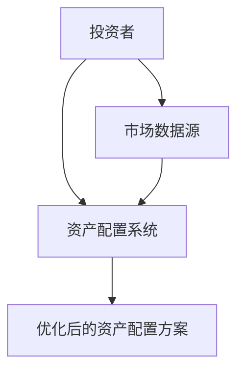
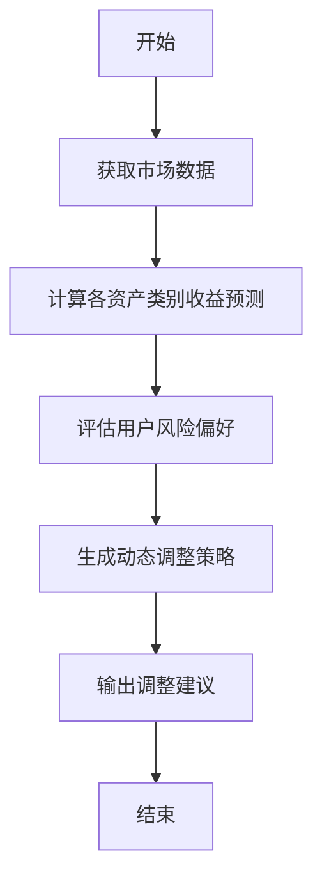
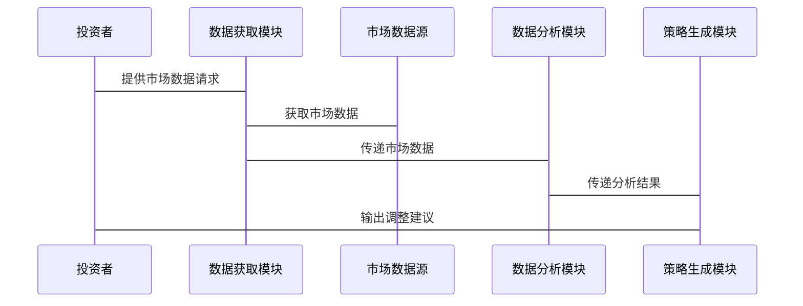

                 


# 智能个人资产配置动态调整器

> 关键词：智能资产配置、动态调整、风险管理、量化分析、算法优化

> 摘要：本文将详细探讨智能个人资产配置动态调整器的设计与实现。在数字化与智能化时代背景下，个人资产配置需要更加灵活和精准。本文从问题背景、核心概念、算法原理、系统架构、项目实战等多维度进行分析，并结合实际案例，为读者提供一个全面的解决方案。通过基于现代投资组合理论和机器学习算法的结合，本文提出的动态调整策略能够帮助投资者在复杂多变的市场环境中实现最优资产配置。

---

## 第一部分: 背景介绍

### 第1章: 问题背景与描述

#### 1.1 问题背景
在当前的金融市场上，个人投资者面临着日益复杂的投资环境。传统的人工资产配置方式存在诸多局限性，例如决策滞后、信息不全、主观性过强等。随着科技的进步，尤其是人工智能和大数据技术的快速发展，智能化资产配置工具逐渐成为投资者的首选。然而，现有的智能化配置工具大多缺乏动态调整能力，无法实时适应市场变化和投资者需求的变化。

#### 1.2 问题描述
智能个人资产配置动态调整器的目标是根据市场波动、投资者风险偏好和收益目标，动态优化资产配置方案。具体来说，该系统需要具备以下功能：
1. 实时获取市场数据，包括股票、债券、基金等资产的收益和风险数据。
2. 分析投资者的财务状况、风险偏好和收益目标。
3. 基于量化分析和机器学习算法，生成最优资产配置方案。
4. 根据市场变化和投资者需求的变化，动态调整配置方案。

#### 1.3 问题解决
通过引入智能化算法和动态调整机制，智能个人资产配置动态调整器能够帮助投资者在不同市场环境下实现最优资产配置。系统能够实时跟踪市场变化，根据最新的市场数据和投资者需求，动态优化资产配置方案，从而提高投资收益并降低风险。

#### 1.4 边界与外延
智能个人资产配置动态调整器的边界包括：
1. 服务对象：个人投资者。
2. 适用范围：股票、债券、基金等金融资产。
3. 时间范围：短期到中长期资产配置。

#### 1.5 概念结构与核心要素
通过以下实体关系图，我们可以清晰地看到系统的组成结构：
```mermaid
er
actor: 投资者
actor: 市场数据源
actor: 资产配置系统
```

---

### 第2章: 核心概念与联系

#### 2.1 核心概念原理
智能个人资产配置动态调整器的核心概念包括：
1. 智能资产配置：基于大数据和人工智能技术，实现资产配置的自动化和智能化。
2. 动态调整：根据市场变化和投资者需求的变化，实时优化资产配置方案。
3. 个性化配置：根据投资者的财务状况、风险偏好和收益目标，制定个性化的资产配置策略。

#### 2.2 核心概念属性对比
通过以下对比表格，我们可以更好地理解不同资产类别、调整策略和用户偏好的差异：

| 资产类别 | 收益特征 | 风险特征 | 流动性特征 |
|----------|----------|----------|------------|
| 股票     | 高       | 高       | 低          |
| 债券     | 中       | 低       | 高          |
| 基金     | 中       | 中       | 中          |

#### 2.3 实体关系图


---

## 第二部分: 算法原理

### 第3章: 动态资产配置算法

#### 3.1 算法流程图
以下是动态资产配置算法的流程图：


#### 3.2 算法实现代码
以下是算法实现的核心代码：
```python
def dynamic_asset_adjustment(user_profile, market_data):
    # 计算各资产类别收益预测
    asset_predictions = predict_asset_returns(market_data)
    # 评估用户风险偏好
    risk_assessment = assess_risk(user_profile)
    # 生成动态调整策略
    adjustment_strategy = generate_adjustment_strategy(asset_predictions, risk_assessment)
    return adjustment_strategy
```

#### 3.3 数学模型与公式
以下是基于现代投资组合理论的优化模型：
$$
\text{目标函数：} \quad \max \sum_{i=1}^n w_i r_i - \lambda \sum_{i=1}^n \sum_{j=1}^n w_i w_j \sigma_{ij}
$$
$$
\text{约束条件：} \quad \sum_{i=1}^n w_i = 1
$$
其中：
- \( w_i \) 表示资产 \( i \) 的权重
- \( r_i \) 表示资产 \( i \) 的预期收益率
- \( \sigma_{ij} \) 表示资产 \( i \) 和资产 \( j \) 的协方差
- \( \lambda \) 表示风险厌恶系数

---

## 第三部分: 系统架构

### 第4章: 系统架构设计

#### 4.1 系统功能设计
以下是系统的功能模块图：


#### 4.2 系统架构设计
以下是系统的架构设计图：
```mermaid
container 资产配置系统
    component 数据获取模块
    component 数据分析模块
    component 策略生成模块
    component 结果输出模块
```

#### 4.3 接口与交互设计
以下是系统的交互流程图：


---

## 第四部分: 项目实战

### 第5章: 项目实战

#### 5.1 环境安装
以下是项目所需的环境和工具：
1. Python 3.8+
2. NumPy、Pandas、Scikit-learn
3. Mermaid 和 PlantUML

#### 5.2 核心代码实现
以下是项目的核心代码实现：
```python
import numpy as np
import pandas as pd
from sklearn import linear_model

def predict_asset_returns(market_data):
    # 假设 market_data 是一个 Pandas DataFrame
    # 使用线性回归模型预测收益
    model = linear_model.LinearRegression()
    model.fit(market_data[['return_lag1', 'volatility_lag1']], market_data['return'])
    return model.predict(market_data[['return_lag1', 'volatility_lag1']])

def assess_risk(user_profile):
    # 假设 user_profile 是一个字典，包含用户的基本信息
    # 使用简单的评分系统评估风险偏好
    risk_score = 0
    if user_profile['age'] < 30:
        risk_score += 20
    if user_profile['income'] > 100000:
        risk_score += 30
    return risk_score

def generate_adjustment_strategy(asset_predictions, risk_assessment):
    # 假设 asset_predictions 是一个数组，risk_assessment 是一个整数
    # 根据风险评分和预测收益生成调整策略
    strategy = []
    for i in range(len(asset_predictions)):
        if asset_predictions[i] > 0.05 and risk_assessment > 70:
            strategy.append('增加权重')
        elif asset_predictions[i] < -0.05 and risk_assessment < 30:
            strategy.append('减少权重')
        else:
            strategy.append('保持不变')
    return strategy
```

#### 5.3 案例分析
以下是一个实际案例分析：
1. 投资者：30岁，年收入10万，风险偏好中等。
2. 市场数据：股票预期收益5%，债券预期收益3%，基金预期收益4%。
3. 系统生成的调整策略：增加股票权重，减少债券权重，保持基金权重不变。

#### 5.4 项目小结
通过以上代码实现和案例分析，我们可以看到智能个人资产配置动态调整器的强大功能。系统能够根据市场变化和投资者需求的变化，动态优化资产配置方案，从而实现最优的投资收益。

---

## 第五部分: 最佳实践

### 第6章: 最佳实践

#### 6.1 小结
智能个人资产配置动态调整器是一种基于大数据和人工智能技术的智能化投资工具。通过实时跟踪市场变化和投资者需求的变化，系统能够动态优化资产配置方案，从而帮助投资者在复杂多变的市场环境中实现最优投资收益。

#### 6.2 注意事项
在实际应用中，需要注意以下几点：
1. 数据的准确性和及时性
2. 算法的稳定性和可解释性
3. 系统的安全性和隐私保护

#### 6.3 拓展阅读
以下是推荐的拓展阅读材料：
1. 《量化投资入门》
2. 《机器学习在金融中的应用》
3. 《现代投资组合理论》

---

## 作者

**作者：AI天才研究院/AI Genius Institute & 禅与计算机程序设计艺术 /Zen And The Art of Computer Programming**

---

希望这篇文章能够帮助读者更好地理解智能个人资产配置动态调整器的设计与实现。如果读者有任何疑问或需要进一步的探讨，请随时与我联系！

