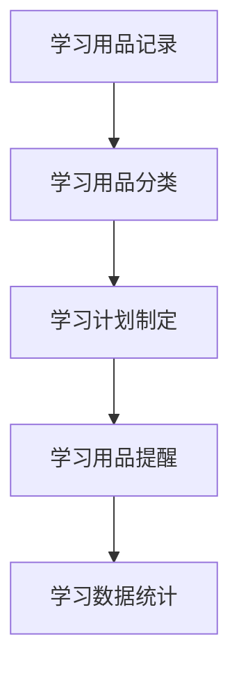
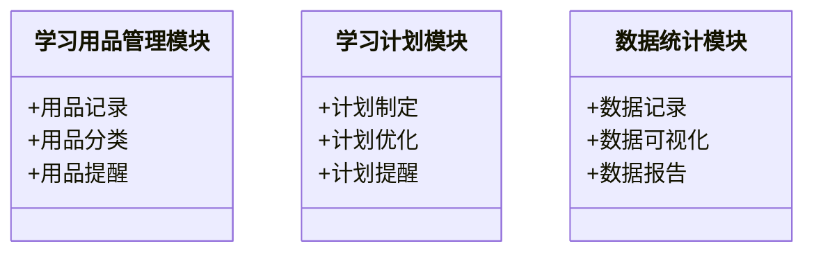
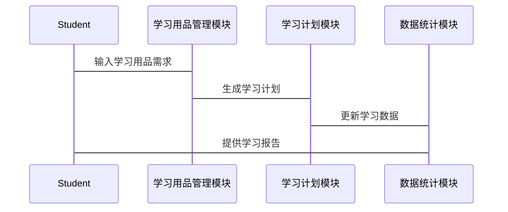

                 


# 智能书包：AI Agent的学习用品管理助手

> 关键词：智能书包，AI Agent，学习用品管理，自然语言处理，机器学习，系统架构设计

> 摘要：本文详细介绍了智能书包的设计与实现，从问题背景到系统架构，从算法原理到项目实战，全面剖析了如何利用AI Agent技术实现学习用品的智能化管理。文章结合理论与实践，通过具体的算法实现和系统设计，展示了智能书包在实际应用中的潜力与价值。

---

## 第1章: 问题背景与需求分析

### 1.1 问题背景

#### 1.1.1 学生学习用品管理的现状
在传统教学环境中，学生的学习用品管理通常依赖于手动记录或简单的纸质清单。这种方式不仅效率低下，还容易出现遗漏或错误。例如，学生可能忘记携带某个学习用品，或者在整理学习用品时花费大量时间。

#### 1.1.2 现有管理工具的不足
现有的学习用品管理工具主要依赖于简单的列表或数据库，无法与学生的学习习惯和需求深度结合。此外，这些工具缺乏智能化的管理功能，无法主动提醒学生补充学习用品或优化学习计划。

#### 1.1.3 智能化管理的需求
随着人工智能技术的发展，智能化的学习用品管理工具成为一种迫切需求。通过AI Agent技术，智能书包可以实现对学习用品的智能化管理，帮助学生提高学习效率。

---

### 1.2 问题描述

#### 1.2.1 学习用品管理的核心问题
学习用品管理的核心问题包括：学习用品的记录与跟踪、学习用品的分类与优先级管理、学习计划的制定与优化等。

#### 1.2.2 用户需求的多样性
不同学生的学习需求和习惯差异较大，因此智能书包需要具备高度的定制化能力，以满足不同用户的需求。

#### 1.2.3 系统功能的边界与外延
智能书包的功能需要明确其边界与外延，例如，是否需要与学校管理系统对接，是否需要与其他学习工具（如在线学习平台）集成等。

---

## 第2章: 智能书包的核心概念与体系结构

### 2.1 AI Agent的基本概念

#### 2.1.1 AI Agent的定义与特点
AI Agent是一种能够感知环境、自主决策并执行任务的智能实体。其特点包括：自主性、反应性、目标导向性和学习能力。

#### 2.1.2 AI Agent的核心要素
AI Agent的核心要素包括感知模块、决策模块、执行模块和学习模块。

#### 2.1.3 AI Agent与传统管理工具的对比
与传统管理工具相比，AI Agent能够实现智能化的决策和执行，具有更高的灵活性和适应性。

---

### 2.2 智能书包的功能体系

#### 2.2.1 基本功能模块
智能书包的基本功能模块包括：学习用品记录、学习用品分类、学习计划制定、学习用品提醒和学习数据统计。

#### 2.2.2 高级功能模块
高级功能模块包括：学习用品优先级管理、学习计划优化、学习数据可视化和学习用品推荐。

#### 2.2.3 功能模块之间的关系
功能模块之间的关系可以通过Mermaid图表示如下：



---

## 第3章: AI Agent的核心原理与算法实现

### 3.1 感知与理解

#### 3.1.1 自然语言处理（NLP）的基础
自然语言处理是AI Agent实现意图理解的核心技术。通过NLP技术，AI Agent能够理解和解析学生的输入文本。

#### 3.1.2 文档分析与分类
文档分析与分类是实现学习用品管理的重要步骤。通过分类算法，可以将学习用品分为不同的类别，以便更好地管理。

#### 3.1.3 用户意图识别
用户意图识别是基于NLP技术实现的，通过分析用户的输入文本，识别其意图并生成相应的管理策略。

---

### 3.2 决策与规划

#### 3.2.1 基于规则的决策
基于规则的决策是一种简单的决策方式，适用于规则明确的场景。

#### 3.2.2 基于机器学习的决策
基于机器学习的决策能够处理复杂场景，通过训练模型实现更精准的决策。

#### 3.2.3 多目标优化
多目标优化是一种综合考虑多个目标的决策方法，适用于需要平衡多个目标的场景。

---

### 3.3 执行与反馈

#### 3.3.1 动作规划与执行
动作规划与执行是AI Agent实现决策的核心步骤，通过规划具体的执行动作并实施。

#### 3.3.2 反馈机制与优化
反馈机制用于收集执行结果并优化决策模型，从而提高系统的整体性能。

#### 3.3.3 系统自适应
系统自适应是一种动态优化机制，能够根据环境变化自动调整系统参数。

---

## 第4章: 系统设计与实现

### 4.1 系统功能设计

#### 4.1.1 功能模块划分
功能模块划分可以通过Mermaid图表示如下：



#### 4.1.2 功能模块之间的关系
功能模块之间的关系可以通过Mermaid图表示如下：



---

### 4.2 系统架构设计

#### 4.2.1 分层架构
系统的分层架构可以通过Mermaid图表示如下：

```mermaid
classDiagram
    class 数据层 {
        +数据库
        +API接口
    }
    class 业务逻辑层 {
        +学习用品管理
        +学习计划制定
        +数据统计
    }
    class 表现层 {
        +用户界面
        +交互逻辑
    }
    数据层 <---> 业务逻辑层
    业务逻辑层 <---> 表现层
```

---

### 4.3 系统实现

#### 4.3.1 环境安装
需要安装的主要环境包括Python、TensorFlow、NLP库（如spaCy）等。

#### 4.3.2 核心代码实现
以下是学习用品管理模块的核心代码示例：

```python
class LearningSuppliesManager:
    def __init__(self):
        self.supplies = {}

    def record_supply(self, supply_name, quantity):
        self.supplies[supply_name] = quantity

    def classify_supplies(self, category):
        return {k: v for k, v in self.supplies.items() if k in category}

    def remind_supply(self, threshold):
        for supply, quantity in self.supplies.items():
            if quantity <= threshold:
                print(f"提醒：{supply} 的数量低于 {threshold}")
```

#### 4.3.3 案例分析
通过一个具体的案例分析，展示系统如何实现学习用品的智能化管理。

---

## 第5章: 项目实战与最佳实践

### 5.1 项目实战

#### 5.1.1 环境安装
需要安装的主要环境包括Python、TensorFlow、NLP库（如spaCy）等。

#### 5.1.2 核心代码实现
以下是学习用品管理模块的核心代码示例：

```python
class LearningSuppliesManager:
    def __init__(self):
        self.supplies = {}

    def record_supply(self, supply_name, quantity):
        self.supplies[supply_name] = quantity

    def classify_supplies(self, category):
        return {k: v for k, v in self.supplies.items() if k in category}

    def remind_supply(self, threshold):
        for supply, quantity in self.supplies.items():
            if quantity <= threshold:
                print(f"提醒：{supply} 的数量低于 {threshold}")
```

#### 5.1.3 案例分析
通过一个具体的案例分析，展示系统如何实现学习用品的智能化管理。

---

### 5.2 最佳实践

#### 5.2.1 小结
智能书包的实现需要结合AI Agent技术，通过自然语言处理和机器学习算法实现智能化的管理功能。

#### 5.2.2 注意事项
在实现过程中需要注意系统的可扩展性、可维护性和安全性。

#### 5.2.3 拓展阅读
建议读者进一步阅读相关领域的书籍和论文，深入理解AI Agent和系统架构设计的核心思想。

---

## 作者：AI天才研究院/AI Genius Institute & 禅与计算机程序设计艺术 /Zen And The Art of Computer Programming

