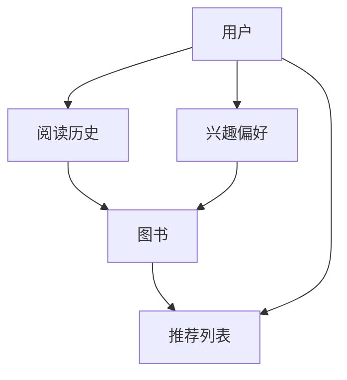
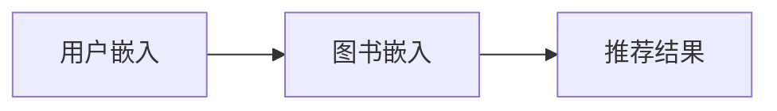
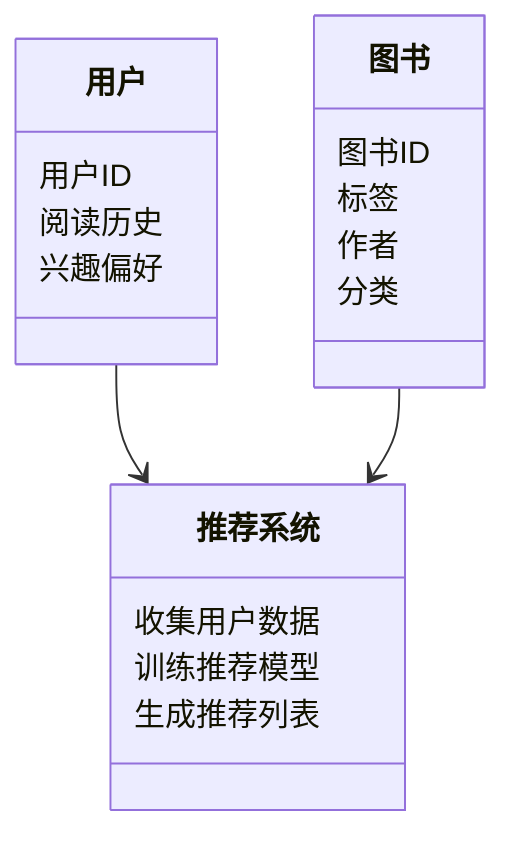
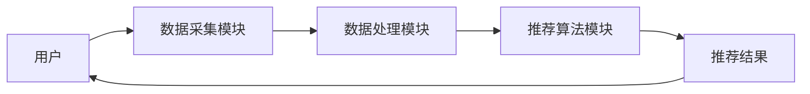

                 


# 智能书架：AI Agent的图书推荐系统

## 关键词
智能书架, AI Agent, 图书推荐系统, 人工智能, 推荐算法, 系统架构

## 摘要
智能书架是一种基于人工智能代理的图书推荐系统，旨在通过智能化的技术手段为用户提供个性化、精准的图书推荐服务。本文将从智能书架的背景与核心概念入手，详细阐述其算法原理、系统架构设计、项目实战及最佳实践，帮助读者全面理解智能书架的构建过程和实现方法。

---

## 第一部分: 智能书架的背景与核心概念

### 第1章: 智能书架的定义与背景

#### 1.1 智能书架的定义
智能书架是一种基于人工智能技术的图书推荐系统，通过AI Agent（智能代理）实现对用户阅读习惯、兴趣偏好的精准分析，并实时提供个性化图书推荐服务。与传统图书推荐系统相比，智能书架更加智能化、动态化，能够根据用户的实时反馈不断优化推荐结果。

#### 1.2 智能书架的背景与技术基础
人工智能技术的快速发展为智能书架的实现提供了坚实的技术基础。传统的图书推荐系统主要依赖协同过滤算法和基于内容的推荐算法，但存在推荐精度低、实时性差等问题。随着深度学习、自然语言处理等技术的成熟，智能书架通过引入AI Agent，能够实现更精准、更个性化的推荐服务。

#### 1.3 AI Agent在图书推荐中的作用
AI Agent是一种智能代理，能够在图书推荐系统中模拟人类的推荐行为。它能够根据用户的阅读历史、偏好、行为数据等信息，结合图书的内容特征，动态生成推荐结果。AI Agent的核心优势在于其智能化和动态性，能够实时适应用户需求的变化。

---

### 第2章: 智能书架的核心概念与联系

#### 2.1 AI Agent与图书推荐系统的原理
智能书架的核心原理在于AI Agent的推荐机制。AI Agent通过收集用户的阅读数据（如阅读历史、评分、点击行为等），分析用户的兴趣偏好，结合图书的元数据（如图书分类、标签、作者等），生成推荐列表。推荐结果不仅基于用户的历史行为，还考虑图书的内容特征和用户的实时需求。

#### 2.2 核心概念对比表
以下是AI Agent与传统推荐算法的核心概念对比表：

| **对比维度** | **AI Agent推荐** | **传统推荐算法** |
|--------------|------------------|-------------------|
| **推荐依据**  | 用户行为 + 图书内容 | 用户行为或图书内容 |
| **动态性**    | 高度动态，实时更新 | 静态或低频更新    |
| **个性化程度** | 高度个性化        | 中等个性化        |
| **计算复杂度** | 高               | 中               |

#### 2.3 实体关系图
以下是智能书架的核心实体关系图：



---

## 第二部分: 智能书架的算法原理

### 第3章: 推荐算法的原理与实现

#### 3.1 协同过滤算法
协同过滤是一种经典的推荐算法，分为基于用户的协同过滤和基于物品的协同过滤。

##### 3.1.1 基于用户的协同过滤
基于用户的协同过滤算法通过寻找与目标用户兴趣相似的用户群体，将这些用户群体的偏好作为推荐依据。具体步骤如下：

1. **计算用户相似度**：通过计算用户之间的相似度（如余弦相似度）。
2. **生成推荐列表**：基于相似用户的评分，加权生成推荐结果。

##### 3.1.2 基于物品的协同过滤
基于物品的协同过滤算法通过分析图书之间的相似性，生成推荐结果。具体步骤如下：

1. **计算图书相似度**：通过计算图书之间的相似度（如余弦相似度）。
2. **生成推荐列表**：基于目标用户的评分，推荐相似图书。

##### 3.1.3 协同过滤的优缺点
- **优点**：简单易实现，推荐结果直观。
- **缺点**：计算复杂度高，冷启动问题明显。

#### 3.2 基于深度学习的推荐算法
基于深度学习的推荐算法（如神经网络协同过滤）能够更好地捕捉用户和图书的隐含特征。

##### 3.2.1 神经网络协同过滤模型
神经网络协同过滤模型通过构建用户-图书的嵌入向量，计算用户与图书的匹配程度。



##### 3.2.2 深度学习推荐的实现步骤
1. **数据预处理**：对用户和图书数据进行特征提取和归一化处理。
2. **模型训练**：通过神经网络模型训练用户和图书的嵌入向量。
3. **生成推荐结果**：基于嵌入向量计算用户与图书的相似度，生成推荐列表。

---

### 第4章: 算法实现与数学模型

#### 4.1 协同过滤的数学模型
基于用户的协同过滤算法的数学模型如下：

$$ sim(u, v) = \frac{\sum_{i}(r_{u,i} - \bar{r}_u)(r_{v,i} - \bar{r}_v)}{\sqrt{\sum_{i}(r_{u,i} - \bar{r}_u)^2} \cdot \sqrt{\sum_{i}(r_{v,i} - \bar{r}_v)^2}} $$

其中，$sim(u, v)$ 表示用户 $u$ 和用户 $v$ 的相似度，$\bar{r}_u$ 表示用户 $u$ 的平均评分。

#### 4.2 基于内容的推荐模型
基于内容的推荐模型通过分析图书的内容特征，生成推荐结果。

$$ score(b, u) = \sum_{i}(w_i \cdot f_i(b)) $$

其中，$score(b, u)$ 表示图书 $b$ 对用户 $u$ 的评分，$w_i$ 表示特征 $i$ 的权重，$f_i(b)$ 表示图书 $b$ 的第 $i$ 个特征值。

---

## 第三部分: 系统分析与架构设计

### 第5章: 系统分析与架构设计

#### 5.1 问题场景介绍
智能书架系统需要解决以下问题：
1. 如何高效地收集和处理用户数据？
2. 如何实现个性化的图书推荐？
3. 如何保证系统的实时性和扩展性？

#### 5.2 系统功能设计
以下是智能书架的系统功能设计：



#### 5.3 系统架构设计
以下是智能书架的系统架构设计：



---

## 第四部分: 项目实战

### 第6章: 项目实战

#### 6.1 环境安装与配置
需要安装以下环境：
1. Python 3.8+
2. TensorFlow 2.0+
3. Pandas 1.0+
4. Scikit-learn 0.24+

#### 6.2 系统核心实现
以下是协同过滤算法的实现代码：

```python
import numpy as np
from sklearn.metrics.pairwise import cosine_similarity

# 用户-图书评分矩阵
rating_matrix = np.array([[4, 3, 2],
                            [5, 1, 4],
                            [3, 5, 2]])

# 计算用户相似度
user_similarity = cosine_similarity(rating_matrix)

# 生成推荐结果
def generate_recommendations(user_id, user_similarity, rating_matrix):
    similar_users = np.argsort(user_similarity[user_id])[::-1]
    recommendations = []
    for u in similar_users:
        if u != user_id:
            recommendations.extend(np.where(rating_matrix[u] > 0)[0])
    recommendations = list(set(recommendations))
    return recommendations

# 示例：为用户0生成推荐
print(generate_recommendations(0, user_similarity, rating_matrix))
```

#### 6.3 代码解读与分析
上述代码实现了基于用户的协同过滤算法，具体步骤如下：
1. **计算用户相似度**：使用余弦相似度计算用户之间的相似度。
2. **生成推荐结果**：基于相似用户的评分，生成推荐列表。

#### 6.4 实际案例分析
以用户0为例，其评分矩阵为 [4, 3, 2]。根据计算，用户0与用户2的相似度最高，因此推荐用户2评分较高的图书（图书1和图书2）。

---

## 第五部分: 最佳实践与总结

### 第7章: 最佳实践与总结

#### 7.1 最佳实践 tips
1. **数据预处理**：确保数据质量，避免噪声干扰。
2. **模型优化**：结合多种推荐算法，提升推荐精度。
3. **系统扩展**：采用分布式架构，提升系统性能。

#### 7.2 小结
智能书架通过AI Agent实现了高度个性化的图书推荐服务，其核心优势在于智能化和动态性。通过本文的讲解，读者可以全面理解智能书架的构建过程和实现方法。

#### 7.3 注意事项
1. **数据隐私**：注意保护用户数据隐私。
2. **模型调优**：根据实际需求调整模型参数。
3. **性能优化**：优化推荐算法，提升系统响应速度。

#### 7.4 拓展阅读
1. 《推荐系统实战》
2. 《深度学习推荐系统》
3. 《人工智能与自然语言处理》

---

## 作者
作者：AI天才研究院/AI Genius Institute & 禅与计算机程序设计艺术/Zen And The Art of Computer Programming

