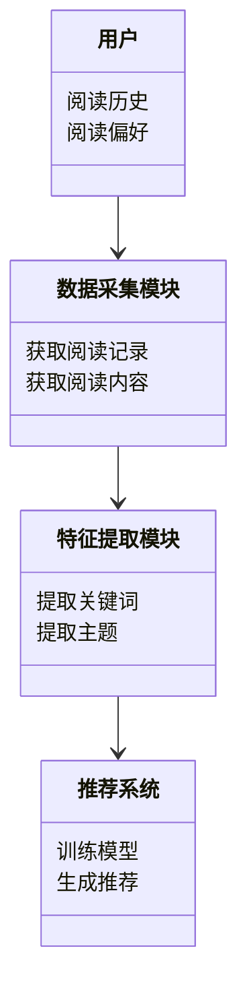
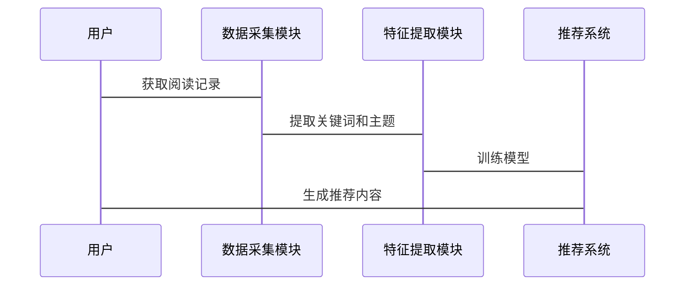

                 


# 智能书架：AI Agent的阅读习惯分析

---

## 关键词：
智能书架, AI Agent, 阅读习惯, 自然语言处理, 机器学习, 推荐系统

---

## 摘要：
本文探讨了AI Agent在阅读习惯分析中的应用，通过智能书架这一具体场景，分析了AI代理如何通过自然语言处理和机器学习技术，实现对用户阅读行为的深度理解和个性化推荐。文章从背景介绍、核心概念、算法原理、系统架构到项目实战，全面解析了智能书架的实现路径，并提供了具体的代码示例和案例分析。

---

## 第一部分: 智能书架与AI Agent概述

### 第1章: 智能书架与AI Agent的背景介绍

#### 1.1 问题背景与描述
##### 1.1.1 阅读习惯分析的背景
在信息爆炸的时代，用户每天面对海量信息，如何高效地筛选和获取有价值的内容成为一个重要问题。阅读习惯分析可以帮助用户更好地管理时间和内容选择，同时为内容提供者优化内容分发策略。

##### 1.1.2 AI Agent在阅读习惯分析中的作用
AI Agent（智能代理）是一种能够自主执行任务的计算机程序，它可以利用自然语言处理（NLP）和机器学习技术，分析用户的阅读行为，提取阅读习惯，并提供个性化的阅读推荐。

##### 1.1.3 智能书架的核心目标与边界
智能书架的核心目标是通过分析用户的阅读数据，生成个性化的阅读计划和推荐内容。其边界包括：仅关注用户的阅读行为，不涉及其他类型的内容消费。

#### 1.2 核心概念与问题解决
##### 1.2.1 阅读习惯的定义与特征
阅读习惯是指用户在一定时间内对特定类型、主题或作者的偏好。其特征包括：频率、时长、主题偏好等。

##### 1.2.2 AI Agent的定义与能力
AI Agent是一种能够感知环境、做出决策并执行任务的智能体。其能力包括：数据采集、特征提取、模式识别和决策优化。

##### 1.2.3 智能书架的实现路径
智能书架的实现路径包括：数据采集、特征提取、模型训练和个性化推荐。

#### 1.3 核心概念结构与要素
##### 1.3.1 阅读习惯的核心要素
- 阅读频率：用户每天阅读的次数和时长。
- 阅读主题：用户偏好的主题或作者。
- 阅读时间：用户的阅读高峰期。

##### 1.3.2 AI Agent的组成部分
- 感知模块：负责数据采集和特征提取。
- 决策模块：负责模型训练和推荐策略。
- 执行模块：负责个性化计划生成和反馈机制。

##### 1.3.3 智能书架的概念模型
智能书架通过AI Agent感知用户的阅读行为，分析用户的阅读习惯，生成个性化的阅读计划和推荐内容。

#### 1.4 本章小结
本章介绍了智能书架的背景、核心概念和实现路径，为后续章节奠定了基础。

---

## 第二部分: AI Agent的核心原理与技术

### 第2章: AI Agent的核心概念与联系

#### 2.1 AI Agent的感知模块
##### 2.1.1 自然语言处理技术
自然语言处理（NLP）技术用于分析用户的阅读内容，提取关键词、主题和情感倾向。

##### 2.1.2 注意力机制
注意力机制（Attention Mechanism）用于关注文本中的重要部分，提高特征提取的准确性。

##### 2.1.3 文本特征提取
文本特征提取是指从文本中提取具有代表性的特征，例如TF-IDF、Word2Vec等。

#### 2.2 AI Agent的决策模块
##### 2.2.1 基于阅读习惯的推荐算法
推荐算法包括协同过滤、基于内容的推荐和混合推荐。

##### 2.2.2 强化学习在阅读推荐中的应用
强化学习用于动态更新推荐策略，提高推荐的准确性和用户满意度。

##### 2.2.3 阅读习惯的动态更新机制
阅读习惯的动态更新机制是指根据用户的最新行为，实时调整推荐策略。

#### 2.3 AI Agent的执行模块
##### 2.3.1 个性化阅读计划生成
个性化阅读计划生成是指根据用户的阅读习惯，制定个性化的阅读计划。

##### 2.3.2 阅读习惯反馈机制
阅读习惯反馈机制是指用户对推荐内容的反馈，用于优化推荐算法。

##### 2.3.3 阅读行为预测模型
阅读行为预测模型用于预测用户的未来阅读行为，提前推荐相关内容。

#### 2.4 核心概念联系的Mermaid图


---

## 第三部分: 阅读习惯分析的算法原理

### 第3章: 阅读习惯分析的算法原理

#### 3.1 自然语言处理模型
##### 3.1.1 Word2Vec模型
Word2Vec是一种将单词映射为向量的模型，常用于文本特征提取。

##### 3.1.2 BERT模型
BERT是一种基于Transformer的预训练语言模型，常用于文本理解任务。

##### 3.1.3 GPT模型
GPT是一种基于Transformer的生成式模型，常用于文本生成任务。

#### 3.2 阅读习惯分析的数学模型
##### 3.2.1 用户阅读行为的向量化表示
用户阅读行为可以通过向量空间模型表示，例如：

$$
\text{用户向量} = \sum_{i=1}^{n} w_i \cdot \text{单词向量}_i
$$

其中，$w_i$ 是单词权重，$\text{单词向量}_i$ 是单词的向量表示。

##### 3.2.2 余弦相似度计算
余弦相似度用于计算两个向量之间的相似程度：

$$
\cos\theta = \frac{\vec{a} \cdot \vec{b}}{|\vec{a}| \cdot |\vec{b}|}
$$

##### 3.2.3 阅读习惯的聚类分析
聚类分析用于将用户的阅读习惯分为不同的类别，例如基于K-means算法：

$$
\text{目标函数} = \sum_{i=1}^{k} \sum_{j=1}^{n_i} (x_j - c_i)^2
$$

其中，$k$ 是聚类数，$n_i$ 是第$i$个聚类的样本数，$c_i$ 是第$i$个聚类的中心点。

#### 3.3 个性化推荐算法
##### 3.3.1 基于内容的推荐算法
基于内容的推荐算法通过分析内容的特征进行推荐：

$$
\text{相似度} = \sum_{i=1}^{m} w_i \cdot \text{特征}_i
$$

其中，$w_i$ 是特征权重，$\text{特征}_i$ 是内容的特征。

##### 3.3.2 基于协同过滤的推荐算法
协同过滤算法通过分析用户的相似性进行推荐：

$$
\text{相似度} = \sum_{i=1}^{n} \frac{r_{ui} \cdot r_{vi}}{\sqrt{\sum_{j} r_{uj}^2} \cdot \sqrt{\sum_{j} r_{vj}^2}}
$$

其中，$r_{ui}$ 是用户$u$对物品$i$的评分，$r_{vi}$ 是用户$v$对物品$i$的评分。

##### 3.3.3 混合推荐算法
混合推荐算法结合基于内容和协同过滤的推荐方法，以提高推荐的准确性和多样性。

---

## 第四部分: 智能书架的系统架构设计

### 第4章: 智能书架的系统架构设计

#### 4.1 问题场景介绍
智能书架的目标是通过AI Agent分析用户的阅读行为，生成个性化的阅读计划和推荐内容。

#### 4.2 系统功能设计
##### 4.2.1 领域模型图


##### 4.2.2 系统架构图


#### 4.3 系统接口设计
##### 4.3.1 接口定义
- 数据采集模块接口：`get_reading_history()`, `get_content()`
- 特征提取模块接口：`extract_keywords()`, `extract_topics()`
- 推荐系统接口：`train_model()`, `generate_recommendations()`

##### 4.3.2 接口交互图


---

## 第五部分: 智能书架的项目实战

### 第5章: 智能书架的项目实战

#### 5.1 环境安装
- 安装Python和必要的库：`pip install numpy, pandas, scikit-learn, transformers`

#### 5.2 核心代码实现
##### 5.2.1 数据采集模块
```python
import pandas as pd

def get_reading_history():
    # 示例：读取CSV文件
    df = pd.read_csv('reading_history.csv')
    return df
```

##### 5.2.2 特征提取模块
```python
from transformers import BertTokenizer, BertModel

def extract_keywords(text):
    # 示例：使用BERT提取关键词
    tokenizer = BertTokenizer.from_pretrained('bert-base-uncased')
    model = BertModel.from_pretrained('bert-base-uncased')
    inputs = tokenizer(text, return_tensors='np')
    outputs = model(**inputs)
    # 提取关键词
    return tokenizer.decode(outputs.last_hidden_state[:, 0, :].argmax())
```

##### 5.2.3 推荐系统实现
```python
from sklearn.metrics.pairwise import cosine_similarity

def generate_recommendations(user_vector):
    # 示例：基于余弦相似度的推荐
    all_vectors = [...]  # 所有用户的向量
    similarities = cosine_similarity([user_vector], all_vectors)
    top_indices = similarities.argsort()[0][-5:]
    return all_vectors[top_indices]
```

#### 5.3 案例分析与代码解读
##### 5.3.1 案例分析
以一位用户为例，分析其阅读习惯，并生成个性化阅读计划。

##### 5.3.2 代码解读
- 数据采集模块：读取用户的阅读记录，提取关键词和主题。
- 特征提取模块：使用BERT模型提取文本特征。
- 推荐系统：基于余弦相似度生成推荐内容。

#### 5.4 项目小结
本章通过实际案例展示了智能书架的实现过程，包括数据采集、特征提取和推荐系统的设计与实现。

---

## 第六部分: 最佳实践与总结

### 第6章: 最佳实践与总结

#### 6.1 最佳实践
- 数据预处理：确保数据的完整性和准确性。
- 模型调优：通过交叉验证优化模型参数。
- 反馈机制：实时收集用户的反馈，优化推荐策略。

#### 6.2 小结
智能书架通过AI Agent分析用户的阅读行为，生成个性化的阅读计划和推荐内容，极大地提升了用户的阅读体验。

#### 6.3 注意事项
- 数据隐私：确保用户的阅读数据不被滥用。
- 模型可解释性：提高推荐系统的透明度。
- 系统性能：优化算法的计算效率。

#### 6.4 拓展阅读
- 《深度学习入门：基于Python和Keras》
- 《自然语言处理实战：基于Python和TensorFlow》

---

## 作者：AI天才研究院/AI Genius Institute & 禅与计算机程序设计艺术 /Zen And The Art of Computer Programming

