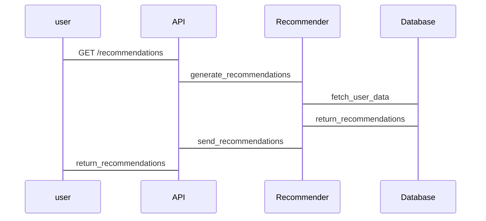

                 


# 智能书架：AI Agent的阅读兴趣分析

## 关键词：智能书架，AI Agent，阅读兴趣分析，推荐算法，协同过滤，深度学习

## 摘要：  
本文探讨了如何利用AI Agent技术进行阅读兴趣分析，以实现智能书架的个性化推荐功能。文章从背景介绍、核心概念、算法原理、系统架构到项目实战，全面解析了智能书架的构建过程。通过详细分析AI Agent在阅读兴趣分析中的应用，本文旨在为读者提供一个系统化的解决方案，帮助用户更好地管理和发现阅读内容。

---

## 第1章：智能书架与AI Agent概述

### 1.1 智能书架的背景与意义

#### 1.1.1 传统书架的局限性  
传统书架主要依赖人工整理和分类，用户查找书籍时效率较低，难以满足个性化需求。此外，传统书架无法根据用户的阅读历史和偏好推荐相关书籍，导致用户阅读体验受限。

#### 1.1.2 智能书架的核心价值  
智能书架通过结合AI技术，能够实时分析用户的阅读行为，提供个性化推荐服务。这不仅提高了用户的阅读效率，还帮助用户发现新的阅读兴趣领域。

#### 1.1.3 AI Agent在智能书架中的作用  
AI Agent作为智能书架的核心，负责数据采集、分析和推荐。它能够动态调整推荐策略，为用户提供更精准的服务。

### 1.2 阅读兴趣分析的必要性

#### 1.2.1 阅读兴趣的定义与特点  
阅读兴趣是指用户对特定类型书籍的偏好，具有动态变化、个性化和关联性的特点。

#### 1.2.2 阅读兴趣分析的场景与应用  
阅读兴趣分析广泛应用于个性化推荐、阅读习惯研究等领域，能够提升用户的阅读体验和满意度。

#### 1.2.3 阅读兴趣分析的边界与外延  
阅读兴趣分析的边界包括用户的基本信息和阅读记录，外延则涉及书籍分类和主题挖掘。

---

## 第2章：AI Agent的基本原理

### 2.1 AI Agent的定义与分类

#### 2.1.1 AI Agent的定义  
AI Agent是一种能够感知环境并采取行动以实现目标的智能体。

#### 2.1.2 AI Agent的分类与特点  
AI Agent可分类为基于规则、基于模型和基于学习的Agent，各有其优缺点。

#### 2.1.3 AI Agent的核心要素  
AI Agent的核心要素包括感知能力、决策能力、行动能力和学习能力。

### 2.2 阅读兴趣分析的算法原理

#### 2.2.1 阅读兴趣分析的输入与输出  
输入包括用户阅读记录和书籍特征，输出为推荐书籍列表。

#### 2.2.2 阅读兴趣分析的核心算法  
常用算法包括协同过滤、内容过滤和混合推荐模型。

#### 2.2.3 阅读兴趣分析的评估指标  
评估指标包括准确率、召回率和F1分数。

### 2.3 AI Agent与阅读兴趣分析的关系

#### 2.3.1 AI Agent在阅读兴趣分析中的角色  
AI Agent负责数据采集、特征提取和推荐策略的制定。

#### 2.3.2 阅读兴趣分析对AI Agent的反馈机制  
通过用户反馈优化推荐模型，提升推荐准确率。

#### 2.3.3 二者的协同工作流程  
AI Agent接收用户数据，分析阅读兴趣，生成推荐结果，并根据反馈调整策略。

---

## 第3章：基于协同过滤的阅读兴趣分析

### 3.1 协同过滤算法概述

#### 3.1.1 协同过滤的定义与特点  
协同过滤是一种基于用户相似性推荐算法，具有简单高效的特点。

#### 3.1.2 基于用户的协同过滤  
通过计算用户之间的相似度，推荐相似用户喜欢的书籍。

#### 3.1.3 基于物品的协同过滤  
通过计算书籍之间的相似度，推荐用户可能感兴趣的书籍。

### 3.2 协同过滤的数学模型

#### 3.2.1 用户-物品评分矩阵的构建  
构建一个用户-物品评分矩阵，用于计算相似度。

#### 3.2.2 相似度计算公式  
$$\text{相似度} = \frac{\sum_{i=1}^{n} (r_{u,i} - \bar{r}_u)(r_{v,i} - \bar{r}_v)}{\sqrt{\sum_{i=1}^{n} (r_{u,i} - \bar{r}_u)^2} \cdot \sqrt{\sum_{i=1}^{n} (r_{v,i} - \bar{r}_v)^2}}$$

#### 3.2.3 推荐结果的计算公式  
$$\hat{r}_{u,i} = \bar{r}_u + \sum_{v \in N(u)} w(u, v) (r_{v,i} - \bar{r}_v)$$

### 3.3 协同过滤的Python实现示例

```python
import numpy as np

def cosine_similarity(user_similarity_matrix):
    return np.dot(user_similarity_matrix, user_similarity_matrix.T) / (np.linalg.norm(user_similarity_matrix, axis=1)[:, np.newaxis])

user_similarity_matrix = np.array([[4,3,2], [5,2,4], [1,0,3]])
similarity = cosine_similarity(user_similarity_matrix)
print(similarity)
```

---

## 第4章：深度学习模型在阅读兴趣分析中的应用

### 4.1 基于深度学习的阅读兴趣分析

#### 4.1.1 常用深度学习模型  
常用模型包括TF-IDF、Word2Vec和BERT。

#### 4.1.2 深度学习模型的优缺点  
优点：特征提取能力强；缺点：计算资源消耗大。

#### 4.1.3 深度学习模型的实现流程  
包括数据预处理、模型训练和结果预测。

### 4.2 基于神经网络的阅读兴趣分析

#### 4.2.1 神经网络结构  
包括输入层、隐层和输出层。

#### 4.2.2 损失函数与优化算法  
使用交叉熵损失函数和Adam优化算法。

#### 4.2.3 模型训练流程  
包括数据准备、模型训练和模型评估。

### 4.3 基于深度学习的阅读兴趣分析代码示例

```python
import tensorflow as tf
from tensorflow.keras import layers

model = tf.keras.Sequential([
    layers.Dense(64, activation='relu'),
    layers.Dense(1, activation='sigmoid')
])

model.compile(optimizer='adam', loss='binary_crossentropy', metrics=['accuracy'])
model.fit(X_train, y_train, epochs=10, batch_size=32)
```

---

## 第5章：系统分析与架构设计

### 5.1 系统功能设计

#### 5.1.1 领域模型  
使用Mermaid绘制类图，展示用户、书籍和推荐的关系。

```mermaid
classDiagram
    class User {
        id: int
        name: str
        reading_history: list
    }
    class Book {
        id: int
        title: str
        author: str
        category: str
    }
    class Recommendation {
        id: int
        book_id: int
        user_id: int
        score: float
    }
    User -> Recommendation: creates
    Book -> Recommendation: associates
```

#### 5.1.2 系统架构设计  
使用Mermaid绘制系统架构图，展示前端、后端和数据库的交互。


---

## 第6章：项目实战

### 6.1 环境安装与配置

#### 6.1.1 安装依赖  
安装Python、TensorFlow和Keras。

#### 6.1.2 数据准备  
收集用户阅读记录和书籍信息。

#### 6.1.3 数据预处理  
进行数据清洗和特征提取。

### 6.2 系统核心实现

#### 6.2.1 协同过滤实现  
实现用户相似度计算和推荐生成。

#### 6.2.2 深度学习模型实现  
构建神经网络模型并进行训练。

#### 6.2.3 系统接口设计  
定义RESTful API接口，实现用户请求处理。

### 6.3 代码实现与解读

#### 6.3.1 协同过滤代码  
实现用户相似度计算和推荐生成。

#### 6.3.2 深度学习代码  
构建神经网络模型并进行训练。

#### 6.3.3 系统交互图  
使用Mermaid绘制交互序列图，展示系统如何处理用户请求。



### 6.4 案例分析与结果解读

#### 6.4.1 案例分析  
分析用户阅读记录，生成推荐列表。

#### 6.4.2 结果解读  
解释推荐结果的准确性和用户满意度。

---

## 第7章：总结与展望

### 7.1 最佳实践

#### 7.1.1 小结  
总结智能书架的构建过程和关键技术。

#### 7.1.2 注意事项  
提醒读者在实际应用中需要注意的问题。

#### 7.1.3 拓展阅读  
推荐进一步学习的方向和资源。

---

## 作者：AI天才研究院/AI Genius Institute & 禅与计算机程序设计艺术/Zen And The Art of Computer Programming

---

通过以上目录和内容，我们可以系统地了解智能书架的构建过程，从理论到实践，帮助读者掌握AI Agent在阅读兴趣分析中的应用。

