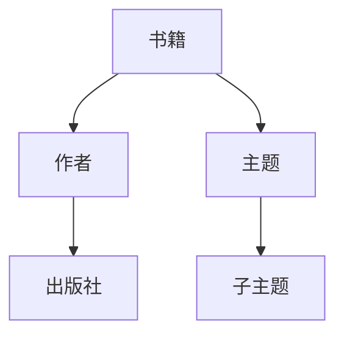

                 


# 《智能书架：AI Agent的阅读兴趣拓展系统》

> **关键词**：AI Agent, 阅读兴趣, 知识图谱, 推荐算法, 系统架构, 项目实战, 最佳实践

> **摘要**：  
> 本文详细探讨了基于AI Agent的智能书架系统，该系统通过知识图谱构建、推荐算法优化以及系统架构设计，实现用户的阅读兴趣拓展。文章从背景、理论、算法、系统设计、项目实战等多个维度展开，结合具体案例分析，深入剖析了智能书架系统的实现原理与应用价值，为读者提供了一套完整的解决方案。

---

## 第一章: 阅读兴趣拓展系统的背景与需求

### 1.1 阅读兴趣拓展的核心问题

在信息爆炸的时代，用户每天面对海量的信息和内容，如何高效地发现和拓展自己的阅读兴趣成为一个重要的问题。传统的阅读推荐系统基于协同过滤或基于内容的推荐方法，存在推荐结果不够精准、难以捕捉用户动态兴趣等问题。AI Agent的引入，为解决这些问题提供了新的思路。

#### 核心问题：
1. 用户阅读兴趣的动态变化难以捕捉。
2. 传统推荐算法难以结合上下文信息，推荐结果缺乏深度关联。
3. 缺乏个性化的阅读路径规划，用户难以系统性地拓展阅读兴趣。

#### 解决方案：
通过AI Agent与知识图谱的结合，构建一个动态、关联性强、且具备自主学习能力的智能书架系统。

---

### 1.2 AI Agent在阅读兴趣拓展中的作用

AI Agent（智能体）是一种能够感知环境、执行任务并主动优化行为的智能系统。在阅读兴趣拓展中，AI Agent主要负责以下几个方面：
1. **知识表示与推理**：将书籍、作者、主题等信息构建为知识图谱，并通过推理能力关联用户的阅读行为。
2. **动态推荐**：根据用户的阅读行为和反馈，实时更新推荐结果，确保推荐内容与用户的兴趣保持一致。
3. **个性化路径规划**：为用户提供个性化的阅读路径，帮助用户系统性地拓展阅读兴趣。

#### AI Agent的核心功能：
- **知识表示**：通过图结构表示书籍、作者、主题等实体及其关系。
- **推理能力**：基于知识图谱进行推理，推断用户的潜在兴趣。
- **自适应学习**：根据用户反馈调整推荐策略。

---

## 第二章: 知识图谱的构建与应用

### 2.1 知识图谱的构建方法

知识图谱的构建是智能书架系统的核心任务之一。以下是构建阅读领域知识图谱的主要步骤：

#### 步骤一：数据采集
- 从书籍数据库中获取书籍的基本信息（如书名、作者、出版时间等）。
- 采集用户阅读行为数据（如阅读记录、点赞、收藏等）。

#### 步骤二：实体识别与抽取
- 识别书籍中的实体（如书籍、作者、主题）。
- 提取实体之间的关系（如“书籍X属于主题Y”）。

#### 步骤三：知识图谱构建
- 使用图数据库（如Neo4j）存储实体及其关系。
- 构建图结构，展示实体之间的关联。

#### 步骤四：知识图谱优化
- 去除冗余关系。
- 补充缺失的知识（如通过外部数据源丰富实体属性）。

#### 实体关系示例（Mermaid图）：


---

### 2.2 基于知识图谱的推荐算法

#### 知识图谱推荐算法的核心思想：
- 利用知识图谱中的实体关系，扩展用户的兴趣范围。
- 基于图结构进行路径推理，发现潜在的推荐目标。

#### 算法实现步骤：
1. **输入用户的当前阅读记录**。
2. **基于知识图谱进行路径推理**，找到与用户兴趣相关的实体。
3. **生成推荐列表**，并根据用户反馈优化推荐结果。

#### 算法示例（伪代码）：
```python
def knowledge_graph_recommend(user_id):
    # 获取用户的阅读记录
    user_books = get_user_books(user_id)
    # 基于知识图谱进行路径推理
    related_books = []
    for book in user_books:
        related_books.extend(find_related_books(book))
    # 去重并排序
    related_books = list(set(related_books))
    related_books.sort(key=lambda x: x.similarity_score)
    return related_books
```

---

## 第三章: 阅读兴趣拓展的算法原理

### 3.1 基于协同过滤的推荐算法

#### 协同过滤的基本原理：
- 找到与用户兴趣相似的用户群体。
- 将这些用户喜欢的书籍推荐给目标用户。

#### 算法实现步骤：
1. **构建用户-物品矩阵**。
2. **计算用户之间的相似度**（如余弦相似度）。
3. **生成推荐列表**。

#### 余弦相似度公式：
$$ \text{similarity}(u_1, u_2) = \frac{\sum u_1.r_i \cdot u_2.r_i}{\sqrt{\sum u_1.r_i^2} \cdot \sqrt{\sum u_2.r_i^2}} $$

---

### 3.2 基于内容的推荐算法

#### 内容推荐的核心思想：
- 基于书籍的内容特征（如主题、关键词）进行推荐。

#### 算法实现步骤：
1. **提取书籍的特征向量**。
2. **计算书籍之间的相似度**。
3. **生成推荐列表**。

#### TF-IDF特征提取：
- TF（Term Frequency）：词频。
- IDF（Inverse Document Frequency）：逆文档频率。

$$ \text{TF-IDF}(t, d) = \text{TF}(t, d) \times \log\left(\frac{N}{\text{DF}(t, d)}\right) $$

---

## 第四章: 系统架构与设计

### 4.1 系统功能设计

#### 功能模块：
- **知识图谱构建模块**：负责知识图谱的构建与优化。
- **推荐算法模块**：实现多种推荐算法的集成与优化。
- **用户交互模块**：提供友好的用户界面和反馈机制。

#### 系统架构图（Mermaid）：


---

## 第五章: 项目实战

### 5.1 环境安装

#### 需要的工具与库：
- Python 3.8+
- Pandas、NumPy
- TensorFlow/Keras
- 图数据库（如Neo4j）

---

### 5.2 核心代码实现

#### 知识图谱构建代码示例：
```python
import neo4j
from neo4j.exceptions import Neo4jError

def create_graph(user_books):
    # 连接Neo4j数据库
    driver = neo4j.driver("bolt://localhost:7687", auth=("neo4j", "password"))
    try:
        with driver.session() as session:
            # 创建书籍节点
            for book in user_books:
                session.write_transaction(create_book_node, book)
            # 创建关系
            session.write_transaction(create_book_relationship, user_books)
    finally:
        driver.close()
```

---

## 第六章: 优化与扩展

### 6.1 性能优化建议

1. **分布式计算**：利用分布式计算框架（如Spark）优化知识图谱构建。
2. **缓存机制**：缓存高频访问的数据，减少数据库查询压力。

---

## 第七章: 总结

智能书架系统通过结合AI Agent和知识图谱，为用户提供了一个高效、个性化的阅读兴趣拓展工具。未来，随着AI技术的不断进步，智能书架系统将具备更强的自主学习能力和更丰富的应用场景。

---

**作者：AI天才研究院/AI Genius Institute & 禅与计算机程序设计艺术 /Zen And The Art of Computer Programming**

