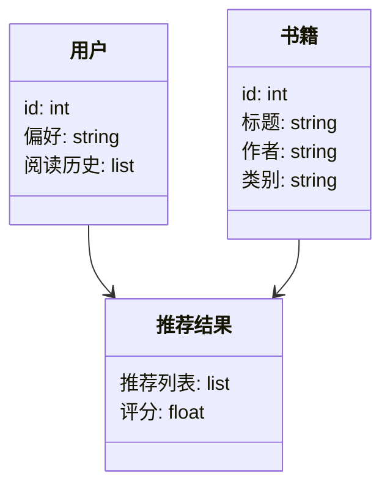
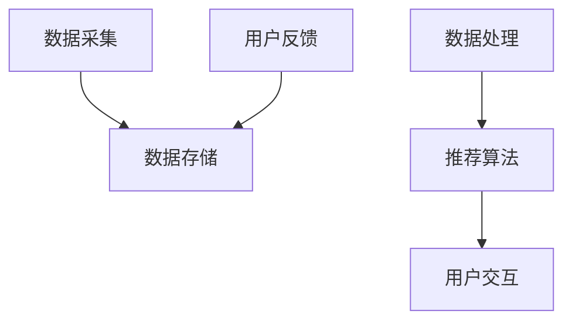

                 


# 智能书架：AI Agent的阅读兴趣推荐系统

> **关键词**：智能书架，AI Agent，阅读兴趣，推荐系统，协同过滤，内容推荐，混合推荐

> **摘要**：本文探讨了智能书架系统的设计与实现，重点介绍了基于AI Agent的阅读兴趣推荐系统。通过分析用户行为和阅读偏好，结合协同过滤、内容推荐和混合推荐算法，构建了一个高效、个性化的推荐系统。文章详细阐述了系统架构、算法原理和实现细节，并通过实际案例展示了系统的应用价值。

---

# 正文

## 第一部分：智能书架的背景与概述

### 第1章：智能书架的定义与应用场景

#### 1.1 智能书架的定义
智能书架是一种基于AI技术的电子书管理与推荐系统，利用AI Agent（智能代理）分析用户的阅读行为和偏好，提供个性化的内容推荐服务。

**核心功能：**
- **用户建模**：通过分析用户的阅读历史、偏好和行为数据，构建用户画像。
- **内容推荐**：基于用户画像和书籍特征，推荐符合用户兴趣的书籍。
- **交互优化**：提供高效的用户界面和交互方式，提升用户体验。

#### 1.2 应用场景
智能书架广泛应用于电子书店、图书馆管理系统、阅读App等领域。例如：
- **电子书店**：推荐用户可能感兴趣的书籍，提高销售转化率。
- **图书馆系统**：帮助用户快速找到感兴趣的书籍，优化资源利用率。
- **阅读App**：个性化推荐功能提升用户体验，增加用户粘性。

### 第2章：阅读兴趣推荐系统的背景与问题分析

#### 2.1 背景分析
- **数字化阅读的兴起**：电子书的普及使得用户拥有更多的阅读选择。
- **用户需求的多样性**：用户阅读兴趣千差万别，传统推荐系统难以满足个性化需求。
- **数据驱动的推荐**：通过分析海量数据，利用机器学习算法实现精准推荐。

#### 2.2 核心问题
- **数据稀疏性**：用户行为数据可能不够丰富，导致推荐准确性下降。
- **冷启动问题**：新用户或新书缺乏足够的数据支持推荐。
- **实时性要求**：用户需求可能随时变化，推荐系统需要实时更新。

### 第3章：智能书架的系统目标与架构

#### 3.1 系统目标
- 提供高效的阅读兴趣推荐服务。
- 实现用户与内容的精准匹配。
- 支持大规模数据处理和实时推荐。

#### 3.2 系统架构
- **数据采集模块**：收集用户行为数据，包括点击、浏览、收藏等。
- **用户建模模块**：利用机器学习算法构建用户画像。
- **推荐算法模块**：基于协同过滤、内容推荐和混合推荐算法生成推荐结果。
- **交互模块**：通过用户界面展示推荐结果，并收集用户反馈。

---

## 第二部分：AI Agent与推荐系统的核心概念

### 第4章：AI Agent的基本原理

#### 4.1 AI Agent的定义与分类
- **定义**：AI Agent是一种能够感知环境、执行任务并做出决策的智能实体。
- **分类**：
  - **基于规则的Agent**：根据预定义规则执行任务。
  - **基于模型的Agent**：利用模型进行推理和决策。

#### 4.2 AI Agent的核心能力
- **信息处理能力**：处理多源异构数据。
- **学习能力**：通过机器学习算法不断优化模型。
- **决策能力**：根据当前状态和目标做出最优决策。

### 第5章：阅读兴趣推荐系统的算法原理

#### 5.1 协同过滤算法
- **定义**：基于用户行为数据，通过寻找相似用户的推荐方法。
- **实现步骤**：
  1. 计算用户相似度：使用余弦相似度或欧氏距离。
  2. 生成推荐列表：基于相似用户的评分加权平均。

**数学公式**：
$$ \text{similarity}(u, v) = \frac{\sum_{i} u_i v_i}{\sqrt{\sum u_i^2} \sqrt{\sum v_i^2}} $$

#### 5.2 基于内容的推荐
- **定义**：基于书籍内容特征进行推荐。
- **实现步骤**：
  1. 提取书籍特征：如主题、关键词、作者等。
  2. 计算相似书籍：基于文本相似度。

**数学公式**：
$$ \text{score}(i, j) = \frac{\sum_{k} w_k \cdot (f_{ik} \cdot f_{jk})}{\sum_{k} w_k} $$

#### 5.3 混合推荐
- **定义**：结合协同过滤和内容推荐的优势。
- **实现步骤**：
  1. 综合两种推荐结果。
  2. 根据用户偏好加权融合。

**数学公式**：
$$ \text{final\_score} = \alpha \cdot \text{score\_cf} + (1 - \alpha) \cdot \text{score\_cb} $$

---

## 第三部分：系统分析与架构设计

### 第6章：系统分析与架构设计

#### 6.1 领域模型
- **领域模型**：定义系统的核心实体及其关系。
  - 用户：包括ID、偏好、阅读历史。
  - 书籍：包括ID、标题、作者、类别。
  - 推荐结果：包括推荐列表、评分。

**Mermaid类图**：


#### 6.2 系统架构
- **分层架构**：
  1. 数据采集层：收集用户行为和书籍数据。
  2. 数据处理层：清洗、转换和存储数据。
  3. 推荐算法层：执行推荐算法，生成推荐结果。
  4. 用户交互层：展示推荐结果，收集用户反馈。

**Mermaid架构图**：


---

## 第四部分：项目实战

### 第7章：项目实战

#### 7.1 环境安装
- **工具与库**：
  - Python 3.8+
  - Pandas、NumPy、Scikit-learn
  - Flask（可选）

#### 7.2 核心代码实现

**协同过滤算法实现**：
```python
from sklearn.metrics.pairwise import cosine_similarity

def collaborative_filtering(user_item_matrix):
    similarities = cosine_similarity(user_item_matrix)
    return similarities
```

**内容推荐算法实现**：
```python
from sklearn.feature_extraction.text import TfidfVectorizer

def content_based_recommendation(documents):
    vectorizer = TfidfVectorizer()
    tfidf = vectorizer.fit_transform(documents)
    return tfidf
```

#### 7.3 案例分析
- **案例**：推荐一本书给用户A。
- **步骤**：
  1. 收集用户A的阅读历史和偏好。
  2. 计算用户相似度，找到最相似的用户。
  3. 推荐相似用户的高评分书籍。

---

## 第五部分：最佳实践与总结

### 第8章：最佳实践与总结

#### 8.1 最佳实践
- **数据质量**：确保数据的完整性和准确性。
- **模型优化**：定期更新模型，避免过时。
- **用户体验**：提供多样化的推荐方式，支持用户自定义。

#### 8.2 小结
智能书架通过AI Agent实现了高效、个性化的阅读推荐，显著提升了用户体验和系统效率。本文详细介绍了系统的背景、算法原理、架构设计和实现过程，并通过实际案例展示了系统的应用价值。

#### 8.3 注意事项
- 数据隐私保护：确保用户数据的安全性。
- 系统可扩展性：支持大规模数据和用户量。

#### 8.4 拓展阅读
- 《推荐系统实践》
- 《机器学习实战》
- 《自然语言处理入门》

---

# 结语

智能书架通过结合AI Agent和推荐系统，为用户提供了一种全新的阅读体验。未来，随着技术的不断进步，智能书架将更加智能化，推荐算法也将更加精准，为用户带来更好的阅读体验。

---

**作者：AI天才研究院/AI Genius Institute & 禅与计算机程序设计艺术 /Zen And The Art of Computer Programming**

