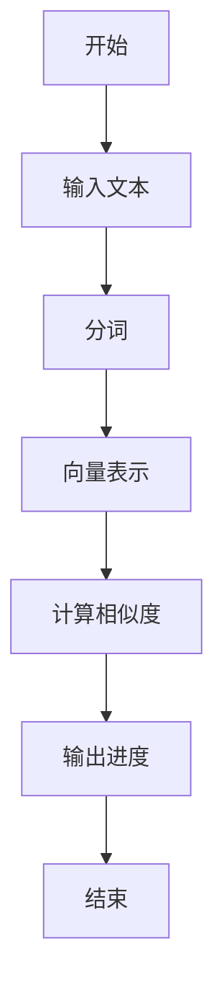

                 


# 智能书签：AI Agent的阅读进度追踪

---

## 关键词：AI Agent，阅读进度追踪，自然语言处理，文本相似度，知识图谱

---

## 摘要：  
本文探讨了AI Agent在阅读进度追踪中的应用，结合自然语言处理和知识图谱技术，提出了一种智能书签系统的设计与实现方法。通过分析阅读行为数据，AI Agent能够实时记录和理解阅读内容，帮助用户高效管理阅读进度。本文详细阐述了智能书签的核心概念、算法原理、系统架构，并通过项目实战展示了具体实现方案，最后总结了最佳实践和未来发展方向。

---

# 第一部分: 背景介绍

## 第1章: 传统阅读进度追踪的局限性

### 1.1 传统书签的不足
传统书签只能记录阅读位置，无法理解内容，导致用户难以快速回顾阅读内容和理解整体进度。

### 1.2 阅读进度追踪的痛点
- 阅读材料多样（电子书、网页、PDF等），记录方式不统一。
- 阅读行为碎片化，难以系统性管理。
- 传统书签无法提供个性化推荐和内容总结。

### 1.3 用户需求与现有解决方案的差距
用户希望阅读进度管理能够智能化、自动化，现有解决方案多基于简单的标记技术，缺乏深度理解和智能分析。

## 第2章: AI Agent的核心概念与优势

### 2.1 AI Agent的定义
AI Agent是一种能够感知环境、理解任务目标、执行操作并优化决策的智能体，能够通过自然语言处理、机器学习等技术实现与用户的交互。

### 2.2 AI Agent在阅读进度追踪中的应用
- **内容理解**：通过NLP技术理解阅读内容，提取关键信息。
- **进度记录**：实时记录用户的阅读位置和时间。
- **个性化推荐**：基于阅读历史推荐相关内容。

### 2.3 智能书签的核心优势
- **自动化记录**：无需手动标记，AI Agent自动跟踪阅读进度。
- **智能分析**：通过深度学习模型理解内容，提供个性化建议。
- **数据驱动**：利用大数据分析优化阅读体验。

---

# 第二部分: 智能书签的核心概念与技术原理

## 第3章: 阅读进度追踪的技术实现

### 3.1 文本相似度计算
通过计算当前阅读内容与历史内容的相似度，判断阅读进度的变化。

### 3.2 基于知识图谱的阅读理解
构建领域知识图谱，帮助AI Agent理解文本的语义关系。

### 3.3 多模态数据融合
将文本、语音、图像等多种数据源进行融合，提升阅读理解的准确性。

---

## 第4章: AI Agent的算法原理

### 4.1 文本处理流程
1. **分词**：将文本分割成词语或短语。
2. **向量表示**：将词语映射到高维向量空间。
3. **相似度计算**：通过余弦相似度判断文本相似性。

### 4.2 基于深度学习的模型训练
- **模型选择**：使用预训练语言模型（如BERT）进行微调。
- **训练数据**：收集大量阅读行为数据，训练模型识别阅读进度。

### 4.3 算法流程图


### 4.4 数学模型与公式
$$\text{余弦相似度} = \frac{\vec{a} \cdot \vec{b}}{|\vec{a}| |\vec{b}|}$$

---

# 第三部分: 智能书签的系统架构与实现

## 第5章: 系统架构设计

### 5.1 功能模块划分
- **数据采集模块**：收集用户的阅读行为数据。
- **文本处理模块**：执行分词、向量表示等操作。
- **进度计算模块**：基于相似度计算阅读进度。
- **用户界面模块**：展示阅读进度和推荐内容。

### 5.2 系统架构图


### 5.3 接口设计
- **输入接口**：接收用户的阅读文本。
- **输出接口**：返回阅读进度和相关推荐。

### 5.4 系统交互流程
```mermaid
sequenceDiagram
用户 -> 数据采集模块: 提交阅读文本
数据采集模块 -> 文本处理模块: 分词处理
文本处理模块 -> 进度计算模块: 计算相似度
进度计算模块 -> 用户界面模块: 返回进度和推荐
用户 <- 用户界面模块: 显示结果
```

---

## 第6章: 项目实战

### 6.1 环境安装
- **Python**：3.8+
- **依赖库**：numpy, transformers, scikit-learn

### 6.2 核心代码实现

```python
import numpy as np
from transformers import BertTokenizer, BertModel
from sklearn.metrics.pairwise import cosine_similarity

def text_to_vector(text):
    tokenizer = BertTokenizer.from_pretrained('bert-base-uncased')
    model = BertModel.from_pretrained('bert-base-uncased')
    inputs = tokenizer(text, return_tensors='np')
    outputs = model(**inputs)
    return outputs.last_hidden_state.numpy.mean(axis=1)

def calculate_similarity(text1, text2):
    vec1 = text_to_vector(text1)
    vec2 = text_to_vector(text2)
    return cosine_similarity(vec1.reshape(1, -1), vec2.reshape(1, -1))[0][0]

# 示例
text1 = "这本书非常有趣，我学到了很多新知识。"
text2 = "这本书的内容让我印象深刻。"
print(calculate_similarity(text1, text2))  # 输出相似度
```

### 6.3 案例分析
通过上述代码实现一个简单的智能书签系统，用户输入阅读文本，系统返回相似度和推荐内容。

---

## 第7章: 总结与展望

### 7.1 小结
智能书签通过AI Agent实现了阅读进度的智能化管理，结合NLP和深度学习技术，能够有效提升用户体验。

### 7.2 注意事项
- 数据隐私保护
- 模型的可解释性
- 多语言支持

### 7.3 未来展望
- 增强模型的实时性
- 扩展支持更多模态数据
- 优化推荐算法

---

# 作者：AI天才研究院/AI Genius Institute & 禅与计算机程序设计艺术 /Zen And The Art of Computer Programming

