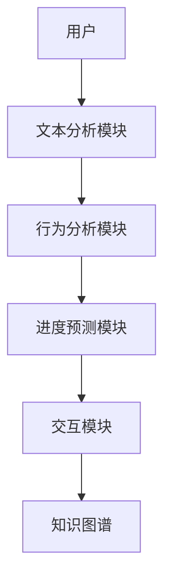

                 


---

# 智能书签：AI Agent的阅读进度追踪

> **关键词**：AI Agent，阅读进度追踪，自然语言处理，机器学习，文本相似度，阅读习惯分析

> **摘要**：本文将深入探讨如何利用AI Agent技术实现智能书签功能，特别是在阅读进度追踪方面的应用。通过结合自然语言处理、机器学习和时间序列分析等技术，我们能够构建一个智能化的阅读进度追踪系统，帮助用户更好地理解和管理他们的阅读习惯。本文将从核心概念、算法实现、系统架构设计、项目实战等多方面展开详细分析。

---

## 第1章: AI Agent的基础概念

### 1.1 AI Agent的定义与特点

#### 1.1.1 什么是AI Agent
AI Agent（人工智能代理）是指能够感知环境、自主决策并执行任务的智能实体。与传统软件不同，AI Agent具备以下特点：

- **自主性**：能够在没有外部干预的情况下自主运作。
- **反应性**：能够实时感知环境并做出响应。
- **学习性**：通过数据和经验不断优化自身的行为。
- **社交能力**：能够与其他AI Agent或人类进行交互。

#### 1.1.2 AI Agent的核心特点
- **智能性**：AI Agent能够理解、推理和学习。
- **适应性**：能够根据环境变化调整行为。
- **交互性**：能够与用户或其他系统进行交互。

#### 1.1.3 AI Agent与传统软件代理的区别
传统的软件代理通常基于固定的规则执行任务，而AI Agent具备学习和适应能力，能够处理复杂和不确定的环境。

### 1.2 AI Agent的类型与应用场景

#### 1.2.1 基于规则的AI Agent
基于规则的AI Agent通过预定义的规则执行任务，适用于任务简单、环境确定的场景。

#### 1.2.2 基于机器学习的AI Agent
基于机器学习的AI Agent能够通过数据学习，具备更强的适应性和智能性，适用于复杂和动态变化的环境。

#### 1.2.3 基于自然语言处理的AI Agent
基于自然语言处理的AI Agent能够理解人类语言，适用于需要与人类交互的场景，如智能书签。

### 1.3 阅读进度追踪的背景与需求

#### 1.3.1 阅读进度追踪的背景
随着数字化阅读的普及，用户希望能够更好地管理自己的阅读进度，了解自己的阅读习惯，并获得个性化的阅读建议。

#### 1.3.2 用户对阅读进度追踪的需求
- **实时追踪**：用户希望随时查看自己的阅读进度。
- **个性化建议**：用户希望获得基于阅读历史的个性化推荐。
- **便捷性**：用户希望阅读进度追踪工具能够无缝集成到阅读过程中。

#### 1.3.3 AI Agent在阅读进度追踪中的作用
AI Agent可以通过分析用户的阅读行为和文本内容，提供实时的阅读进度反馈、个性化建议和便捷的交互体验。

---

## 第2章: 阅读进度追踪的核心概念

### 2.1 阅读进度追踪的定义与实现方式

#### 2.1.1 阅读进度追踪的定义
阅读进度追踪是指通过技术手段记录和分析用户的阅读行为，以了解用户的阅读习惯和进度。

#### 2.1.2 阅读进度追踪的实现方式
- **文本分析**：通过自然语言处理技术分析阅读内容。
- **行为分析**：通过记录用户的阅读行为数据，如阅读时间、阅读速度等。
- **进度预测**：基于历史数据预测用户的阅读进度。

### 2.2 AI Agent在阅读进度追踪中的核心功能

#### 2.2.1 文本理解与分析
AI Agent需要能够理解阅读内容，提取关键信息，以便进行进度分析。

#### 2.2.2 阅读习惯分析
通过分析用户的阅读行为数据，AI Agent可以识别用户的阅读习惯，如偏好主题、阅读速度等。

#### 2.2.3 进度预测与提醒
基于用户的阅读习惯和文本内容，AI Agent可以预测用户的阅读进度，并在适当的时候提醒用户继续阅读。

### 2.3 阅读进度追踪的边界与外延

#### 2.3.1 阅读进度追踪的边界
- **阅读内容的范围**：仅限于用户授权的内容。
- **阅读行为的范围**：仅限于用户的阅读行为数据。

#### 2.3.2 阅读进度追踪的外延
- **阅读建议**：基于阅读进度提供个性化的阅读建议。
- **知识图谱构建**：通过阅读内容构建知识图谱，辅助用户更好地理解和记忆。

---

## 第3章: AI Agent与阅读进度追踪的核心要素

### 3.1 阅读进度追踪的系统架构

#### 3.1.1 系统功能模块
- **文本分析模块**：负责对阅读内容进行理解和分析。
- **行为分析模块**：负责记录和分析用户的阅读行为数据。
- **进度预测模块**：基于历史数据预测用户的阅读进度。
- **交互模块**：与用户进行实时交互，提供反馈和建议。

#### 3.1.2 系统数据流
用户阅读内容 -> 文本分析模块 -> 行为分析模块 -> 进度预测模块 -> 用户反馈。

### 3.2 AI Agent的核心算法与技术

#### 3.2.1 自然语言处理技术
- **文本相似度计算**：通过余弦相似度等方法计算文本之间的相似度。
- **情感分析**：分析文本的情感倾向，帮助理解用户的阅读偏好。

#### 3.2.2 机器学习算法
- **卷积神经网络（CNN）**：用于文本特征提取。
- **循环神经网络（RNN）**：用于处理序列数据，如阅读时间序列。

#### 3.2.3 时间序列分析
- **ARIMA模型**：用于预测未来的阅读进度。

### 3.3 阅读进度追踪的数学模型

#### 3.3.1 余弦相似度公式
$$\text{余弦相似度} = \frac{\vec{A} \cdot \vec{B}}{|\vec{A}| |\vec{B}|}$$

#### 3.3.2 ARIMA模型
ARIMA模型是一种常用的时间序列分析模型，适用于预测未来的阅读进度。

---

## 第4章: AI Agent与阅读进度追踪的算法实现

### 4.1 自然语言处理算法实现

#### 4.1.1 文本相似度计算

```python
def compute_cosine_similarity(vector1, vector2):
    dot_product = sum(v1 * v2 for v1, v2 in zip(vector1, vector2))
    magnitude1 = sum(v1**2 for v1 in vector1) ** 0.5
    magnitude2 = sum(v2**2 for v2 in vector2) ** 0.5
    return dot_product / (magnitude1 * magnitude2)
```

#### 4.1.2 情感分析

```python
from tensorflow.keras.models import Model
from tensorflow.keras.layers import Input, LSTM, Dense, Dropout

input_layer = Input(shape=(max_len, vocab_size))
lstm_layer = LSTM(64)(input_layer)
dense_layer = Dense(1, activation='sigmoid')(lstm_layer)
model = Model(inputs=input_layer, outputs=dense_layer)
model.compile(loss='binary_crossentropy', optimizer='adam', metrics=['accuracy'])
```

### 4.2 机器学习算法实现

#### 4.2.1 卷积神经网络（CNN）

```python
from tensorflow.keras import layers, Model

input_layer = layers.Input(shape=(max_len, vocab_size))
conv_layer = layers.Conv1D(filters=64, kernel_size=3, activation='relu')(input_layer)
pool_layer = layers.MaxPooling1D(pool_size=2)(conv_layer)
flatten_layer = layers.Flatten()(pool_layer)
dense_layer = layers.Dense(1, activation='sigmoid')(flatten_layer)
model = Model(inputs=input_layer, outputs=dense_layer)
model.compile(loss='binary_crossentropy', optimizer='adam', metrics=['accuracy'])
```

---

## 第5章: AI Agent与阅读进度追踪的系统设计

### 5.1 系统架构设计

#### 5.1.1 系统架构图


#### 5.1.2 功能模块设计

#### 5.1.3 接口设计

#### 5.1.4 交互设计

---

## 第6章: AI Agent与阅读进度追踪的项目实战

### 6.1 环境安装

#### 6.1.1 安装Python和必要的库
```bash
pip install numpy
pip install scikit-learn
pip install tensorflow
```

### 6.2 核心代码实现

#### 6.2.1 文本相似度计算

```python
import numpy as np

def compute_cosine_similarity(vec1, vec2):
    dot = np.dot(vec1, vec2)
    mag1 = np.linalg.norm(vec1)
    mag2 = np.linalg.norm(vec2)
    return dot / (mag1 * mag2)
```

#### 6.2.2 机器学习模型训练

```python
from tensorflow.keras import layers, Model

input_layer = layers.Input(shape=(max_len, vocab_size))
lstm_layer = layers.LSTM(64, return_sequences=True)(input_layer)
dense_layer = layers.Dense(1, activation='sigmoid')(lstm_layer)
model = Model(inputs=input_layer, outputs=dense_layer)
model.compile(loss='binary_crossentropy', optimizer='adam', metrics=['accuracy'])
model.fit(X_train, y_train, epochs=10, batch_size=32)
```

### 6.3 模型测试与优化

#### 6.3.1 模型测试

#### 6.3.2 模型优化

---

## 第7章: AI Agent与阅读进度追踪的最佳实践

### 7.1 性能优化技巧

#### 7.1.1 使用分布式训练

#### 7.1.2 优化模型结构

### 7.2 数据隐私保护

#### 7.2.1 数据加密

#### 7.2.2 数据匿名化

### 7.3 功能扩展建议

#### 7.3.1 增加知识图谱构建

#### 7.3.2 支持多语言阅读

### 7.4 总结与展望

---

## 作者信息

作者：AI天才研究院/AI Genius Institute & 禅与计算机程序设计艺术 /Zen And The Art of Computer Programming

---

通过本文的详细分析和实战演示，我们展示了如何利用AI Agent技术实现智能书签功能，并在阅读进度追踪方面取得显著成效。希望本文能够为读者提供有价值的参考和启发，进一步推动AI技术在阅读领域的应用。

