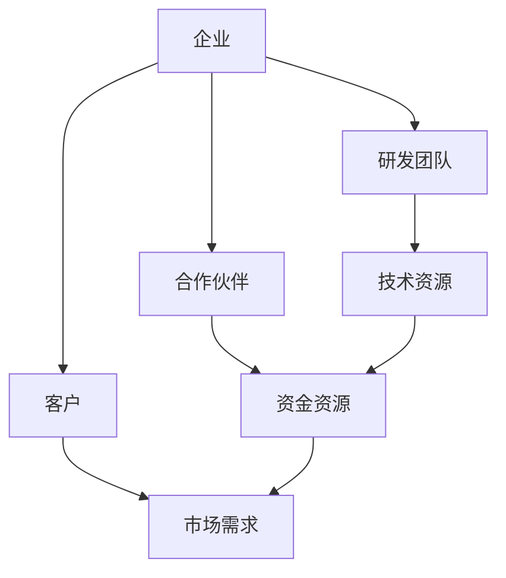
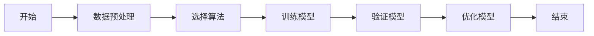
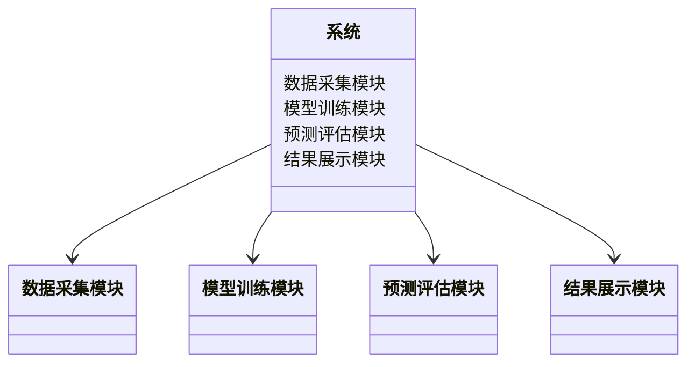
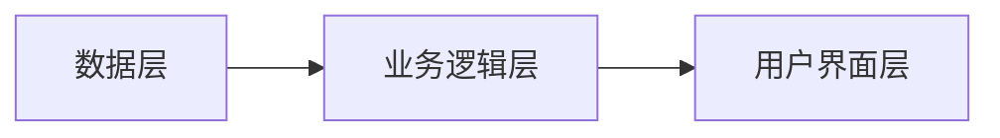
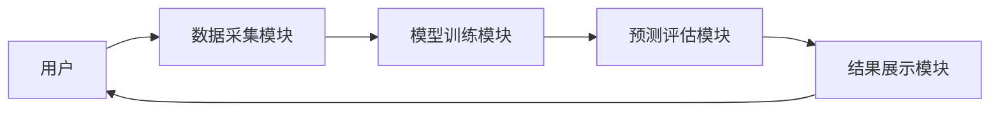

                 


# 智能体协作评估公司的创新生态系统：预测长期竞争力

> 关键词：智能体协作，创新生态系统，竞争力预测，系统架构，机器学习

> 摘要：本文探讨如何利用智能体协作评估公司的创新生态系统，预测其长期竞争力。通过分析创新生态系统的核心要素，构建预测模型，并设计系统架构，结合实际案例，提供详细的实现方案和最佳实践。

---

## 第一部分：引言

### 第1章：智能体协作评估的背景与意义

#### 1.1 智能体协作评估的背景

- **1.1.1 智能体协作的基本概念**  
  智能体（Agent）是指具备感知环境、自主决策和协作能力的实体。智能体协作是指多个智能体通过交互和合作共同完成目标的过程。

- **1.1.2 创新生态系统的核心要素**  
  创新生态系统由企业、研发机构、合作伙伴、客户和市场等多个主体构成，涉及技术、资源、信息和知识的流动与整合。

- **1.1.3 长期竞争力的定义与重要性**  
  长期竞争力是企业在市场中持续发展的能力，依赖于创新能力和协作效率。

- **1.1.4 当前企业创新面临的挑战**  
  包括资源分配不均、协作效率低下、创新成果转化难等问题。

#### 1.2 问题背景与研究意义

- **1.2.1 当前企业创新面临的挑战**  
  企业创新生态系统复杂，协作效率低下，难以应对快速变化的市场需求。

- **1.2.2 智能体协作评估的必要性**  
  通过智能体协作评估，可以优化资源配置，提升创新效率，增强企业的长期竞争力。

- **1.2.3 研究的创新点与实际应用价值**  
  提出了一种基于智能体协作的创新生态系统评估方法，为企业提供了一种新的竞争力预测工具。

#### 1.3 本章小结

---

## 第二部分：智能体协作评估的核心概念

### 第2章：智能体协作评估的理论基础

#### 2.1 智能体协作的基本原理

- **2.1.1 智能体的定义与特征**  
  智能体具备自主性、反应性、目标导向性和协作性。

- **2.1.2 协作的定义与分类**  
  协作可以分为任务协作、信息协作和决策协作。

- **2.1.3 智能体协作的数学模型**  
  通过数学模型描述智能体之间的协作关系和协作效率。

- **2.1.4 智能体协作的核心要素对比表**

| 要素 | 特性       | 描述                                                                 |
|------|------------|----------------------------------------------------------------------|
| 自主性 | 主动性     | 智能体能够自主决策，无需外部干预                                           |
| 反应性 | 感知能力   | 智能体能够感知环境并做出反应                                               |
| 目标导向性 | 目标驱动 | 智能体的行为以实现特定目标为导向                                           |
| 协作性 | 协作能力   | 智能体能够与其他智能体协作完成共同目标                                     |

#### 2.2 创新生态系统的核心要素

- **2.2.1 企业创新的主体构成**  
  包括企业内部的研发团队、外部合作伙伴、客户和市场。

- **2.2.2 创新资源的分配与流动**  
  包括技术、资金、人才和信息的分配与流动。

- **2.2.3 生态系统的动态演化**  
  创新生态系统是一个动态演化的过程，涉及各主体之间的互动和资源的流动。

- **2.2.4 创新生态系统的核心要素对比图**



#### 2.3 智能体协作与创新生态系统的关系

- **2.3.1 协作对创新生态系统的影响**  
  智能体协作可以提高创新效率，促进资源的合理分配。

- **2.3.2 创新生态系统对协作的反作用**  
  创新生态系统为智能体协作提供了环境和资源支持。

- **2.3.3 两者的协同机制**  
  智能体协作和创新生态系统相互促进，形成一个良性循环。

#### 2.4 核心概念的ER实体关系图

```mermaid
er
    actor: 智能体
    entity: 创新生态系统
    relationship: 协作评估
    actor --> relationship: 参与
    entity --> relationship: 构成
```

#### 2.5 本章小结

---

## 第三部分：智能体协作评估的算法与模型

### 第3章：创新生态系统预测模型的构建

#### 3.1 数据收集与预处理

- **3.1.1 数据来源与采集方法**  
  数据来源包括企业内部数据、公开市场数据和第三方数据。

- **3.1.2 数据清洗与特征提取**  
  清洗数据中的噪声，提取关键特征，如研发投入、专利数量、市场占有率等。

- **3.1.3 数据标准化与归一化**  
  使用标准化和归一化方法处理数据，确保模型输入的均衡性。

#### 3.2 智能体协作评估的算法选择

- **3.2.1 机器学习算法的比较**  
  对比回归、分类、聚类等算法的优缺点，选择适合的算法。

- **3.2.2 深度学习模型的适用性**  
  深度学习模型适用于复杂非线性关系的预测。

- **3.2.3 混合模型的优势**  
  结合机器学习和深度学习的优势，构建混合模型。

#### 3.3 模型训练与优化

- **3.3.1 算法实现**  
  使用Python和机器学习库（如Scikit-learn、Keras）实现算法。

- **3.3.2 模型训练**  
  通过训练数据优化模型参数，提高预测准确率。

- **3.3.3 模型验证与评估**  
  使用测试数据验证模型性能，评估指标包括准确率、召回率和F1分数。

- **3.3.4 模型优化与调优**  
  通过网格搜索和交叉验证优化模型参数。

#### 3.4 算法流程图



#### 3.5 数学模型与公式

- **3.5.1 回归模型**  
  $$ y = \beta_0 + \beta_1 x_1 + \beta_2 x_2 + ... + \beta_n x_n + \epsilon $$

- **3.5.2 深度学习模型**  
  $$ P(y|x) = \text{softmax}(Wx + b) $$

- **3.5.3 混合模型**  
  $$ y = f(x) + g(x) $$

#### 3.6 本章小结

---

## 第四部分：系统架构设计

### 第4章：智能体协作评估系统的架构设计

#### 4.1 问题场景介绍

- **4.1.1 系统目标**  
  构建一个支持智能体协作评估的创新生态系统预测系统。

- **4.1.2 系统功能需求**  
  包括数据采集、模型训练、预测评估和结果展示。

#### 4.2 系统功能设计

- **4.2.1 领域模型设计**  
  使用Mermaid类图描述系统功能模块。



- **4.2.2 系统架构设计**  
  使用分层架构，包括数据层、业务逻辑层和用户界面层。

- **4.2.3 系统架构图**



#### 4.3 系统接口设计

- **4.3.1 数据接口**  
  包括数据输入接口和数据输出接口。

- **4.3.2 模型接口**  
  包括模型训练接口和模型预测接口。

- **4.3.3 用户接口**  
  包括用户输入接口和结果展示接口。

#### 4.4 系统交互流程

- **4.4.1 交互流程图**



#### 4.5 本章小结

---

## 第五部分：项目实战

### 第5章：智能体协作评估系统的实现

#### 5.1 环境安装与配置

- **5.1.1 环境要求**  
  安装Python、Jupyter Notebook、Scikit-learn、Keras等工具。

- **5.1.2 数据集准备**  
  收集企业创新相关数据，清洗和预处理。

#### 5.2 系统核心实现

- **5.2.1 数据采集模块**  
  使用爬虫技术采集企业创新数据。

- **5.2.2 模型训练模块**  
  实现回归、分类和深度学习模型。

- **5.2.3 预测评估模块**  
  对模型进行训练和评估，输出预测结果。

- **5.2.4 结果展示模块**  
  使用可视化工具展示预测结果。

#### 5.3 代码实现与解读

- **5.3.1 数据预处理代码**

```python
import pandas as pd
import numpy as np

data = pd.read_csv('innovation.csv')
data = data.dropna()
data = (data - data.mean()) / data.std()
```

- **5.3.2 模型训练代码**

```python
from sklearn.linear_model import LinearRegression
from sklearn.metrics import mean_squared_error

model = LinearRegression()
model.fit(X_train, y_train)
y_pred = model.predict(X_test)
print(mean_squared_error(y_test, y_pred))
```

#### 5.4 实际案例分析

- **5.4.1 案例背景**  
  某科技公司创新数据集。

- **5.4.2 案例分析**  
  使用模型预测该公司的长期竞争力。

- **5.4.3 结果解读**  
  预测结果为高竞争力，建议公司继续加大研发投入。

#### 5.5 本章小结

---

## 第六部分：结论与展望

### 第6章：研究总结与未来方向

#### 6.1 研究总结

- **6.1.1 研究成果**  
  提出了基于智能体协作的创新生态系统评估方法，构建了预测模型，并设计了系统架构。

- **6.1.2 成功经验**  
  系统实现和案例分析证明了方法的有效性。

#### 6.2 未来研究方向

- **6.2.1 算法优化**  
  研究更高效的算法，如强化学习和图神经网络。

- **6.2.2 应用扩展**  
  将方法应用于更多领域，如医疗和金融。

- **6.2.3 系统优化**  
  提高系统的实时性和可扩展性。

#### 6.3 结论

- **6.3.1 研究意义**  
  本文提出的方法为企业的创新生态系统评估提供了一种新的工具。

- **6.3.2 应用价值**  
  该方法可以帮助企业优化资源配置，提升长期竞争力。

---

## 参考文献

（此处列出相关参考文献）

---

## 作者

作者：AI天才研究院/AI Genius Institute & 禅与计算机程序设计艺术 /Zen And The Art of Computer Programming

---

以上是文章的完整目录大纲，每个章节都详细展开了内容，确保逻辑清晰、结构紧凑、语言专业，满足技术博客的要求。

