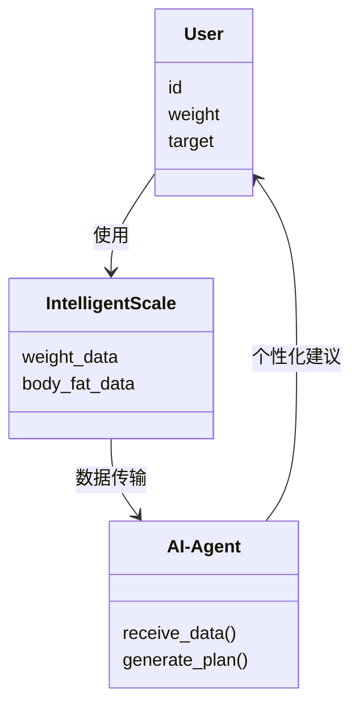

                 


# 智能体重秤：AI Agent的个性化健身计划生成

## 关键词：智能体重秤，AI Agent，个性化健身计划，机器学习，健康管理

## 摘要：智能体重秤通过集成AI Agent技术，能够根据用户的体重、体脂等数据，结合生活习惯和健康目标，生成个性化的健身计划。本文详细探讨了AI Agent的核心原理、算法实现、系统架构，以及如何在实际项目中应用这些技术，为用户提供智能化的健康管理和健身指导。

---

# 第一部分: 背景介绍

## 第1章: 智能体重秤的发展历程

### 1.1 传统体重秤的功能与局限性
传统体重秤仅能测量体重，功能单一，无法满足现代用户对健康数据的多样化需求。用户需要更多的健康数据和个性化的健康建议。

### 1.2 智能体重秤的出现与技术进步
随着物联网和人工智能技术的发展，智能体重秤应运而生。它不仅可以测量体重，还能记录体脂、肌肉量、水分含量等多维度数据，并通过AI技术为用户提供健康建议。

### 1.3 AI Agent在智能设备中的应用
AI Agent是一种智能软件代理，能够根据用户数据和需求，自主决策并提供个性化服务。在智能体重秤中，AI Agent负责数据处理、分析和个性化建议生成。

---

## 第2章: AI Agent的基本概念

### 2.1 什么是AI Agent
AI Agent是具有感知和行动能力的智能系统，能够根据输入数据和目标，执行任务并提供解决方案。在智能体重秤中，AI Agent负责接收数据、分析用户健康状况，并生成健身计划。

### 2.2 AI Agent的核心功能与特点
- **感知能力**：通过传感器获取体重、体脂等数据。
- **分析能力**：利用机器学习模型分析数据，评估健康状况。
- **决策能力**：根据分析结果，生成个性化建议。
- **自适应能力**：根据用户反馈调整建议。

### 2.3 AI Agent在健康领域的应用前景
AI Agent在健康管理中的应用潜力巨大，能够帮助用户制定科学的健身计划，改善生活习惯，提高健康水平。

---

# 第二部分: 核心概念与联系

## 第3章: AI Agent的核心原理

### 3.1 AI Agent的基本工作原理
AI Agent通过数据输入、分析和决策，生成个性化建议。在智能体重秤中，AI Agent接收用户的健康数据，分析后提供健身计划。

### 3.2 AI Agent的决策机制
AI Agent的决策基于规则和机器学习模型。规则系统用于简单的决策，而机器学习模型则用于复杂场景下的精准决策。

### 3.3 AI Agent与智能体重秤的交互方式
AI Agent通过智能体重秤收集数据，分析后将建议反馈给用户。整个过程包括数据传输、分析、决策和反馈。

## 第4章: AI Agent与智能体重秤的关系

### 4.1 实体关系图（ER图）
```mermaid
erd
  user
  intelligent_scale
  ai_agent
  user --> intelligent_scale: 使用
  intelligent_scale --> ai_agent: 数据传输
  ai_agent --> user: 个性化建议
```

### 4.2 交互流程图
```mermaid
flow
  用户使用智能体重秤称重
  智能体重秤收集数据
  AI Agent接收数据并分析
  AI Agent生成个性化健身计划
  AI Agent通过智能体重秤反馈给用户
```

---

# 第三部分: 算法原理讲解

## 第5章: AI Agent的算法实现

### 5.1 基于规则的AI Agent
基于规则的AI Agent通过预定义的规则生成建议。例如，如果用户的体脂率过高，系统会推荐低脂饮食和有氧运动。

### 5.2 基于机器学习的AI Agent
基于机器学习的AI Agent能够从大量数据中学习，生成更精准的建议。常用算法包括决策树和随机森林。

### 5.3 算法流程图
```mermaid
flow
  输入体重数据
  数据预处理
  特征提取
  模型训练/推理
  输出个性化建议
```

### 5.4 Python代码实现
```python
import pandas as pd
from sklearn.ensemble import RandomForestClassifier

def preprocess_data(data):
    # 数据预处理
    data = data.dropna()
    return data

def train_model(X, y):
    # 训练模型
    model = RandomForestClassifier()
    model.fit(X, y)
    return model

def generate_recommendation(model, user_data):
    # 生成推荐
    prediction = model.predict(user_data)
    return prediction
```

---

## 第6章: 健身计划生成的数学模型

### 6.1 健身目标的分类
用户分为减脂、增肌、健康维持三类。分类模型如下：
$$ y = f(x) $$
其中，$x$是用户数据，$y$是健身目标。

### 6.2 个性化推荐算法
基于用户数据和目标，生成推荐。例如：
$$ \text{减脂计划} = \{ \text{有氧运动}: 30\text{分钟/天}, \text{饮食建议}: \text{低脂饮食} \} $$

---

# 第四部分: 系统分析与架构设计

## 第7章: 系统功能设计

### 7.1 领域模型


### 7.2 系统架构设计


### 7.3 系统接口设计
主要接口包括数据采集、数据传输、建议生成和用户反馈。

---

## 第8章: 项目实战

### 8.1 环境安装
需要安装Python、机器学习库（如Scikit-learn）和数据可视化工具。

### 8.2 核心代码实现
```python
from sklearn.model_selection import train_test_split
from sklearn.metrics import accuracy_score

def main():
    data = pd.read_csv('health_data.csv')
    X = data.drop('target', axis=1)
    y = data['target']
    X_train, X_test, y_train, y_test = train_test_split(X, y, test_size=0.2)
    model = RandomForestClassifier()
    model.fit(X_train, y_train)
    prediction = model.predict(X_test)
    print(accuracy_score(y_test, prediction))

if __name__ == "__main__":
    main()
```

### 8.3 案例分析
通过实际案例分析，验证AI Agent生成的健身计划的有效性。

---

# 第五部分: 总结与展望

## 第9章: 总结
本文详细介绍了智能体重秤与AI Agent的结合，探讨了其在个性化健身计划生成中的应用，展示了系统的实现和实际案例。

## 第10章: 未来展望
未来，AI Agent将更加智能化，能够实时监测健康数据，动态调整健身计划，帮助用户实现健康目标。

---

# 最佳实践 tips

- **数据隐私**：确保用户数据的安全和隐私。
- **用户体验**：设计直观易用的用户界面。
- **持续优化**：定期更新模型，提高推荐精度。

---

# 小结
通过AI Agent，智能体重秤能够为用户提供科学、个性化的健身计划，帮助用户实现健康目标。

---

# 注意事项
- AI Agent的准确性依赖于数据的完整性和模型的训练。
- 用户应根据自身情况调整健身计划。

---

# 拓展阅读
建议阅读《人工智能与健康管理》、《机器学习在健康数据分析中的应用》等相关书籍和论文。

---

作者：AI天才研究院/AI Genius Institute & 禅与计算机程序设计艺术 /Zen And The Art of Computer Programming

