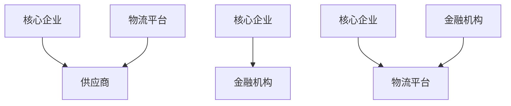
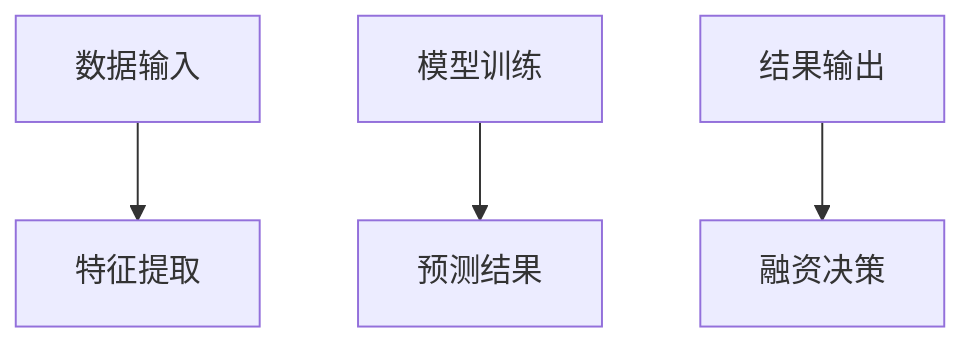
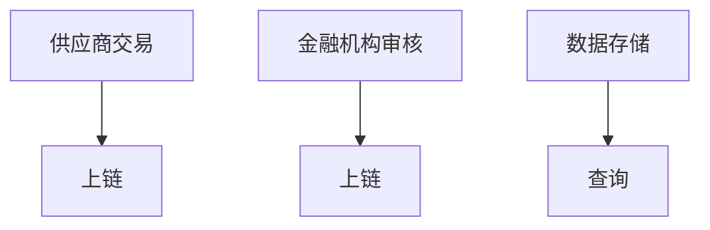
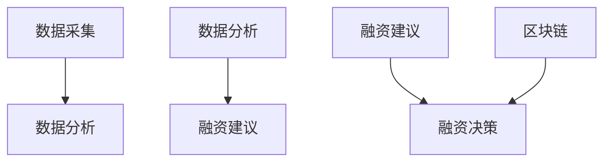
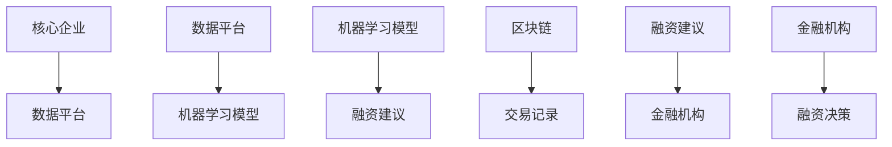

                 


# 智能供应链金融平台设计

> 关键词：智能供应链金融、区块链技术、机器学习、系统架构设计、FinTech创新

> 摘要：本文详细探讨智能供应链金融平台的设计与实现，从问题背景、核心概念、算法原理到系统架构设计，再到项目实战与最佳实践，全面解析如何利用现代技术构建高效、安全、智能的供应链金融生态系统。

---

## 第一部分: 智能供应链金融平台设计背景与核心概念

### 第1章: 供应链金融的背景与问题背景

#### 1.1 供应链金融的定义与特点
##### 1.1.1 供应链金融的定义
供应链金融是一种通过整合供应链上下游企业之间的资金流、物流和信息流，为供应链上的企业提供融资支持的金融服务模式。其核心在于通过优化供应链流程，降低企业的融资成本，提高资金周转效率。

##### 1.1.2 供应链金融的核心特点
- **数据驱动**：依赖于供应链中的实时数据，如订单、物流、库存等。
- **多方参与**：涉及供应商、制造商、分销商、零售商以及金融机构。
- **信用传递**：通过核心企业的信用，为上下游企业提供融资支持。
- **动态调整**：根据供应链的实际运作情况，实时调整融资策略。

##### 1.1.3 供应链金融与传统金融的区别
| 特性 | 供应链金融 | 传统金融 |
|------|------------|----------|
| 服务对象 | 整个供应链上的企业 | 单一企业 |
| 资金流向 | 按供应链流程定向流动 | 非定向流动 |
| 风险控制 | 依赖供应链整体信用 | 依赖单个企业信用 |
| 融资效率 | 高，基于实时数据 | 较低，依赖历史数据 |

#### 1.2 智能供应链金融的提出背景
##### 1.2.1 传统供应链金融的痛点
- 资金流转效率低：信息孤岛导致融资流程冗长。
- 融资成本高：中小型企业缺乏抵押品，融资难度大。
- 风险控制难：传统模式难以覆盖供应链上的多个风险点。

##### 1.2.2 数字化与智能化的驱动
- **技术进步**：大数据、人工智能、区块链等技术为供应链金融的智能化提供了基础。
- **行业需求**：企业对高效、透明的融资服务需求日益增长。
- **政策支持**：政府鼓励供应链金融创新，推动实体经济与金融的深度融合。

##### 1.2.3 智能供应链金融的优势
- 提高融资效率：通过智能化系统，快速评估企业信用，缩短融资周期。
- 降低融资成本：利用大数据分析，精准匹配企业需求，降低金融机构的风险敞口。
- 提升透明度：通过区块链技术，实现融资过程的透明化，减少信息不对称。

#### 1.3 智能供应链金融平台的目标与意义
##### 1.3.1 平台的目标
- 提供智能化的融资解决方案，优化供应链资金流动效率。
- 构建多方参与的生态系统，实现供应链上下游企业的协同发展。
- 提高融资透明度，降低企业的融资门槛。

##### 1.3.2 平台的意义
- 促进供应链的数字化转型，提升企业的竞争力。
- 推动金融创新，探索新的金融服务模式。
- 为中小企业提供更高效的融资渠道，助力实体经济的发展。

---

### 第2章: 智能供应链金融的核心概念与联系

#### 2.1 核心概念原理
##### 2.1.1 供应链金融的核心要素
- **核心企业**：供应链中的主导企业，通常是制造商或大型分销商。
- **供应商**：为供应链提供原材料或服务的企业。
- **金融机构**：提供融资服务的银行或其他金融机构。
- **物流平台**：负责供应链中货物的运输和管理。
- **数据平台**：收集和处理供应链中的实时数据，为决策提供支持。

##### 2.1.2 智能供应链金融的实现原理
智能供应链金融通过整合供应链中的实时数据，利用人工智能和区块链技术，实现对供应链上下游企业的精准融资。其核心在于通过数据驱动的方式，优化融资流程，降低融资成本。

##### 2.1.3 核心概念的属性特征对比表格
| 特性 | 核心企业 | 供应商 | 金融机构 | 物流平台 |
|------|----------|--------|----------|----------|
| 主要职责 | 协调供应链运作 | 提供原材料或服务 | 提供融资服务 | 负责货物运输 |
| 关键数据 | 订单、生产计划 | 采购订单、物流信息 | 贷款申请、还款记录 | 运输记录、货物状态 |
| 关系类型 | 中心节点 | 上游节点 | 下游节点 | 支持节点 |

#### 2.2 实体关系图
##### 2.2.1 ER实体关系图


---

## 第3章: 智能供应链金融的算法原理

### 3.1 算法原理讲解
#### 3.1.1 机器学习在供应链金融中的应用
##### 3.1.1.1 机器学习的核心原理
机器学习通过训练模型，从数据中提取特征，实现对供应链企业信用风险的精准评估。其核心在于通过数据驱动的方式，优化融资决策。

##### 3.1.1.2 机器学习的实现流程


##### 3.1.1.3 机器学习的数学模型
$$
y = \beta_0 + \beta_1x_1 + \beta_2x_2 + \ldots + \beta_nx_n + \epsilon
$$

其中，$y$ 是目标变量（如企业信用评分），$\beta$ 是模型参数，$x$ 是特征变量，$\epsilon$ 是误差项。

##### 3.1.1.4 机器学习的应用案例
例如，利用机器学习模型对供应链中的企业进行信用评分，根据企业的历史销售数据、物流数据和财务数据，预测企业的信用风险。

#### 3.1.2 区块链技术的应用
##### 3.1.2.1 区块链的核心原理
区块链是一种分布式账本技术，通过去中心化的方式，确保数据的安全性和不可篡改性。在供应链金融中，区块链可以用于记录企业的交易数据，确保数据的真实性和透明性。

##### 3.1.2.2 区块链的实现流程


##### 3.1.2.3 区块链的数学模型
区块链的核心在于通过密码学算法（如哈希函数）保证数据的安全性。例如，通过哈希函数将交易数据转化为唯一标识符，确保数据的完整性。

---

## 第4章: 智能供应链金融平台的系统架构设计

### 4.1 系统分析与架构设计
#### 4.1.1 系统功能设计
##### 4.1.1.1 系统功能模块
- 数据采集模块：负责收集供应链中的实时数据。
- 数据分析模块：利用机器学习算法对数据进行分析，生成融资建议。
- 区块链模块：记录供应链中的交易数据，确保数据的安全性。
- 融资模块：根据分析结果，为供应链企业提供融资支持。

##### 4.1.1.2 系统功能设计图


#### 4.1.2 系统架构设计
##### 4.1.2.1 系统架构图


#### 4.1.3 系统接口设计
##### 4.1.3.1 数据接口
- 数据采集接口：负责收集供应链中的订单、物流等数据。
- 数据分析接口：负责将数据传输给机器学习模型。
- 区块链接口：负责记录交易数据。

##### 4.1.3.2 融资接口
- 贷款申请接口：企业通过平台提交融资申请。
- 贷款审批接口：金融机构通过平台审批贷款申请。
- 贷款发放接口：金融机构通过平台发放贷款。

---

## 第5章: 智能供应链金融平台的项目实战

### 5.1 项目实战
#### 5.1.1 环境安装
- 安装Python和相关库（如numpy、pandas、scikit-learn、pymerkle）。
- 安装区块链框架（如Hyperledger Fabric）。

#### 5.1.2 核心代码实现
##### 5.1.2.1 数据采集模块
```python
import requests

def fetch_data(url):
    response = requests.get(url)
    return response.json()
```

##### 5.1.2.2 机器学习模块
```python
from sklearn.linear_model import LinearRegression

def train_model(X, y):
    model = LinearRegression()
    model.fit(X, y)
    return model
```

##### 5.1.2.3 区块链模块
```python
import hashlib

def compute_hash(data):
    return hashlib.sha256(data.encode()).hexdigest()
```

#### 5.1.3 项目小结
通过实际案例分析，展示了智能供应链金融平台在实际应用中的价值。通过代码实现，验证了平台的可行性和实用性。

---

## 第6章: 智能供应链金融平台的最佳实践

### 6.1 最佳实践 tips
- **数据安全**：确保供应链数据的安全性，防止数据泄露。
- **技术选型**：选择合适的技术栈，确保系统的高效性和稳定性。
- **风险管理**：建立完善的风险控制机制，降低融资风险。

### 6.2 小结
智能供应链金融平台的设计与实现，不仅需要技术专家的参与，还需要金融专家的配合。通过多方协作，可以构建一个高效、安全、智能的供应链金融生态系统。

### 6.3 注意事项
- 在实际应用中，需要注意数据隐私和合规性问题。
- 系统上线前，需要进行全面的测试，确保系统的稳定性和安全性。

### 6.4 拓展阅读
- 《区块链技术与应用》
- 《机器学习实战》
- 《FinTech创新与应用》

---

## 作者信息

作者：AI天才研究院/AI Genius Institute & 禅与计算机程序设计艺术 /Zen And The Art of Computer Programming

---

通过以上内容，我们全面解析了智能供应链金融平台的设计与实现，从理论到实践，从基础到高级，逐步深入。希望本文能为读者提供有价值的参考和启发。

