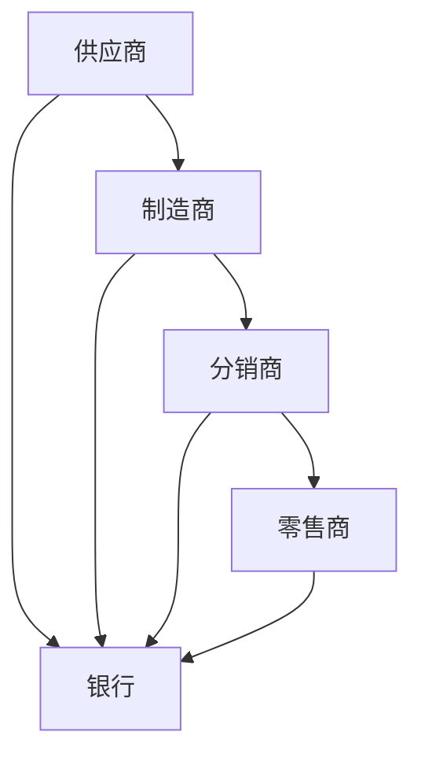
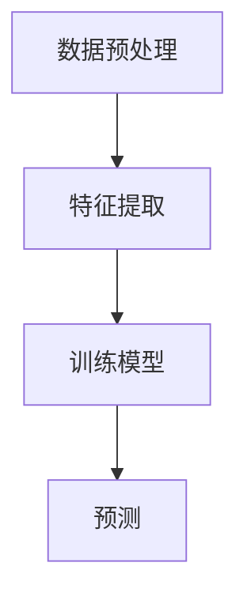
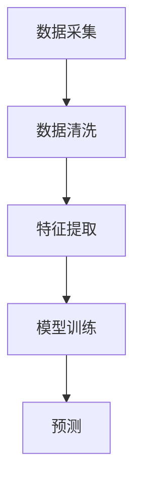
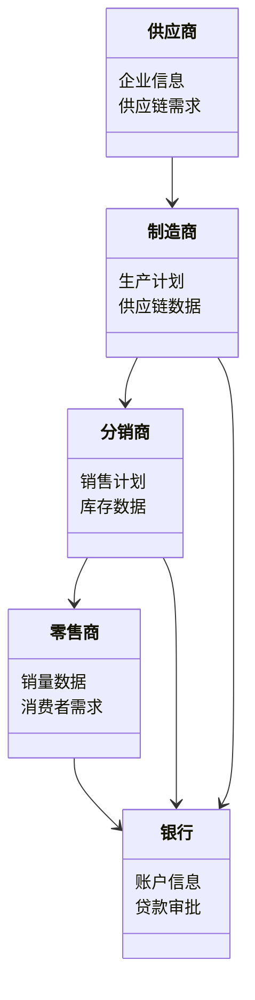
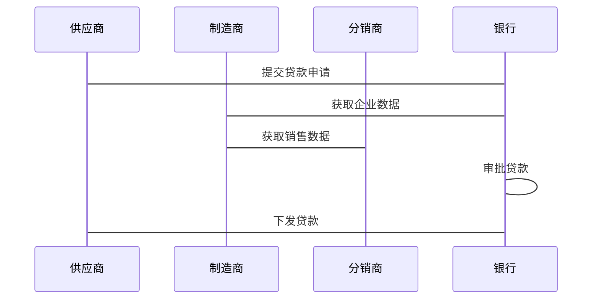

                 


# 智能供应链金融解决方案

## 关键词：供应链金融，智能技术，风险管理，大数据，人工智能

## 摘要：智能供应链金融解决方案是通过人工智能和大数据技术优化传统供应链金融的流程和效率。本文将从背景、核心概念、算法原理、系统架构、项目实战到最佳实践，全面解析智能供应链金融的实现路径。

---

# 第1章：供应链金融概述

## 1.1 问题背景

供应链金融是指通过整合供应链上的企业，提供融资、结算、风险管理等服务，以提高供应链整体效率和降低风险的金融活动。传统的供应链金融存在以下问题：

- **信息不对称**：上下游企业之间的信息不透明，导致融资困难。
- **效率低下**：传统流程依赖人工审核，耗时长且易出错。
- **风险控制不足**：缺乏实时数据支持，难以精准评估风险。

智能供应链金融通过引入大数据、人工智能等技术，解决了这些问题。

---

## 1.2 供应链金融的核心要素

供应链金融的核心要素包括：

1. **供应链参与方**：供应商、制造商、分销商、零售商等。
2. **资金流**：融资、结算等金融服务。
3. **信息流**：数据采集、分析和共享。
4. **物流**：货物的流转和监控。

---

# 第2章：智能供应链金融的核心概念

## 2.1 智能供应链金融的原理

智能供应链金融通过以下方式实现优化：

- **智能风控**：利用机器学习模型分析历史数据，预测风险。
- **数据驱动决策**：通过大数据分析，优化供应链中的资源配置。

---

## 2.2 传统供应链金融与智能供应链金融的对比

| 对比维度             | 传统供应链金融                     | 智能供应链金融                     |
|----------------------|------------------------------------|------------------------------------|
| 数据来源             | 线下报表、人工审核                 | 大数据、实时监控                 |
| 风险评估方式         | 人工评估                           | 机器学习模型自动评估             |
| 效率                 | 较低                              | 高                                |
| 成本                 | 高                                | 低                                |

---

## 2.3 实体关系图



---

# 第3章：算法原理讲解

## 3.1 机器学习算法

### 3.1.1 分类算法



代码实现：

```python
import pandas as pd
from sklearn.model_selection import train_test_split
from sklearn.linear_model import LogisticRegression

# 数据加载与预处理
data = pd.read_csv('data.csv')
X = data.drop('label', axis=1)
y = data['label']

# 划分训练集和测试集
X_train, X_test, y_train, y_test = train_test_split(X, y, test_size=0.2)

# 模型训练
model = LogisticRegression()
model.fit(X_train, y_train)

# 预测与评估
print(model.score(X_test, y_test))
```

### 3.1.2 数学模型

$$ P(y=1|x) = \frac{e^{(\beta_0 + \beta_1 x)}}{1 + e^{(\beta_0 + \beta_1 x)}} $$

---

## 3.2 时间序列分析

### 3.2.1 预测流程图



代码实现：

```python
from statsmodels.tsa.arima_model import ARIMA

# 数据加载与训练
data = pd.read_csv('time_series.csv')
model = ARIMA(data, order=(1, 1, 1))
model_fit = model.fit()

# 预测
forecast = model_fit.forecast(steps=5)
print(forecast)
```

---

# 第4章：系统分析与架构设计

## 4.1 问题场景

企业希望通过智能供应链金融系统优化供应链中的资金流动和风险控制。

---

## 4.2 领域模型设计



---

## 4.3 系统架构设计

```mermaid
rectangle 数据库 {
    供应链数据
    交易记录
}
rectangle 应用层 {
    数据采集模块
    风险评估模块
    决策支持模块
}
rectangle 接口层 {
    API接口
}
rectangle 表现层 {
    用户界面
}
```

---

## 4.4 接口与交互设计



---

# 第5章：项目实战

## 5.1 环境安装

安装Python和相关库：

```bash
pip install numpy pandas scikit-learn
```

---

## 5.2 核心代码实现

```python
import pandas as pd
from sklearn.ensemble import RandomForestClassifier

# 数据加载
data = pd.read_csv('data.csv')
X = data.drop('label', axis=1)
y = data['label']

# 模型训练
model = RandomForestClassifier()
model.fit(X, y)

# 预测
print(model.predict(X))
```

---

## 5.3 案例分析

以某汽车制造企业的供应链为例，通过智能风控模型评估供应商的信用风险，优化融资流程。

---

## 5.4 项目小结

智能供应链金融系统通过大数据和人工智能技术，显著提高了供应链的效率和风险控制能力。

---

# 第6章：最佳实践

## 6.1 小结

智能供应链金融通过技术创新，解决了传统供应链金融的痛点。

---

## 6.2 注意事项

- 数据隐私和安全需严格保护。
- 模型的可解释性需关注。
- 系统的实时性和稳定性需保证。

---

## 6.3 拓展阅读

建议阅读《供应链金融：理论与实践》和《人工智能在金融领域的应用》。

---

# 作者

作者：AI天才研究院/AI Genius Institute & 禅与计算机程序设计艺术/Zen And The Art of Computer Programming

