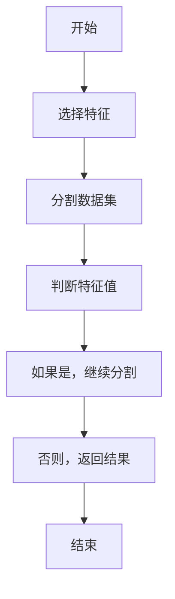
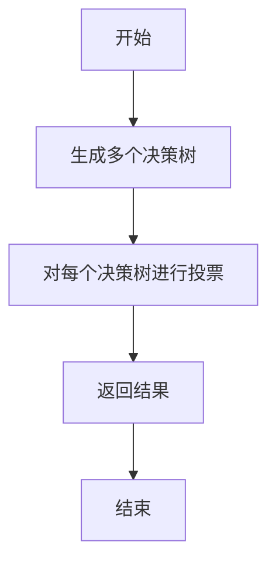
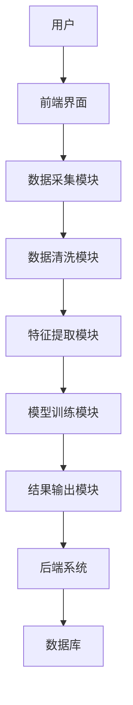

                 


# 《智能保险理赔处理系统》

---

## 关键词：智能保险理赔，人工智能，系统架构，机器学习算法，保险行业数字化转型

---

## 摘要：  
本文详细探讨了智能保险理赔处理系统的构建与应用。通过分析保险行业的现状与挑战，阐述了智能理赔处理系统的必要性与核心功能。文章从数据采集、特征提取、模型训练等核心概念入手，结合决策树、随机森林等机器学习算法，详细讲解了系统的算法原理与实现。通过系统架构设计、项目实战与案例分析，展示了智能保险理赔处理系统的实际应用场景与优化方案，为保险行业的数字化转型提供了有力的技术支持。

---

## 正文

---

### 第1章: 智能保险理赔处理系统背景介绍

#### 1.1 保险行业的现状与挑战  
保险行业作为金融领域的重要组成部分，近年来正经历着数字化转型的浪潮。传统的保险理赔流程依赖人工操作，存在效率低、误差大、成本高等问题。例如，理赔申请的处理周期长，容易因为信息不全或复杂性而延误。此外，保险公司还面临欺诈风险，传统的人工审核方式难以及时识别和处理虚假理赔。

#### 1.2 智能保险理赔处理系统的定义与目标  
智能保险理赔处理系统是一种基于人工智能技术的自动化理赔处理系统，旨在通过数据采集、特征提取和模型训练，实现理赔申请的智能审核、风险评估和结果输出。其核心目标包括：  
- 提高理赔处理效率，缩短客户等待时间。  
- 准确识别欺诈行为，降低保险公司的财务风险。  
- 提供个性化的理赔建议，提升客户满意度。  

#### 1.3 智能保险理赔处理系统的组成要素  
智能保险理赔处理系统由以下几个关键部分组成：  
1. **数据源**：包括保单信息、理赔申请、历史记录等。  
2. **处理流程**：包括数据清洗、特征提取、模型训练和结果输出。  
3. **输出结果**：包括理赔金额、处理建议和风险提示。  

---

### 第2章: 智能保险理赔处理系统的核心概念与联系

#### 2.1 核心概念原理  
智能保险理赔处理系统的实现依赖以下几个核心概念：  
- **数据采集与预处理**：从多种数据源获取理赔相关信息，并进行清洗和标准化处理。  
- **特征提取与模型训练**：从数据中提取关键特征，构建机器学习模型进行分类或回归预测。  
- **结果输出与反馈优化**：根据模型输出结果，生成理赔建议，并通过反馈机制优化模型性能。  

#### 2.2 核心概念属性特征对比表  
以下是核心概念的关键属性对比表：  

| 特征       | 描述                                                         | 示例                             |
|------------|--------------------------------------------------------------|----------------------------------|
| 数据源      | 输入数据的来源                                             | 保单信息、理赔申请、历史记录     |
| 处理流程    | 数据处理的步骤                                             | 数据清洗、特征提取、模型训练     |
| 输出结果    | 系统的输出形式                                             | 理赔金额、处理建议、风险提示     |

#### 2.3 ER实体关系图  
以下是系统的ER实体关系图：  

```mermaid
er
actor: 用户
system: 智能保险理赔处理系统
database: 保险数据库
actor --> system: 提交理赔申请
system --> database: 查询历史记录
database --> system: 返回理赔相关信息
system --> actor: 输出处理结果
```

---

### 第3章: 智能保险理赔处理系统的算法原理

#### 3.1 常见算法及其流程图  
以下是常用的算法及其流程图：  

##### 3.1.1 决策树算法  


##### 3.1.2 随机森林算法  


#### 3.2 算法的数学模型与公式  
##### 3.2.1 决策树的分类函数  
决策树的分类函数可以表示为：  
$$f(x) = \text{sign}(\sum_{i=1}^{n} \alpha_i h_i(x))$$  
其中，$\alpha_i$ 是权重，$h_i(x)$ 是基函数。  

##### 3.2.2 随机森林的集成学习公式  
随机森林的预测结果可以表示为：  
$$\hat{y} = \frac{1}{N} \sum_{i=1}^{N} h_i(x)$$  
其中，$N$ 是决策树的数量，$h_i(x)$ 是第 $i$ 棵树的预测结果。  

#### 3.3 算法实现的Python代码示例  
以下是决策树算法的Python实现示例：  

```python
from sklearn.tree import DecisionTreeClassifier
from sklearn.model_selection import train_test_split

# 数据预处理
X = ...  # 特征矩阵
y = ...  # 标签向量

# 划分训练集和测试集
X_train, X_test, y_train, y_test = train_test_split(X, y, test_size=0.2)

# 初始化决策树模型
model = DecisionTreeClassifier()

# 训练模型
model.fit(X_train, y_train)

# 预测结果
y_pred = model.predict(X_test)

# 输出准确率
print("Accuracy:", model.score(X_test, y_test))
```

---

### 第4章: 智能保险理赔处理系统的系统分析与架构设计

#### 4.1 问题场景介绍  
智能保险理赔处理系统需要解决的主要问题是：  
- 理赔申请的快速审核。  
- 欺诈行为的识别与防范。  
- 理赔结果的个性化输出。  

#### 4.2 项目介绍  
本项目旨在构建一个基于机器学习的智能保险理赔处理系统，实现以下功能：  
- 自动化理赔申请处理。  
- 风险评估与欺诈检测。  
- 理赔结果的个性化建议。  

#### 4.3 系统功能设计  
以下是系统的功能模块设计：  

##### 4.3.1 数据采集模块  
- 从多种数据源（如保单信息、理赔申请、历史记录）获取数据。  
- 数据清洗与标准化处理。  

##### 4.3.2 特征提取模块  
- 提取关键特征（如保单金额、理赔金额、历史理赔记录等）。  
- 构建特征向量。  

##### 4.3.3 模型训练模块  
- 使用决策树、随机森林等算法训练模型。  
- 优化模型参数，提高预测准确率。  

##### 4.3.4 结果输出模块  
- 根据模型输出结果生成理赔建议。  
- 提供风险提示和欺诈检测结果。  

#### 4.4 系统架构设计  
以下是系统的架构图：  



---

### 第5章: 智能保险理赔处理系统的项目实战

#### 5.1 环境安装与配置  
- 安装Python和必要的机器学习库（如scikit-learn、pandas等）。  
- 安装Jupyter Notebook或其他开发工具。  

#### 5.2 系统核心功能实现  
##### 5.2.1 数据预处理  
```python
import pandas as pd

# 加载数据
df = pd.read_csv('insurance_claims.csv')

# 数据清洗
df.dropna(inplace=True)
df = pd.get_dummies(df)
```

##### 5.2.2 模型训练  
```python
from sklearn.ensemble import RandomForestClassifier

# 初始化模型
model = RandomForestClassifier(n_estimators=100, random_state=42)

# 训练模型
model.fit(X_train, y_train)

# 预测结果
y_pred = model.predict(X_test)
```

##### 5.2.3 结果输出  
```python
# 输出准确率
print("Accuracy:", accuracy_score(y_test, y_pred))

# 输出混淆矩阵
print(classification_report(y_test, y_pred))
```

#### 5.3 实际案例分析  
以下是实际案例分析：  
- 案例背景：客户提交了一份高额理赔申请，系统需要判断是否存在欺诈行为。  
- 系统处理：通过特征提取和模型预测，系统识别出该理赔申请存在较高的欺诈风险，并生成相应的风险提示。  
- 结果输出：系统建议拒绝理赔申请，并提供进一步的调查建议。  

---

### 第6章: 总结与展望

#### 6.1 总结  
智能保险理赔处理系统通过结合人工智能技术，显著提高了保险理赔的效率和准确性。系统的实现依赖于数据采集、特征提取和模型训练等核心环节，同时结合决策树、随机森林等算法，确保了系统的高效性和准确性。

#### 6.2 优缺点分析  
- **优点**：  
  - 提高了理赔处理效率。  
  - 准确识别欺诈行为，降低财务风险。  
  - 提供个性化理赔建议，提升客户满意度。  
- **缺点**：  
  - 系统的初始搭建和调试成本较高。  
  - 对模型的依赖性较强，需要持续优化和更新。  

#### 6.3 未来展望  
未来的智能保险理赔处理系统将进一步优化算法，引入更先进的机器学习技术，如深度学习和强化学习。同时，系统将更加注重数据隐私和安全，确保客户信息的安全性。

---

## 最佳实践 tips  
- 在数据预处理阶段，尽量减少数据冗余，提高数据质量。  
- 在模型训练阶段，注意参数调优，确保模型的泛化能力。  
- 在系统部署阶段，确保系统的可扩展性和可维护性。  

---

## 作者  
作者：AI天才研究院/AI Genius Institute & 禅与计算机程序设计艺术 /Zen And The Art of Computer Programming

