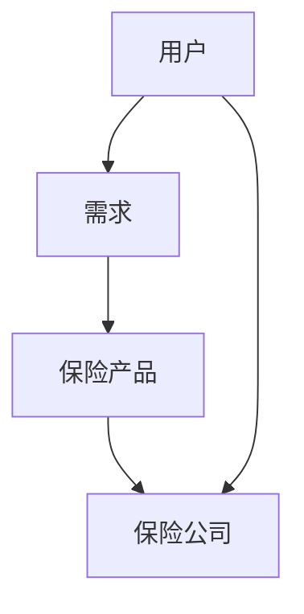
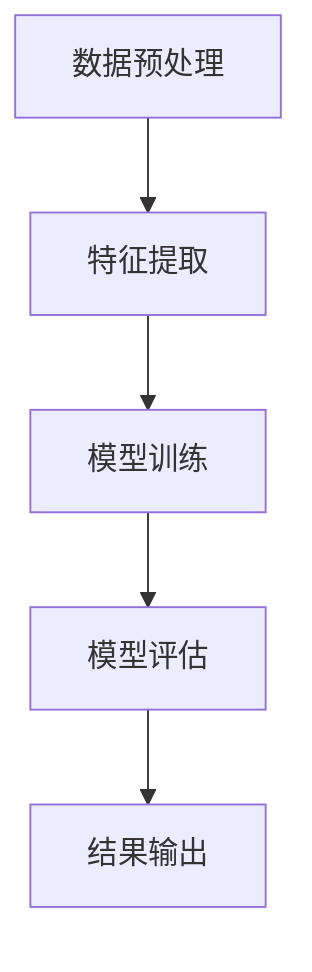

                 


# 智能保险需求评估工具

> 关键词：保险需求评估、人工智能、智能工具、需求分析、系统架构

> 摘要：智能保险需求评估工具利用人工智能技术，通过分析用户数据和保险产品特征，自动评估保险需求，优化保险服务。本文从背景、概念、算法、系统架构到项目实战，全面解析智能保险需求评估工具的实现与应用。

---

# 第1章: 智能保险需求评估工具的背景介绍

## 1.1 保险行业的现状与挑战
保险行业正面临数字化转型的浪潮，传统的需求评估方法存在效率低、精准度不足的问题。随着大数据和人工智能技术的发展，保险公司亟需智能工具来提升服务质量和效率。

## 1.2 保险需求评估的核心问题
保险需求评估需要考虑用户的基本信息、财务状况、健康状况等因素，传统方法难以全面覆盖和精准匹配。

## 1.3 智能保险需求评估工具的定义与目标
定义：利用AI技术分析用户数据，评估保险需求并推荐合适产品。
目标：提高评估效率和准确性，优化用户体验和保险公司的服务流程。

## 1.4 本章小结
本章介绍了保险行业背景、需求评估的核心问题以及智能工具的必要性。

---

# 第2章: 智能保险需求评估工具的核心概念与联系

## 2.1 核心概念的原理与特征
- 数据驱动分析：通过用户数据提取特征，构建需求模型。
- 人工智能应用：使用机器学习和深度学习技术进行预测和推荐。
- 知识图谱构建：整合保险知识，辅助需求分析。

## 2.2 核心概念的属性特征对比
| 特性 | 数据驱动分析 | AI技术应用 | 知识图谱构建 |
|------|----------------|-------------|----------------|
| 优势 | 高精度 | 智能推荐 | 知识整合 |
| 动态性 | 高 | 高 | 中 |

## 2.3 ER实体关系图


## 2.4 本章小结
本章详细阐述了智能保险需求评估工具的核心概念及其相互关系。

---

# 第3章: 智能保险需求评估工具的算法原理

## 3.1 算法原理概述
- 机器学习模型：用于分类和回归分析。
- 深度学习模型：处理非结构化数据。

## 3.2 算法流程图


## 3.3 算法实现代码示例
```python
import pandas as pd
from sklearn.model_selection import train_test_split
from sklearn.ensemble import RandomForestClassifier

data = pd.read_csv('insurance.csv')
X = data[['age', 'sex', 'income']]
y = data['insurance_need']

X_train, X_test, y_train, y_test = train_test_split(X, y, test_size=0.2)

model = RandomForestClassifier()
model.fit(X_train, y_train)
score = model.score(X_test, y_test)
print(f'Accuracy: {score}')
```

## 3.4 数学模型与公式
$$ \text{概率} = \frac{\text{符合需求的用户数}}{\text{总用户数}} $$

## 3.5 本章小结
本章详细讲解了算法原理和实现过程。

---

# 第4章: 智能保险需求评估工具的系统分析与架构设计

## 4.1 系统功能设计
- 数据采集模块：收集用户信息。
- 模型计算模块：评估需求。
- 推荐模块：推荐保险产品。

## 4.2 系统架构图


## 4.3 接口与交互设计
- 接口：REST API。
- 交互：用户输入信息，系统返回推荐结果。

## 4.4 本章小结
本章详细分析了系统的架构设计和功能模块。

---

# 第5章: 智能保险需求评估工具的项目实战

## 5.1 环境搭建
- 安装Python和相关库：pandas、scikit-learn。

## 5.2 核心代码实现
```python
from flask import Flask, request, jsonify

app = Flask(__name__)

@app.route('/evaluate', methods=['POST'])
def evaluate():
    data = request.json
    # 数据处理和模型计算
    return jsonify({'result': '保险需求匹配成功'})

if __name__ == '__main__':
    app.run(debug=True)
```

## 5.3 案例分析
通过实际案例分析工具的应用效果，验证其准确性和效率。

## 5.4 项目总结
总结项目成果，分析优缺点。

## 5.5 本章小结
本章通过实战项目展示了工具的应用和实现。

---

# 第6章: 智能保险需求评估工具的最佳实践与总结

## 6.1 最佳实践
- 数据质量：确保数据准确性和完整性。
- 模型优化：定期更新和调优模型。

## 6.2 小结
智能保险需求评估工具通过AI技术提升了保险服务的效率和精准度。

## 6.3 注意事项
- 数据隐私保护。
- 模型的可解释性。

## 6.4 拓展阅读
推荐相关书籍和论文，供读者深入学习。

## 6.5 本章小结
本章总结了工具的应用经验和未来发展方向。

---

# 作者
作者：AI天才研究院 & 禅与计算机程序设计艺术

