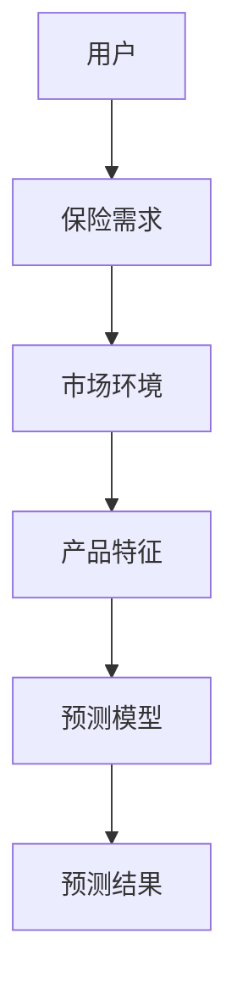
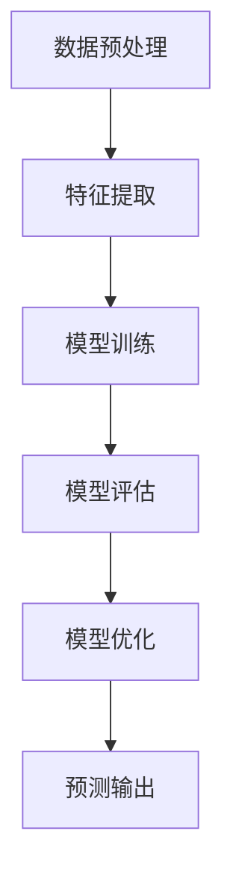
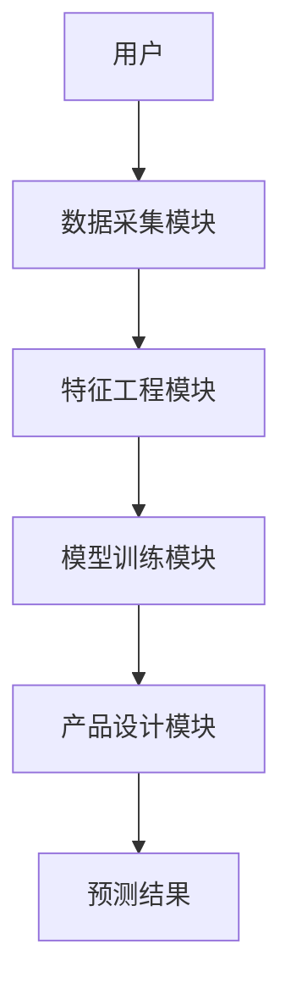
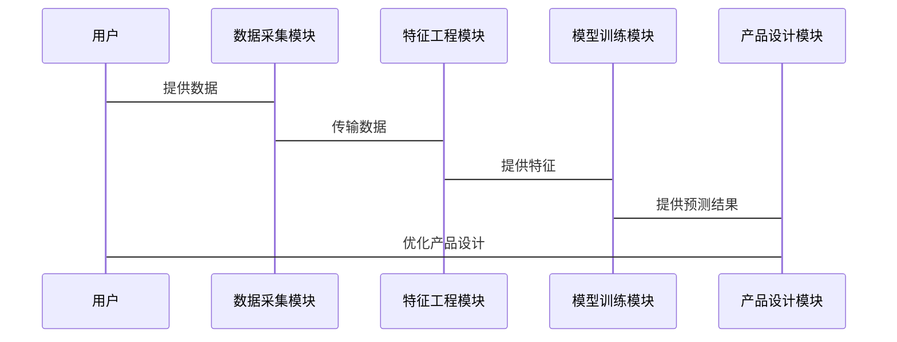

                 


# 智能保险需求预测与产品设计系统

## 关键词
智能保险，需求预测，产品设计，人工智能，机器学习

## 摘要
智能保险需求预测与产品设计系统是一种结合人工智能技术的创新解决方案，旨在通过数据驱动的方法，精准预测保险需求并优化产品设计。本文将从背景、核心概念、算法原理、系统架构、项目实战等多个方面详细探讨这一系统的设计与实现，为保险行业提供智能化转型的实践指导。

---

## 第一部分: 智能保险需求预测与产品设计系统概述

### 第1章: 智能保险需求预测的背景与意义

#### 1.1 保险行业的现状与挑战
保险行业正面临数字化转型的挑战。传统保险业务依赖人工经验判断，存在效率低、精准度差等问题。随着大数据和人工智能技术的发展，智能保险需求预测成为行业创新的重要方向。

#### 1.2 智能保险需求预测的定义与目标
智能保险需求预测通过收集和分析大量数据，利用机器学习算法，预测用户对保险产品的需求，从而优化产品设计和市场推广策略。

#### 1.3 保险需求预测的核心要素
- **用户行为分析**：通过用户的历史购买记录、浏览行为等数据，分析用户的保险需求。
- **市场环境影响**：考虑经济波动、政策变化等因素对保险需求的影响。
- **产品特征提取**：分析保险产品的特性，如保费、保障范围等。

### 第2章: 保险需求预测的核心概念与联系

#### 2.1 核心概念原理
- **数据驱动的保险需求分析**：利用大数据技术，从海量数据中提取有用信息。
- **智能算法的应用原理**：通过机器学习算法，建立预测模型，实现需求预测。
- **保险产品设计的优化逻辑**：根据预测结果，优化产品设计，满足用户需求。

#### 2.2 核心概念属性特征对比表
| 特征维度 | 传统保险需求预测 | 智能保险需求预测 |
|----------|------------------|------------------|
| 数据来源 | 结构化数据为主    | 结构化+非结构化数据 |
| 预测方法 | 统计模型为主      | 机器学习+深度学习 |
| 预测精度 | 较低            | 较高            |
| 适用场景 | 简单场景         | 复杂场景         |

#### 2.3 ER实体关系图


### 第3章: 智能保险需求预测的算法原理

#### 3.1 算法流程图


#### 3.2 算法实现
- **数据预处理**：清洗数据，处理缺失值、异常值。
- **特征提取**：选择重要的特征，如用户年龄、收入水平等。
- **模型训练**：使用机器学习算法（如随机森林、神经网络）训练模型。
- **模型评估**：通过准确率、召回率等指标评估模型性能。
- **模型优化**：调整模型参数，提升预测精度。

#### 3.3 数学公式
- **线性回归模型**：$$y = \beta_0 + \beta_1x_1 + \beta_2x_2 + \cdots + \beta_nx_n$$
- **决策树算法**：通过特征分裂，构建决策树模型，实现分类预测。

---

## 第二部分: 智能保险需求预测系统架构设计

### 第4章: 系统架构与功能设计

#### 4.1 系统功能模块
- **数据采集模块**：收集用户行为数据、市场数据等。
- **特征工程模块**：对数据进行特征提取和处理。
- **模型训练模块**：训练预测模型，生成预测结果。
- **产品设计模块**：根据预测结果，优化保险产品设计。

#### 4.2 系统架构图


#### 4.3 系统接口设计
- **数据接口**：与数据库或其他数据源对接。
- **模型接口**：与第三方AI平台对接，调用预测模型。

#### 4.4 系统交互流程


---

## 第三部分: 项目实战与代码实现

### 第5章: 项目实战

#### 5.1 环境安装
- **Python版本**：Python 3.8及以上。
- **依赖库安装**：numpy、pandas、scikit-learn、xgboost。

#### 5.2 核心代码实现

##### 数据预处理
```python
import pandas as pd
import numpy as np

# 读取数据
data = pd.read_csv('insurance.csv')

# 处理缺失值
data = data.dropna()

# 标准化处理
from sklearn.preprocessing import StandardScaler
scaler = StandardScaler()
data_scaled = scaler.fit_transform(data)
```

##### 特征提取
```python
from sklearn.feature_selection import SelectKBest
selector = SelectKBest(k=10)
selected_features = selector.fit_transform(data_scaled, labels)
```

##### 模型训练
```python
from sklearn.ensemble import RandomForestClassifier
model = RandomForestClassifier(n_estimators=100, max_depth=10)
model.fit(selected_features, labels)
```

##### 模型评估
```python
from sklearn.metrics import accuracy_score
y_pred = model.predict(selected_features)
print("Accuracy:", accuracy_score(labels, y_pred))
```

##### 模型优化
```python
from sklearn.model_selection import GridSearchCV
param_grid = {'n_estimators': [100, 200], 'max_depth': [10, 20]}
grid_search = GridSearchCV(RandomForestClassifier(), param_grid)
grid_search.fit(selected_features, labels)
print("Best Parameters:", grid_search.best_params_)
```

---

## 第四部分: 最佳实践与未来展望

### 第6章: 最佳实践与小结

#### 6.1 系统优势
- **高精度**：基于机器学习算法，预测精度显著提高。
- **实时性**：能够实时更新数据，快速响应市场变化。
- **可解释性**：通过特征重要性分析，了解影响需求的关键因素。

#### 6.2 实际应用中的注意事项
- 数据隐私保护：保险数据涉及用户隐私，需严格遵守数据保护法规。
- 模型更新：定期更新模型，确保预测结果的准确性。

#### 6.3 未来展望
- **多模态数据融合**：结合文本、图像等多种数据源，提升预测精度。
- **自动化产品设计**：基于预测结果，实现保险产品的自动化设计。
- **个性化服务**：通过用户画像，提供个性化保险产品推荐。

---

## 作者
作者：AI天才研究院/AI Genius Institute  
联系邮箱：contact@aicenter.com  
博客地址：https://blog.aicenter.com

