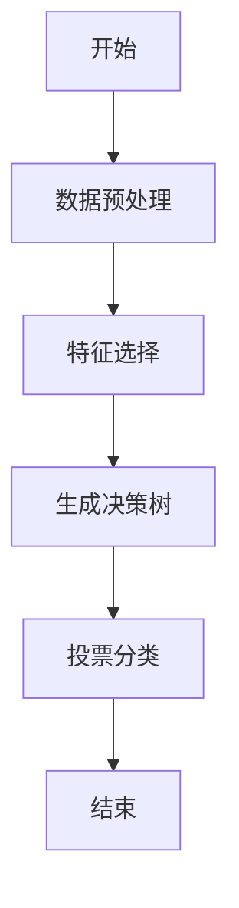
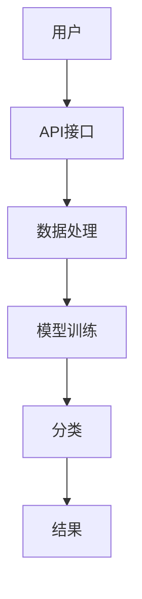
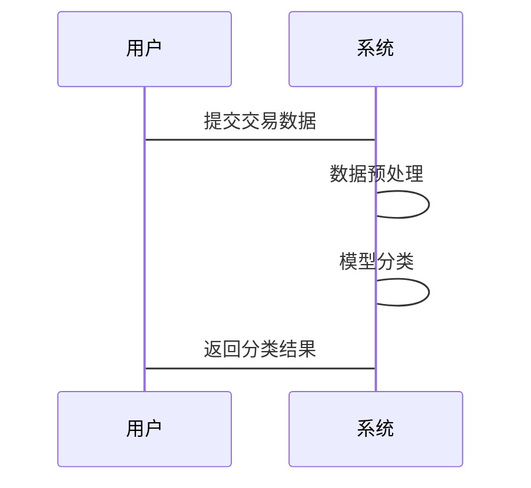

                 


# 智能信用卡支出分类系统

> 关键词：智能分类，信用卡支出，机器学习，随机森林，系统架构

> 摘要：智能信用卡支出分类系统利用机器学习算法，如随机森林，对交易数据进行分类。本文详细探讨了系统的背景、核心概念、算法实现、系统架构设计以及项目实战，展示了如何构建高效准确的分类系统。

---

# 第1章: 智能信用卡支出分类系统背景与目标

## 1.1 信用卡支出分类的背景

### 1.1.1 传统信用卡支出分类方式的局限性

传统信用卡支出分类依赖于规则或人工分类，存在以下问题：
- 规则复杂：需处理大量异常情况，难以覆盖所有场景。
- 人工成本高：需要大量人工审核，效率低。
- 易出错：规则无法完全匹配所有交易类型。

### 1.1.2 智能分类的必要性与优势

智能分类通过机器学习算法自动处理交易数据，优势显著：
- 高效性：快速分类大量交易。
- 准确性：模型可不断优化，提升分类准确率。
- 灵活性：适用于多种分类任务。

### 1.1.3 信用卡支出分类的业务价值

智能分类在金融领域具有重要价值：
- 提高客户满意度：减少分类错误带来的困扰。
- 风险控制：及时识别异常交易，预防欺诈。
- 数据驱动决策：为银行提供交易分析支持。

## 1.2 智能分类的核心概念与问题描述

### 1.2.1 智能分类的定义

智能信用卡支出分类系统是利用机器学习算法对信用卡交易数据进行分类的系统，实现自动、高效的分类过程。

### 1.2.2 系统需要解决的问题

系统需解决以下关键问题：
- 数据预处理：清洗和特征提取。
- 算法选择：选择适合的分类算法。
- 模型优化：提升分类准确率。

### 1.2.3 系统的目标与边界

系统目标：
- 实现交易分类自动化。
- 提高分类准确率和效率。

系统边界：
- 数据范围：交易记录、用户信息。
- 功能范围：分类、分析、监控。

## 1.3 本章小结

本章介绍了智能信用卡支出分类系统的背景、核心概念和目标，为后续章节奠定基础。

---

# 第2章: 智能信用卡支出分类系统的核心概念与联系

## 2.1 核心概念原理

### 2.1.1 分类算法的原理

分类算法将输入数据映射到预定义类别。监督学习是常用方法，通过训练数据学习决策函数。

### 2.1.2 数据预处理的重要性

数据预处理包括清洗、特征提取和标准化，确保模型输入有效。

### 2.1.3 模型评估标准

准确率、召回率、F1值和ROC-AUC是常用的评估指标。

## 2.2 核心概念属性特征对比

以下表格展示了核心特征及其属性：

| 特征 | 描述 | 示例 |
|------|------|------|
| 支出类型 | 消费类别 | 餐饮、购物、转账 |
| 交易金额 | 金额大小 | $100, $500, $1000 |
| 时间特征 | 交易时间 | 上午、下午、晚上 |
| 地点特征 | 交易地点 | 商店、线上、国外 |

## 2.3 ER实体关系图

```mermaid
er
    左侧: 用户
    中间: 交易
    右侧: 分类标签
    用户 --> 交易: 发起交易
    交易 --> 分类标签: 分类结果
```

## 2.4 本章小结

本章通过概念和图表分析了系统的数据结构和特征，为后续实现打下基础。

---

# 第3章: 分类算法原理与实现

## 3.1 分类算法的选择与比较

### 3.1.1 常见分类算法概述

常见算法包括决策树、随机森林、SVM和神经网络，各有优缺点。

### 3.1.2 机器学习与深度学习算法的对比

随机森林和神经网络在分类任务中的表现差异显著。

### 3.1.3 适合信用卡分类的算法选择

随机森林适合处理高维数据，分类准确率高。

## 3.2 随机森林算法原理

### 3.2.1 随机森林的基本原理

随机森林通过生成多个决策树并投票分类，降低过拟合风险。

### 3.2.2 随机森林的数学模型

随机森林基于袋装技术和特征子集，公式如下：

$$
y = \text{sign}\left(\sum_{i=1}^{n} \text{weight}_i \cdot y_i\right)
$$

### 3.2.3 随机森林的流程图



## 3.3 随机森林算法的Python实现

### 3.3.1 数据预处理代码

```python
import pandas as pd
from sklearn.ensemble import RandomForestClassifier
from sklearn.model_selection import train_test_split
from sklearn.metrics import accuracy_score

# 加载数据
data = pd.read_csv('transaction.csv')
# 分离特征和目标
X = data.drop('category', axis=1)
y = data['category']
# 划分训练集和测试集
X_train, X_test, y_train, y_test = train_test_split(X, y, test_size=0.2)
# 初始化模型
model = RandomForestClassifier(n_estimators=100, random_state=42)
# 训练模型
model.fit(X_train, y_train)
# 预测
y_pred = model.predict(X_test)
# 评估准确率
print("准确率:", accuracy_score(y_test, y_pred))
```

## 3.4 本章小结

本章详细讲解了随机森林算法的原理和实现，展示了如何使用Python代码构建分类模型。

---

# 第4章: 系统架构设计与实现

## 4.1 系统架构设计

### 4.1.1 系统功能模块划分

系统主要模块包括数据采集、预处理、模型训练和分类。

### 4.1.2 系统架构图



### 4.1.3 系统交互图



## 4.2 数据库设计

### 4.2.1 数据库表结构

| 列名         | 类型       | 描述                 |
|--------------|------------|----------------------|
| transaction_id | INT        | 交易ID               |
| user_id      | INT        | 用户ID               |
| amount       | DECIMAL    | 交易金额             |
| time         | DATETIME   | 交易时间             |
| location     | VARCHAR(50)| 交易地点             |
| category     | VARCHAR(50)| 分类结果             |

## 4.3 系统接口设计

### 4.3.1 API接口定义

- 接口：POST /classify
- 请求体：包含交易数据
- 响应：分类结果

### 4.3.2 接口实现代码

```python
from flask import Flask, request, jsonify

app = Flask(__name__)
model = RandomForestClassifier(...)

@app.route('/classify', methods=['POST'])
def classify():
    data = request.json
    prediction = model.predict(data)
    return jsonify({'category': prediction[0]})

if __name__ == '__main__':
    app.run()
```

## 4.4 本章小结

本章设计了系统的架构和接口，展示了如何构建高效的数据处理和分类系统。

---

# 第5章: 项目实战与优化

## 5.1 环境配置

### 5.1.1 安装依赖

```bash
pip install pandas sklearn flask
```

## 5.2 数据集处理

### 5.2.1 数据加载

```python
data = pd.read_csv('transactions.csv')
```

## 5.3 模型训练与优化

### 5.3.1 模型训练

```python
model.fit(X_train, y_train)
```

### 5.3.2 模型优化

调整超参数，如n_estimators和max_depth，提升准确率。

## 5.4 实际案例分析

### 5.4.1 案例分析

通过实际交易数据，展示模型如何分类交易。

## 5.5 本章小结

本章通过项目实战展示了系统的实现过程，并讨论了优化方法。

---

# 第6章: 系统部署与扩展

## 6.1 系统部署方案

### 6.1.1 部署步骤

- 打包应用
- 配置服务器
- 部署到云平台

## 6.2 系统扩展

### 6.2.1 模型更新

定期重新训练模型，保持分类准确率。

## 6.3 系统监控

### 6.3.1 监控指标

- 分类准确率
- 响应时间
- 错误率

## 6.4 本章小结

本章讨论了系统的部署和扩展策略，确保系统的稳定运行和性能优化。

---

# 第7章: 总结与展望

## 7.1 系统总结

智能信用卡支出分类系统利用机器学习算法实现了高效准确的交易分类，具有重要的应用价值。

## 7.2 未来展望

未来可进一步优化算法，引入深度学习模型，提升分类效果。

---

# 作者

作者：AI天才研究院 & 禅与计算机程序设计艺术

