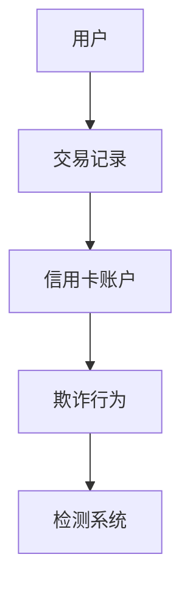
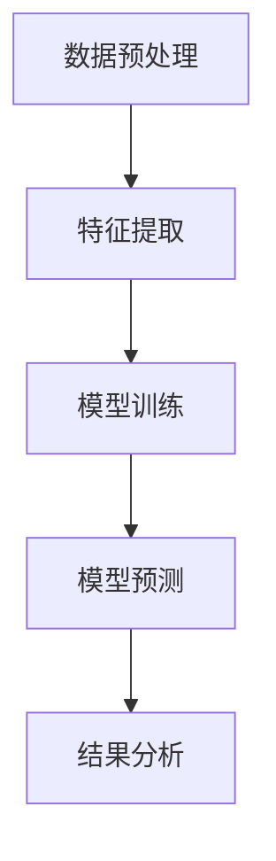
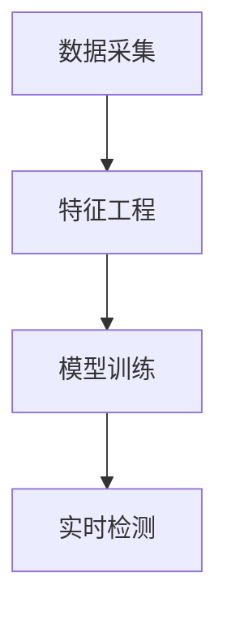
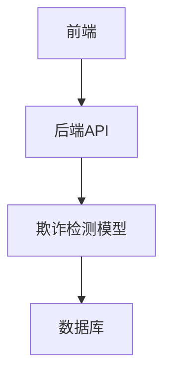
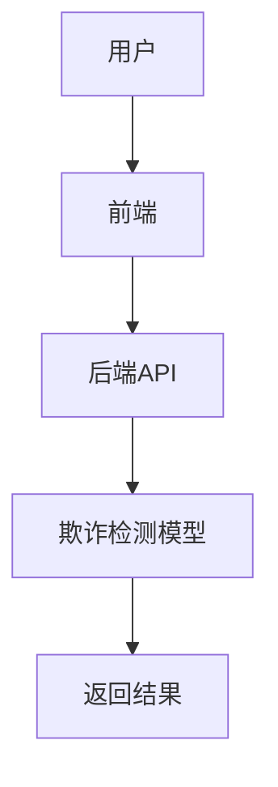

                 


# 智能信用卡欺诈检测系统

> 关键词：智能信用卡欺诈检测，人工智能，机器学习，金融安全，数据特征分析，监督学习，无监督学习

> 摘要：智能信用卡欺诈检测系统利用人工智能技术，通过分析交易数据和用户行为特征，构建高效的欺诈检测模型，从而提升金融安全水平。本文将从背景、原理、算法、系统架构到项目实战，全面解析智能信用卡欺诈检测系统的核心内容。

---

# 第一部分：智能信用卡欺诈检测系统概述

## 第1章：智能信用卡欺诈检测系统背景介绍

### 1.1 信用卡欺诈检测的重要性

#### 1.1.1 信用卡欺诈的现状与挑战
- 当前信用卡欺诈的主要形式：盗刷、伪卡、钓鱼攻击等。
- 欺诈行为对企业与个人的经济损失。
- 数据泄露与身份盗窃的严峻性。

#### 1.1.2 智能化欺诈检测的必要性
- 传统欺诈检测方法的局限性：规则依赖、效率低下。
- 数据量爆炸式增长的需求：实时性与准确性的双重挑战。
- 人工智能技术在金融领域的应用趋势。

#### 1.1.3 信用卡欺诈检测的核心目标
- 实时检测异常交易。
- 准确识别欺诈行为。
- 最小化误报与漏报。

### 1.2 信用卡欺诈检测的背景与问题描述

#### 1.2.1 信用卡欺诈的定义与分类
- 欺诈交易的定义。
- 常见的欺诈类型：身份盗用、恶意套现、虚假交易等。
- 欺诈行为的特征分析。

#### 1.2.2 智能信用卡欺诈检测的边界与外延
- 检测范围：境内与境外交易。
- 检测时间：实时与非实时检测。
- 检测对象：个人用户与企业用户。

#### 1.2.3 智能信用卡欺诈检测的核心要素组成
- 数据来源：交易数据、用户行为数据、地理位置信息。
- 检测模型：分类算法、聚类算法、深度学习模型。
- 检测结果：实时反馈、风险评分、欺诈标记。

## 1.3 本章小结

---

# 第二部分：智能信用卡欺诈检测的核心概念与联系

## 第2章：智能信用卡欺诈检测的核心概念原理

### 2.1 数据特征与欺诈行为的关系

#### 2.1.1 交易数据特征分析
- 交易金额、时间间隔、交易地点。
- 交易频率分析：异常交易模式识别。

#### 2.1.2 用户行为特征分析
- 用户登录时间、操作频率、设备信息。
- 用户行为模式与欺诈行为的关联性。

#### 2.1.3 时间序列特征分析
- 时间序列数据的周期性与趋势分析。
- 异常序列检测方法：基于统计和机器学习的对比。

### 2.2 智能检测算法的原理与特点

#### 2.2.1 监督学习与无监督学习的对比
- 监督学习：基于标注数据的分类模型。
- 无监督学习：发现数据中的隐含结构。
- 混合学习：结合两者的优势。

#### 2.2.2 分流分类算法的优缺点
- 分流分类：将数据分流到不同的分类器中。
- 优点：提高检测效率与准确性。
- 缺点：模型复杂性增加。

#### 2.2.3 深度学习模型的适用场景
- 高维数据特征提取。
- 非线性关系建模。

### 2.3 实体关系图架构



---

## 第3章：智能信用卡欺诈检测算法原理

### 3.1 算法原理概述

#### 3.1.1 逻辑回归算法
- 算法原理：通过sigmoid函数将线性回归结果映射到概率空间。
- 优点：计算效率高，易于解释。
- 缺点：对非线性关系建模能力有限。

#### 3.1.2 随机森林算法
- 算法原理：基于决策树的集成学习方法。
- 优点：抗过拟合能力强，特征重要性分析。
- 缺点：计算资源消耗较大。

#### 3.1.3 神经网络算法
- 算法原理：通过多层神经网络近似非线性函数。
- 优点：强大的特征提取能力。
- 缺点：训练时间长，需要大量标注数据。

### 3.2 算法流程图



### 3.3 算法实现代码示例

#### 3.3.1 逻辑回归算法示例

```python
import numpy as np
from sklearn.linear_model import LogisticRegression

# 假设X为特征矩阵，y为标签
model = LogisticRegression()
model.fit(X, y)
```

#### 3.3.2 神经网络算法示例

```python
import tensorflow as tf
from tensorflow.keras import layers

model = tf.keras.Sequential([
    layers.Dense(64, activation='relu'),
    layers.Dense(1, activation='sigmoid')
])
model.compile(optimizer='adam', loss='binary_crossentropy', metrics=['accuracy'])
model.fit(X_train, y_train, epochs=10, batch_size=32)
```

### 3.4 数学模型与公式

#### 3.4.1 逻辑回归损失函数

$$\text{损失函数} = -\frac{1}{m} \sum_{i=1}^{m} [y^{(i)}\log(h(x^{(i)})) + (1 - y^{(i)})\log(1 - h(x^{(i)}))]$$

#### 3.4.2 梯度下降公式

$$\text{更新规则} = \theta_j := \theta_j - \alpha \frac{\partial L}{\partial \theta_j}$$

---

## 第4章：智能信用卡欺诈检测系统的分析与架构设计

### 4.1 问题场景介绍

#### 4.1.1 智能信用卡欺诈检测系统的目标
- 实时监控交易数据。
- 快速识别异常交易。
- 准确分类欺诈行为。

#### 4.1.2 系统的输入输出
- 输入：交易数据、用户行为数据。
- 输出：欺诈标记、风险评分。

### 4.2 项目介绍

#### 4.2.1 项目目标
- 构建一个高效的智能信用卡欺诈检测系统。
- 提供实时的欺诈检测服务。

#### 4.2.2 项目范围
- 数据来源：信用卡交易数据。
- 检测范围：实时与非实时交易。
- 用户群体：信用卡持卡人。

### 4.3 系统功能设计

#### 4.3.1 功能模块划分
- 数据采集模块：负责收集交易数据和用户行为数据。
- 特征工程模块：提取关键特征并进行数据预处理。
- 模型训练模块：训练欺诈检测模型。
- 实时检测模块：在线检测交易是否为欺诈行为。

#### 4.3.2 功能流程图



### 4.4 系统架构设计

#### 4.4.1 系统架构图



#### 4.4.2 关键模块说明
- 前端：用户界面，接收交易请求。
- 后端API：接收前端请求，调用检测模型。
- 检测模型：返回欺诈检测结果。
- 数据库：存储交易数据和模型训练数据。

### 4.5 系统接口设计

#### 4.5.1 接口定义
- API接口：`POST /detect_fraud`
- 请求参数：交易金额、交易时间、用户ID。
- 响应参数：欺诈标记、风险评分。

#### 4.5.2 接口交互流程图



### 4.6 系统交互设计

#### 4.6.1 交互流程
- 用户发起交易请求。
- 前端接收请求并调用后端API。
- 后端调用欺诈检测模型进行检测。
- 返回检测结果。

#### 4.6.2 交互界面示例
- 用户界面前端：显示交易详情和风险提示。
- 后台管理界面：显示检测结果和历史记录。

---

## 第5章：智能信用卡欺诈检测系统的项目实战

### 5.1 环境安装与配置

#### 5.1.1 系统环境要求
- 操作系统：Linux/Windows/MacOS。
- 开发工具：Python、Jupyter Notebook、IDE。

#### 5.1.2 依赖库安装
- Python库：scikit-learn、TensorFlow、Pandas。
- 其他工具：Jupyter Notebook、Git。

### 5.2 系统核心实现源代码

#### 5.2.1 数据预处理代码

```python
import pandas as pd

# 读取数据
data = pd.read_csv('credit_card_transactions.csv')

# 删除缺失值
data = data.dropna()

# 标准化处理
from sklearn.preprocessing import StandardScaler
scaler = StandardScaler()
data_scaled = scaler.fit_transform(data)
```

#### 5.2.2 模型训练代码

```python
from sklearn.model_selection import train_test_split
from sklearn.linear_model import LogisticRegression
from sklearn.metrics import accuracy_score

# 划分训练集与测试集
X_train, X_test, y_train, y_test = train_test_split(data_scaled, target, test_size=0.2)

# 训练模型
model = LogisticRegression()
model.fit(X_train, y_train)

# 模型评估
print(accuracy_score(model.predict(X_test), y_test))
```

#### 5.2.3 实时检测代码

```python
import requests

# 发送请求到后端API
response = requests.post('http://localhost:5000/detect_fraud', json=data)
print(response.json())
```

### 5.3 代码应用解读与分析

#### 5.3.1 数据预处理的实现细节
- 数据清洗：处理缺失值、异常值。
- 特征标准化：将数据标准化到均值-方差标准化。
- 特征选择：基于特征重要性选择关键特征。

#### 5.3.2 模型训练的实现细节
- 数据分割：训练集与测试集的比例。
- 模型选择：选择适合的分类算法。
- 模型调优：参数优化与交叉验证。

#### 5.3.3 实时检测的实现细节
- API接口设计：定义请求格式与返回格式。
- 异常处理：处理网络错误与数据格式错误。
- 日志记录：记录检测结果与异常信息。

### 5.4 实际案例分析与详细讲解剖析

#### 5.4.1 案例背景
- 某银行信用卡交易数据。
- 历史欺诈交易记录。

#### 5.4.2 数据分析
- 统计分析：欺诈交易的分布情况。
- 可视化分析：时间序列图、热力图。

#### 5.4.3 模型训练
- 训练逻辑回归模型。
- 评估模型性能：准确率、召回率、F1分数。

#### 5.4.4 模型部署
- 部署模型到后端服务。
- 实现实时检测功能。

### 5.5 项目小结

---

## 第6章：智能信用卡欺诈检测系统的总结与展望

### 6.1 本章总结

#### 6.1.1 核心内容回顾
- 信用卡欺诈检测的重要性。
- 智能检测系统的原理与算法。
- 系统架构设计与项目实战。

#### 6.1.2 系统优缺点分析
- 优点：检测准确率高，实时性强。
- 缺点：计算资源消耗大，模型更新频繁。

### 6.2 未来发展方向

#### 6.2.1 深度学习模型的优化
- 引入更复杂的深度学习模型。
- 利用迁移学习提升模型性能。

#### 6.2.2 实时检测系统的优化
- 提高系统的响应速度。
- 优化系统的资源利用率。

#### 6.2.3 多维度数据分析
- 结合地理位置、设备信息等多维度数据进行检测。
- 引入图结构数据进行关联分析。

### 6.3 最佳实践 Tips

#### 6.3.1 数据预处理
- 数据清洗是关键，确保数据质量。
- 特征工程是核心，选择合适的特征。

#### 6.3.2 模型选择
- 根据数据特点选择合适的算法。
- 结合业务需求选择模型。

#### 6.3.3 系统优化
- 优化算法提高检测效率。
- 优化架构提高系统的扩展性。

### 6.4 注意事项

#### 6.4.1 数据隐私保护
- 确保用户数据的安全性。
- 遵守相关法律法规。

#### 6.4.2 系统维护
- 定期更新模型。
- 监控系统性能。

### 6.5 拓展阅读

#### 6.5.1 推荐书籍
- 《机器学习实战》
- 《深度学习入门：基于Python》

#### 6.5.2 推荐博客
- 人工智能技术博客
- 金融安全技术博客

---

# 作者：AI天才研究院/AI Genius Institute & 禅与计算机程序设计艺术/Zen And The Art of Computer Programming

