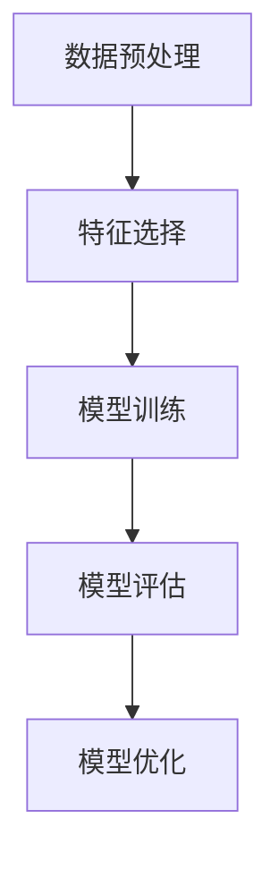
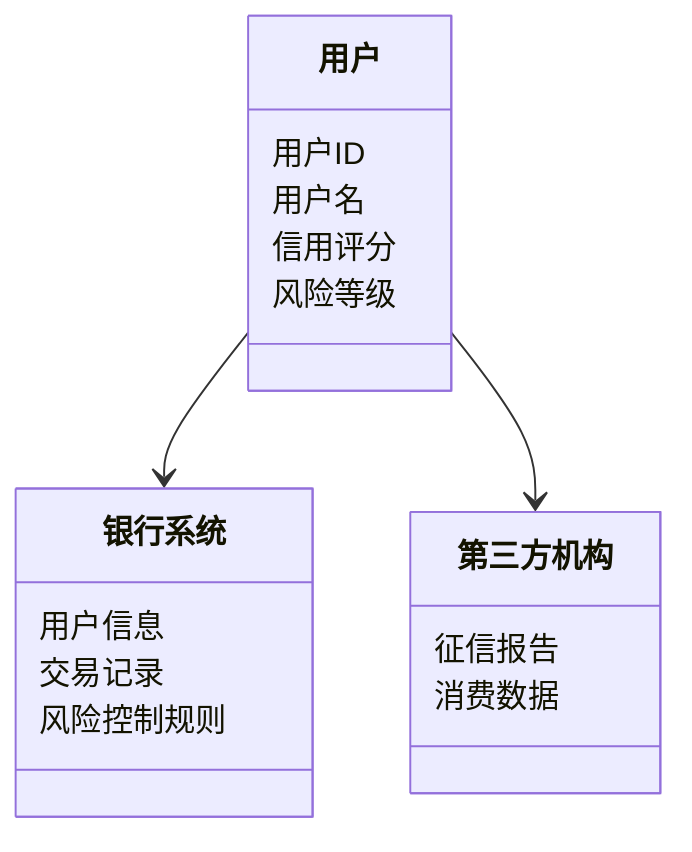
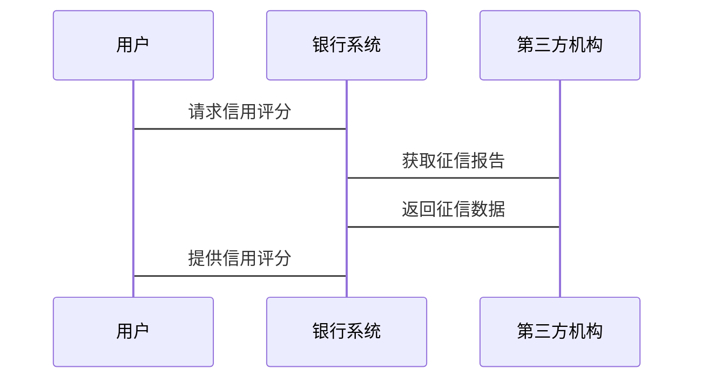

                 


# 智能信用卡额度优化与风险控制系统

> 关键词：智能信用卡，额度优化，风险控制，机器学习，金融系统

> 摘要：随着金融行业的快速发展，智能信用卡额度优化与风险控制系统的重要性日益凸显。本文通过详细分析智能信用卡系统的背景、核心概念、算法原理、系统架构以及项目实战，为读者提供一个全面了解智能信用卡额度优化与风险控制的框架。本文结合实际案例，深入探讨了如何利用机器学习算法和系统架构设计来实现信用卡额度的动态优化和风险的有效控制。

---

# 第一部分: 智能信用卡额度优化与风险控制系统概述

## 第1章: 智能信用卡额度优化与风险控制的背景与问题

### 1.1 信用卡额度优化与风险控制的背景

#### 1.1.1 传统信用卡额度管理的局限性
传统的信用卡额度管理依赖于人工审核和经验判断，存在效率低、误差大、难以实时调整等问题。随着金融业务的复杂化，传统方法难以满足现代金融市场的动态需求。

#### 1.1.2 风险控制在信用卡业务中的重要性
信用卡业务的核心在于风险控制。风险控制不力可能导致银行面临巨大的损失，甚至引发系统性金融风险。因此，建立高效的智能风险控制系统至关重要。

#### 1.1.3 智能化技术在金融领域的应用趋势
随着人工智能和大数据技术的快速发展，智能化技术在金融领域的应用日益广泛。智能信用卡额度优化与风险控制系统正是这一趋势的典型应用之一。

### 1.2 问题描述与目标

#### 1.2.1 信用卡额度优化的核心问题
信用卡额度的优化需要综合考虑用户的信用评分、消费行为、还款能力等多个因素，确保在风险可控的前提下最大化客户价值。

#### 1.2.2 风险控制的关键挑战
风险控制的核心在于识别潜在风险并采取有效措施。传统方法难以实时捕捉风险变化，而智能化系统可以通过实时数据分析实现动态风险控制。

#### 1.2.3 智能化系统的建设目标
智能化系统的建设目标是通过机器学习和大数据分析技术，实现信用卡额度的动态优化和风险的精准控制，从而提高银行的收益能力和风险防控能力。

### 1.3 系统边界与外延

#### 1.3.1 系统功能边界
智能信用卡系统的功能边界包括用户画像构建、信用评分模型设计、风险控制策略制定以及额度优化算法实现。

#### 1.3.2 系统与外部系统的交互
系统需要与银行核心系统、第三方征信机构以及用户行为数据采集系统进行交互，确保数据的实时性和准确性。

#### 1.3.3 系统的可扩展性与灵活性
系统设计需要充分考虑可扩展性，以应对未来业务需求的变化和新技术的引入。

## 第2章: 核心概念与联系

### 2.1 核心概念原理

#### 2.1.1 用户画像构建
用户画像是基于用户行为数据和信用历史构建的用户信息模型，包括用户的消费习惯、还款能力、信用评分等多个维度。

#### 2.1.2 信用评分模型
信用评分模型是基于用户数据构建的评分函数，用于评估用户的信用风险。常见的信用评分模型包括FICO评分和自定义评分模型。

#### 2.1.3 风险控制策略
风险控制策略是根据用户的信用评分和风险评估结果制定的控制措施，包括额度调整、交易监控、风险预警等。

### 2.2 概念属性对比表

| 概念       | 属性1       | 属性2       | 属性3       |
|------------|-------------|-------------|-------------|
| 用户画像   | 数据来源     | 数据维度     | 数据处理方式 |
| 信用评分模型 | 模型类型     | 模型参数     | 模型评估指标 |
| 风险控制策略 | 风险类型     | 控制规则     | 策略优化方法 |

### 2.3 ER实体关系图

```mermaid
er
  actor 用户
  actor 银行
  actor 第三方机构
  database 用户画像数据库
  database 信用评分数据库
  database 风险控制数据库
  relationship 用户 -> 用户画像数据库
  relationship 用户 -> 信用评分数据库
  relationship 银行 -> 风险控制数据库
  relationship 第三方机构 -> 用户画像数据库
```

## 第3章: 算法原理与实现

### 3.1 信用评分模型的算法选择

#### 3.1.1 机器学习算法
常用的机器学习算法包括决策树、随机森林、逻辑回归等。这些算法可以用于构建信用评分模型。

#### 3.1.2 算法流程图



### 3.2 信用评分模型的数学公式

#### 3.2.1 FICO评分公式

$$ FICO = \sum_{i=1}^{n} w_i x_i $$

其中，$w_i$ 是特征 $x_i$ 的权重，$n$ 是特征数量。

#### 3.2.2 随机森林模型

随机森林模型是一种基于决策树的集成学习算法，其数学公式如下：

$$ y = \sum_{i=1}^{n} T(x_i) $$

其中，$T(x_i)$ 是第 $i$ 棵决策树的预测结果。

### 3.3 风险控制模型的实现

#### 3.3.1 风险评估的数学模型

$$ Risk = \sum_{i=1}^{m} \beta_i z_i $$

其中，$\beta_i$ 是风险因素 $z_i$ 的系数，$m$ 是风险因素数量。

#### 3.3.2 风险控制策略

风险控制策略包括动态额度调整和实时交易监控。动态额度调整基于用户的信用评分和风险评估结果，实时交易监控则通过设置交易限额和风险预警机制实现。

---

# 第二部分: 系统分析与架构设计

## 第4章: 系统分析与架构设计

### 4.1 问题场景介绍

智能信用卡系统需要解决的问题包括信用卡额度的动态优化和风险的有效控制。

### 4.2 系统功能设计

#### 4.2.1 领域模型类图



### 4.3 系统架构设计

#### 4.3.1 系统架构图

```mermaid
container 银行系统 {
    component 用户信息管理
    component 信用评分计算
    component 风险控制
}
container 第三方机构 {
    component 征信数据采集
    component 消费数据分析
}
```

### 4.4 系统接口设计

系统接口设计包括用户信息接口、信用评分接口和风险控制接口。

### 4.5 系统交互序列图



---

# 第三部分: 项目实战

## 第5章: 项目实战

### 5.1 环境安装

#### 5.1.1 Python环境安装

```bash
python --version
pip install -y numpy scikit-learn
```

### 5.2 系统核心实现

#### 5.2.1 信用评分模型实现

```python
from sklearn.ensemble import RandomForestClassifier
import pandas as pd
import numpy as np

# 加载数据
data = pd.read_csv('credit_data.csv')

# 特征选择
features = data[['income', 'age', 'credit_history', 'loan_amount']]
target = data['credit_risk']

# 模型训练
model = RandomForestClassifier()
model.fit(features, target)

# 模型预测
new_user = np.array([[50000, 30, 3, 20000]])
predicted_risk = model.predict(new_user)
print(predicted_risk)
```

#### 5.2.2 风险控制策略实现

```python
def risk_assessment(risk_score):
    if risk_score < 600:
        return '高风险'
    elif 600 <= risk_score < 700:
        return '中风险'
    else:
        return '低风险'
```

### 5.3 实际案例分析

#### 5.3.1 案例分析

案例分析：某用户信用评分为750分，系统将其归类为低风险，并为其提供10万元的信用额度。

---

# 第四部分: 最佳实践与总结

## 第6章: 最佳实践与总结

### 6.1 最佳实践

#### 6.1.1 数据质量控制
确保数据的准确性和完整性，避免因数据质量问题影响模型效果。

#### 6.1.2 模型优化
定期更新模型参数和特征，确保模型的准确性和实时性。

#### 6.1.3 系统安全性
加强系统安全性，防止数据泄露和系统攻击。

### 6.2 小结

智能信用卡额度优化与风险控制系统通过机器学习和大数据技术，实现了信用卡额度的动态优化和风险的有效控制，为银行和用户带来了双赢的结果。

### 6.3 注意事项

#### 6.3.1 数据隐私保护
在数据采集和处理过程中，必须严格遵守数据隐私保护法规。

#### 6.3.2 系统稳定性
确保系统的稳定运行，避免因系统故障导致业务中断。

### 6.4 拓展阅读

#### 6.4.1 推荐书籍
- 《机器学习实战》
- 《金融风险管理》

#### 6.4.2 技术博客
- [机器学习在金融领域的应用](https://example.com)
- [智能风控系统的实现](https://example.com)

---

# 作者

作者：AI天才研究院/AI Genius Institute & 禅与计算机程序设计艺术 /Zen And The Art of Computer Programming

