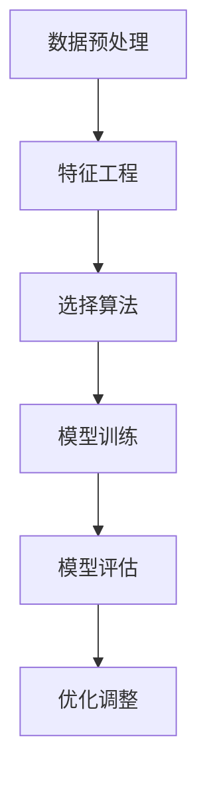
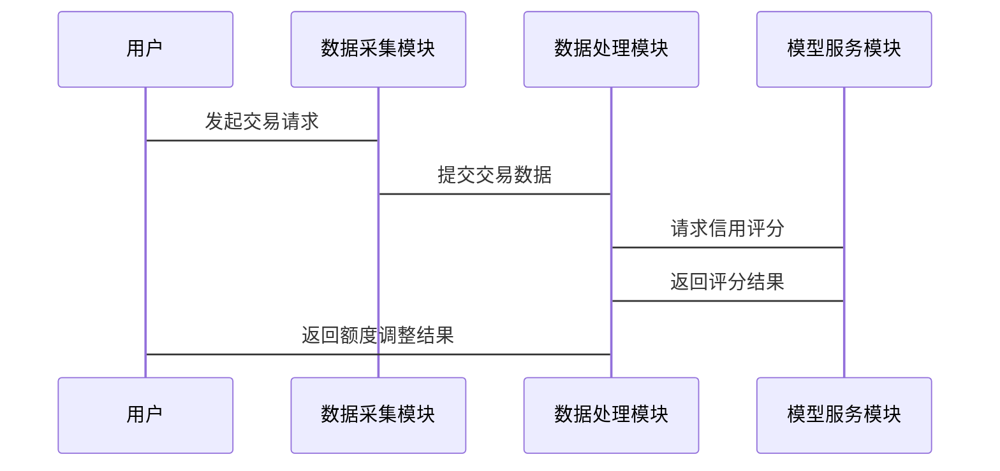

                 


# 智能信用卡额度管理系统

> 关键词：智能信用卡，额度管理，人工智能，机器学习，系统架构

> 摘要：本文详细探讨了智能信用卡额度管理系统的构建与实现，从背景分析、核心概念、算法原理、系统架构到项目实战和最佳实践，全面解析了利用人工智能技术优化信用卡额度管理的实现方案。

---

## 第一章：智能信用卡额度管理系统的背景与概述

### 1.1 智能信用卡额度管理的背景

#### 1.1.1 传统信用卡额度管理的痛点
传统信用卡额度管理依赖人工审核和固定规则，存在效率低、误差大、客户体验差等问题。银行通常根据客户的信用报告、收入证明等静态信息进行评估，难以实时捕捉用户的动态需求和风险变化。

#### 1.1.2 人工智能技术在金融领域的应用
人工智能（AI）和机器学习（ML）技术的快速发展为金融行业带来了革新。通过分析海量数据，AI能够识别复杂模式，预测用户行为，优化决策流程。信用卡额度管理是AI技术在金融领域的重要应用场景之一。

#### 1.1.3 智能信用卡额度管理的必要性
随着消费金融的普及，用户对信用卡额度的需求日益多样化。智能额度管理系统能够根据用户的实时行为、信用评分、消费习惯等多维度数据，动态调整额度，提升用户体验，降低风险。

---

### 1.2 问题背景与目标

#### 1.2.1 信用卡额度管理的核心问题
- 如何实时评估用户的信用风险？
- 如何动态调整额度以满足用户需求？
- 如何平衡风险控制与用户体验？

#### 1.2.2 智能管理的目标与期望
- 实时分析用户数据，动态调整额度。
- 提高额度决策的准确性和效率。
- 优化用户体验，降低不良资产率。

#### 1.2.3 问题的边界与外延
智能信用卡额度管理不仅关注额度调整，还包括风险预警、用户行为分析、欺诈检测等关联问题。

---

### 1.3 系统的核心概念与联系

#### 1.3.1 核心概念的定义与属性
- **用户数据**：包括用户基本信息、交易记录、信用评分等。
- **信用评分**：基于用户历史行为和当前状态的综合评分。
- **动态额度调整**：根据实时数据，调整用户的信用额度。
- **风险控制**：通过模型预测潜在风险，防止欺诈和违约。

#### 1.3.2 ER实体关系图
```mermaid
erd
    entity 用户 {
        key 用户ID
        属性 用户姓名
        属性 身份证号
        属性 信用评分
    }
    entity 信用卡 {
        key 信用卡号
        属性 信用卡类型
        属性 信用额度
        属性 开卡时间
    }
    entity 交易记录 {
        key 交易流水号
        属性 交易时间
        属性 交易金额
        属性 交易地点
    }
    用户 --> 信用卡: 拥有
    用户 --> 交易记录: 产生
    信用卡 --> 交易记录: 关联
```

#### 1.3.3 核心概念的联系
智能信用卡额度管理通过分析用户数据和交易行为，结合信用评分模型，动态调整信用额度，实现风险控制和用户体验的双重优化。

---

### 1.4 与传统信用卡额度管理的对比

#### 1.4.1 传统方法的局限性
- **静态评估**：仅依赖历史数据，无法捕捉实时变化。
- **人工审核**：效率低，成本高。
- **规则单一**：缺乏灵活性，难以应对多样化需求。

#### 1.4.2 智能管理的优势
- **实时性**：能够根据用户实时行为动态调整额度。
- **精准性**：通过机器学习模型，提升额度决策的准确性。
- **智能化**：自动识别风险，优化用户体验。

#### 1.4.3 两者的联系与区别
智能信用卡额度管理并非完全取代传统方法，而是通过技术手段优化传统流程，提升效率和精准度。

---

## 第二章：智能信用卡额度管理系统的算法原理

### 2.1 模型训练与特征工程

#### 2.1.1 数据预处理
- **数据清洗**：去除缺失值、异常值。
- **特征提取**：从用户数据中提取关键特征，如交易频率、金额分布、信用评分等。

#### 2.1.2 特征工程
- **特征选择**：通过统计分析和模型评估，筛选重要特征。
- **特征转换**：对数据进行标准化、归一化处理，提升模型性能。

#### 2.1.3 模型训练
- 使用机器学习算法（如随机森林、梯度提升树）对用户数据进行训练，构建信用评分模型。

---

### 2.2 算法选择与优化

#### 2.2.1 算法选择
- **随机森林**：适合处理高维数据，特征重要性分析。
- **梯度提升树（GBDT）**：适合分类和回归任务，模型性能优越。

#### 2.2.2 模型优化
- 调参：通过网格搜索优化模型参数，提升预测精度。
- 正则化：防止过拟合，提升模型泛化能力。

#### 2.2.3 模型评估
- 使用AUC-ROC曲线、F1分数等指标评估模型性能。

---

### 2.3 算法流程图



---

### 2.4 数学公式与模型解析

#### 2.4.1 损失函数
随机森林模型的损失函数：
$$ L = -\frac{1}{N}\sum_{i=1}^{N} [y_i \ln(p_i) + (1 - y_i)\ln(1 - p_i)] $$

#### 2.4.2 树模型的分裂准则
决策树模型的分裂准则：
$$ \text{信息增益} = H(parent) - H(child) $$

---

## 第三章：智能信用卡额度管理系统的系统架构

### 3.1 系统分析与设计

#### 3.1.1 需求分析
- 用户需求：实时额度调整、个性化服务。
- 系统需求：高可用性、安全性、可扩展性。

#### 3.1.2 功能设计
- **用户信息管理**：录入、修改用户信息。
- **信用评分**：基于机器学习模型评估用户信用。
- **额度调整**：根据评分动态调整额度。
- **风险预警**：实时监控异常交易，预警潜在风险。

---

### 3.2 系统架构设计

#### 3.2.1 分层架构
- **数据层**：存储用户数据、交易记录。
- **服务层**：提供信用评分、额度调整等服务。
- **应用层**：用户交互界面，展示额度调整结果。

#### 3.2.2 模块划分
- 数据采集模块：实时收集用户交易数据。
- 数据处理模块：清洗、特征提取。
- 模型服务模块：提供信用评分、额度调整服务。

---

### 3.3 系统接口设计

#### 3.3.1 API接口
- `/api/v1/credit_score`：计算信用评分。
- `/api/v1/adjust_limit`：调整信用额度。

#### 3.3.2 接口交互流程
1. 用户发起交易请求。
2. 系统调用信用评分模型。
3. 根据评分动态调整额度。
4. 返回结果给用户。

---

### 3.4 系统交互设计



---

## 第四章：智能信用卡额度管理系统的项目实战

### 4.1 环境配置

#### 4.1.1 技术选型
- **编程语言**：Python
- **机器学习库**：scikit-learn、XGBoost
- **数据库**：MySQL、MongoDB
- **框架**：Flask、Django

#### 4.1.2 开发环境
- 安装依赖：`pip install numpy pandas scikit-learn`

---

### 4.2 核心代码实现

#### 4.2.1 数据预处理代码
```python
import pandas as pd
from sklearn.impute import SimpleImputer

# 读取数据
data = pd.read_csv('credit_data.csv')

# 去除缺失值
data.dropna(inplace=True)

# 标准化处理
from sklearn.preprocessing import StandardScaler
scaler = StandardScaler()
data_scaled = scaler.fit_transform(data)
```

#### 4.2.2 模型训练代码
```python
from sklearn.ensemble import RandomForestClassifier

# 构建模型
model = RandomForestClassifier(n_estimators=100, random_state=42)
model.fit(X_train, y_train)

# 预测
y_pred = model.predict(X_test)
```

---

### 4.3 代码解读与分析

#### 4.3.1 数据预处理
- 使用`SimpleImputer`填充缺失值。
- 通过`StandardScaler`对数据进行标准化处理。

#### 4.3.2 模型训练
- 使用随机森林模型进行训练。
- 调参：`n_estimators`和`random_state`影响模型性能。

---

### 4.4 案例分析

#### 4.4.1 数据分析
- 计算用户信用评分分布。
- 分析交易金额与时间的关系。

#### 4.4.2 模型评估
- 使用混淆矩阵、精确率、召回率评估模型性能。

---

### 4.5 项目总结

通过项目实战，我们实现了智能信用卡额度管理系统的核心功能，验证了机器学习算法在金融领域的有效性。系统能够实时调整额度，提升用户体验，降低风险。

---

## 第五章：智能信用卡额度管理系统的最佳实践

### 5.1 小结

智能信用卡额度管理系统通过机器学习技术，实现动态额度调整和风险控制，显著提升了信用卡业务的效率和用户体验。

---

### 5.2 注意事项

- 数据隐私保护：确保用户数据的安全性。
- 模型解释性：选择可解释性较强的模型，便于业务理解。
- 系统稳定性：确保系统高可用性，避免服务中断。

---

### 5.3 未来趋势

- **实时性增强**：进一步优化实时响应速度。
- **多模态数据融合**：结合文本、图像等多模态数据，提升模型精度。
- **联邦学习**：在保证数据安全的前提下，实现跨机构协作。

---

### 5.4 拓展阅读

- 《机器学习实战》
- 《深入理解神经网络》
- 《金融风险管理》

---

## 作者

作者：AI天才研究院/AI Genius Institute & 禅与计算机程序设计艺术 /Zen And The Art of Computer Programming

