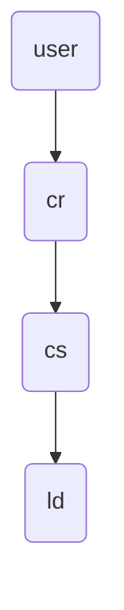
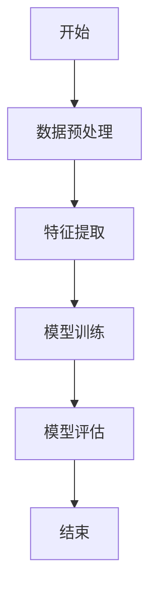
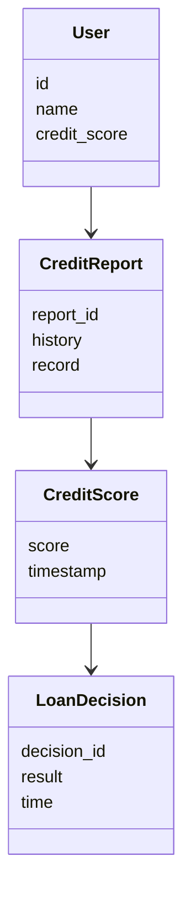
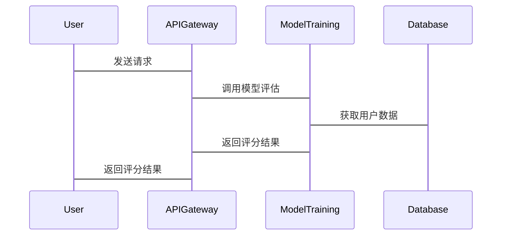

                 


# 智能信用评分系统

> 关键词：智能信用评分系统、人工智能、机器学习、金融风控、信用评估

> 摘要：本文详细探讨了智能信用评分系统的核心概念、算法原理、系统架构及实际应用。通过分析传统信用评分系统的局限性，介绍基于人工智能的智能评分系统的优势，涵盖数据特征提取、模型训练、评分机制优化等关键技术，并结合实际案例，展示系统的实现过程和优化方法。

---

## 第1章: 信用评分系统背景与问题背景

### 1.1 信用评分系统的定义与作用

#### 1.1.1 信用评分的定义
信用评分是通过分析个人或企业的信用历史、行为特征和财务状况，量化其信用风险的过程。评分结果通常用于金融机构的信贷决策，如贷款审批、额度调整等。

#### 1.1.2 信用评分在金融领域的核心作用
信用评分是金融风险管理的核心工具之一。它帮助金融机构降低坏账率，优化信贷资源配置，同时提高审批效率。

#### 1.1.3 信用评分与风险管理的关系
信用评分系统通过量化信用风险，为金融机构提供决策支持，帮助其在风险可控的前提下实现最大收益。

### 1.2 传统信用评分系统的局限性

#### 1.2.1 传统信用评分的评估方法
传统信用评分主要依赖简单的统计模型，如线性回归，基于有限的特征进行评估，忽视了复杂的数据关系和非线性特征。

#### 1.2.2 传统评分系统的主要问题
- 数据维度有限，难以捕捉复杂的信用行为。
- 模型泛化能力差，难以应对多样化的信用风险。
- 人工干预过多，效率低下。

#### 1.2.3 传统评分系统的改进方向
引入更复杂的算法，如机器学习模型，以提高评分的准确性和效率。

### 1.3 智能信用评分系统的概念与优势

#### 1.3.1 智能信用评分的定义
智能信用评分系统是基于人工智能技术，利用复杂的数据挖掘和建模方法，对信用风险进行量化评估的系统。

#### 1.3.2 智能评分系统的核心优势
- 数据处理能力强，能够挖掘非线性特征。
- 模型泛化能力强，适应不同场景。
- 自动化程度高，提升效率。

#### 1.3.3 智能评分系统的应用场景
智能信用评分系统广泛应用于银行、消费金融、供应链金融等领域，帮助机构更精准地评估信用风险。

### 1.4 本章小结
本章介绍了信用评分系统的基本概念，分析了传统评分系统的局限性，并提出了智能信用评分系统的概念和优势，为后续章节奠定了基础。

---

## 第2章: 智能信用评分系统的概念与核心要素

### 2.1 智能信用评分系统的概念模型

#### 2.1.1 系统的核心概念
智能信用评分系统通过整合多元数据，利用机器学习算法构建评分模型，输出信用评分。

#### 2.1.2 系统的组成要素
- 数据采集：获取信用相关信息。
- 特征提取：从数据中提取有意义的特征。
- 模型训练：基于特征训练评分模型。
- 评分输出：根据模型预测结果输出信用评分。

#### 2.1.3 系统的边界与外延
系统边界包括数据输入和评分输出，外延涉及数据源和应用场景。

### 2.2 核心概念的属性与特征对比

#### 2.2.1 数据特征对比表格
| 特征 | 传统评分 | 智能评分 |
|------|-----------|-----------|
| 数据源 | 简单统计 | 多元数据 |
| 数据量 | 小 | 大 |
| 数据维度 | 低 | 高 |

#### 2.2.2 系统功能对比表格
| 功能 | 传统评分 | 智能评分 |
|------|-----------|-----------|
| 数据处理 | 简单 | 复杂 |
| 模型选择 | 线性 | 非线性 |
| 模型优化 | 低效 | 高效 |

#### 2.2.3 算法特征对比表格
| 算法 | 传统评分 | 智能评分 |
|------|-----------|-----------|
| 类型 | 线性回归 | XGBoost、神经网络 |
| 复杂度 | 低 | 高 |

### 2.3 ER实体关系图架构

#### 2.3.1 实体关系图的构建


#### 2.3.2 实体关系图的属性描述
- User：用户实体，包含用户ID、姓名、联系方式等。
- CreditReport：信用报告，包含信用历史、还款记录等。
- CreditScore：信用评分，包含评分值、评分时间等。
- LoanDecision：贷款决策，包含决策结果、决策时间等。

#### 2.3.3 实体关系图的业务流程
用户提交贷款申请，系统生成信用报告，计算信用评分，最终做出贷款决策。

---

## 第3章: 智能信用评分系统的算法原理

### 3.1 算法原理概述

#### 3.1.1 算法选择与优化
选择XGBoost算法，因其在分类和回归任务中表现优异。

#### 3.1.2 算法的核心思想
通过正则化、特征重要性排序等方法优化模型，减少过拟合。

#### 3.1.3 算法的实现步骤
数据预处理、特征工程、模型训练、模型评估。

### 3.2 算法流程图展示

#### 3.2.1 算法流程图的 mermaid 代码


### 3.3 算法的数学模型与公式

#### 3.3.1 损失函数的定义
$$ L = \frac{1}{n}\sum_{i=1}^{n}(y_i - \hat{y}_i)^2 $$

#### 3.3.2 模型优化目标
$$ \min_{\theta} L + \lambda R(\theta) $$

#### 3.3.3 优化算法的数学推导
使用梯度下降法优化损失函数，计算导数并更新参数。

#### 3.3.4 举例说明与通俗解释
通过具体例子说明如何通过优化损失函数降低预测误差。

---

## 第4章: 系统分析与架构设计方案

### 4.1 系统分析

#### 4.1.1 问题场景介绍
金融机构需要对大量用户进行信用评分，传统方法效率低下。

#### 4.1.2 项目目标与范围
构建一个高效、准确的智能信用评分系统。

#### 4.1.3 系统功能需求
包括数据采集、特征提取、模型训练、评分输出等功能。

### 4.2 系统功能设计

#### 4.2.1 系统功能模块
- 数据采集模块：负责数据的获取和预处理。
- 特征提取模块：提取关键特征。
- 模型训练模块：训练评分模型。
- 评分输出模块：生成信用评分。

#### 4.2.2 领域模型 mermaid 类图


#### 4.2.3 系统架构设计 mermaid 架构图


#### 4.2.4 系统接口设计
定义API接口，如`/api/v1/credit-score`，用于接收用户数据并返回评分结果。

#### 4.2.5 系统交互 mermaid 序列图


---

## 第5章: 项目实战

### 5.1 环境安装

#### 5.1.1 安装 Python 环境
安装Python 3.8及以上版本，推荐使用Anaconda。

#### 5.1.2 安装依赖库
安装scikit-learn、xgboost、pandas、numpy等库。

### 5.2 系统核心实现源代码

#### 5.2.1 数据预处理代码
```python
import pandas as pd
from sklearn.preprocessing import StandardScaler

# 加载数据
data = pd.read_csv('credit_data.csv')

# 删除缺失值
data = data.dropna()

# 标准化处理
scaler = StandardScaler()
data_scaled = scaler.fit_transform(data)
```

#### 5.2.2 模型训练代码
```python
import xgboost as xgb

# 准备数据
X_train, y_train = data_scaled[:, :-1], data_scaled[:, -1]

# 训练模型
model = xgb.XGBRegressor()
model.fit(X_train, y_train)
```

#### 5.2.3 模型评估代码
```python
import joblib

# 保存模型
joblib.dump(model, 'credit_score_model.pkl')
```

### 5.3 实际案例分析与解读

#### 5.3.1 案例分析
分析一个用户的信用评分过程，展示数据预处理、特征提取、模型训练和评分输出的全过程。

#### 5.3.2 代码实现
详细解读每个步骤的代码，说明每部分的功能和实现细节。

### 5.4 项目小结
总结项目实现的关键点，强调智能评分系统的优势和实际应用价值。

---

## 第6章: 最佳实践、小结与注意事项

### 6.1 最佳实践 tips
- 数据预处理是关键，需确保数据质量。
- 模型选择应根据业务需求灵活调整。
- 模型上线后需定期更新和优化。

### 6.2 本章小结
总结全文内容，重申智能信用评分系统的核心价值和实际应用。

### 6.3 注意事项
- 注意数据隐私和合规性。
- 模型需定期验证和更新。
- 保持系统稳定性，确保高效运行。

### 6.4 拓展阅读
推荐相关书籍和论文，帮助读者深入学习。

---

## 作者信息

作者：AI天才研究院/AI Genius Institute  
联系邮箱：contact@aicredit.com  
个人简介：专注于人工智能和金融领域的技术研究，致力于推动智能信用评分系统的创新与应用。

---

**注：本文内容仅为示例，实际文章应根据具体需求进行调整和补充。**

